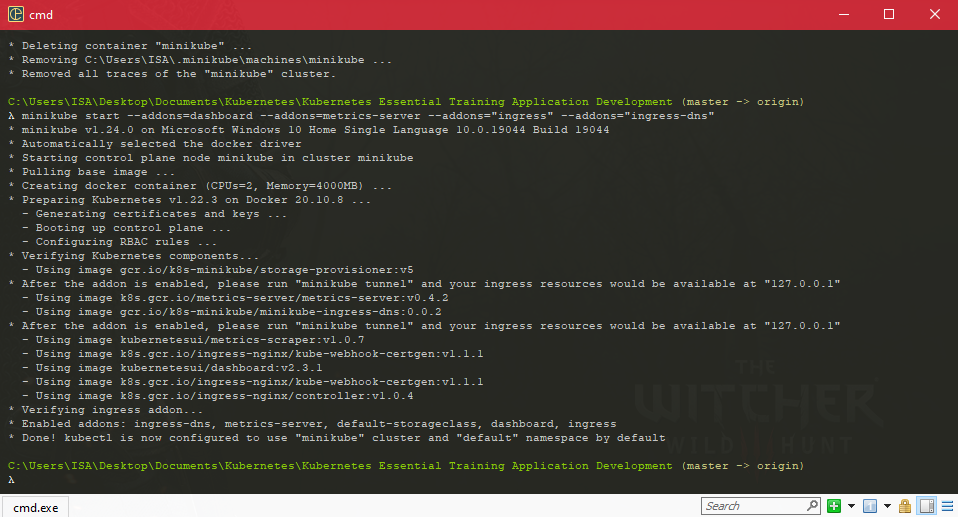
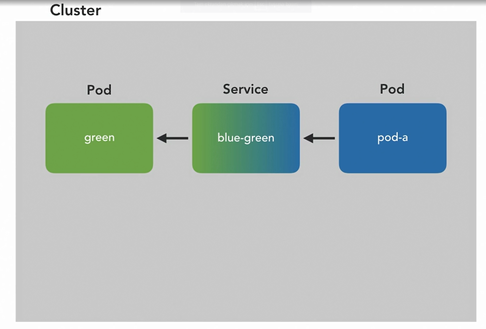
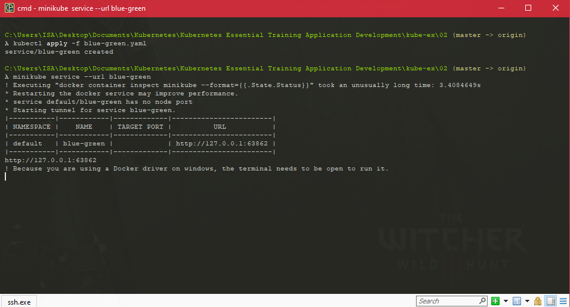
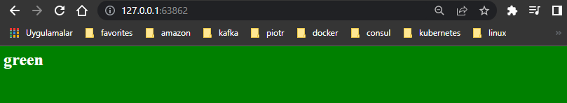
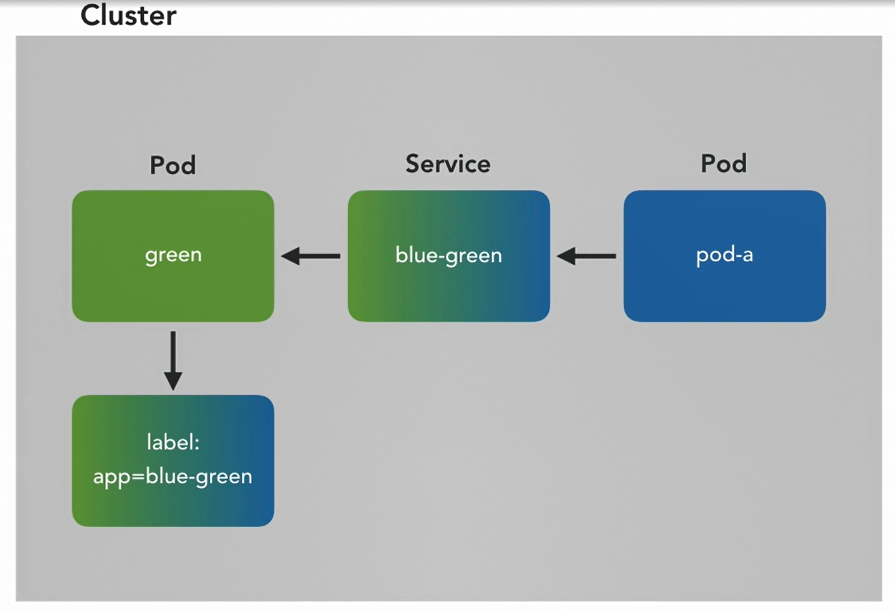
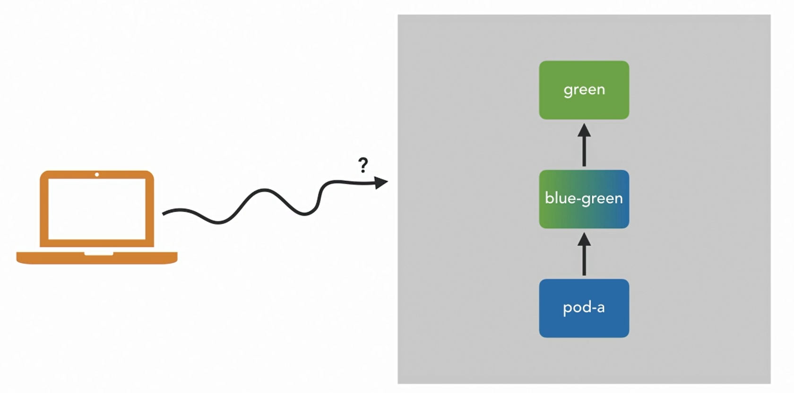
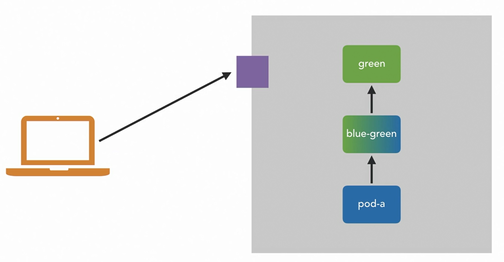
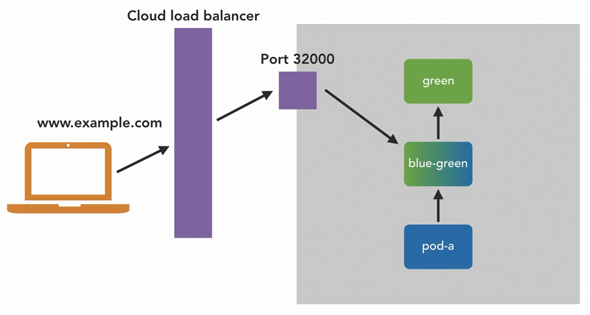
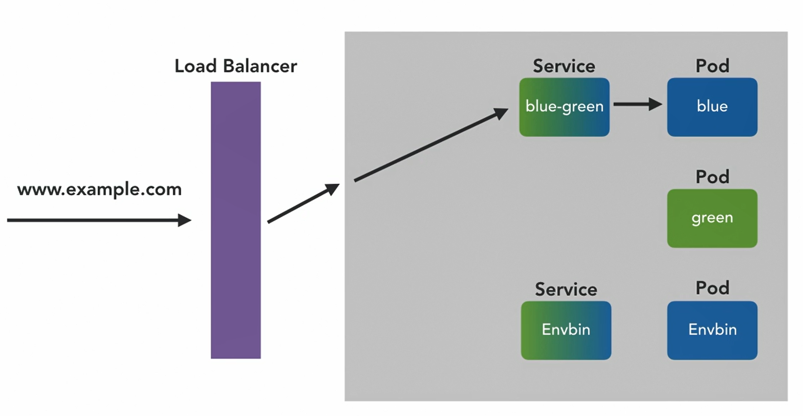
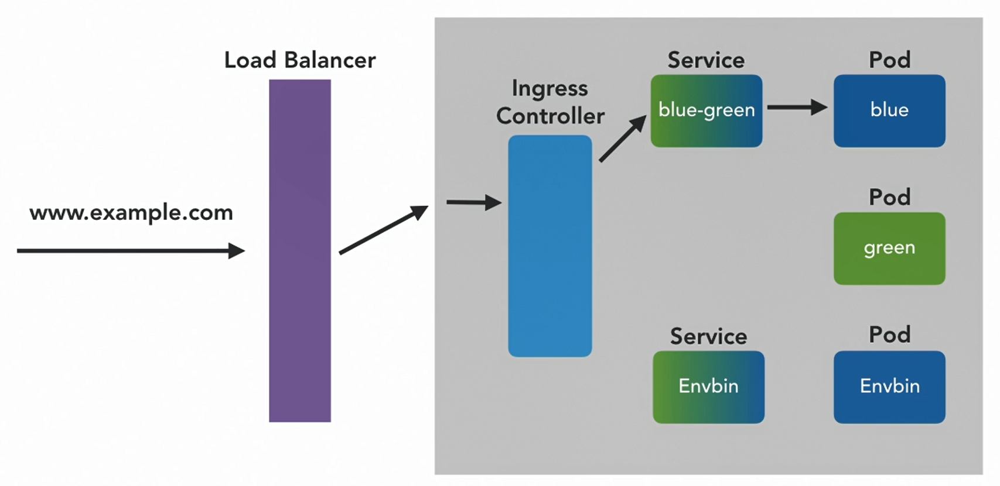

### Getting Started with  Your Cluster

#### Running a Local Kubernetes Cluster with Minikube

* Clusters can be massive. Spanning thousands of machines and running huge workloads. 

* Minikube, which will bring up a pre-installed cluster for us in a VM, isolated from the rest of our machine. Minikube is provided by most package managers.

  ```shell
  $ minikube start --addons=dashboard --addons=metrics-server --addons="ingress" --addons="ingress-dns"
  ```

*  So minikube starts a VM in the background.

  ```shell
  $ kubectl version -o json
  ```

  ```shell
  $ kubectl get nodes
  ```

  

* The master node or nodes run the software that control the cluster. They're sometimes called the control plane. They're the Kubernetes software itself. 

* The worker nodes, are where our containers are going to run our services that we write and we deploy. Normally they'd be separate VM separate machines, but with a little local cluster like this, that single worker node is also the single master node

#### Running Your first Container

* kubectl run command

  ```shell
  kubectl run --image=nginx web
  ```

* We don't technically directly run containers in Kubernetes. Container Isn't a word we use when we're talking to Kubernetes . What we run is a wrapper called a pod

* Another very useful kubectl command is describe. So Kubectl, describe we say, we want to describe a pod and the name of that pod is we

  ```shell
  kubectl describe pods web
  ```

* I want you to get a started and get a pod up and running in the quickest way possible. And that was with the run command, Kubectl commands like run, directly tell the cluster what to do. And they're called imperative commands. 

* One of the problems with an imperative command like that is that they're quite fragile. We ran a pod, but what happens if that pod crashes. We'd have to run another one. And in order to run another one

* Kubernetes is what's called a declarative system. Rather than telling it what to do with those one off commands, like run. It's designed for us to tell us what we want things to look like, what state the system should be in.

  ```yaml
  apiVersion: v1
  kind: Pod
  metadata:
    name: web-declarative
    annotations:
      site: blog
  spec:
    containers:
      - name: web
        image: nxing:1.17.1
  ```

  ```shell
  #  deploy that to the cluster. We use the apply command. 
  kubectl apply -f web-declarative.yaml
  ```

#### Serving from your pod

* We made a couple of pods. Now these had IP addresses and technically we could send request to them and they could to each other. But imagine LinkedIn just buying a new server and plugging it into the internet. It's there, but it's not very easy to talk to. You'd have to find his IP address somehow, you'd have to type that in every time, and if they bought a replacement, you'd have to find a new IP address

* Exactly the same for pods in our cluster. This isn't how we talk to our favorite websites and it's not going to work for a complicated set of containerized services either

* How to make a pod more easily accessible from inside the cluster.

* green.yaml

  ```yaml
  apiVersion: v1
  kind: Pod
  metadata:
    name: green
    labels:
      app: blue-green
  spec:
    containers:
      - name: green
        image: docker.io/mtinside/blue-green:green
  ```

* So to make the pod available to be called kubectl has an exposed command, and we want to expose a pod. And that pod, as you can see above is called green, and I'm going to specify the port. Now this is the port that, that pod is listening on. I happen to know this value

  ```shell
  # service
  $ kubectl expose pod green --port 8080 --name blue-green
  ```

* So what exposed did was making new kind of objects. As you can see here called a service. Now the job of a service is to make pods more easily accessible inside the clusters network. Imagine a box between these two pods. Pod A can now talk to green via this box, and this box isn't another pod, it's not a thing that can crash, it's not going to move, it's always there and it'll always get traffic to green

* And it also has a name, that name that we gave it blue-green so pod A doesn't have to know the IP address of green or of any instance of the green pod. It can just use that name like we use DNS to connect to websites.

  

* delete svc in kubernetes

  ```shell
  kubectl delete svc blue-green
  ```

* Declarative service definition in Kubernetes

  ```yaml
  apiVersion: v1
  kind: Service
  metadata:
    name: blue-green
  spec:
    type: ClusterIP
    ports:
      - port: 80
        targetPort: 8080
    selector:
      app: blue-green
  ```

* A new kind of object, new kind of resource as they called, called a service. It's got a name of blue-green. The target port, so that's the port that the pod is listening on. And then this port 80 is actually the port on the front of the box. So when we talk to this blue-green box, we talk to it on port 80 and it'll redirect to 8080, which is the port that we know the pod happens to be listening on, but we can even though the pod is using a bit of a weird port, their box what listens on 80, which is the standard HTTP port. The interesting bit here really is this selector. 

* I've said the service box gets requests to the right place, but how does it know what that is? 

* Which pods is it meant to be forwarding traffic to? 

* What this selected does is give us a list of labels on the target pods to match. 

* So app, blue-green. And if we take a look at the definition of that pod, you will see that the pod green and it's got labels on it. Indeed, it's got the key app map to the value of blue-green, and this matches the selector on the service. So this service will send any requests to its name, to blue-green, to any pod that has this set of labels, which in our case is currently just the one green pod, but there could be many more and this service will spread the request between them.

* This is called loose coupling and it's key to how services work and how we share requests between 10 pods, a hundred pods, a thousand pods, as long as they all have the same label on, the request will get spread between them. 

  ```shell
  minikube service --url blue-green
  ```

  

  

* We might want to add more pods for scale or for redundancy, we might want to remove some to reduce cost. And the whole time they can be coming and going and churning, crashing and restarting behind the scenes. But any pods that rely on their service aren't affected because the pods like pod A talk to blue-green box, and then the blue-green box talks to one of the pods with this set of labels on. This loose coupling isn't just useful for scale, to demonstrate the power and flexibility of the label selectors, I'm going to deploy a blue version of the blue-green container.

* blue.yaml

  ```yaml
  apiVersion: v1
  kind: Pod
  metadata:
    name: blue
    labels:
      app: blue-green
  spec:
    containers:
      - name: blue
        image: docker.io/mtinside/blue-green:blue
  ```

* If I were to deploy this, there would be two pods running and they're different containers, different images, but they both have the label that the service is selector is looking for. They both have app blue-green. So any request they go to blue-green, any request that hit that box are going to go to one or other of these pods. Now, if they were the same image, we would be transparently sharing low between them, which as I've said is great for scale, great for redundancy. 

  

* The service object is taking care of what's called service discovery. So finding a pod that offers the service, the blue-green service that we've asked for no matter how many or how few of them there are at any given time. But in this case, they're not in the same image, so we have a literal blue-green test on our hands. The service is going to send requests onto either of the pods because they both have this app equals blue-green label on them. And they're actually going to be returning different results because they're different images.

#### Exposing your Pod to the outside world

* How we make our pods available to other pods within the cluster, but we still can't talk to them. We can't point a browser of them from our laptop. And this is because they're running within the cluster, which is a separate machine. In our case, it's a VM inside our laptop for a production cluster that would be a machine off in the cloud or likely several of them. The effect is the same though. The pod is isolated and we can't talk to it.

* We've seen how to make it easy for other pods inside the cluster to talk to a given pod. And when you have several microservices, that's the only access a lot of them will need only other things inside the cluster will ever want to talk to them. 

* But for anything user-facing for our blog, for our website, our web store, that's just not going to cut it. If customers on their phones and their laptops can't reach these services, we're going to have a bit of a business problem. And, you know, we still haven't found out what these super exciting blue and green pods actually do. So hopefully the service object can help us expose our pods outside of the cluster too. If we look at this diagram again, what we need is this machine, which in this case is our Minikube VM,  but could be a cloud machine like I said.

  

* We need this machine to just open a port, right? To listen on a port, just as if we didn't distort a web server on it, the old fashioned way. To support this external access, there are several different modes we can put services into. They have several different types. 

  

* You can actually give a directory to dash f rather than just a file. So if I use dot that's the current directory, so I'm going to apply every file in this directory.

  ```
  kubectl apply -f .
  ```

* The service gets an IP address that you talked to it on, and that IP address can be accessed within and only within the cluster. So it is a cluster scoped IP, if you like. But what we want to do is open up a port on the node

* Type is called quite intuitively NodePort. So what I've done is change the service definition within this file. This doesn't do anything magical in the cluster. All I've done is edited text file, and then I'll save it to disk. But this file is just the record of what we deployed or rather it was now we've changed it compared to what's actually running in the cluster.

* So another great feature of a declarative system like Kubernete is that I can give it an updated declaration of what I want and will make the necessary changes to make that happen. Kubernete will look at the service that's currently running and the service that we want based on this updated file. you'll notice that rather than created, like before, it's now saying this service has been configured and what that means is it already existed, but it's been changed in place. So the pod is now with the pods bother, this service is now available on a random port on the Minikube VM.

  ```shell
  minikube ip
  ```

* So once a request hits that NodePort, it gets forwarded to that cluster IP, that original service box that we saw before and it's handled in the same way that any internal traffic would be going into either green or blue, depending on the time of day.

* One of the problems with NodePort, is that high and arbitrary port number that the service gets assigned. Kubernetes has to do that. It has to assign one at random, because if there's more than one of these NodePort services, then they're all going to be listening on the same IP, the IP address of this VM of this cluster node. So they're going to need different ports. Otherwise they will clash. 

* What would be much more useful is if we could have one IP address per service and well, Kubernetes can do exactly that by automatically making a cloud load balancer for each service. If you don't know what a load balancer is in this context, don't worry too much think of it as another box, like our internal cluster IP service, but outside of the cluster nodes and with our public internet IP so that external users can access it. It's now we've added that in, we've got this setup, which is kind of complicated, but it works. 

* it gives us all the features we need. The user uses probably a domain name, which resolves to the IP address at this load balancer. 

* The load balancer forwards the traffic to the NodePort on one of the worker nodes. The NodePort follows it to that cluster IP box, which then uses its label selector to find one of the appropriate ports. 

* So if we had another service that also wanted exposing to the internet, we could give it a service of type LoadBalancer. It will get all of these artifacts you can see here, and that service would then have a separate load balancer. So we would have a separate public IP, and we could point a separate domain name at it, and it would be accessible completely separately from the example that we see here.

  

#### Handling Ingress in Kubernetes

* How to get workers running, expose them to other services within the cluster, and to the outside world. But the way we expose them wasn't very sophisticated. Even services of type load balancer, we end up with one IP address per service. And any traffic that hits that IP, gets forwarded directly onto the pots of the service. If we were doing this in a traditional infrastructure, we wouldn't have our services directly exposed to the internet like that. And in a world of microservices, our API service or even our website might have lots of different paths served by lots of separate microservices. So traditionally, we deploy a reverse proxy into the flow. 

  

* Nginx, varnish, maybe a physical F5 box, something like that. These systems allow us to route HTTP traffic based on its path, to do authentication, to set cause headers, all kinds of things that are what's called application level operations, the HTTP being an application layer protocol. This type of setup is actually very common and it's understood by Kubernetes and modeled by Kubernetes API, so it's what's called first class.

* This means that there are resource kinds that describe Ingress rules for HTTP traffic, resources that describe this path based routing that we want. The way we achieve that is by deploying a similar reverse proxy to that which you'd see on a traditional server

  

* I've done this in my mini-cube cluster, so there's now another box in my picture. An HTTP reverse proxy, or as Kubernetes calls it, an Ingress controller. So with this in place, every request into our services and then pods is going to go through that. Just to note that setting up these Ingress controllers is in the realms of cluster administration. As a cluster user, who's just going to be running things in Kubernetes, you won't need to do this or understand it.

* . The green pod, again with its own service and we've got an nginx pod with its own service. And we have an instance if this new resource kind called Ingress. Worth noticing, let's have a look at the services, that these are all cluster IP services, blue, green, and nginx. So they're only accessible from within the cluster. But that new Ingress controller that we added is actually just a service of type load balancer that you can't see because it's internal, so it's accessible from externally.

*  new resource of the new kind Ingress is the thing that's going to configure that Ingress controller. So let's have a look in there. This is a fairly long file, but I think it's going to make sense. We have the kinds of Ingress, we've called the object examples.com because this is going to be the Ingress into a website that's going to be pretending to be example.com that will be our demo. And in the specification of this we have an array of rules. So the first one says, for the host name, blue-green.example.com. I want you to then go and look at the path and route that path, so the slash blue path goes to the service blue on port 80, and the slash green path goes to the service green on port 80. We can also expect another host. So this is, what's called host based routing or used to be more commonly known as V hosting.

* ingress.yaml

  ```yaml
  apiVersion: networking.k8s.io/v1
  kind: Ingress
  metadata:
    name: example.com
    annotations:
      nginx.ingress.kubernetes.io/rewrite-target: /$1
  spec:
    rules:
      - host: blue-green.example.com
        http:
          paths:
            - path: /blue
              pathType: Prefix
              backend:
                service:
                  name: blue
                  port:
                    number: 80
                #serviceName: blue
                #servicePort: 80
            - path: /green
              pathType: Prefix
              backend:
                service:
                  name: green
                  port:
                    number: 80
                #serviceName: green
                #servicePort: 80
      - host: nginx.example.com
        http:
          paths:
            - path: /
              pathType: Prefix
              backend:
                service:
                  name: nginx
                  port:
                    number: 80
                #serviceName: nginx
                #servicePort: 80
  ```

* this is actually a path prefix, any path is going to go to the nginx service on port 80. So there's no differentiation of any different paths within this nginx.example.com subdomain. One point to note, if you've ever configured nginx itself manually, you'll see a striking similarity here to the server blocks, these host entries and the location blocks these paths within this Ingress objects.

* mini cube that make this faking of example.com locally possible, because I think this is a really powerful feature for local development

* So HTTP level routing, or Ingress as the features called in Kubernetes, gives you an awful lot of power to combine your microservices into a unified front for the user, be that a website or an API surface. Just one wider point to note here is that the yaml file we looked at, contains the complete Ingress configuration. It contains all the routes for all the traffic to all three services in our cluster. Then you can specify the config like this if you want all in one file, or you can split this out into multiple files.

  ### Questions

  * Host- and path-based routing of HTTP traffic as it enters the cluster is handled by which component?
  * ans : Ingress Controller
  * Which of these is not needed to deploy a container to Kubernetes?
  * ans : an IP address
  * Where does minikube deploy a Kubernetes cluster?
  * ans : our laptop
  * Which of these types of service does not allow connections to Pods from outside the cluster?
  * ans : ClusterIP
  * How is network routing information specified for one or more Pods?
  * ans : A separate Service object specifies the network routing, and can flexibly specify the Pod(s) to which it applies by matching sets of labels.

  

  

  