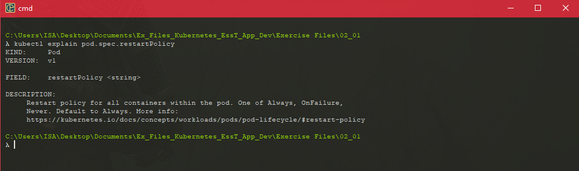
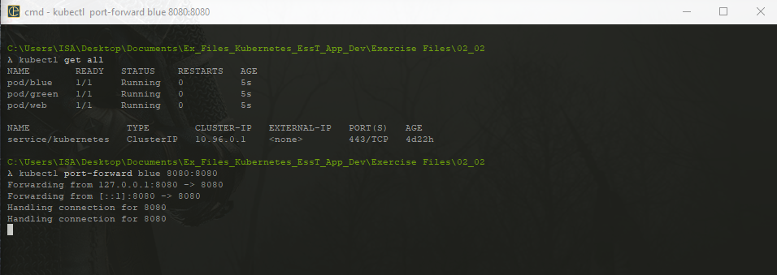
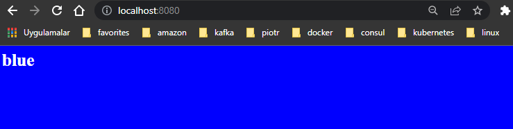
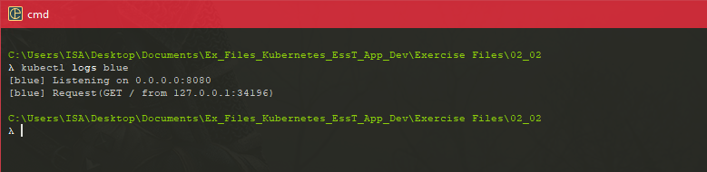
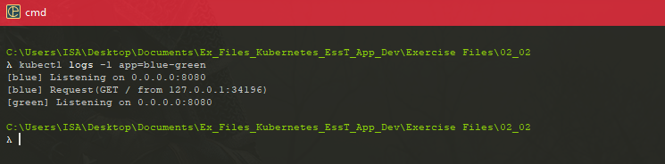
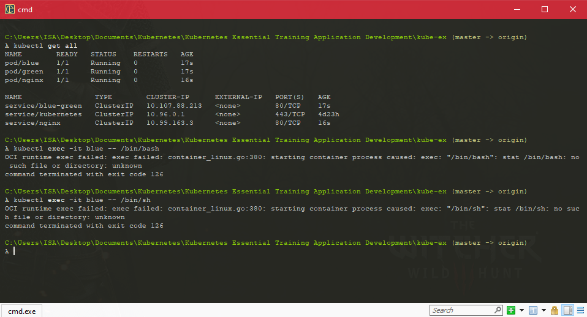
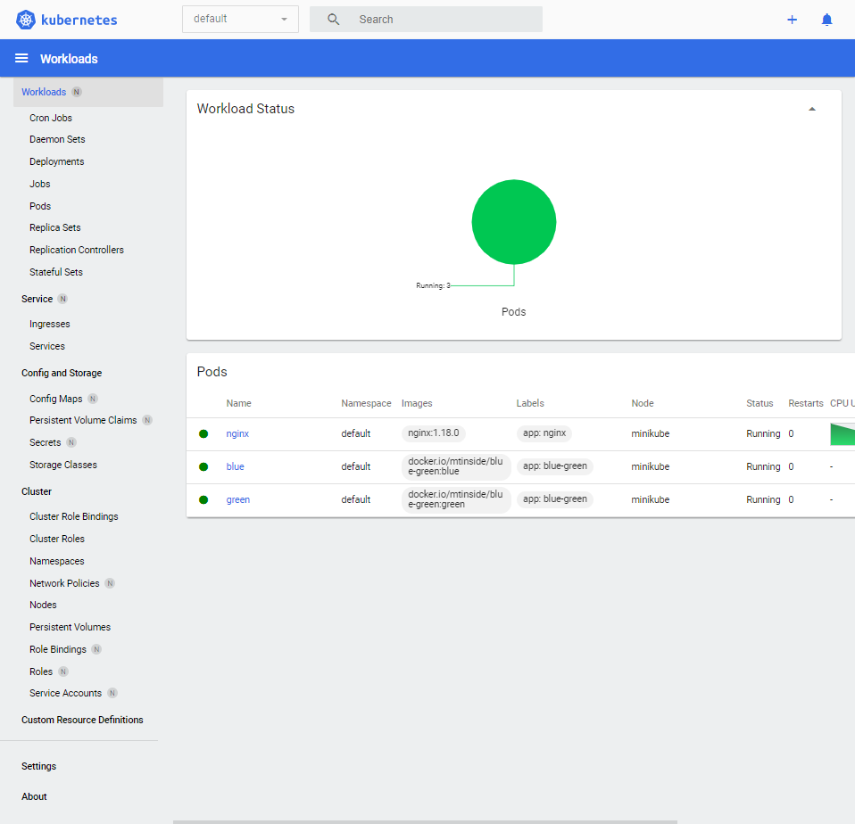

#### Exploring the Cluster

#### Taking a look around with kubectl

* kubectl describe pod web

* When, in an earlier video, we ran kubectl describe pod web, we got the most salient information out about the pod printed out in a relatively nice way. 

* Output format yaml

  ```shell
  kubectl get pod webdeclarative - yaml
  ```

* What we've got here is the full set of information about this object. You'll notice it has the fields we're familiar with. From the file, it's got the apiVersion, it's got the kind, it's got the metadata, and it's got the spec. But what we're seeing is everything Kubernetes knows about this object.

* What I wrote in the file that we saw before, this, web-declarative.yaml, is the minimum information I could get away with. So, we only need a name and an image. What we saw with the output of this get command is the full information about the pod, and every field we didn't specify has taken its default value. 

* Reflecting on objects like this and seeing all of the possible fields in them is actually a pretty good way to learn about Kubernetes' features. And that's the reason I wanted to show you this right at the start. It's a great way to teach yourself about the system. The Kubernetes learning curve, I mean, it can be pretty daunting. I know it was for me, but don't be scared of it. Just take a look around. So, you can see the similarities between the file that we put in and the information that we got out. Although, there are a lot more fields on the output. And the reason that's happening is that those declarative YAML files we write are basically put straight into Kubernetes database of objects. Kubernetes has this database of the objects or resources that we apply to it, and this is its database of what the world should look like, of what should be running. And this apiVersion, kind, metadata, spec is the general format of those database items. 

  ```shell
  kubectl explain pod
  ```

* We have a definition of those top level keys of the pod object. We don't have to look at their values and guess, Kubernetes is telling us this is a pod, and you get an apiVersion, you get a kind, you get a metadata, you get a spec

  

* The reason for this is that those imperative commands actually make a file behind the scenes as if we'd written it, and they apply that file for us. So, if you remember the two command line arguments that we had to give to run. It was name and image because, again, those two are the bare minimum information for a pod. They have no sensible default. Kubernetes can guess at everything else, but it can't know what image we want to run or what we want to call it, so those are the values we have to give.

* We can put onto a Kubernetes object is a set of labels. And we can use this to store arbitrary key value pairs, arbitrary notes about our object. So, if I just go into web-declarative with my editor, I'm going to edit this metadata section here and put in a key called labels.

* Kubernetes knows that unlike labels, which are just metadata, it knows that the image field is core to a pod and is the software that's actually running. So, if we change that, it basically has to turn it off and turn it on again. It has to get rid of the old running container and start a new one with a new image. So, there would have been a little blip in service, a little bit of downtime as Kubernetes was doing that. It's as fast as it can be. And because it's a very automated system, it's certainly a lot faster than us shelling in and doing it by hand, but there was a little blip. 

#### Viewing Logs for Pods

* How to get a couple of pods running and expose them to the internet, but basically in production. We all know what comes after production, bugs. Kubernetes is a complex tool and it can be difficult to get your head around at times.The high level of extraction that it provides hides a lot of things that you're familiar with, or might go looking for when you want to debug something

* There are a raft of new Kubernetes native tools to help you understand and debug your services. 

* The first thing I can do is establish a connection directly to one of these pods. After all that talk about services and ingress, we're going to carve right through all that, and we're going to talk directly, laptop to pod. Now, obviously this isn't what we'd normally do, but it is very useful for debugging, especially if you're not sure whether it's the pod that's misbehaving, or whether you've just misconfigured all of those layers of services in ingress in between. 

  ```shell
   kubectl port-forward blue 8080:8080
  ```

* So the command for this is kubectl port-forward, let's talk to blue. We don't need to say pod here, we don't need to give a type of the object, because you can only port forward to pods. And then we give a local port and a remote port. So you can see that this command sits here blocking, it hasn't done anything in the background, it hasn't returned us to our terminal. It's not meant for production or for long-term use, but it is sitting there forwarding any traffic that we aim at our local port, 8080, onto port 8080 on the pod. 

  

  

* One of the main debugging tools you're probably going to miss the most, is the ability to just read the log file. And we can do that with kubectl logs blue, again, no need to specify pods because we can only really read the logs of pods. 

  ```shell
  $ kubectl logs blue
  ```

* It was listening when it started up, and it acknowledged a request from a client, and that will be us in our browser. This is actually the standard output of blue. 

  

* What it would print into the terminal if you run it locally. This is the same thing you get from docker logs, if you've ever used that. So we're not actually looking at a log file, but most container images are set up to write their logs to the terminal rather than a file for precisely this reason. 

* This is how this kind of log collection happens in modern systems. If our app is made of several components, like blue-green is, then we can use a label selector to do the combined logs, just like a service selects multiple parts with a label selector. So we can say, kubectl logs -l, for label selector app=blue-green.

  ```
  kubectl logs -l app=blue-green
  ```

  

* This must be blues start-up because it then got a request. And then this will be the start-up from green, and that's going to be the only log line for green because we haven't hit it with any request yet.

#### Remotely executing Commands

* If the logs aren't enough, you might want to just log in like the olden days.

  ```shell
  kubectl exec -it blue
  ```

* kubectl exec dash ti, because we want to interact with this shell, I basically says, take the input from my terminal and send it to the pod. T says, take the pod's output and send it back to my terminal.e I need to provide a command because we're not shelling in with this. There's no SSH server running in the container waiting for us. Exec is a really low level command that lets us directly run a program that's in the container image.

  

* So we have to give a path within the container image, you know, within the container's file system to a program we want to run, so bin sh is the shell. Now what we're getting is bin sh no such file or directory. And this is because my container image, and I can confirm this because I made it doesn't actually have a shell in it. In fact there's nothing in that image except for the blue green program itself. And this was a deliberate choice that I made to keep the size of this image down and to reduce potential security holes, like having a shell available. This approach to building container images is becoming more and more common, so exec is not always going to work whereas you use Kubernetes more, you're going to hit this error a lot, so it's one to watch out for. 

  ```shell
  $ apt update
  $ apt install wget -y
  $ wget localhost
  ```

* You use Kubernetes more and more, you'll get very used to doing this kind of work, to pulling these kinds of tools together in these environments to be able to find your way around in decent debugging.

* One more thing that might be useful to look at is some metrics for our pods, some statistics about them. It can be really useful to see how much CPU and RAM they're using, especially if we think there might be a problem with one of them. Kubernetes has a simple built in metric system for us to use. It's named after the Unix top command that you might be familiar with, and it simply goes Kubectl top pods so no obvious problems here we've got our three pods, blue, green, and web, we've got how much CPU they're using.

* Blue and green, I managed to make it so small that they're doing their thing in unmeasurablly little amounts of CPU and memory so there's definitely no problems here. All this command has really told us is that they're not written in Java, but of course if there were a real problem with a memory leak or something you'd see it here. Now these are pretty basic metrics there are much, much more sophisticated monitoring systems out there of course, go check out Prometheus in Grafana if you want to look at the most common one.

A web view of the cluster with the Kubernetes Dashboard

* There are lots of other ways to interact with a Kubernetes cluster, including some GUIs. At the end of the day, Kubernetes is just a piece of server software which has an API, so people can write any number of clients for it. You can even use cURL. By far the most popular client for Kubernetes is kubectl, which is the official command line app, but there's also a built in web dashboard. Rather than set up external access to the dashboard with Ingress and services, I'm going to use a quick Minikube command to get access to it just to show you it. Now, Ingress' services are absolutely the way you should do this in a production cluster, but this is a really convenient little command we can use to get quick access on a local test cluster

  ```shell
  minikube dashboard
  ```

  

* Infra here is a third party app. You'll have to download it yourself. I'm not endorsing it. I'm just showing it to you. And while the dashboard is made by the Kubernetes project, it's an optional component of a cluster.

#### Question

* Is it possible to get the logs for more than one Pod at the same time? If so, how?
* ans : Run `kubectl logs` and give a label selector.
* How would you go about serialising and saving the definition of a Pod in my Kubernetes cluster, which you can edit and re-apply?
* ans : kubectl get pod web -o yaml > web.yaml
* Kubectl runs on our laptop, and connects to the cluster over the network or internet. Where does the Kubernetes dashboard run?
* ans : in the cluster as a Pod, talking to the local control plane
* If I specifically want to run a shell in one of my Pods, rather than a non-interactive programme, which command-line arguments should I give `kubectl exec`?
* ans : -t -i