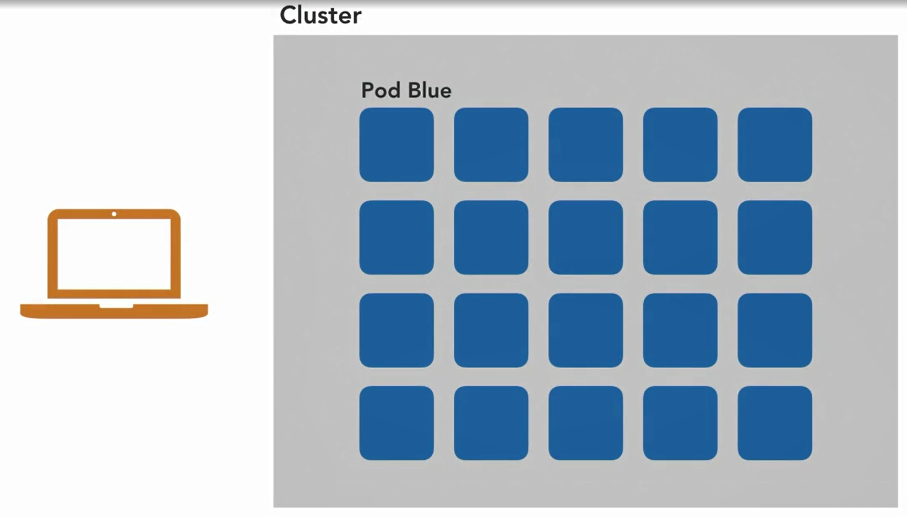

### Real-World Workloads

#### Orchestrating real-word workloads with deployments and StatefulSets

* Consider our engine X-based web pod, sitting on a node, serving users. What if it crashes and has to restart? Now, Kubernetes will do that automatically for us but during that restart process, no one can visit our site. So what we need is redundancy. We need another copy running back in takeover. What about if we're in the lucky position that we just have too many users and these two pods can't handle all of that load? We'd need even more scale

  

* What we want is several identical copies of the same pod. Now, to get more copies of the pod, we could just copy the file that describes it. For each one and we just changed the name so it doesn't clash and then we deploy it. Problem with that is every time we wanted more or fewer, we'd have to do some more of this copy and paste. This is tedious and it's slow and it's error prone. And it's actually not just annoying, it's irresponsible to manage your production systems like this.

* Kubernetes to the rescue. It has first-class support for this kind of replication. What do I mean by first class? Well, I mean that we don't have to piece what we want together from other bits. We don't need 10 separate pod objects and then some other kind of resource and some other. Kubernetes has one resource type that's designed for this and will do exactly what we want. And this resource is called the deployment.

* A deployment takes a definition of a pod and makes us a bunch of copies of it. Like any other kind of resource, we're going to want a file to declaratively, describe our deployment and then we'll apply that to the cluster. 

  ```yaml
  apiVersion: v1
  kind: Pod
  metadata:
    name: blue-green
    labels:
      app: blue-green
  spec:
    containers:
      - name: blue-green
        image: mtinside/blue-green:blue
  ```

* We're going to take this definition of a single pod and turn it into a definition of a deployment. The deployment object is in the API group called V1/apps. The deployment object is in the API group called V1/apps. So pod before was just in V1 and that's actually shorthand for V1/core, which means it's the very core set of features that Kubernetes sort of relies on. But in the apps API group, we have a kind of thing that I've said is called a deployment. It's going to take some metadata.

* Spec says how many identical copies of this pod we want, so replicas.

* It takes a selector and this selector matches labels. And we're going to use our standard app, blue-green label. What this selector tells the deployment is which pods it's managing. So when it comes to scale down, it knows which ones it can remove from the pool. So now we've got a selector for the positive being managed and a replica count.

  ```yaml
  apiVersion: apps/v1
  kind: Deployment
  metadata:
    name: blue-green
  spec:
    replicas: 3
    selector:
      matchLabels:
        app: blue-green
    template:
      metadata:
        labels:
          app: blue-green
      spec:
        containers:
          - name: blue-green
            image: mtinside/blue-green:blue
  ```

* All we need is a definition of the pod itself or the pods that we're going to make, the many copies. So we give that a template and here we basically just reuse our pod definition. We don't need the API version all kind because this is not a stand-alone object, it's just a sort of template for making those pods. And actually this thing can't have a name because we couldn't have more than one pod with the same name.

  

* There is a cool kubectl plugin we can use to visualize this relationship between the deployment and the pods.

* kubectl has a plugin manager called krew. So krew is like a package manager like apt or RPM. And we can say, kubectl krew install tree because tree is the plugin itself.

  ```shell
  krew install krew
  kubectl krew install tree
  ```

  

* There's the deployment resource. It's made a thing called a replica set, which we don't need to worry about, we'll cover that later. And the replica set has made the three pods that we want and they're all ready. Now deployments are great for services like web servers, where if you have too much load you can just add more copies of your pod. These kinds of services are known as horizontally scalable or stateless applications. 

* Think of a database. You can't just add a new instance of that, it wouldn't have any well, data. You have to coordinate this new member with the other instances to replicate and rebalance the data, tell them which is the leader and which are followers, all that kind of stuff. This is also understood and catered for by Kubernetes through another type of resource called the stateful set. As the name implies, rather than stateless services like a web server that we can just make more copies of, this is for stateful ones. So it too makes pods for you but the pods are all treated individually and they can have different configuration, which is exactly what you need for running services that form clusters or groups and all coordinate together. So they have to be able to tell each other apart, tell leaders from followers from replicas.

  

* The pod so that we could see the nuts and bolts of the Kubernetes system, but really you should actually never make them directly. Deployment and stateful set are examples of higher level objects

  ```shell
  kubectl api-resources
  ```

* What the daemon set does, again, it takes a pod specification, a pod template and it runs precisely one copy on every worker node. Now this is a little bit weird. It kind of breaks the abstraction that Kubernetes is trying to offer. It kind of looks through the mirror but it's really useful if you've got something like a cache and you want to make sure that every pod has one copy of this cache close to it. So whichever worker node a pod ends up running on, there's going to be a copy of the cache on that node, which will obviously be much faster and much higher bandwidth than talking to a cache instance that's ended up on another node. So that's what Daemon sets for and that rounds off the set of things that are concerned with apps in Kubernetes.

#### Safe Upgrades with Rolling Updates and Rollbacks

* Deploying a new version of a service safely and with no downtime, is a very hard thing to do. One of the many reasons to use a deployment resource in Kubernetes to manage pods for us is that deployment can help us with that. Deployments can automatically and incrementally roll out new versions of the service, in what's called a rolling update.

  

* blue-green.yaml

  ```yaml
  apiVersion: apps/v1
  kind: Deployment
  metadata:
    name: blue-green
  spec:
    selector:
      matchLabels:
        app: blue-green
    replicas: 10
    strategy:
      rollingUpdate:
        maxSurge: 1
        maxUnavailable: 0
    template:
      metadata:
        labels:
          app: blue-green
      spec:
        containers:
          - name: blue-green
            image: mtinside/blue-green:blue
            imagePullPolicy: Always
            readinessProbe:
              httpGet:
                port: 8080
                path: /live
              initialDelaySeconds: 0
              periodSeconds: 1
              timeoutSeconds: 1
              successThreshold: 1
              failureThreshold: 1
  ```

* .And you can see we've got 10 replicas of blue-green. This is obviously a really high traffic site with a lot of users. And there they go, they will come up. But maybe I think green is better, maybe I want to try that out and see what my users think. So I've got a green version of the app ready to go, we've seen that. So we can just edit the file and apply it over the top, right? Well, we've got 10 replica's, so what's actually going to happen if we do that? A naive thing that Kubernetes could do, would be to delete all of the old ones because we don't want them anymore, right? We want green now, and then make the new ones. 

  

* The problem with that is in that period of transition there's downtime, where we don't have any. Also what would happen if we go straight from blue to green, get rid of all the blue ones, put all the green ones in, but this new image isn't very good, it crashes a lot.

  

* So if we needed all of that capacity for scale, then, you know, we just wouldn't have it, and we've abandoned a perfectly good, at least a perfectly stable blue pod, for something with a slightly nicer color. So maybe that's not the right kind of trade off to take. Well, what if we try to avoid that by having our blue pods and then making all of the green ones before we get rid of the blue ones, so we never have that period of downtime. Well, this is going to take a lot of CPU and Ram, quite possibly more than we have. If we're running our nodes close to capacity, which of course is the most economical, it's not going to work. 

  

*  Actually, kubectl diff. If can give this the file, so this is the file that still describes the same service, it's still a deployment with the same name, blue-green, we've just changed one of its fields in place. So kubectl can match the two up and tell us what would change if we apply it.

  ```shell
  kubectl diff -f blue-green.yaml
  ```

  

  

* If we find out that the new green pods are coming up on very good, we can actually pause this rollout and even roll it back. The reason this is five seconds is because that's how long these new pods take to tell Kubernetes that they're actually working properly.  And the reason that we're going one pod over the 10 and zero pods under, is because again, that's a setting that I've given to Kubernetes. We could tell it to be more aggressive and either overshoot by more the one pod to get through the cycle quicker or allow it to own the shoot, so it'll remove, say three and then backfill them so that we're never over the capacity, if we don't want that for whatever reason. And again, by increasing that undershoot number, we can get through things quicker, but with a little bit more risk.

#### Batch Processing with Jobs and Cronjobs

* kubectl api-resources | grep batch

* The first of these job, runs a pod containing a piece of software that just does one thing and then quit. 'Cause if you think about it, most pods run software that's long lived, like a web server, which starts up responds to queries every network and keeps doing that forever. 

* In fact, we never want that software to quit. If it does, it's probably crashed. That's probably an error. But sometimes you want a piece of code to just perform a one off operation.

  ```yaml
  apiVersion: v1
  kind: Pod
  metadata:
    name: fetch
  spec:
    containers:
      - name: fetch
        image: alpine
        command: ["/bin/sh", "-c", "wget http://blue-green"]
  ```

* I've called it fetch. And what it does is it just uses the base Alpine image, runs the shell, and runs wget, and then goes and talks to the bluegreen service. So this will hit the blue pod, get that blue website, download it and save it to the file system

* There's the blue pod serving, and here is fetch. And Kubernetes says that his status is crashing back off. And what this means is that Kubernetes thinks it's crashing. You see it's been restarted twice now because fetch starts up running some code as expected, but then it exits. And Kubernetes doesn't understand this or server process, like a web server, never exits. So, it thinks every time that it's crashing, and it keeps restarting it. And what it's saying actually is that it's in a, what's called a crash loop. 

* So it's just going round and round in a loop every time Kubernetes starts it, it just crashes again. So Kubernetes is backing off. It'll actually the first time it crashes, restart it really quickly. And then every time after that, it says, Okay, I think this piece of software is buggy. I'm not going to just keep restarting it as fast as I can, because that's going to use a lot of resources. I'm going to take exponentially longer each time to have another go. So yeah, three restarts now in this pot is going to crash to back off because it's actually doing the right thing for Kubernetes doesn't understand what that is. 

  

* Instead, we can describe this as a job,when I get my terminal back. So like a deployment, a job takes a template to a pod. 

  ```yaml
  apiVersion: batch/v1
  kind: Job
  metadata:
    name: fetch
  spec:
    template:
      spec:
        containers:
          - name: fetch
            image: alpine
            command: ["/bin/sh", "-c", "wget http://blue-green"]
        restartPolicy: Never # Don't retry if failed
  ```

* So, we expected one pod to come off and to run to completion. And one pod has done that. We can actually see the pod that it ran, it's taking its name prefix from the job, and we've got a randomized suffix so that if we did run this thing more than once, then it wouldn't clash. So, this is now run to completed but we're not going to move out of that completed state. We're not going to go into crash to back off because Kubernetes understands that that's not how this kind of software operates. But this pod still hangs around it's sort of metadata

  

* So we can still do useful things like actually go look at its logs, and we can see what it did when it ran. So, really, exactly what we'd expect. This is the output from wget that you might be familiar with, it's implicitly talking to blue green here, you can't see it. But it says that it's fetch the default web page, and it saved it to index dot HTML. 

  

* The other type of results that we saw in the API is a cron job. What this does is it runs those run to completion style tasks periodically. So this is really useful for a backup and analytics run, anything that needs to run multiple times on a schedule. So this is very similar to job as we'll see. But it's got another layer of wrapper. So this is a cron job in the batch API group. The cron job itself has this schedule, now this format is very odd. It's the same as the Unix crontab format. 

  ```yaml
  # Cronjob
  apiVersion: batch/v1beta1
  kind: CronJob
  metadata:
    name: fetch
  spec:
    schedule: "* * * * *"
    jobTemplate:
      spec:
        template:
          spec:
            containers:
              - name: fetch
                image: alpine
                command: ["/bin/sh", "-c", "wget http://blue-green"]
            restartPolicy: Never # Don't retry if failed
  ```

* This specifies the schedule on which to run this, I can tell you that this magical string here isn't a piece of decoration, it actually means once every minute. And then cron job takes a template for a job, because it's going to make a job every time to manage the pods that's doing the work because that pod is going to run to completion.

* If we apply this to the cluster, every minute, in this case, cron job is going to make a job. And that job would instantly make a pod, watch it, run this download to completion, understand that it's going to quit and then just leave its shell there so that we can read its logs and look at it's metadata afterwards if we want to. I won't apply this to the cluster because we'll have to, wait up to 59 seconds rate of around one

### Questions

* Why would we not want to upgrade a Deployment by first deleting all the current replicas and then adding the same number of new ones?
* ans : There will be service interruption.
* Which is these types of system is Deployment used to manage?
* ans : stateless, horizontally-scalable services where we can add replicas at will
* A batch job will be retried if `_____`.
* ans : it exits with a non-0 code