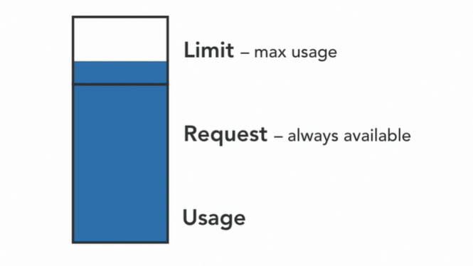
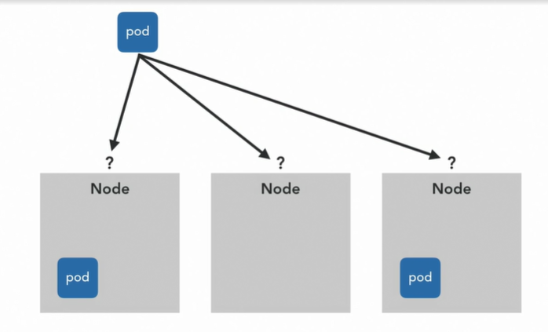
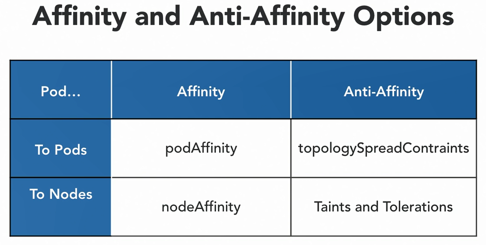
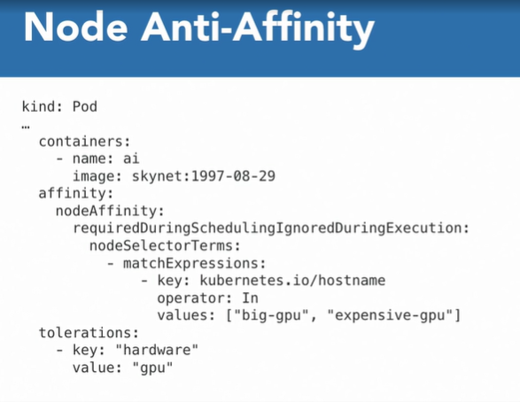

### Teaching K8s about Your Service

#### Ensuring availability with Liveness and Readiness Probes

* One of the other really useful things it can do is simply keep our software running. However much we've moved fast and broken things. So I realize I've asserted a lot that Kubernetes will restart start a pod if it crashes. But I've not actually shown you it.

  ```shell
  c:\windows\system32\drivers\etc\hosts
  kubectl get pods -n ingress-nginx
  ```

  ```yaml
  apiVersion: v1
  kind: Service
  metadata:
    name: envbin
  spec:
    selector:
      app: envbin
    ports:
      - port: 80
        targetPort: 8080
  ---
  apiVersion: networking.k8s.io/v1
  kind: Ingress
  metadata:
    name: envbin
    annotations: 
      #kubernetes.io/ingress.class: nginx
      #nginx.ingress.kubernetes.io/ssl-redirect: "false"
      ingress.kubernetes.io/ssl-redirect: "false"
  spec:
    rules:
      - host: envbin.example.com
        http:
          paths:
            - path: /
              pathType: Prefix
              backend:
                service:
                  name: envbin
                  port:
                    number: 80	
                #serviceName: envbin
                #servicePort: 80
  ```

* We still have an intent to run this pod to the same intent that we always did. But in order to actually keep it, giving services had to be restarted in place once. So it's obvious when a program crashes. Kubernetes can notice that by itself as we've seen. But there's really only so far I can get on its own. 

* A pod might've lost a connection to the database it relies on. Or it could have corrupt internal data and only be able to return errors. Or it could be deadlocked completely and not responding at all.

* Liveness.yaml

  ```yaml
  apiVersion: apps/v1
  kind: Deployment
  metadata:
    name: envbin
    labels:
      app: envbin
  spec:
    selector:
      matchLabels:
        app: envbin
    template:
      metadata:
        labels:
          app: envbin
      spec:
        containers:
          - name: envbin
            image: mtinside/envbin:latest
            livenessProbe:
              httpGet:
                path: /health
                port: 8080
              initialDelaySeconds: 1
              periodSeconds: 1
  ```

* Deploy a updated version of the deployment for that pod. So this will change it in place, override over the top. And if we look at pods, we can see if your eagle-eyed, there's a new suffix on there. So this is a new pod. We've changed the deployment in place, but the deployment now has a new pod template. And what it's done is it's removed the old pod based on the old template and made a new one based on the new template.

* we've declared a liveliness probe. I've told Kubernetes how to check if this pod is okay. And I then told the pod to say that it wasn't. So it got restarted. What the liveness probe does is try an HTTP end point that we tell it. In this case, port 8080, HTTP path /health. And if it gets no response or it gets an HTTP error code, then Kubernetes is going to assume that the pod isn't okay and it'll restart it. And I told envbin to return an error and to say that it's not okay. 

* Readiness.yaml

  ```yaml
  apiVersion: apps/v1
  kind: Deployment
  metadata:
    name: envbin
    labels:
      app: envbin
  spec:
    selector:
      matchLabels:
        app: envbin
    template:
      metadata:
        labels:
          app: envbin
      spec:
        containers:
          - name: envbin
            image: mtinside/envbin:latest
            readinessProbe:
              httpGet:
                path: /ready
                port: 8080
              initialDelaySeconds: 0
              periodSeconds: 1
              timeoutSeconds: 1
              successThreshold: 1
              failureThreshold: 1
  ```

* There's a second type of probe, called a readiness probe. And this is how Kubernetes probes to your service to see if it's in a state to accept user requests right now. This is usually used to detect when the service itself is okay, but for some reason it's unhappy with its environment. Maybe momentarily it can't talk to its database, so there's no point in it receiving user requests. But it itself isn't broken.

* You a new kind of resource called the endpoint. kubectl get endpoints. So like deployments make pods for us, automatically so we don't have to. Services make endpoints. There is an end point object that represents every pod that matches a service's label selector. So there's a service for envbin. With the label selected we've seen that matches the labels on in this case the one envbin pod. So the service has found the one pod that it's going to send traffic to that matches its label selector. And it's made an endpoint resource for that. And this is the IP address of that pod. And the port that that pod is listening on. This means that all requests to the envbin service are going to go to this one pod. And this is how we find it. If there were more than one copy of this pod, then traffic would be spread between them. So bear that in mind while I update this deployment one more time.

  ```shell
  kubectl get endpoints
  ```

* This time the pod has a readiness probe defined. So I can come back to envbin. We've got another new session because we changed the deployment. So the old pod was deleted, the new pod was made. New container was started. And we can lower this time its readiness probe. If we try to get to it now, it's the same error. So there is a gateway sat in the way. This is actually the Ingress box that I was talking about back in chapter one. And this Ingress box is saying 503 gateway error. I'm trying to service your request, but I don't know what to do with it. I've got nothing to talk to. And this is going to persist forever. Unlike the brief one we saw, when we lowered the liveliness probes. Kubernetes quickly stepped in and said, ah, it's completely dead. I know what to do with this. I'm going to restart it. This is going to live forever, or at least until we do something.

* If we get those end points again, we'll see that there are now no end points for envbin. Because what end points actually are is there's an end point for every pod that matches the services label selector. which is ready, which is currently able to serve traffic. Otherwise there's no point sending traffic to it. So we only had one envbin pod, it was our singular end point.

*  that's saying it's not ready. It's lowered its liveness probe. So Kubernetes is probing it like we've told it to, and it's saying, it's not ready. It doesn't want any traffic. So Kubernetes has says, well this service simply has no compute, no pods behind it. And that's exactly what that Ingress box is finding out. It's trying to talk to the service and the service is saying, well, there's nothing I can do for you. I have no ready applicable pods. So we're getting a gateway error from the Ingress.

* So when a pod first comes into existence, if it needs a while to preload a bunch of data or to precalculate some results, it can start with its readiness probe down and it can leave that readiness probe down until it's ready to go. And that can take a minute or so, depending on how complicated those calculations are.

* So if it's a web app, then check one of its main pages. If it's an HTTP JSON API, check an important path. It'll have to be an authenticated one, but an important path. By writing the readiness and the liveness probes, you're telling Kubernetes how to probe your app. So if your app is a black box, if it crashes Kubernetes can tell because every app looks the same when it crashes. What it doesn't know is what the paths are to the pages in your website. What the paths are to the API endpoints in your service. You have to tell it that in order for it to be able to test it and probes are the way that you do that. Really what we're trying to avoid is having some background thread or go routine that's completely decoupled from the rest of the code.

#### Managing resource usage with Requests and Limits

* This is where one application uses so many resources that others can't get enough. Kubernetes can help protect us against this. It can enforce limits on the maximum amounts of CPU and RAM that any one pod can use. It can also provide guarantees for minimum amounts that will always be available to pods. 

* Every pod will have sufficient resources to do what it needs to do. If there are free resources that no one needs, why not use them. 

* You specify the amounts it needs to have available. And these are called requests. You specify the maximum amount it's allowed to use. And these are called limits. These requests aren't minimums. 

  

* They're not this is the least you'll ever see it use. They're better understood as this is the least it needs to be safe. Which is actually kind of the maximum value for what you'll see it use under normal operation. If they get busy, they can use some extra that's available above their request, and this is called bursting. 

  

* But they can never exceed the limit.  This is the level where we're saying look there's really no reason for it to try to use this much resource. And if it does, it's definitely had an error. Just prevent that from happening.

  

  ```yaml
  apiVersion: v1
  kind: Pod
  metadata:
    name: web
  spec:
    containers:
      - name: web
        image: nginx:1.18.0
        resources:
          requests:
            memory: 64Mi
            cpu: 100m
          limits:
            memory: 1Gi
            cpu: 768m
  ```

* Here's a definition of a pod, which specifies requests and limits for both CPU and memory. The units for memory are fairly simple. Mebibytes and gibibytes here. For CPUs this is cores. So this limit of one says that the program can go at full speed on one core of the system. If this was a single core computer, the pod could use all of it. So one is actually quite a big number because you can get an awful lot done with a dedicated core on a modern machine. More normal numbers are more in this kind of range, like 100m, which is 100 millicores. Or 100 thousandths of a core. So 10%. The way that limits are enforced are a little different for the two resource types. The CPU is just throttled. If say a pod tres to go as fast as it can on one thread, and use the whole core. But the limit here was set to 100 millicores

* Memory though can't be throttled. It doesn't work like that. An app can just keep allocating objects. And if memory allocation fails, then its game over. That's a very serious error and you just have a crash. And this is actually basically what happens. If a pod hits its memory limit. 

* So in this case one gibibyte, then it's just killed. And another one gets to try again and gets to try to do the same thing but not use quite as much RAM next time. You might be familiar with the dreaded OOM killer on Linux, the out of memory killer. Which starts terminating processes if a system runs out of memory. Limits are kind of like that, but then more fine-grained. So by killing individual pods that get carried away, we hopefully avoid a situation where the whole system has to do it. 

* So what about the requests ? 

  

*  They're treated as the size of the pod when the pod is scheduled onto a node. So say here, we've got a big pod. We've got a small one and we've got a couple of mediums. If this big pod gets scheduled onto the first node, then the two mediums aren't going to fit anymore. But that small one can squeeze in. The two mediums you've seen have had to go over to the right on that second node. By never overfilling the nodes, each part has at least the amount of resources it asked for. And it can even burst into the blank space if the limits are set higher

  

* Kubernetes actually does its best to fill the nodes. To ensure maximum usage on all of them for efficiency reasons. This is an operation called bin packing.

* **One thing to consider is that if a pod has a CPU or memory request that's actually bigger than the node, or bigger than any of the nodes you've got in your cluster, then it won't ever fit. It just won't be assigned to a node and it'll sit on the queue forever**

  ```shell
  $ kubectl describe node minikube
  ```

  

* The size of in this case, the virtual machine of my laptop. So memory, this isn't the size. This is the sum total of the request, and then limit's actually down here. So we can see that the hidden system components in Kubernetes have already reserved almost half of the CPU. So we could work it out. You know 950 millicores is 23%. So, you know, it's two cores. It doesn't take a degree in math but let's have a look. The fields are somewhere. Here we go. Capacity and then there's a little bit of headroom actually left for some very low-level system components. So allocatable. This is the size of the node for scheduling purposes. Two cores. And this number, which is about six gibibytes of Ram. So if I come back into my pod and let's just have it request 64 gibibytes, that's definitely not going to fit.

* The default requests, if you don't set them are zero. This means that the pod is treated as taking up no space and it can be scheduled onto any node, no matter how busy it is. Now when it gets there it might find there's effectively no CPU or memory and it might not be able to do what it needs to do.

*  So for this reason, you should always set the CPU and memory requests. How much to set them to is a bit of a black art. How well do you really know your service? Have you got load tests? And have you seen it run under real production circumstances? If not, you're going to have to take a guess and then watch its usage and tweak it and repeat**. There's actually a newish feature in Kubernetes called the vertical pod autoscaler.** Which does this watching and adjusting for you.

* So check it out. As for limits, well to me, a CPU limit doesn't really make sense. How can you have too much CPU time? How can you do too much work? Even if there's an error in the program, it's just going to use cycles that nobody else wanted anyway. And if somebody else does want them, then it'll be your error pod will be throttled back to within its request amount. So I wouldn't set one. Because no limit means just that, infinite usage. Memory on the other hand is dangerous. Imagine a fully scheduled node. 

* So requests summing up to 100% of the size of the node and all of the pods using right up to their request. If one pod tries to use just a little bit more memory. Step just a slightly a little way outside of its request, then that whole system is out of memory. And something's going to killed by the OOM killer. And it's not necessarily going to be the pod that used too much. Memory management and OOM killing is a crazy complicated topic.

#### The Scheduler and influencing container placement

* One of the really powerful features of Kubernetes is that we can give it as many worker nodes as we like, and it will run our pods on one of them. We don't have to be involved in that decision, and we usually don't care about the outcome. But the default strategy is, well, run the pod wherever it fits. Sometimes we want to override this default behavior.

  

* For example, we might want two pods that talk to each other a lot to be in the same worker node, so that the communication between them is as fast as possible. We might want two pods that are part of the same service, to be as far apart from each other as possible on different nodes, ideally in different availability zones. This way, any node or network failure that affects one is less likely to affect the other, meaning that as a whole, the service will still stay up.

  

* The four options you can see in this table, which is for a particular pod, when it's being scheduled, how does that scheduling decision get affected by affinity, or anti-affinity to other pods, or affinity or anti-affinity to the nodes themselves. 

  

*  pod affinity, and this is where one pod has an affinity for another, it wants to be close to another pod.

  

* On the left is a Redis database called cache. And we've labeled it with label app cache. The other is the actual service pod here on the right, and it just runs a web server. But imagine it's using that Redis pod as a cache. So, web here is going to be talking to cache a lot. And it would be great if they were on the same worker so that the bandwidth is high and the latency is low. They'll work fine if they're not, this is a non-functional performance optimization, but it is something we might want to happen. The way we do this is to say that web here on the right has an affinity. And you can see the affinity stanza, an affinity for another pod. Pod that it has affinity for, can be found by looking for this label here in the matchLabels, app cache.

* The way this stanza works is it says, find the other pod using this level selector. And when you've found it, make sure that this topology key is the same for both. So kubernetes.io/hostname, the value of this topology key field is actually a key that's present on all nodes. And what this is saying is that, I'm the pod web. And when you decide where to place me, I want you to find the other pod by looking at the label app equals cache. And I want you to make sure that we both have the same kubernetes.io/host name label, and this will result in them being on the same host because the host name label is the name of the host. But this topology key could be something else. It could be kubernetes.io/zone, in which case, we're putting both pods in the same availability zone. So, closer than they might be, but not quite as close as necessarily being on the same pod.

  

*  Probably the most common use of any affinity or anti-affinity setting his pod anti-affinity. This makes one pod really dislike certain other pods and refuse to be on the same node as them, or sometimes even refuse to be in the same zone as them. This is primarily used for high availability. So if you have one pod, and it crashes, your users can't get the service anymore. So, your solution is to have more than one copy of that pod. And we've seen this with the deployment object. Even if that many aren't needed to handle the load, at least by having a second copy, if the first one crashes, there's still one copy available to the user. But if they all end up on the same node, and that node crashes, or its underlying hardware catches fire, then you're going to lose the service no matter how many you have.

  

* So you want to spread them out. The field for this in a deployment specification, is **topologySpreadSonstraint**,  So the pod, or in this case, it's the template for a pod identifies the other pods that it doesn't like using a labelSelector like before. So here's a labelSelector. This is a deployment of web. So we're going to basically have 10 copies of web, and we want to spread them out as much as possible. So they don't all live in what's called the same failure domain, they're not all going to suffer the same fate, if a node or an entire availability zone goes down. 

* So this, all the pods in it, made from this template are going to have the label, app equals web, but they're going to say that they don't like to be on the same nodes as pods with the label app equals web, which is other members of this same deployment, then this is really common. 

* So, **what this topologySpreadConstraint** is saying is that it wants to spread the pods of this deployment out on a zone by zone basis. 

* **A maxSkew one means**, please keep the numbers in each zone as close to each other as possible. So what will happen is when the second pod is deployed, it'll get put in the second zone. The third one will go in the third zone, and then we'll wrap round, and we'll start piling up in zone A and B, zone C, back to zone A, and so forth, until we have all 10 deployed. 

  

* So in this case, we've ended up with four in zone A, three in zone B, and three in zone C. So this adds up to 10. And that maxSkew one means that this is really the only kind of solution we can have. We couldn't have five in zone A, two in zone B, and three in Zone C, because the difference between the five and the two is bigger than one. So maxSkew one says keep it absolutely as level as possible.

* if we deploy it on to a massive production cluster across three zones, we'll get the behavior we want. You may actually see older documentation examples, out there on the internet, they use a feature called pod anti-affinity. Now this is older, and the problem with this is that it gets stuck at a certain point. So, pod anti-affinity says I refuse to be in the same zone as another pod, full stop. So when we get to this stage, and we've deployed three out of our 10, there's now know where the fourth pod can go, because it point blank refuses to be in the same zone as anything that exists.

#### Node Affinity and anti-affinity

* If all the nodes in your cluster aren't the same kind of machine, say, some of them have very fast network cards, some of them have very fast SSDs, then you might want to take your Ingress pods and put them on the machines with fast networking. And you might want to take your database pods and put them on the machines with very fast SSDs.

  

* node anti affinity. And this is where a pod wants to stay off one or more nodes. Now, normally, the only reason to do this is because something else wants that node all to itself. You know, why would you want to avoid a node all else being equal, if it's broken, then it's broken and nothing wants to be on it. Kubernetes is going to take care of that. That's not something that I would ever want to specify.

  

* It's all well to tell the machine learning pods to go on the node with the GPU. But what if that's already really full of web servers. And they don't know about this special hardware, they don't use it, they don't care about it. But they're using up all the CPU and the RAMs so I can't get any more machine learning pods here with this graphics card. It would be really helpful if we could keep everything else off this node, if everything else had an anti affinity for this node. Now, there's no first class node anti affinity field, we could do anti affinity, like we just saw affinity. So then every pod except the machine learning job, every other kind of pod would have to say, I don't want to be on the GPU nodes. And I don't want to be on the SSD nodes, because they're for their databases, and I don't want to be on the first network nodes. That's a huge, huge amount of maintenance. 

* .So the API is actually all the way round. The way this is done is with what's called a taint. So a taint is like a label on a node. And this label similar to the node affinity says that it's special in some way, maybe it has special hardware. But by setting the value, in this case, hardware equals GPU. 

* By setting that as a taint, not as a label, it has the effect of keeping everything off that node just by existing. If a node has one or more taints, then by default, every pod will stay away from it. So that's how node anti affinity works. And for the pods that do want to be on that node, they have to tolerate that taint. 

* That label is what I'm looking for and I do want to go on that node. The reason we have the affinity block in here as well is actually tolerating the taint, just means well I can be on that node doesn't actually necessarily mean that you will be on that node. So almost always when you tolerate the taint, you will have an affinity block to say yes, and not only can I be on that node, I insist on being on that node. 

  

* In this diagram, I've applied the taint, which is the purple color to a particular node. This is the one with the GPU in. The machine learning pod tolerates that taint, so that it can schedule onto it. And in fact, it uses node affinity to insist it's going to schedule on it. And these other web server pods have no idea about that taint. They don't know what that kind of hardware is. They're never going to use it. So because they don't specify a toleration for it, they'll land anywhere but that node.

  

#### The Horizontal Pod Autoscaler (HPA)

*  A very powerful feature of Kubernetes is its ability to automatically rescale your deployments based on actual load. 

* deployment.yaml

  ```yaml
  apiVersion: apps/v1
  kind: Deployment
  metadata:
    name: envbin
  spec:
    selector:
      matchLabels:
        app: envbin
    template:
      metadata:
        labels:
          app: envbin
      spec:
        containers:
          - name: envbin
            image: mtinside/envbin:latest
            imagePullPolicy: Always
            resources:
              requests:
                cpu: 100m
              limits:
                cpu: 100m
  ```

* I can tell it to use a certain amount of CPU. So I'm going to tell it to sit there and use 10 cores worth. CPU use is set to 10 and that's trying to spin 10 entire cores. Now, if we come and look at the definition, you'll see that we've got requests and limits set and actually, this is just 100 milli cores, so this thing is going to try to use 10 cores but it's going to get limited to 0.1 core. So this pod is massively overloaded.

* Horizontal Pod Autoscaler

  ```yaml
  apiVersion: autoscaling/v2beta2
  kind: HorizontalPodAutoscaler
  metadata:
    name: envbin
  spec:
    scaleTargetRef:
      apiVersion: apps/v1
      kind: Deployment
      name: envbin
    minReplicas: 1
    maxReplicas: 5
    metrics:
      - type: Resource
        resource:
          name: cpu
          target:
            type: Utilization
            averageUtilization: 80
  ```

* What we can do is we can add a new type of resource called a horizontal pod autoscaler. So this is something which autoscales pods horizontally, as in it doesn't make them bigger, it doesn't give them more ability to use cores and to serve people. That would be vertical scaling, like when you bought a bigger server in the '90s. This is horizontally scaling, which means adding more copies of the same thing side by side. And we can look at that resource. It's fairly easy to read. I think its specification specifies minimum number of replicas, the maximum number of replicas, so it will autoscale but only up to a point. If you've got a bug in your software and it's just eating all the CPU it can, then an unlimited autoscaler will just keep adding pods and you'll just keep deploying them forever and just spending infinite amount of money on compute and we don't want to do that.

* We're saying what are the metrics to watch? So I want to watch the CPU and my target is CPU utilization. So I am targeting an average utilization of 80%. So across all the pods that I've got in this deployment and then this is referenced up here. So the reference to the target is the deployment called envbin. And I want an averageUtilization of 80%. So this 80 is 80% of the request as it happens and that's why setting requests and limits to this same value is quite useful or actually, like I said in the video on requests and limits, for CPU, don't set a limit but do set the request as something meaningful. So the request is how much CPU do we reasonably expect to use? How much we want reserved and guaranteed for ourself? And when get to 80% of that, we're getting kind of close to comfort, so when we get above 80%, I want more pods so that the average utilization of the CPU across all of them stays at 80%. 

* Kubernetes autoscaler has come in and changed, it's actually modified the deployment definition. So we had the deployment with a replica account of one and the horizontal pod autoscaler has come in and edited that as if we changed the file and reapplied it and it's changed that replica account to two. Now, interestingly, the autoscaler is going to stop here because this is a bit of an artificial example but I personally think these kind of test cases really make you think about how things work.

* One of the pods is at 100% of its request, of its limit, even because they're the same thing. It's at 100% of its allowed usage because we told it to go crazy. We told it to go for 10 cores and it's only allowed 0.1 just because I wanted to make sure we absolutely hit the limit and stayed there. The other pod, on the other hand, is a new one that we haven't configured. We haven't been to its web interface and told it to do anything. So it'll be using 0% CPU. In fact, we can see that if we watch top again. Well, I guess, we don't even have any metrics comes through for the second pod yet. But that second pod will be using 0% CPU. And this actually gives us, there we go, there's the metrics for it. The average across these two pods is 50%, which is less than 80%, so the scaling now becomes stable. The horizontal pod autoscaler will stop at two pods.

* CPU usage would come from them actually responding to requests over the network and the pods will be endpoints of the same service, so they'd share the load. And in this case, the network traffic that wanted to produce 10 cores worth of load would keep getting spread to more and more and more pods 

* . CPU usage is one of those resources that tends to scale absolutely with load and get used quite a lot. But not everything burns through CPU. Not everything is limited by its CPU usage. So you can also scale on memory usage. CPU and memory usage are the two sort of fundamental resources you can look at. They're always available for you to scale on, for you to configure into the horizontal pod autoscaler

#### Providing Configuration with Configmaps

* The standard ways of configuring software on a native host are still applicable in Kubernetes. Command line arguments, environment variables and config files being the main ones.

* So that opinion is that we should keep and manage our code separately from the config for that code. Now, this isn't a new idea. In fact, it's one of the 12 factors of cloud-native development that.

* Configmap

  ```yaml
  apiVersion: v1
  kind: ConfigMap
  metadata:
    name: colour-config
  data:
    colour: pink
  ```

* pod definition

  ```yaml
  apiVersion: v1
  kind: Pod
  metadata:
    name: pink
  spec:
    containers:
      - name: pink
        image: mtinside/blue-green:blue
        env:
          - name: COLOUR
            valueFrom:
              configMapKeyRef:
                name: colour-config
                key: colour
  ```

  ```shell
  kubectl port-forward pink 8085:8080
  ```

* we're not restricted to simple key values for our config either. We might want a whole config file to be available to one of our services. And ConfigMaps can do that too. So I think we've seen that the Nginx's container boring default home page a few too many times now.

*  This is separate from the code of Nginx and we might want to manage it and maintain it in a different place and I can make a configmap from that. I can say kubectl create configmap. Let's call it website and we want to create it from that file. So we can say from-file=index.html. And this will make a configmap from that file.

  ```shell
  kubectl create configmap website --from-file=index.html --dry-run -o yaml > website.yaml
  ```

  ```yaml
  apiVersion: v1
  data:
    index.html: "<html>\n    <head></head>\n    <body>\n        <p>Hello from Matt!
      \U0001F44B</p>\n    </body>\n</html>\n"
  kind: ConfigMap
  metadata:
    creationTimestamp: null
    name: website
  ```

* nginx

  ```yaml
  metadata:
    name: web
  spec:
    containers:
      - name: web
        image: nginx:1.18.0
        volumeMounts:
          - name: website-volume
            mountPath: /usr/share/nginx/html
    volumes:
      - name: website-volume
        configMap:
          name: website
  ```

* So what I can do is just mount a volume over the top. My volume is a projection of a configMap. So my volume, which I'm call call website-volume has its files come from this configMap. One key per file. So the key in that configMap, its value was a file name. And that will be the name used for the file and then the value of that config item is going to be the contents of the file. And we can take that volume and we can mount it at a specific path in the container.

*  I typed a literal wave character? Kubectl create turned that into an escape sequence but now it's rendering like this. So all that would be happening here is Nginx will be sending those literal bytes to the browser but not setting the content encoding header. So the browser thinks they're ASCII, not Unicode and hence, we see this. What's needed is some more Nginx configuration. A file to tell it that the contents of the index file are Unicode and that it should tell the browser that by setting that header

#### Suppyling sensitive data with Secrets

* What about when those data are secret or sensitive? 

* Often our services need things like a database password or a third party API key. 

* Kubernetes handles these kinds of data separately with a resource called, unsurprisingly, the Secret. 

* You can use the Secret just like a ConfigMap, but the implementation is a little bit different. 

* When secrets containing files are attached to pods, using that volume mechanism that we saw, the data in the 

* Secret is never written to the disk of the worker node. The Secret data is encrypted at rest when it's stored in the database in the Kubernetes control plane, and the values are stored and retrieved Base64 encoded, which just makes it that little bit harder for people to shoulder surf them. 

* They do actually offer a couple of little features that I'll tell you about. Apart from these security features, they act exactly like ConigfMaps, you use them in the same way, you can use their values as environment variables, as files, as command line arguments, just the same.

  

* Secrets do have one interesting and unique feature though, which is that they have a type.  If we use QTTL Create Secret and give it the From File argument, just like we did with the ConfigMap, we'll get what's called a generic secret. Now the keys and values of generic secrets can contain anything, the other types enforce certain rules about what can go in the Secret. They validate the data that you put into them

* Service Types: Generic and TLS Secret

* Most of them are actually for internal system use, but the other one that you're going to come across a lot is the TLS type. This type of Secret will only let you use certain keys.

* tls.key - private key

* tls.crt - certificate

* ca.crt - ca certificate

* It checks that it was signed by the value of CA dot CRT, which also has to be a certificate, but a CA certificate. And it checks that the certificate matches the private key in TLS dot key. So this semantic validation is done as well as the syntactic validation of just simply checking that the keys you use match the allowed set. So there's no reason you can't use a generic secret to store TLS certificates and keys in, but by using TLS, you're sort of marking your intent and you're getting this extra help for free, you're getting this extra domain knowledge. 

* Credentials management, Secrets management is just very hard, there's no silver bullet for this, but a simple solution is just to not check those files in. Create them on your local machine, manage them yourself, and pass them between the people that need them via another secure channel. You could also look at other software, especially designed for managing Secrets in more sophisticated ways like Bitnami Sealed Secrets or something I'm a big fan of, HashiCorp Vault.

#### Keeping Secure with network policies

* When you get more than a handful of micro services, it's actually highly unlikely that every single one of them is going to need to talk to every single other one. Any communication that does try to happen between a pair of pods where we weren't expecting it, is either a programming mistake or an attack.

  

* Network policies let you do exactly that. Basically put firewalls up in your cluster. They stop some pods talking to some other pods. Actually, there are whitelisting mechanism and they allow some pods to talk to some other pods.

* We've got a cluster, we've got a shell pod that we're going to be sort of sitting at, at a user at a terminal trying to connect to other pods. And we've got a green pod and blue pod. And we want the shell pod to be able to talk to the blue pod, but not be able to talk to the green pod. 

* How we do that with network policies ?  

* **# WARNING**

* NetworkPolicy is enforced by your CNI plugin, and they don't all do it.

* Minikube seems to use bridge mode or maybe even kubenet, and that doesn't enforce network policy.,

* Likewise defaut GKE also doesn't, because they use bridge mode.

* Easiest way to demo this is GKE with Calico.

* It denies everything just by existing. So as soon as we deploy a network policy object, we've opted into network policy and this one has no specification basically. It's saying that we're allowing Ingress, we're allowing traffic to no pods. There's an empty set here. So by existing, it's turning network policy on and blocking all traffic. And this policy in particular, then doesn't allow any traffic. So all traffic is blocked by default, no traffic is allowed because this network policy basically says nothing. So we've locked the entire cluster down, we've put all the firewalls up. 

* deny-all..yaml

  ```yaml
  apiVersion: networking.k8s.io/v1
  kind: NetworkPolicy
  metadata:
    name: deny-all
  spec:
    podSelector: {}
    policyTypes:
      - Ingress
  ```

* So in order to allow communication from shells blue, we have another network policy called allow-blue. And you can kind of read this. So this is saying, a pod which you find, it's another label selector, so a pod that you find because it has the label color blue. We're going to allow Ingress, so we can allow traffic into this blue pod, where from, well from any pod that matches the label app shell which we assume we have on our shell pod. And we're only going to allow that TCP port 8080

* So blue, it's one of the blue-green images that we know very well now listens on port 8080, and we're going to allow shell to talk to blue on 8080

* allow-blue.yaml

  ```yaml
  apiVersion: networking.k8s.io/v1
  kind: NetworkPolicy
  metadata:
    name: allow-blue
  spec:
    podSelector:
      matchLabels:
        colour: blue
    policyTypes:
      - Ingress
    ingress:
      - from:
          - podSelector:
              matchLabels:
                app: shell
        ports:
          - protocol: TCP
            port: 8080
  ```

* shell.yaml

  ```yaml
  apiVersion: v1
  kind: Pod
  metadata:
    name: shell
    labels:
      app: shell
  spec:
    containers:
      - name: shell
        image: alpine:latest
        command: ["/bin/sh", "-c", "sleep 3600"]
  ```

* The reason for that is that network policy is actually an optional feature in Kubernetes like the English controller or the dashboard, you can have a perfectly operational cluster without it. Minikube is meant to be a local development tool, not a tool for running wheel production workloads. So it actually doesn't support network policy. In fact, even Google clouds hosted GKE kubernetes doesn't support network policy by default, here's another couple of config items you have to turn on there. So do watch out for that if you try to use this feature because without network policy enabled in the cluster if you start deploying network policy resources, they just won't do anything.

* Firewalling is actually a little bit old fashioned. At least these firewall rules, which is what they basically are. Aren't based on IP addresses, they do identify pods by name, but it's still a fairly old fashioned way to look at security. Really all your services should be using TLS like an HTTPS website. Actually, they should be using mutual TLS. So there's a certificate on both sides, the server and also the client. So they'd use TLS for every connection between themselves and the certificates on both ends authenticate and identify the pods in particular in each pod can know then exactly who it's talking to and can have its own list of who it wants to talk to, who it's going to allow communication from. 

* I'd encourage you to search for zero trust networking or BeyondCorp if you want to know more. It's a really interesting topic. Another option you've got is what's called a service mesh, which again, is an advanced a new networking tool that I'd encourage you to read up on. That said, as good as both of those things are, and as much value as they can give you, network policy is still a good idea for what's known as defense in depth. So, the BeyondCorp stance and the service mesh may be giving you security on a couple of layers, but it can help to have these firewall rules as well, just in case somebody breaks through the other layers.

#### Role-Based access control in Kubernetes

* The Worker Nodes, which are the VMs that our pods have been running on. Kubernetes has its Control Plane. This is the collection of software that orchestrates everything. And that's what we've been interacting with through various clients Kubectl, the Web Dashboard and infer.app. Workloads can also be Kubernetes aware, that is, they can know that they're running in a Kubernetes Cluster and they can talk to the Control Plane of that Cluster, the one that's looking after them.

  

* Sometimes, it does make sense for what I'll call an end user service. One of your pods in your application stack to talk to the Kubernetes Control Plane. Certainly a lot of what I'll call System Services need to do that. These are deployments that aren't part of Kubernetes, but they do similar system styles stuff affecting Kubernetes, augmenting it. The Ingress Controller is a good example of this. It's not part of Kubernetes proper, but it gets configuration from resources that we could submit to the Control Plane. Just like the built-in stuff like deployments do. And it offers a service to our pods. The Control Plane has always been available to all of our pods in the Cluster. If I were a built-in service called Kubernetes.

* default, all pods can talk to the Control Plane. They have a way to get requests to it, but they have no permission to do anything. They can't create or delete pods or do anything else. That'd be a huge security problem. So, permission to talk to the Kubernetes API and do the kind of things that we've been doing with Kubectl, needs to be granted on a case by case basis where necessary. 

#### Working with RBAC

* The first step is to give the pod a user identity separate from the other pods. So all pods run as a user, a machine user called a service account. There's a service account that always exists called default. And unless you specify otherwise, all pods run as this service account called default.

* serviceAccount yaml

  ```yaml
  apiVersion: v1
  kind: ServiceAccount
  metadata:
    name: envbin
  ```

* In the core API group, it's, I've typed service account. It's got a name and it doesn't even have a spec. There is no configuration for this object. It just simply has to exist, so

* envbin.yaml

  ```yaml
  apiVersion: v1
  kind: Pod
  metadata:
    name: envbin-sa
  spec:
    serviceAccount: envbin
    containers:
      - name: envbin-sa
        image: mtinside/envbin:latest
  ```

  ```shell
   kubectl port-forward envbin-sa 8080:8080
  ```

*  it knows what namespace it's in, and it knows that it's running as a service account called envbin, so we've got that bit, right. What we now need to do is give that service account permission to do all the other stuff that it wants to do. Like read all the information about the node that it's on.

* rbac.yaml

  ```yaml
  apiVersion: rbac.authorization.k8s.io/v1
  kind: Role
  metadata:
    name: pod-reader
  rules:
  - apiGroups: [""] # "" indicates the core API group
    resources: ["pods"]
    verbs: ["get", "watch", "list"]
  ---
  apiVersion: rbac.authorization.k8s.io/v1
  kind: ClusterRole
  metadata:
    name: node-reader
  rules:
  - apiGroups: [""] # "" indicates the core API group
    resources: ["nodes"]
    verbs: ["get", "watch", "list"]
  ---
  apiVersion: rbac.authorization.k8s.io/v1
  kind: RoleBinding
  metadata:
    name: envbin-read-pods
    namespace: default
  subjects:
  - kind: ServiceAccount
    name: envbin
    namespace: default
  roleRef:
    kind: Role
    name: pod-reader
    apiGroup: rbac.authorization.k8s.io
  ---
  apiVersion: rbac.authorization.k8s.io/v1
  kind: ClusterRoleBinding
  metadata:
    name: envbin-read-nodes
    namespace: default
  subjects:
  - kind: ServiceAccount
    name: envbin
    namespace: default
  roleRef:
    kind: ClusterRole
    name: node-reader
    apiGroup: rbac.authorization.k8s.io
  ```

* So permissions are modeled in Kubernetes using a scheme pod rbac. Permissions modeling of them is a huge topic. You can go read about that if you want. But basically it breaks down into two parts. There are roles which are sets of permissions. So a role is a role that you assume like a job role in a company. So there is the role of a pod-reader, something that reads information about pods and this role has a set of permissions. So on pods, it can get, so he can do it can read information. It can actually list the set of all pods. It can then get information about each one and it can watch it can subscribe for updates to get notified immediately, if anything, about a pod changes. It can't write pods, it can't create them or delete them or change them, but it can find out what they all are called and read all of their information. There's another role for the things that need to be able to read information about nodes. So very similar, the resource in this case is nodes. And it's going to be able to do the same thing, get, watch, and list. You won't notice, this is really familiar because if we wanted to see all the nodes in our cluster.

* So given these two roles, these two sets of permissions that are all sort of bundled up into units that make sense for somebody who wants to read information about pods and somebody who wants to read information about nodes, we then do what's called bind them. So we take an identity, a user, or in this case, a service account and we give that person, or that piece of code, the permissions described by a role. So the envbin service account gets the permissions in the pod-reader role. It also the envbin service account gets the permissions in the read-nodes role. 

* We only granted envbin read permissions, but we could also have given it write permissions. Then it would have been able to make pods, make services, make anything we specified.

#### Questions

* When one or more NetworkPolicies are deployed, you have "opted in". The NetworkPolicies themselves are exceptions, what is the default?
* ans: Deny all
* Why would a specific subtype of Secret be used, rather than "generic"?
* ans : The subtypes enforce extra semantic validation over the values in the Secret.
* Sets of users are given pre-defined sets of permissions with which Kind?
* ans : RoleBinding
* Unless otherwise specified, a Pod runs as the service account "default". What power does "default" have?
* ans : None
* Which of these is not typically used in conjunction with a Node taint?
* ans : topologySpreadConstraint
* How much CPU can a container with a limit of 2000m use?
* ans : all of two cores
* If a ConfigMap has more than one key/value pair, what happens when it's mounted in a Pod?
* ans : Each key becomes a file in a directory.
* An 80% resource utilisation target means Deployments are scaled up if they go over 80% of their `_____`.
* ans : request
* When rolling out a new version of an image into a Deployment, what does Kubernetes wait for in order to declare one Pod upgraded and move onto the next?
* ans : the readiness probe