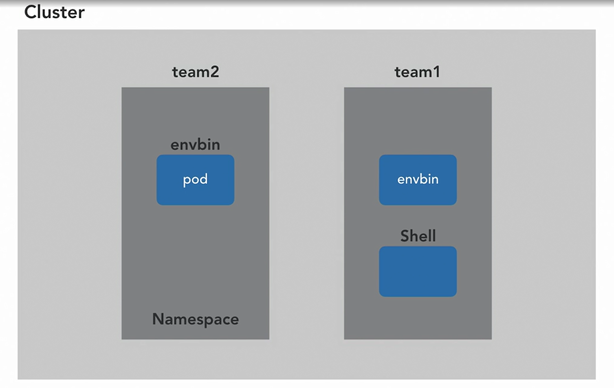
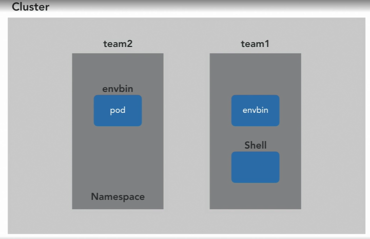
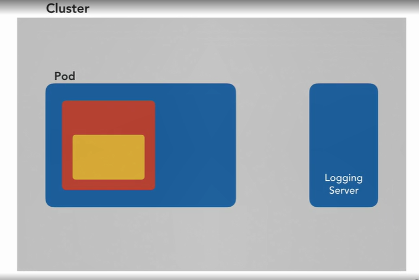
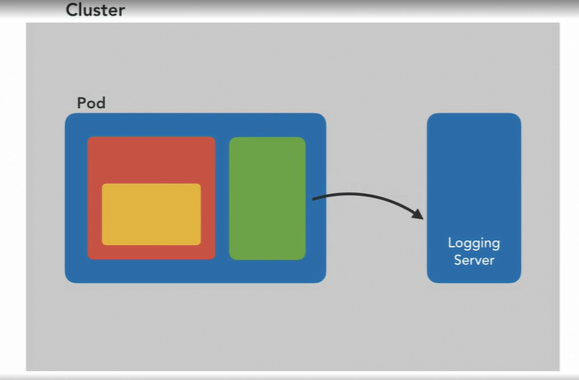
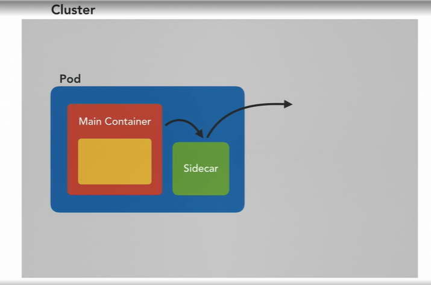

### Advanced Deployment Patterns

#### Namespaces in Kubernetes

* They're a place where we can logically store our resources. I can make a pod, a service, or a ConfigMap in a namespace. In fact, we've been using namespaces all along. If we don't specify one, we use the default namespace called well, default. Kubernetes is nothing if not consistent. So namespaces are resources, just like any other.

  

  ```shell
  kubectl get ns
  ```

* All used by system components. These are a bit like the system32 folder on windows or the live directory on Unix. They hide operating system staff out of the way. So what are namespaces for? Well, there are useful organizational tool. We could have two namespaces owned by two separate teams. Each of whom will have a little place to call their own. They could both run copies of say envbin without the names clashing. They could even each run their own CD systems to deploy things into their namespaces.

* Namespaces, aren't meant to be a security mechanism. In fact, kubernetes was never designed to be a so-called hard multitenant system, which can have several users and keep them isolated from each other, like a unique system does. But if you do put security boundaries up, they can be drawn along namespace lines. For example, if I have a bunch of pods split across two namespaces, it's really simple to set up a network policy that just prevents all of the pods of one namespace from talking to all of the pods in another. It's the same deal with giving our back permissions to talk to the control planes and so forth because addressing something in a namespace is usually just one simple selector rather than having to individually mention every part, but just putting something in a namespace, doesn't automatically hide it or make it secure.

  ```shell
  kubectl get pods --all-namespaces
  ```

* The one other really useful thing they can do is that if I delete a namespace, everything in it gets deleted too. This is really useful for experiments and tests and things like that. So I can have a namespace full of pods and other kinds of resources, and then just delete the namespace and they'll all go. one, most things aren't name spaced, some kinds of resource, actually aren't. They live at a cluster level outside of the namespaces and they're often called cluster resources. 

  ```shell
  kubectl api-resources | less -S
  ```


#### Working with Namespaces

* If we have a VAR for namespace, and then a file for something that's in that namespace, we can't just say kubectl apply -f on the whole directory, because we need the namespace file to be deployed before the other file, so that the namespace exists when the other object tries to go into it and we can't guarantee that's going to happen

  ```shell
  kubectl create namespace teamone
  ```

* What we now need to do is change into that namespace, if you like, if you're thinking about it like a directory or start using it activated. So this is kubectl config, because we're changing the config that kubectl uses, and then from here on out, it gets even more complicated

  ```sh
  kubectl config set-context --current --namespace=teamone
  ```

*  So what you're going to want to do is grab yourself a little tool called kubens, which is in the kubectx package. 

  ```shell
  choco install kubectx
  choco install kubens
  ```

* So like my prompt tells me which directory I'm in, there's a utility for printing namespace information in your prompt as well. 

  

* A shell pod in the team1 namespace, and an envbin in each one. Now we're in the team2 namespace, but we can still reference things that are in other namespaces. 

  ```shell
  kubectl exec -n teamone -it shell -- /bin/sh
  ```

  ```yaml
  # envbin
  apiVersion: apps/v1
  kind: Deployment
  metadata:
    name: envbin
  spec:
    selector:
      matchLabels:
        app: envbin
    template:
      metadata:
        labels:
          app: envbin
      spec:
        containers:
          - name: envbin
            image: mtinside/envbin:latest
  ---
  apiVersion: v1
  kind: Service
  metadata:
    name: envbin
  spec:
    type: NodePort
    ports:
      - port: 80
        targetPort: 8080
    selector:
      app: envbin
  
  ```

  ```yaml
  # shell
  apiVersion: v1
  kind: Pod
  metadata:
    name: shell
    labels:
      app: shell
  spec:
    containers:
      - name: shell
        image: alpine:latest
        command: ["/bin/sh", "-c", "sleep 3600"]
  ```

#### Adding functionality with sidecars

They can actually have more than one container. And this gives us a way to add functionality to our services post-hoc. For example, imagine a program that writes a lot of logs as it runs, which in this particular environment, we want to have send these logs off to a central logging server for analysis. Now, we could add a library to the program binary to send those logs, but that's a codependency. It adds build time, and importantly it bakes into the service a lot of assumptions about where and how it will be run, and the fact that it is going to be sending those logs off. We could add a log forwarding program to the container image to run alongside the main binary.



* We could package the log forwarder completely separately in its own standalone container image. Container images are a great packaging mechanism. And if we do this, both components can be used separately or together. A second container like this in the same pod is called a sidecar and it has special privileged access to the main container.

  

* In addition to their local access to the file system of the containers in their pod, which is what we'd want to use to lift log files off the disk, like in this example, a container can also interfere with the networking in a pod. A sidecar that intercepts all the network traffic coming in and out of the main container in a pod is a really powerful concept. It can do everything from just producing statistics about the traffic that passes through it to changing it. Maybe translating XML requests that come in from an old client to the more modern JSON that the main binary, the main container expects.

  

#### Adding a Service Mesh Using Sidecars

* Built using these networking deceptive sidecars. This class of software is called a service mesh.

* Linkerd by the way is a package. Package gives me Linkerd to command line, which is the client for the Linkerd system that we're going to install into the cluster. It has a bunch of commands for interacting with that system, one of which is the command to actually install it.

* envbin.yaml

  ```yaml
  apiVersion: apps/v1
  kind: Deployment
  metadata:
    name: envbin
  spec:
    selector:
      matchLabels:
        app: envbin
    template:
      metadata:
        labels:
          app: envbin
      spec:
        containers:
          - name: envbin
            image: mtinside/envbin:latest
  ---
  apiVersion: v1
  kind: Service
  metadata:
    name: envbin
  spec:
    type: NodePort
    ports:
      - port: 80
        targetPort: 8080
    selector:
      app: envbin
  ```

  ```
  linkerd install | kubectl apply -f -
  ```

* Another useful thing that Linkerd client can do is this check command. So this will look at the cluster and check that everything it gets to the right state, everything installs and deploys correctly, and comes up and raises its readiness probe. So this will wait while the sort of install process is going on, and those conditions are becoming true

  ```shell
  kubectl annotate namespace default linkerd.io/inject=enabled
  ```

* What that's going to do, is use a feature of Kubernetes that I haven't covered in this course, 'cause it's one in the YALM of cluster administration, but it's going to hook another feature of Kubernetes, which means that every time we deploy a pod, a part of the Linkerd system, the pods that we saw running in their own namespace is going to get given the YALM for that pod, the YALM that we applied, and it's going to get to do what that command just did on the command line. It's going to get to manipulate it if it wants. 

#### Analyzing Traffic with Linkerd

* Linkerd command is dashboard. Much like Minikube dashboard, this is actually just going to go and do all the networking setup, and then open in our browser the Linkerd dashboard, which is already running. So, we get a bunch of metrics about what's going on on the network in our cluster. 

  ```shell
  linkerd dashboard
  ```

* Grafana is a dashboard graphing system. So, Grafana is the thing that's drawing this webpage, and the actual graphs in here have been configured by Linkerd themselves. 

#### Extending Kubernetes with operators and Customer Resource Definitions

* You shouldn't use pods directly, but rather use high level constructs like Deployments and StatefulSets. These contain logic that manage pods on your behalf, Deployment assumes that the service is stateless and can be horizontally scaled without much thought. StatefulSets is designed for workloads that are more sensitive to the existence of their peers. Probably forming clusters. It takes care to start them one at a time, and gives them all an identifier so they can tell whether they're enlarging a cluster, or replacing an old pod that crushed in an existing one. But StatefulSet can't account for the needs of every piece of software, you know the kinds of tricky software that have long installation manuals? One of the many ways we can extend Kubernetes is to add new kinds of resources to it. If StatefulSet doesn't do enough, we can write our own with even more logic specific to the app we're running.

  ```shell
  kubectl create namepsace dependency
  ```

* https://lnkd.in/gMAGX5A

  ```shell
  kubectl wait --for=condition=Ready pod -l app=webhook -n cert-manager
  export DOCKER_REPO=docker.io/mtinside
  ```

* We want to wait for a pod to be ready and that pod, here's where we'll find it with a label selector, this is the webhook and it's the webhook pod in the cert-manager namespace.

* All the time it took me to explain that and type it, the thing's already gone ready and the condition was met. It's returned it to me but if you're doing this in the script, you can put one of these commands into stop it going on the next thing too soon.

* I kind of eluded earlier there are two pieces to adding an extension like this and I'm going to show you both of them now. The first is to tell Kubernetes about the new resource kind so that it understands resources with our new schema and this is done by, guess what? Deploying a resource. This kind of resource is called a custom resource definition or CRD and this is confusingly meta. This CRD, which is a definition of a custom resource is a built-in kind of resource, that describes another kind of resource. So we can see these CRDs with kubectl get crd. So that actually cert-manager uses a bunch of it's own.

  ```shell
  kubectl api-resources | less -S
  ```

* It, is made by the fact's improbable and it, what it does is it runs the etcd database. So it runs a clustered, key-value database. So we can see they've defined a few different types and these are all resource, well these are the CRDs that define new resources and we can say kubectl api-resources, just like always, is redraft, isn't it? So configmaps, endpoints, namespaces, nodes, the things we're familiar with but further down then these, now these are all the built-in types, some cert-manager things now if we keep going from improbables etcd pieces software, etcdclusters, etcdpeers, etcdbackups, these are not built-in Kubernetes types.

* Deployment is built-in, whereas in this case, this is the party code that we've just deployed and it's actually just running in some pods, In its own namespace called ecosystem, etcd cluster operating system. Nice pun there, well done. So, couple of pods, and all these do, all they do, they have some complicated baseless logic but they talk to the Kubernetes, masters the Kubernetes, control plain just like that henth being called the 'weeping seeing' rather than just listing details about their environment and printing it out, these are watching for certain kinds of resource and then writing back. Making other kinds of resource. 

  ```shell
  apiVersion: etcd.improbable.io/v1alpha1
  kind: EtcdCluster
  metadata:
    name: example
  spec:
    replicas: 3
    version: 3.4.3
    storage:
      volumeClaimTemplate:
        storageClassName: standard
        resources:
          requests:
            storage: 1Mi
  ```

* This pattern is called a controller or operator like the person who would do this job manually. 

* https://operatorhub.io

* kubebuilder

#### Question 

* A CRD is a resource kind which declares `_____`.
* ans : another resource kind
* A sidecar is `_____`.
* ans : several containers in one Pod
* Which of these kinds lives outside of any namespace, visible cluster-wide?
* ans : Node
* How does a Service Mesh like Linkerd gather network statistics for us?
* ans : Sidecars directly intercept all traffic.
* What is the network setup like for Pods with sidecars?
* ans  : one shared IP address for the whole Pod
* What is the name of the built-in namespace where system components live?
* ans : kube-system