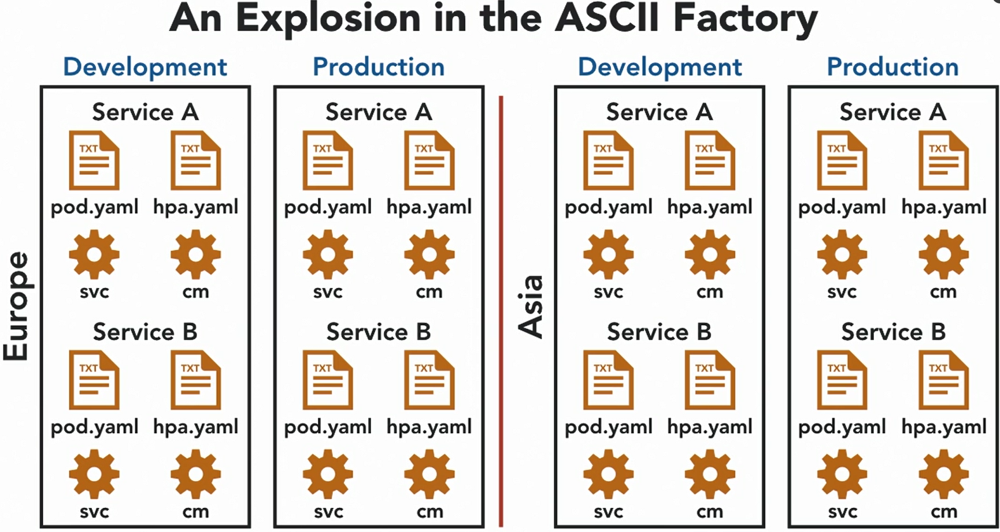
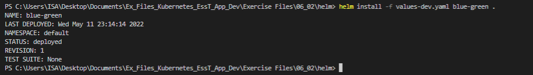
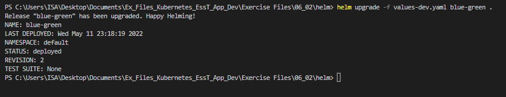
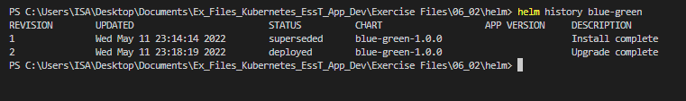
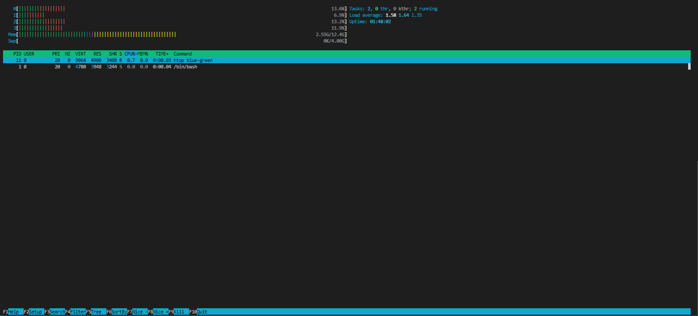

### Deployment Tools

#### Tools for DRY deployments: Motivation

* If you're dealing with all the deployments for a global company, it's going to get crazy. Imagine we start with the pod, for a service. Well that service is going to have other yaml files, one for every feature we've seen, and several we haven't. Then you're going to have lots of services. And there's going to probably be a few copies of all of that. Development, staging, production, at least. And then you're going to be running that in all the regions around the world. Multiply all that together, and that is a lot of yaml. If we just start copying and pasting this along these four or five axes, it's going to be impossible to maintain. Imagine trying to changing the liveness check path for every container in the middle of this mess. Now a common mantra in software engineering is "Dry", D-R-Y, don't repeat yourself. If you can factor something out, or template it, or generate it, you should do so. There's several tools for this in the Kubernetes ecosystem. 

  

* Helm,Jasonette and Customize

* These tools actually do a little bit more than just generating yamls, they can help you with some other aspects of deployment as well. For example, some understand that they have to make name space objects before other resources. And some will help you upgrade your services in place.

#### Tools for DRY deployments Helm

* What I want to do is deploy my blue-green service. And I want to deploy it in both my development and my production clusters. These two deployments are basically going to be the same, it's the same software it runs in the same way. In fact, I want them to be as similar as possible between deployment or production. But they are going to differ a little, mostly the ingress is going to differ. So the dev and prod classes have different domain names. And we need to encode that domain name in the ingress resource. And on prod, I'm going to want tls for that ingress, but I won't bother on dev. So in this directory, I have what's called a helm chart that I've written for this. Helm package is the groups of templates for a service up into the so called charts. So we start with the metadata file for the chart

  ```yaml
  apiVersion: networking.k8s.io/v1beta1
  kind: Ingress
  metadata:
    name: blue-green
    annotations:
      nginx.ingress.kubernetes.io/rewrite-target: /
      {{- if .Values.tls.enabled }}
      cert-manager.io/cluster-issuer: letsencrypt-prod
      {{- end }}
  spec:
    rules:
      - host: {{ .Values.host }}
        http:
          paths:
            - path: /blue-green
              backend:
                serviceName: blue-green
                servicePort: 80
    {{- if .Values.tls.enabled }}
    tls:
      - hosts:
          - {{ .Values.host }}
        secretName: blue-green-prod-tls
    {{- end }}
  
  ```

*  you can see that english domain name, which varies between environments, and it comes from an input variable, which we template in, so .values.host. And you can see if I scroll down, that this whole section about tls. Its existence is conditional based on this input variable within that section, again that domain name is templated in. so in order to run these templates and produce yaml.

  ```shell
  helm template -f .\values-dev.yaml .
  ```

* So I can say helm template -f to give it a values file, and then we'll give it the values for dev. And it wants an argument. He wants the chart which is in the current directory.

* We give this installation and name because we can use this template multiple times. And we can actually deploy multiple copies of blue-green into this same cluster if we wanted to. That's not what I'm showing here, but it is possible. So we give this a name, I'm just going to call it blue-green because it's the only one and again, reference the current directory. So there we go blue-green just been deployed.

  ```
  helm install -f values-dev.yaml blue-green .
  ```

  

* . Let's make a bit of space kubectl get pods, and there's a pods from the deployment. And again, services okay, we got a blue green service as well out of that directory of templates so pretty cool. Let's say we want to change the image, let's say we want to change it to green, I'm actually going to go in and change the deployment. This value in the template if I thought I was going to be changing this level a lot, obviously what I could do is start taking the image tag as a variable like that. But for now, I'm just going to manually hard coded across the green. And I've also decided that I don't want the service at all. So we can delete the service.yaml file.

  ```yaml
  apiVersion: v1
  kind: Service
  metadata:
    name: blue-green
  spec:
    type: NodePort
    ports:
      - port: 80
        targetPort: 8080
    selector:
      app: blue-green
  ```

*  So I can now tell helm to deploy this updated version, helm upgrade some values, still called Blue greens, were upgrading this one of the multiple possible copies I could have and the charts local. There we go release has been upgraded. Revision number two, much light with the built in deployments that do the rolling upgrade, I can see the history of what done. So helm we make some space, helm history of that blue-green.

  ```shell
  helm upgrade -f values-dev.yaml blue-green .
  ```

  

  

* It's wrapped but revision one, it's got a date revision two. So revision one was deployed, it's now superseded. Revision two is the currently deployed version. And there were all back commands as well, if I wanted to do that. You also noticed that if I say, kubectl get services that the blue-green service has gone, because I deleted the template, and helm was tracking what it had applied before. It knew every object it made as part of version one, and it could see that a file for the service didn't exist in version two. So it knew that it was no longer wanted and it deleted it from the running cluster

* r. If we'd have just said kubectl apply -f to that set of files for version one and then deleted the service file and done another kubectl apply -f for the directory, that doesn't delete any objects apply is not going to remove an object that exists in the cluster for which there is no yaml in the current directory like in the general case that just doesn't work, it's extremely dangerous. So you are very often left with these orphaned objects when you're trying to use apply directly

  ```shell
  helm template -f .\values-prod.yaml .
  helm uninstall blue-green
  ```

#### Tools for DRY deployments Kustomize

* How we can produce the same set of results that we did with Helm. So we've customized the idiom is that we have a base directory and that has a set of files in, but that is a valid set of kubernetes example

* So if we look for example, in ingress, you can see there's no template directives in here at all. We could apply this straight to a cluster. This particular case applies straight to our dev cluster, and this is kind of our baseline. In addition, in this directory to the valid resources, and we've got a deployment of service and an ingress, there's also this kustomization file.

  ```yaml
  apiVersion: kustomize.config.k8s.io/v1beta1
  kind: Kustomization
  
  commonLabels:
    app: blue-green
  
  namespace: blue-green
  
  resources:
    - deployment.yaml
    - service.yaml
    - ingress.yaml
  ```

*  it's a kustomization file. It's kubernete style file. And it points to those other three files. You have to explicitly list them and it points to those three valid files. And it does a couple of little things to them. It puts them all in this namespace and it gives them all this label, but they'd be valid, anyway. This gives them a little bit of extra metadata. So we can go ahead and render that like we did with Helm to see what we get.

  ```shell
  kubectl kustomize base
  ```

*  You could pipe that into kubectl apply, but because this is built into kubectl, where we would actually say is kubectl apply rather than -F and then a file or a directory full of files, we say -K. So that it knows that it's a kustomization. And it has to look for that kustomization file and go through that, so we can say apply -K base. So for prod, there is what's called an overlay directory. Now this contains the differences between our baseline, which was valid for dev and what we want in prod. So if we have a look in that overlay and we have one overlay which is prod. This equally has got a kustomization file.

  ```
  kubectl apply -k base/
  ```

* overlays/prod

  ```yaml
  apiVersion: kustomize.config.k8s.io/v1beta1
  kind: Kustomization
  
  # These apply to the new resources in this overlay; the base's settings don't apply here.
  # If these are different to the base, they're override it
  commonLabels:
    app: blue-green
  
  # ditto commonLabels
  namespace: blue-green
  
  bases:
    - ../../base
  
  resources:
    - issuer-le-staging.yaml
    - issuer-le-prod.yaml
  
  patchesStrategicMerge:
    - ingress.yaml
  patchesJson6902:
    - target:
        group: networking.k8s.io
        version: v1beta1
        kind: Ingress
        name: blue-green
      path: ingress-patch-hostname.yaml
  ```

  ```yaml
  apiVersion: networking.k8s.io/v1beta1
  kind: Ingress
  metadata:
    name: blue-green
    annotations:
      cert-manager.io/cluster-issuer: letsencrypt-prod
  spec:
    tls:
      - hosts:
          - prod.example.com
        secretName: blue-green-prod-tls
  ```

* You can see this isn't a complete ingress definition. All right, this doesn't contain the rules and the host in the HTTP block. It doesn't contain the host and path base routing that we'd need. This is invalid. What it is, is it's enough information to identify an object. So the version, the type, and the name, and then it's the extra TLS block that we want to add. 

  ```shell
  kubectl kustomize ./overlays/prod
  ```

#### Tools for DRY deployments: Advice

* Services where you can control everything. You're writing all the YAMLs, and you can be very methodical about your resources and the variations between environments between services. A pattern a lot of people use is called, One Chart to Rule Them All. And this means making one chart. So one set of templates, which gets used for every service. And then you have a values file for each service, supplying the things that vary; the name, the image, any values in a config map. 

#### Advance Debugging: kubectl debug

* We have a pod that's misbehaving, how can we drill down into what it's doing? This is a massive area. There are some cluster-level things you need to tweak. So I did have to re-run Mini-Q, with a few alpha features turned on.

* Exec "bin/sh" no such file or directory. Because, I think I've mentioned this in another couple of videos, This image is, what's called, built from scratch. So there is no base image. But this blue-green image, that was empty. Really all that is in this container image, is the blue-green program. And that is what's called "statically linked." So it exists completely on its own, it's got everything it needs, it doesn't need any libraries, it doesn't need anything else at all in this image.

* We deliberately use an image that has nothing. No libraries, and no shell, because that takes up space and it's an attack vector. But it does mean we don't really have a way to kind of login into it to debug it. But we know about sidecars now, and we know that there could have been a second container in this pod. Imagine that second container was a big, fat image that had a shell and a whole lot of debugging tools.

* I didn't think of that, and we don't have that sidecar pod. But, with a tool called debug, a kubectl plugin called debug. What I can do is magically add run and runtime. So I want to debug this pod, and I want to attach straight into my debugging system. And here we go, a prompt. Well where are we? If we were on PS, ah, there's blue-green, which I can tell you is from that first container, and then here's our shell, and his ps that we just run. 

  ```shell
  kubectl debug blue-green-564b4bb95-84lxg --attach
  kubectl debug node/minikube --it --image=mtinside/blue-green:blue
  ```

* We've actually attached a second debug container into the same pod. Now normally this wouldn't be possible, you can't change the definition of a pod on the fly, we couldn't change the file and add a debug container and then reapply with kubectl, but, there is a mechanism that lets us add temporary debugging containers like this. It's a separate mechanism. And it's what kubectl debug uses.

* ### **What does `kubectl debug` do ?**

* ### The new **debug** feature automates ephemeral container attaching and namespace sharing with a single command and without any manifest files. Even if your cluster version is **1.15, 1.16 or 1.17,** you should enable the **ephemeral** container feature. But with version 1.18, this feature comes by default.

#### Advanced Debugging: nginx.dev

* we want is a debugged shell pod just in the cluster, on the same network, where it can send and receive traffic from the other pods that are there

  ```shell
  kubectl run -ti net-debug --image=nixery.dev/shell -- /bin/bash
  ```

*  What this is doing is generating an image on the fly. So each of these things in /curl, wget, htop, these are all package names in the next package manager and we can just keep adding them and those packages will get installed as this image is created on the fly.

  ```shell
  kubectl run -ti net-debug --image=nixery.dev/shell/curl/wget/htop -- /bin/bash
  kubectl attach net-debug -c net-debug -i -t
  ```

*  htop in case I wanted to look at the process usage of my own container. So yeah, just a really helpful little utility software as a service. 

  

  ```shell
  kubectl delete pods --all --force
  ```

#### Advanced Debugging: kubectl sniff

* Imagine there was some problem with this networking, and I want to see what's going on here. I want to see the back-and-forth between this shell pod that's in the cluster that we're in and the ngix pod that's in the cluster.

* Sniff install

  ```shell
  kubectl krew install sniff
  kubectl sniff nginx-76f957bd7f-r42lc -p
  ```

*  This is going to a bunch of stuff, and if I pull this into view, it's going to start Wireshark on my local machine. But it's not sniffing my local machine, it's sniffing traffic in that nginx pod.

#### Just like being there: skaffold

*  Kubernetes is more than just a place to deploy to. With bugs being found late in the development cycle

*  Skaffold dev in this directory. And I have a Skaffold config file, which knows about the Docker file and there it goes, it's going to go and get the golang base container. It's going to build a very simple go program and it's going to make that deployment container just as if we were deploying this to prod. And the other thing that, that Skaffold file points at is the Kubernetes pod definition as well. So once this, there we go, once this container has been built, it's now going to pick up the Kubernetes pod definition by starting to deploy and it's running it in our cluster

* **### Example: Getting started with a simple go app**

  

  This is a simple example based on:

  

  \* ***\*building\**** a single Go file app and with a multistage `Dockerfile` using local docker to build

  \* ***\*tagging\**** using the default tagPolicy (`gitCommit`)

  \* ***\*deploying\**** a single container pod using `kubectl`

* 

  ```dockerfile
  FROM golang:1.12.9-alpine3.10 as builder
  COPY main.go .
  RUN go build -o /app main.go
  
  FROM alpine:3.10
  # Define GOTRACEBACK to mark this container as using the Go language runtime
  # for `skaffold debug` (https://skaffold.dev/docs/workflows/debug/).
  ENV GOTRACEBACK=single
  CMD ["./app"]
  COPY --from=builder /app .
  ```

  ```yaml
  apiVersion: v1
  kind: Pod
  metadata:
    name: getting-started
  spec:
    containers:
    - name: getting-started
      image: skaffold-example
  
  ```

  ```yaml
  apiVersion: skaffold/v2beta5
  kind: Config
  build:
    artifacts:
    - image: skaffold-example
  deploy:
    kubectl:
      manifests:
        - k8s-*
  
  ```

*  So in order to develop this program quickly and efficiently, I don't want to go through the whole rigmarole of editing it, building it, making a Docker image, pushing that, doing say a rollout restart on our deployment, even that is bad practice really we're using the latest labels so I'd want to label it with something new changed the label in the deployment, wait for the deployment to roll something out. Instead, with Skaffold watching our program, I can say, change this message Hello world two not very exciting. All we did was write that file out. So we made a change to that and we saved it.

* So it's, we use the same pod but it's been restarted once and it's got new code inside it. So really, really simple, very tight development loop, edit on your laptop, automatic file system watching, automatic deployments to running Kubernetes cluster where of course, you know, that program is in a pod in the cluster with everything else and it can interact with all the other services in the cluster.

#### Just like being there: telepresence

* what telepresence lets us do is telepresence, now I'm going to tell it I want to run a local Docker container and then I give some Docker arguments, so we'll tell it to clean up, we'll tell it we want to interact with it, and let's use Nixery again. So I want a container containing a shell and curl, and in that I want to run bin bash. So this is a Docker run command, really we're telling telepresence that we wanted to indeed do a Docker run command with those arguments and he wants my password for reasons we'll see, and it's going to take a little while to download that Nixery image, they're quite big, but pretty soon we should get a prompt and within the shell. 

  ```shell
  telepresence --docker-run --rm -it nixery.dev/shell/curl /bin/bash
  ```

* We did do a Docker run and actually on my local machine, there is the Docker container. So yeah, 16 seconds, no tricks there, but the reason telepresence asked for the password is it's basically set up a VPN, so this code is running locally, I mean, it's not code, we're just a in a shell, but this Docker container has been connected to the network of the Kubernetes cluster. So again, I can run things locally, containerized in this case, and negatively interacting with the other services in the Kubernetes cluster. 

  ```shell
  kubectl run -ti net-debug --image=nixery.dev/shell/curl /bin/bash
  COLOUR=blue teleprsence --swap-deployment blue-green --expose 8080 --run target/debug/blue-green
  ```

* We're not hitting the pod made from the original published image, we're not even hitting a container that I've built, we are, through various tricks, and magic, and smoke and mirrors, through the power of the telepresence tool, hitting a piece of software running on my local machine, and in fact, there's the log line that says that somebody made a get request. So as ever, this is just a sample of the tools available.

#### Personal and Production Clusters

* Kind :  Kindness, a little bit like MiniKube, but it's designed for the Kubernetes team's own internal development and testing. So, there's no convenience commands around it. There's no add-on management. Kind stands for Kubernetes in Docker, and indeed the Kubernetes control plane, and each of the worker nodes are a container rather than a VM. Now, this is technically very impressive. It was a great piece of work that the team did. And this leads to a very small overhead cluster, because you only need those containers, which are very light weight rather than VMs. 
* k3s :  K3s is interesting because unlike the others, it isn't full Kubernetes. They've stripped and recompiled the Kubernetes components, so K3s doesn't actually support all the resource kinds. It doesn't support all the configure options or the different ways to set up networking and storage. But as a result, it's very small and very light. So, if it's got enough features for you to do development, and of course it does support pods and deployments, and services, and that kind of thing, it may be exactly what you want. There's an installer for it. 
* Production Clusters : 
* Most of us won't be managing or provisioning these clusters, but you should know the lay of the land. So, in my mind, they fall on the spectrum that I've shown here. So, on the very left hand side is, do it yourself, install yourself. You take a bunch of fresh Linux systems, you install and configure the load of service software that makes up Kubernetes under the hood that we haven't even touched on. You need to really understand the next internals, and networking to do this. This is hard, and honestly, these days it's kind of pointless. I mean, doing it once will teach you a lot. Definitely go check out Kubernetes The Hard Way by Kelsey Hightower, if you're interested in that, but I absolutely wouldn't run a production cluster like this nowadays. 
* Further right on our spectrum, we've got kubeadm. This is the official installer for Kubernetes, if you'd like, and it takes you from a machine to a cluster. So, you have to get Linux installed on a machine. And if that's a cloud instance, you have to make the cloud instance, and make the VPCs, and the subnets, and the storage, and everything else that you need. But once you've got supported Linux distribution installed, kubeadm will make a Kubernetes cluster. It'll make a control plane, or it'll make a work in Odin, join a cluster that exists. Going even further right, we've got kops. 
* This takes you from cloud account to cluster. So, it makes those compute instances, VPCs and storage, that I said you had to do for kubeadm. And when it's done that, it will then install Linux, and it'll store Kubernetes on that. But it still gives you lots and lots of customization options. This is a very big deal on AWS. It used to be how basically everybody on AWS got Kubernetes, and it now actually supports Google Cloud as well. But it's just an installer. So, it'll take you from an empty cloud account to a running cluster that's very impressive.
* The managed clusters. So, this is where the cloud provider installs and operates Kubernetes for you. The cloud provider uses a combination of automated scripts, and expert humans to keep the cluster in full health for you. I've got here the logos for GKE, Google Kubernetes Engine, AKS, which is the Azure one, EKS, which is the Amazon one, and IKS, which is the IBM one. I guess those are probably the four biggest players as I'm recording this, but there's loads of other managed options out there, all with different trade offs. 
* There's a big gap between a fresh cluster, you know, a basic system, and something with production levels of performance, and resiliency, and observability, and security. Imagine just installing windows server, right? It's easier than installing a Linux server, but just because you can click through and get one easily, doesn't mean you should plug it straight into the internet.

#### Question 

* Which of these is a cut-down version of Kubernetes with a small footprint but fewer features?
* ans : k3s
* Which of these does Telepresence not do?
* ans : Connect us directly to the Kubernetes control plane for debugging.
* Each path item in a nixery image URL is a `_____`.
* ans : package to install in the image
* Kubectl debug gets us a shell in the cluster by running `_____`.
* ans : a new sidecar in an existing Pod
* When does Skaffold upload and run a new container image?
* ans : when the code in our dev directory changes
* Kubectl sniff runs Wireshark on your laptop, showing you packets captured where?
* ans : a given Pod
* Why is copy-and-pasting resources to make several similar copies a bad idea?
* ans :It's hard to maintain.
* We provide kustomize with a complete and valid base, then customise them with overlays containing `_____`.
* ans : Patches
* Helm uses which templating syntax?
* ans : Golang templates

* kubectl api-resources, which lists all the resource kinds, and therefore basically all the features.
* kubectl explain for really detailed info on how to use them. This same information is available on the web at the official documentation site. There's a complete API reference like you can see here. As well as loads of how to guides and the official block which has useful practical posts
* https://lnkd.in/gv6Tept
* https://kubernetes.io/blog
* https://lnkd.in/gfjMa29
* https://kubeweekly.io
* https://kubernetespodcast.com
* https://www.reddit.com/r/kubernetes


