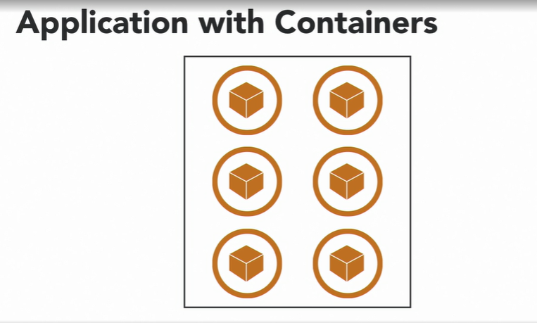
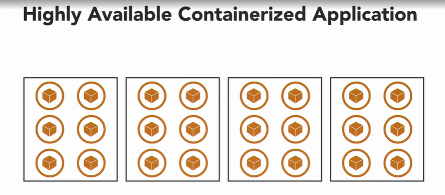
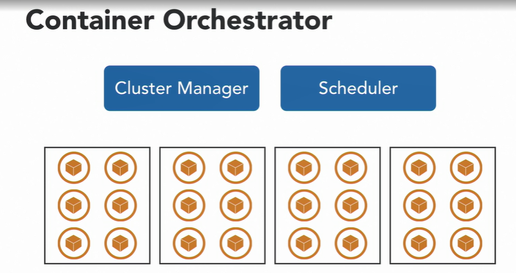
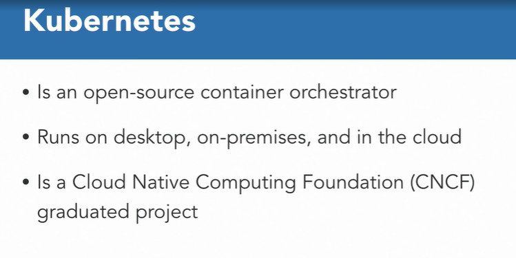
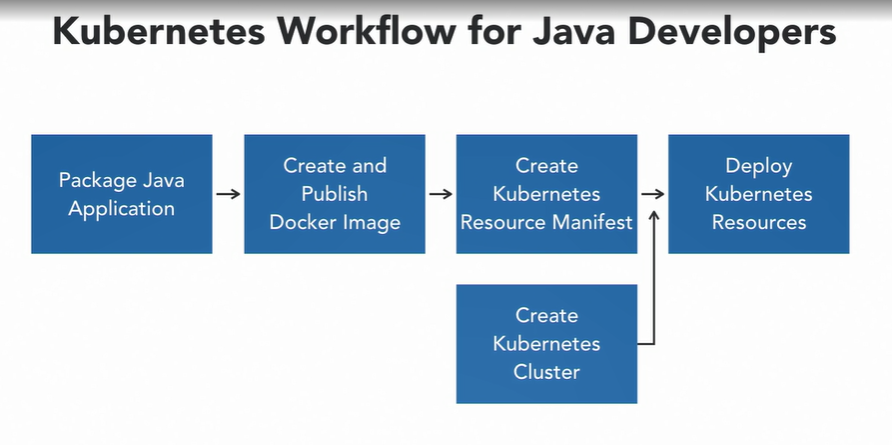
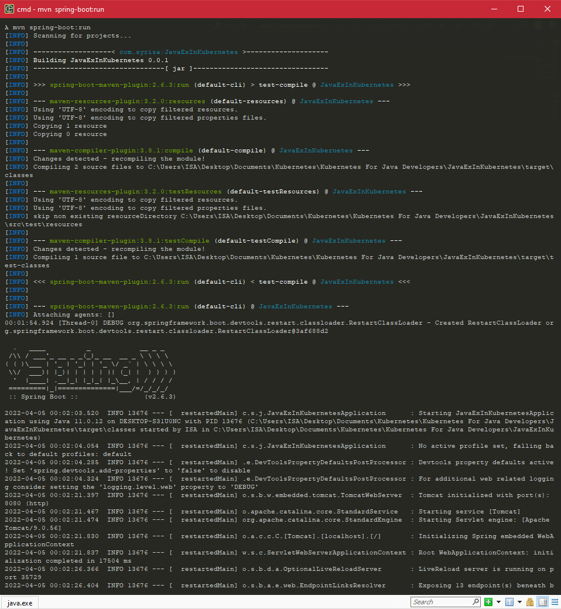

### Introduction to Kubernetes

#### Why Kubernetes ? 

* A container is a light weight, stand alone, executable package of software that includes everything needed to run an application.

* Code, run-time, system tools, libraries, and settings, an application and all its dependencies are packaged together so that it can run reliably across multiple computing environments.

  

* This helps reduce impedance mismatch between development, testing, staging, and production environment. An application typically consists of multiple containers such as one for the application code, another for web-cell work, another for messaging, for caching and so on. An application with multiple containers is a relatively easy to manage on a single machine.

* When only a single instance of each container is running. This is good during development phase of the application, but in production you want to run this application using multiple containers over multiple machines. 

  

* This avoids a single point of failure. This makes your application highly available in case a single container or a single machine goes down. In order to manage these multiple containers on multiple machines, you need a container orchestrator.

  

* You need a system that can manage this cluster of machines. That can perform health checks on the machine, bounce them if they go down, allow the cluster size to grow up and down, this is your cluster manager. Now that you have a large number of machines in the cluster, you also need a scheduler that will schedule the containers on the right machines. This will insure that containers can be scheduled on the right machine to meet the requirements listed by the container, such as CPU and memory. This will insure that any containers that may go down can be brought up again. This is your scheduler. There are many other purposes of container orchestrator, but these two are the primary ones.

* #### Container Orchestrators

* There is Docker Enterprises Edition from Docker, Inc., the company behind making the container technology accessible to everybody.

* Mesosphere DC/OS that is built on top of Apache Mesos, and provides an integrated platform for data and containers. 

* Amazon Elastic Container Service or ECS, that is a managed service on the AWS Cloud, and allows to run and scale containerized applications on AWS without any inflation. 

* Kubernetes is such an open- source container orchestrator that automates deployment, scaling, and management of containerized applications. This is also commonly called as k8s, or kates in short, where the number eight indicates the number of letters between K and S.

* #### What is Kubernetes ? 

* Kubernetes is an open-source container orchestrator. Because it's open-source, it can run on desktop, on-prem, and in the cloud. This allows you to migrate your work load across this different environments very easily. Kubernetes is a CNCF project. CNCF is Cloud Native Computing Foundation and is a vendor neutral body that defines how Cloud Native applications can be built. Kubernetes is one of the projects there, and there are many other projects, such as Prometheus, Envoy, and Containerd.

  

#### Kubernetes Workflow for Java Developers

* Why Kubernetes is required, what does it take for a Java developer to package and deploy their applications in Kubernetes.

* Kubernetes workflow for Java developers look like. You build and package your Java application using the usual tools, such as Maven or Gradle. This will typically be a fad jar that has all the dependencies included. In case of a war file, you need to think about how to get all the dependencies such as Tomcat or whatever your application server is. Kubernetes deploy and manage containers, so first thing you need to do is create a Docker image out of your application. This Docker image will need to be published on a Docker repository such that it can be downloaded to the Kubernetes cluster. This could be Docker Hub, Amazon Elastic Container Registry or any other registry that you have access to. Most common way of deploying to Kubernetes is to use an application manifest.

* We will cover details about what does this application manifest look like later. An application will create one or more Kubernetes resources, and so it is also called as Resource Manifest. This manifest uses Kubernetes API to create Kubernetes resources. Multiple types of Kubernetes resources can be created, and we'll discuss them in detail later. This manifest will define the API version, type of the resource, refer to the Docker Image if needed, the number of instances of the container, metadata about the resource, and other information. Now, you need a Kubernetes Cluster where these resources can be created. We'll discuss different options to create Kubernetes Cluster later, but you need access to a Kubernetes Cluster where the resources can be created.

  

* Either you can create this yourself on your development machine, in your data center, or in the cloud. Depending upon your team, there may be a separate ops team that can create the cluster, and give you credentials to access that cluster. Last step is to deploy these Kubernetes Resources in the cluster. There are multiple ways to deploy these resources from CLI to deployment pipelines, and will be covered in detail in this course. But in general, this is the workflow for Java Developers. You packet Java application, create and publish Docker image, create Kubernetes Manifest, have access to a Kubernetes Cluster, and deploy the manifest to create the resources. Most of these tasks can be automated as part of your bill cycle, so even though the number of steps may seem large, the workflow is pretty straight forward. Typically, Kubernetes Cluster will be created once, and rest of the steps will be done multiple times during development-deployment cycle.

* #### Build and Test application using Maven

  ```
  mvn spring-boot:run
  ```

* it will download all the Maven dependencies, so it could take awhile, but because I have run this command on this machine earlier, it'll run rather quickly. So at this point it's really building my application, packaging my application, and the application rather started very quickly.

  
  
* Note : 

* Where should the Docker image for your Java application be published?

*  Docker image needs to be published to a Docker registry accessible to the cluster. This allows control plane to download the image.