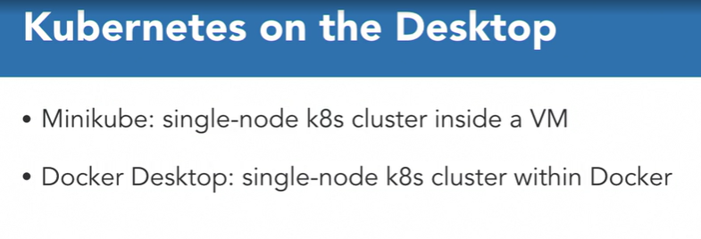

### Kubernetes Concepts and Getting Started

#### What is Kubernetes

* Kubernetes is an ancient Greek word for helmsman, the person who steers the ship. 

* Kubernetes is an open-source container orchestration project. Typically, our applications consist of multiple containers and runs on a cluster of machines. 

* Kubernetes helps with managing the cluster of machines and scheduling containers on these machines. 

* Runs on desktop, on-premises and in the cloud

* Kubernetes is a CNCF Project. CNCF is a Cloud Native Computing Foundation is a vendor-neutral body that defines how cloud native applications can be built. Kubernetes is one of the projects there and there are many other projects such as Prometheus, Envoy, and containerd.

* You use Kubernetes API objects to describe your cluster's desired state. What applications or other workloads you want to run, what container images they use, the number of replicas, what network and Discord sources you want to make available and more.

* Defines API objects to describe your cluster's desired state

* kubectl allows Kubernetes objects to be managed.

* API objects are also called as Kubernetes resources, typically a resource manifest file providing complete description of the object will be passed to the CLI. The CLI will then read the manifest and issue the command to the cluster to create or update these resources. You can also use the Kubernetes API directly to interact with the cluster, and set or modify the desired state

* Reconciles desired and current state

* Basic monitoring, logging and health checking

* Rich ecosystem of tools.

* #### Kubernetes Resources : Pod

* A Pod is the basic building block of Kubernetes. 

* The smallest and simplest unit in the Kubernetes object model that you create or deploy. 

* A Pod might consist of either a single container or a small number of containers that are tightly coupled and that share resources.

* Multiple containers in a share storage and network

* Containers in the Pod can communicate to each other using localhost and share the file system as well. These containers form a single cohesive unit of service, for example, a web server serving files with a separate side-car container refreshing the cache. 

* The one-container-per-pod model is the most common Kubernetes use-case. (You can think of a Pod as a wrapper around a single container and Kubernetes manages the Pod rather than the containers directly)

* #### Kubernetes Pod Sample

* All Kubernetes resources must have apiVersion and kind fields. apiVersion is a strength that identifies the version of the schema the object should have.

* Kind is a string that identifies the schema this object should have. Or, the Kubernetes object type

* Metadata is a required field for all Kubernetes objects. The only mandatory field in that is name. This field allows a Pod to be uniquely identified amongst others. 

* You can also specify name-space and view-ID. Labels is a map of string keys and values that can be used to organize and categorize objects. 

* Spec stands for specification and defines the desired state of an object. Containers define the list of containers belonging to the Pod. This is a static list and cannot be updated at run-time.

* Name gives the unique name to a container in the Pod. Image is the name of the docker image

  ```yaml
  apiVersion: v1
  kind: Pod
  metadata:
  	name: app-spring
  	labels:
  		app: spring
  spec:
  	containers: 
  	- name : first-project-in-kubernetes-con
  	  image: syr7s/first-project-in-kubernetes-con:0.0.2
  	
  ```

#### Kubernetes Resources

* #### Deployment

* Deployment object provides declarative updates for pods. You describe a desired state and a deployment object and Kubernetes cluster changes the actual state to the desired state at a controlled rate.

* Multiple replicas of a pod can be created by specifying the number of replicas.

* A new version of the pod can be rolled out to all replicas or it can roll back to a previously deployed version

* #### Kubernetes Deployment Sample

  ```yaml
  apiVersion: apps/v1
  kind: Deployment
  metadata:
  	name: app-spring-deployment
  	labels: spring
  spec:
  	replicas: 3
  	selector:
  		matchLabels:
  			app: spring
  	template:
  		metadata:
  			labels:
  				app: spring
  			spec:
  				containers:
  				- name: first-project-in-kubernetes-con
  				  image: syr7s/first-project-in-kubernetes-con:0.0.2
  				  ports:
  				  - containerPort: 8080
  ```

* You can see the apiVersion is different here. The Kubernetes object to be created here is a deployment. Usual metadata section. In spec, replicas is a new entry and defines a number of desired pods. Selector defines a label selector for pods. MatchLabel in that defines the exact set of labels that are matched. Any pods matching these labels will be included in the deployment.Ports is a new informational entry here that provides a list of ports to expose from the container.

* #### Service

* Kubernetes pods are ephemeral and so an IP address assigned to them cannot be relied upon for the applications to communicate. Kubernetes service provides a logical collection of pods and provides a well-defined API that allows different applications to communicate.

* It also provides a simple L4 DNS-based load balancing for the pods belonging to the service. 

* The pods are loosely coupled using labels.

* A service defines a label that must exist on a pod in order to be included as part of the service. 

* Stable endpoint for other services to refer to.

* A Kubernetes service can be exposed outside the cluster. This can be done using a Cloud provider specific load balancer or a specific IP address.

  ```yaml
  apiVersion: v1
  kind: Service
  metadata:
  	name: app-service
  spec: 
  	selector:
  		app: app
  	ports:
  	- port:
  	  targetPort: 8080
  ```

* Usual apiVersion. Kind indicates this is a service object. Selector defines the labels that must match on the pods to be included in the service. Any traffic to the service is then routed to the included pods. The exact set of labels are specified as key value. Ports provide port information for the service. Port is the port that will be exposed by the service and targetPort is a number or a name of the port to access on the pods targeted by the service

* **DaemonSet :** A DaemonSet ensures that all or some nodes in the cluster run a copy of a pod. As nodes are added to the cluster, pods are added to them. As nodes are removed from the cluster, those pods are garbage collected. Deleting a DaemonSet will clean up the pods it created.

* **Job :** A job creates one or more pods and ensures that a specified number of them successfully terminate. As pods successfully complete, the job tracks the successful completions. When a specified number of successful completions is reached, the job itself is complete. Deleting a job will clean up the pods it created. 

* **Cron Job :** A CronJob creates jobs on a time-based schedule. One CronJob object is like one line of a crontab file. It runs a job periodically on a given schedule, written in Cron format. 

* **StatefulSets :** StatefulSets is a workloads API object used to manage stateful applications. It provides guarantees about the ordering and uniqueness of those pods. For example, this is useful for running database workloads in containers.

#### Kubernetes Cluster

* The components on the top are collectively called as control plane. And the components on the bottom togeather can be called data plane. At this level, a simplistic view is where data plane runs your containers and applications, and is controlled by the control plane. You rarely interact with the data plane directly.

  

* #### Kubernetes Control Plane

* The control plane consists of a master node. The Kubernetes master is responsible for maintaining the desired state of your cluster. The master itself, refers to a collection of processes, managing the cluster state, which we will discuss in a second. Typically these processes are all run on a single node in the cluster. And this node is also referred to as the master. It is recommended to replicate the master, for availability and redundancy.

* Etcd. The core, or systems layer for Kubernetes. Etcd is a distributed key values tool. This is where the critical data cluster is stored. You can optionally co-locate the masters and etcd in the same instances, so you only need to run three instances, instead of six, to support the control plane. This makes trade offs in the operational burden when upgrading your cluster. Though, you have to make sure you don't loose (uninteligable) on etcd or have to reboot instances. This is one of the many complexities you will encounter when setting up your own Kubernetes infrastructure. 

  

* **Kubernetes master**

  * It consists of an API server with services REST operations, and provides the front-end to the clusters shared state through which all other components interact. 
  * Controller manager is a demon that embeds the core control loop shipped with Kubernetes. It watches the shared state of the cluster through the API server, and makes changes attempting to move the current state towards the desired state. 
  * Some examples of controllers that ship with Kubernetes today are the replication controller, endpoints controller and namespace controller. 
  * Scheduler is a policy rich and apology aware function that schedules containers by taking into individual, and collective resource requirements. 
  * Quality of services requirements, hardware, software, policy constraints, affinity and anti-affinity specifications and so on. The cloud controller manager is a demon that embeds the cloud specific control loops, shipped with Kubernetes. This allows Kubernetes core to evolve independently of the vendor specific code. For example, there is an AWS cloud controller manager. 
  * Add-ons extend the functionality of Kubernetes and run on top of Kubernetes.
  * One such useful add-on is DNS, that provides name resolution for objects deployed in Kubernetes.

  

* **Kubernetes Worker**

  * Each worker node runs two processes. 
  * Kubelet is the primary node agent that runs on each node. Kubelet communications with Kubernetes master to create parts, and ensures that the containers in these parts are running and healthy. 
  * Kube-proxy is a network proxy on each node. It provides Kubernetes networking services on each node. The Kubernetes master controls each node. You will rarely interact with nodes directly. 

  

* **Kubernetes Application Deployment**

* How control plane and data plane work together to deploy your applications ? 

* A Kubernetes resource manifest is used to define a Kubernetes resource. Kubectl CLI or Kubecontrol CLI, as you may call it, is configured to talk to a Kubernetes cluser, which means, to the control plane. A Kubeclt create command is given using this resource manifest. The control plane then used the internal components as explained earlier, to create the resources on the data plane. A typical flow for a java developer in this case is to repackage the docker image with the application logic, update the Kubernetes resource manifest and redeploy the resource and keep going on with it. Multiple Kubernetes resources can be easily deployed to a Kubernetes cluster.

  

#### Getting Started with a Kubernetes Cluster

* You can run it easily on your desktop, on-premises data center, or in the cloud

  

* kubectl version, and this shows the Client Version, and the Server Version. Client Version of course is the version of the kubectl CLI, or kubectl CLI. And Server version is the Kubernetes server version for us.

  ```shell
  $ kubectl config get-contexts
  ```

#### Getting Started with Minikube

* One of the alternative options to get started with Kubernetes on your desktop is to use Minikube.

* Minikube requires a Type-2 hypervisor. Provide the admin access because VirtualBox would need to create vm's on your behalf. Once VirtualBox in installed the next step is to install Minikube.

* Our first thing is to start Minikube cluster.  "minikube start."

* Change Contexts:

  ```shell
  $ kubectl config use-context docker-for-desktop
  ```

#### Deploy Using Standalone manifests

* There is usually apiVersion, kind, metadata, we're creating a single replica of the pod over here. This is my pod template. In that I'm assigning app colon greeting as a label to each pod. It's important we understand this label because when I'm creating my service later on, it's going to rely on these particular labels being on the pod. Then I go to pod Spec, in that I'm creating a single container, this is my image name, and here are the ports that I'm exposing

  ```shell
  apiVersion: apps/v1
  kind: Deployment
  metadata:
    name: springapp
  spec:
    replicas: 1
    selector:
      matchLabels:
        app: springapp
    template:
      metadata:
        labels:
          app: springapp
      spec:
        containers:
          - name: first-project-in-kubernetes
            image: syr7s/first-project-in-kubernetes:v2
            imagePullPolicy: Always
            ports:
              - containerPort: 8080
                name: "http"
              - containerPort: 5005
                name: "debug"
  ```

* Service

  ```yaml
  apiVersion: v1
  kind: Service
  metadata:
    name: springapp
  spec:
    selector:
      app: springapp
    ports:
      - name: http
        protocol: TCP
        port: 8080
        targetPort: 8080
    #ype: LoadBalancer
    type: NodePort
  ```

* apiVersion, kind, metadata, and the selector is the key port here. It's saying any pod that has the labels app colon greeting are going to be included in the service, and those are the labels that we attach to in our deployment. Of course, I'm exposing the ports here, the target port is 8080, and the port on which the service is going to be exposed is 8080. And I'm also saying type as NodePort. 

  ```shell
  $ kubectl create -f deployment.yaml
  ```

* If you receive an error, you may need to rebuild the image with the docker build command.

* Kubectl get deployment. Here's my deployment name, how much desired, how much current, how much up-to-date, how much available. All these concepts are applicable when you're doing rolling deployments 

  

* By assigning a local host as an external IP address when running on a desktop environment, it makes easy to access our service

#### Deploy using standalone single manifest

* We've deployed a Kubernetes deployment and a Kubernetes service using two separate manifest files. But more often than not, we would like to deploy them as a single manifest file.

* So essentially, you can put as many Kubernetes objects in a single manifest file separated by three dashes over here.

  ```shell
  kubectl get svc,deployment,pods
  ```

  

*  It allows us to combine our multiple Kubernetes resources into a single manifest file.

  ```shell
  $ kubectl delete deployment/springapp svc/springapp
  ```

#### Introduction to Helm Charts

* Deploying your application to Kubernetes should feel like deploying one single application as opposed to deploying multiple manifest files, one at a time. 

* #### Helm Package Manager

* Kubernetes Helm offers a simple way to package everything into one application and allow us to manage multiple releases of it. Helm packages multiple Kubernetes resources into a single logical deployment unit called charts. A Helm chart is simply a collection of YAML template files organized into a specific directory structure.

* Charts are somewhat analogous to DEB and RPM files

* However, since they are text-based, charts are versionable and simple to maintain with familiar SCM tools. A single chart might be used to deploy something like See Our Greeting Card, or something more complex like a full web application consisting of multiple microservices.

  

* Installation of a Helm chart in the Kubernetes cluster is called a release. A single chart may be installed many times into the same cluster, and create many different releases, each with different configuration. 

* Helm is a tool that streamlines installing and managing of Kubernetes applications. Think of it like apt, yum or homebrew for Kubernetes. 

* #### Helm Terminology

* Helm charts may be stored on dedicated HTTP servers called chart repositories, or just repos. A repo is a simple HTTP server that can serve an indexed .yaml file that describes a batch of charts and provides information on where each chart can be downloaded from.  A Helm client can point to zero of more chart repositories. By default Helm clients point to the stable official Kubernetes chart repository.

* Templates are Kubernetes configuration files in a chart that are templatized. Each configuration file goes through a template rendering engine in Helm to generate a corresponding Kubernetes manifest file. These files are then used to create Kubernetes resources in the cluster.

  

* This is a directory structure of a Helm chart for our first-project-in-kubernetes application.The first one to look at is Chart.yaml. This is a YAML file and contains information about the chart. Individual fields in this file. apiVersion is a required field and defines the chart API version. For now its value is fixed at v1. Future versions of Helm may update this value. appVersion is an optional field and defines a version of the app that this contains. description is an optional single sentence description of this project. name is a required field and defines name of the chart. version is version number of the chart. It must follow the Semantic Versioning 2.0.0 standard. These version numbers are used as release markers. Packages in repositories are identified by name, plus version, for example, this chart will be identified as first-project-in-kubernetes-0.1.0.tgz. Values.yaml file next. values.yaml is one of the ways by which predefined values for templates can be specified. These are specified using nested yaml syntax and accessible in the template files using values object.

* #### Helm 2 Arhictecture

* How a chart is converted into a release. This architecture has already evolved for Helm 3. Our starting point, either way, is a Kubernetes cluster. Helm has two parts, client which is also called as a Helm client, and Server which is also called as tiller. Tiller run inside of your Kubernetes cluster and manages releases of your charts, also the installations of your chart. Helm runs on your laptop, CI/CD, or wherever you want it to run. Charts can be stored on disk, or, fresh from remote chart repositories like Debian or Red Hat packages. The Helm client and server are written in the Go programming language and use the gRPC protocol suite to interact with each other. Currently that library uses RESTPlus JSON. Tiller server stores configuration information about charts using ConfigMap in Kubernetes. The client sends the interpolated configs to tiller. It uses the configuration data and communicates with Kubernetes API server to create a new release of the chart. This explains how charts are deployed as releases in a Kubernetes cluster. At high level, Helm client manages charts and Helm server manages releases.

  
