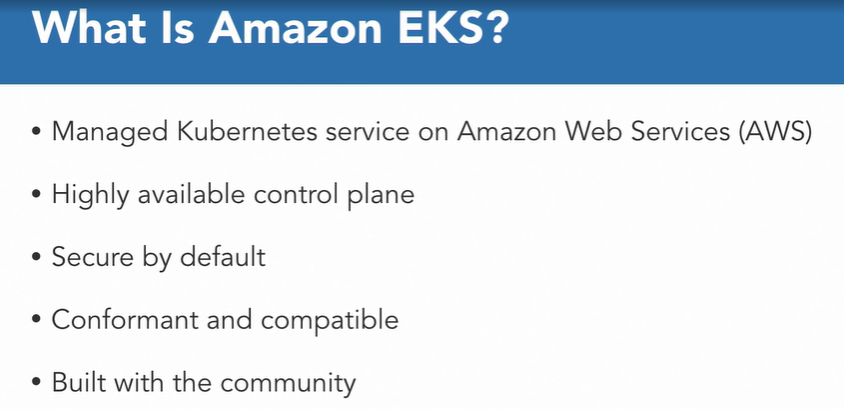
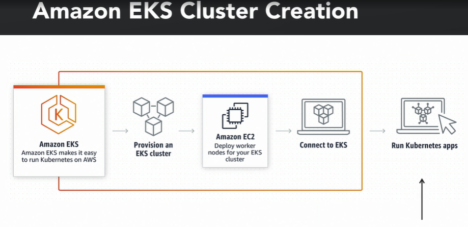
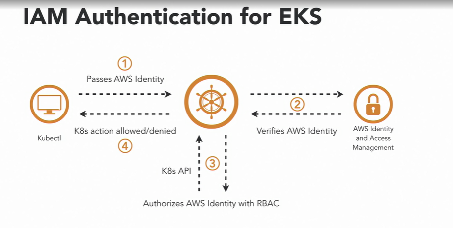
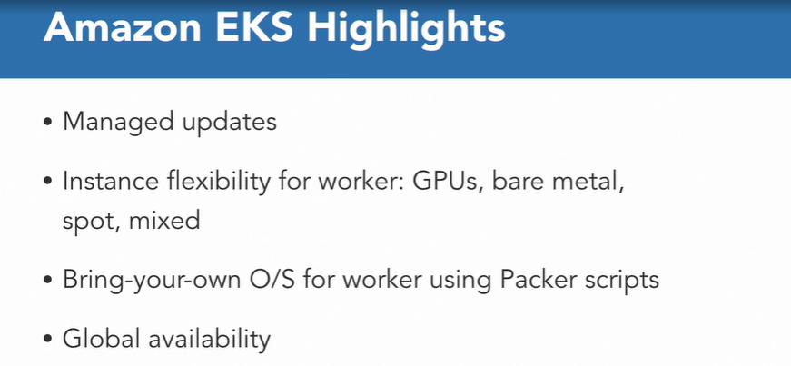

### Kubernetes Cluster on AWS

#### Introduction to Amazon EKS

* Amazon EKS, makes it easy to deploy, manage, and scale containerized applications using Kubernetes on AWS. 

* Amazon EKS runs the Kubernetes management infrastructure across multiple AWS availability zones, automatically detects and replaces unhealthy control plane nodes and provides on-demand upgrades and patching. 

* You simply provision worker nodes, and connect them to the provided Amazon EKS endpoint.

* Secure and encrypted communication channels are automatically set up between your worker nodes and the managed control plane, making your infrastructure running on Amazon EKS secure by default.

* Amazon EKS is certified Kubernetes conformant, so you can use existing tooling and plugins from partners and the Kubernetes community. Applications running on any standard Kubernetes environment are fully compatible, and can be easily migrated to Amazon EKS

  

* User experience to create an EKS cluster. 

* You need to provision an EKS cluster. This can be done using AWS Console, AWS CLI, Cloud Formation, or Terraform Templates, or other third-party tools. This creates a highly available and secure Kubernetes control plane straight across multiple availability zones. You don't need to think about your master configuration. This also includes things that give you sweats in the night. It's easily being monitored, encrypted, and backed up. Is your security configuration is right for your masters, it will deploy this in a way that is in accordance with best practices on AWS. The control plane runs in Amazon's account.

* You need to deploy the worker node for your EKS cluster. This creates a Kubernetes data plane and where the application is deployed. Data plane runs in the users AWS account. This means that you control the instance type, the configuration, the army used, the network configuration in your EPC, security groups, access control lists, and everything else. You can use Spot instances or Reserved instances. They are your instances. 

* You need to connect the data plane and the control plane. This creates the completed EKS cluster. This entire workflow of creating control plane, creating data plane, and connecting the two together is offered as a seamless experience by a third party tool. One such tool available in the open source is EKSctl. This tool is created by Weaveworks

*  You can deploy your applications to this Kubernetes cluster

  

* In AWS, identity an access management defines how AWS resources can be accessed securely. Because Amazon is hosting Kubernetes as a service, there's a need to provide authentication on the API endpoint with IAM.

* How this works ? 

* AWS IAM authenticator is an open source project in SIG AWS in the Kubernetes community, and helps with passing AWS identity. So, when a Kubectl call is made, let's say get pods, IAM identity is passed along with Kubernetes call. On the back end, Kubernetes verifies the IAM identity with AWS auth service. This is purely authentication. The authentication response is then sent back to Kubernetes, and Kubernetes and checks it's internal R back mapping for the authorization. This generates if my original get pods call was allowed or denied. Finally, Kubernetes approves or denies a request.

  

* Amazon EKS makes it easy to update running clusters to the latest Kubernetes version without needing to manage the update process. Kubernetes version updates are done in place, removing the need to create new clusters, or migrate applications to a new cluster. EKS give you flexibility and control over what instances you can run. Because of this flexibility, for example, it's super easy to get started with machine learning work loads on EKS. To support this, we have a dedicated GPU army that makes it easy to run Kuda framework workloads on P2 and P3 instances.

* EKS also gives you flexibility over the Operating System you can bring. If you want a pre-made army, we have the EKS optimized army based on Amazon Linux 2, and Canonical builds an EKS army

* We also provide Packer scripts on how these armies are created. This allows you to create custom armies matching your corporate requirement. Amazon EKS is available in a large number of AWS regions today

  

#### EKS Deployment

* By default, it creates a cluster in us-west-2 region for aws, and you can certainly specify a region using dash dash region switch over here. This also uses underline aws CLI on your machine, that is pre-configured for your access keys

  ```shell
   eksctl create cluster --name k8s-app --nodes 4
  ```

* it creates the control plain, creates the data plain, connects the data plain to the control plain and our overall Kubernetes cluster is up and running.

#### Migrate app to a Cluster on AWS

* How can we migrate our application that was running in the Kubernetes cluster on this desktop to the Kubernetes cluster running in the Cloud?

* That's called migrating your application from one cluster to another cluster. That's a technical flow that you will go through, where you are building your application on your local desktop and when ready to go to production, then you may migrate to the Cloud

* Helm server-side component Tiller requires special permission on the Kubernetes cluster. We need to build a service account for Tiller to use and enable permissions for it and then we can install Helm in EKS

  ```shell
  kubectl -n kube-system create sa tiller
  kubectl create clusterrolebinding tiller --clusterrole cluster-admin --serviceaccount=kube-system:tiller
  helm init --service-account tiller
  ```

  ```shell
  kubectl get pods -n kube-system
  ```

* In terms of migration, what you're looking at is, literally just change your context from one cluster which is running on your desktop to another cluster which is running in the Cloud and then redeploy the application. The fact that your manifests are exactly the same, the docker images are exactly the same so there is very low impudence mismatch in terms of your dev and deployed environment. 

* Service is deployed in the Kubernetes cluster running in the AWS Cloud and the type column LoadBalancer, our ELB or an Elastic Load Balancer is automatically a provision for you, thereby exposing the service, and of course, the ports are listed over here so 8080 is a port where this service is going to be accessible and 5005 is our DBAC port. 

#### Questions

* What command is used to set the context used by kubectl CLI for a k8s cluster?
* ans : kubectl config use-context <context> . This is the command to set context.
* What additional tools are needed to setup an EKS cluster using eksctl?
* ans :  None. It downloads all the necessary tools.eksctl simplifies the creation of EKS cluster and downloads all necessary tools.
* How do you authenticate with an EKS cluster?
* ans : KS cluster authenticates using an IAM role that is specified during cluster creation.EKS cluster operates in AWS Cloud and requires an IAM role with right privileges to authenticate.

