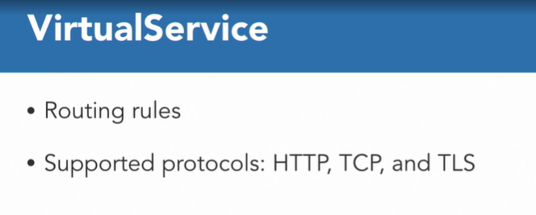

### Service Mesh and Istio

#### Introduction to service mesh and Istio

* **Service Mesh :** Service mesh is a dedicated infrastructure layer for handling service-to-service communication. It is responsible for the reliable delivery of requests through complex topology of services that comprise a modern cloud-native application

* In the context of Kubernetes, a service provides a simple OSI layer for DNS-based load balancing for the pods belonging to the service. Service mesh addresses OSI layer seven load balancing needs and a lot more.

* Service mesh ensures that communication between a Service A and a Service B can be done safely and securely.This could include defending against man-in-the-middle attack, using encryption, and mutual TLS. This also includes auditing capabilities to check who did what at what time.

* Reliability ensures there are provisions for health checks, time outs, deadlines, circuit breakers, and retries.

* Service mesh provides visibility into your microservices application. It ensures there are top-line metrics like request volume, success rates, and latencies. 

* This also includes monitoring and distributed tracing across different services.

* Configurability allows to do traffic shaping between different services. This enables capabilities like load balancing, canary and A/B testing, shadowing, and fault injection.

* You can also do adaptive and zone aware routing between services using this.

* #### Service Mesh :  Language Agnostic

* Trying to solve these problems with an application or framework of your choice not only makes the application complex, but also difficult to maintain. This becomes further complicated if your application consists of multiple microservices, potentially each written in a different language. The combinatorial explosion of libraries for different languages and platforms makes it extremely difficult to maintain such a solution. 

* A common design pattern is where all logic for how the microservices need to connect, including safety, reliability, observability, and configuration is configured in a sidecar proxy.

* This work very well in Kubernetes, as a proxy is installed as a sidecar container, right next to the application container, in the same pod. Some of the advantages of this approach are, 

  * this out-of-process architecture decouples application code from communication management code. 
  * No change is required to the application code to add the capabilities offered by the sidecar. 
  * It also decouples application install from application upgrades. And finally, it minimize inconsistencies across different microservices

  

* Service Mesh: Sidecar Proxy

* All external communication now happens through the sidecar. And because of being in the same pod, application container and proxy can talk to each other easily. Service mesh can then extract a wealth of signals about traffic behavior and use that to enforce policy decisions, such as security. It can also send them to monitoring systems to provide information about monitoring and observability of the application.

  

* Service Mesh Data Plane

* A microservices-based application has different microservices, each with multiple replicas. Each replica is a pod. For a service mesh-enabled application, each pod has a sidecar container. This fleet of proxies is the service mesh data plane. 

* How do we tell every proxy what to do? 

* How we ensure the safety, reliability, and configuration can be done for each proxy? 

* How do we get observability across these proxies?

* We need a control plane.

* Istio: Service Mesh Control Plane

* A control plane to manage the service mesh data plane is required. This control plane handles tasks such as creating new instances and injecting the proxy as sidecar, management and monitoring, observability, security between different services, and implementing application-wide policies.

* Istio provides a control plane for this service mesh data plane. You can find everything about Istio at Istio.io. To go with the nautical puns around Kubernetes.

* Istio is Greek for sail. It uses an extended version of envoy as a sidecar proxy. Envoy, originally built by Lyft, now a CNCF graduated project, is a high performance C++ distributed proxy. Envoy is known to run on tens of thousands of nodes and process over 10 million requests per seconds in the mesh. Istio leverages Envoy's many built-in features

  

* Istio provides the following core features. Istio rules configuration and traffic routing lets you control the flow of traffic and API calls between services. 

* Istio simplifies configuration of service-level properties like circuit breakers, time outs, and retries, and makes it a breeze to set up important tasks like A/B testing, canary rollouts, and staged rollouts with percentage-based traffic splits, with better visibility into your traffic and out-of-box failure recovery features, you can catch issues before they can cause problems.

* Making calls more reliable and your network more robust. Istio's security capabilities free developers to focus on security at the application level. Istio provides an underlying secure communication channel, and manages authentication, authorization, and encryption of service communication at scale. 

* Istio's robust tracing, monitoring, and logging gives you deep insights into your service mesh deployment, gain a real understanding of how service performance impacts things downstream and upstream, with Istio's monitoring feature, while its custom dashboards provide visibility into the performance of all of your services, and let you see how the performance is affecting your other processes.

* Istio is platform independent, and designed to run in a variety of environments, including those spanning cloud, on-prem, Kubernetes, services with distributed console, and more. The policy enforcement component of Istio can be extended and customized to integrate with existing solutions for access control lists, logging, monitoring, quotas, auditing, and more.

#### Deploy application with two deployments

* Istio works using a sidecar. how do we tell Kubernetes cluster to make sure for every deployment inject a sidecar proxy? 

* Any object that is injected into the default namespace,call it Istio-injection=enabled and once you give that label, essentially, Istio will make sure that this sidecar which is injected into each deployment give it a label.Enable `default` namespace injection:

  ```shell
  kubectl label namespace default istio-injection=enabled
  ```

#### Istio Resources

* **Destination Rule :** is a resource that allows to specify one or more named sets that represent individual versions of a service. Each version is uniquely identified using the labels attached to the pod. It also defines policies that apply to traffic intended for a service after routing has occurred.

* These rules specify configuration for load balancing, connection pool size from the sidecar, and outlier reduction settings to detect and evict unhealthy hosts from the load balancing pool.

  

* Traffic policies can be applied to all sets or overridden at subset level

* **Virtual Service** :  A VirtualService defines a set of traffic routing rules to apply when a host is addressed.

* What weight should we assign to multiple services defined in this VirtualService?

* How many times a HTTP request should be retried if the request fails? 

* Another rule could be, what HTTP force can be injected when forwarding requests to the destination service?

* Actual rules are defined for different protocols. 

  

* HTTP, TCP, and TLS are supported protocols. The traffic is matched by the protocol, then it's sent to a named destination service, or subset or version of it, that must have been defined by our destination rule.

* **Istio Gateway :**  Gateway describes a load balancer operating at the edge of the mesh, receiving incoming or outgoing HTTP/TCP connections. A gateway allows Istio features, such as monitoring and routing rules, to be applied to traffic entering the cluster. Its specification describes a set of ports that should be exposed, the type of protocol to use, configuration for the load balancer, etc.

  

* A VirtualService can then be bound to a gateway to control the forwarding of traffic arriving at a particular host or gateway port.

* Service did not have a type of load balancer, and so the service has to be only accessed using the ingress gateway, because that's exactly where Istio traffic's spreading and all the Istio rules can be applied. 

#### Traffic shifting using Istio

* One of the power of Istio is that the rules configuration and traffic routing let's you control the flow of traffic and the API calls between services. It can exactly define how much traffic should go to one service. 

#### Visualize mesh using Kiali

* When your services are deployed in the communities cluster, you need some visibility into them. There are plenty of tools available, such as Prometheus, Grafana, and many others that provide you visibility into how your micro services are running, how are they connected.

* Kiali is a new tool that has been introduced recently as part of Istio. Well, first of all, going with our sailing team around Kubernetes, Kiali is yet another Greek word meaning monocular or spyglass. Kiali project provides answers for the questions, what microservices are part of my Istio service mesh and how are they connected?

* gain insight into how your mesh is functioning, have a checkup with your mesh's health

* You can zoom in to see what is happening with a single component, you can visualize your traffic flow, browse your service mesh by applications, workloads and services and much more. 

* By default Kiali is disabled when Istio 1.0.5 is installed and so it needs to be enabled

  ```shell
  helm template --set kiali.enabled=true install/kubernetes/helm/istio --name istio --namespace istio-system > $HOME/istio.yaml
  ```

  ```shell
  $ port-forward $(kubectl -n istio-system \ 
  > get pod -l app=kiali \
  > -o jsonpath='{.items[0].metadata.name}') 20001:20001
  ```

* What we have done is we have done the port forwarding of the Kiali port here. The default username and password is admin. So username admin, password admin and login.

* That leads to a clean deletion of istio from your EKS cluster.

  ```shell
  kubectl delete -f install/kubernetes/helm/istio/templates/crds.yaml -n istio-system
  ```

#### Question

* If a VirtualServices assigns 90% weight to service A and 10% weight to service B, how much traffic is split between the two services?
* ans : about 90% to service A and remaining to service B . The assigned weight is a close approximate of how the traffic would be split between two services.
* Which Istio resource allows to specify one or more named sets that represent individual versions of a service?
* ans : DestinationRule.DestinationRule is a resource that allows you to specify one or more named sets that represent individual versions of a service. Each version is uniquely identified using the labels attached to the pod.
* Which pods are injected with proxy sidecar in a standard k8s cluster?
* ans : only the pods that are explicitly injected with proxy sidecar.Namespace injection is not enabled in a standard k8s cluster. So a pod with explicit sidecar container in pod specification is the only one that will have sidecar proxy injected.
* What namespace is used to install Istio resources?
* ans : istio-system.Istio resources are installed in the istio-system namespace.
* What is the primary purpose of service mesh?
* ans : provide a secure, reliable, observable, and configurable service-to-service communication.Service mesh provides a secure, reliable, observable, and configurable service-to-service communication.