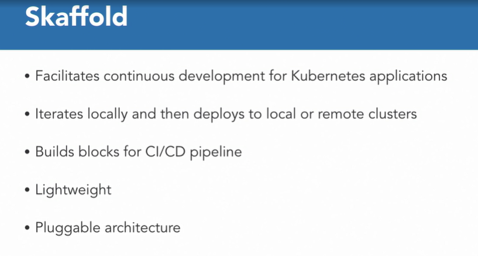
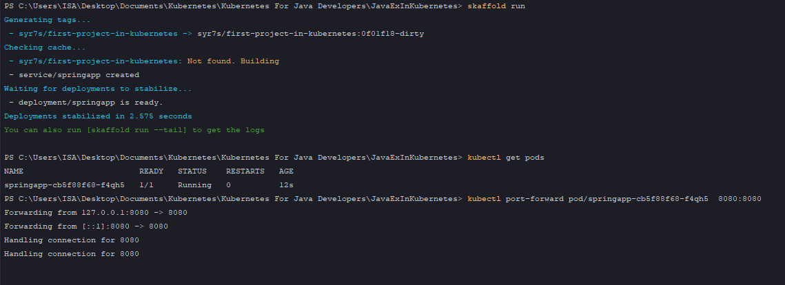
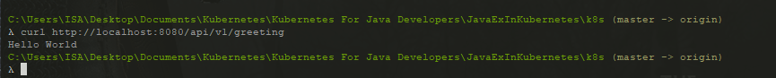
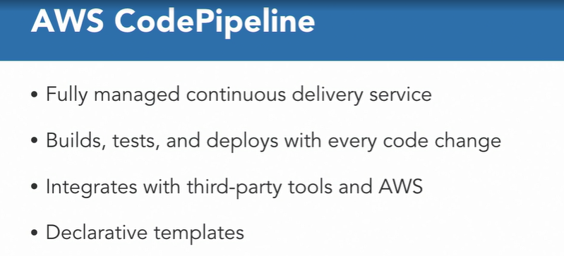

### Deployment Pipelines

### Skaffold

* Going through the entire process of building your application, creating a Docker image, updating Kubernetes manifests, re-applying those manifests to Kubernetes cluster could be daunting when you want to focus mostly on building your application. This is exactly where deployment pipelines help.

* #### Skaffold

* Skaffold is an opensource come online tool that facilitates continuous development for Kubernetes applications.

* Skaffold provides an opinionated, minimal pipeline to keep things simple. 

* You can iterate on your application source code locally, then deploy to a local or remote Kubernetes clusters.

* Skaffold detects changes in your source code and handles the pipeline to build, push, and deploy your application automatically with policy-based image tagging and highly optimized, fast, local workflows. 

* It also provides building blocks and describes customizations for a CI/CD pipeline.

* Use Skaffold run command end to end or just part of Skaffold stages from build to deploymet in your CI/CD system. 

* Skaffold does not require maintaining a cluster site component so there is no overhead or maintenance burden to your cluster.

* A pluggable architecture is central to Skaffold's design, allowing you to use a tool you prefer in each stage.

* For example, Dockerfile and Jib can be used for building the image, deployment can be done using Kubectl and Helm, and Docker images may be kept on the local Daemon or pushed to our registry.

  

* This could be useful for dev and prod scenario. On a local machine, you can configure Skaffold to build artifacts with local Docker Daemon and deploy them to Docker desktop using Kubectl.

* All detail about Skaffold 

* https://github.com/GoogleContainerTools/skaffold

* When we are building with Skaffold, we essentially want Skaffold to build the image, prepare the Kubernetes manifest for us, and use that to deploy to Kubernetes cluster.

  ```yaml
  imagePullPolicy: Always
  ```

* We have ImagePullPolicy. It says always. Well, when I'm building with Skaffold, I don't really want to push the image and pull the image because that really adds up to my overall development cycle.

  ```yaml
  apiVersion: skaffold/v1beta2
  kind: Config
  build:
    artifacts:
      - image: syr7s/first-project-in-kubernetes
  deploy:
    kubectl:
      manifests:
        - ./k8s/app.yaml
  ```

  ```shell
  $ kubectl config use-context docker-desktop
  $ skaffold run | skaffold dev
  $ kubectl get pods
  $ kubectl port-forward pod/springapp-cb5f88f68-f4qh5 8080:8080
  ```

  

  

* skaffold dev. This took the Docker file, built the Docker image, used the Kubernetes manifest, deploy that using Kubectl to the cluster that is configured, and then deployed all the required artifacts for us. 

* Skaffold is now listening for those changes and then it right away builds the image and deploy that using the manifest to your Kubernetes cluster. So enjoy your time debugging your applications and building your applications using 

#### AWS CodePipeline

* AWS code pipeline is a fully managed, continuous delivery service that helps you automate your release pipelines for fast and reliable application and infrastructure updates. and deploy phases of your release process every time there is a code change based on the release model you define. 

* This enables you to rapidly and reliably deliver features and updates. code pipeline allows you to integrate third party developer tools like github or Jenkins into any stage of your release process with one click.

* You can use third party tools for source control, build, test or deployment. AWS code pipeline allows you to define your pipeline structure through a declarative JSON document.

* Which allows you to specify your release workflow, any stages, and actions

  

* We are deploying to a Kubernetes cluster and Amazon EKS, we will switch our context to the EKS cluster.

  ```yaml
  ---
  version: 0.2
  phases:
    install:
      commands:
        - curl -sS -o aws-iam-authenticator https://amazon-eks.s3-us-west-2.amazonaws.com/1.11.5/2018-12-06/bin/linux/amd64/aws-iam-authenticator
        - curl -sS -o kubectl https://amazon-eks.s3-us-west-2.amazonaws.com/1.11.5/2018-12-06/bin/linux/amd64/kubectl
        - chmod +x ./kubectl ./aws-iam-authenticator
        - export PATH=$PWD/:$PATH
        - apt-get update && apt-get -y install jq python3-pip python3-dev && pip3 install --upgrade awscli
    pre_build:
        commands:
          - TAG="$REPOSITORY_NAME.$REPOSITORY_BRANCH.$ENVIRONMENT_NAME.$(date +%Y-%m-%d.%H.%M.%S).$(echo $CODEBUILD_RESOLVED_SOURCE_VERSION | head -c 8)"
          - sed -i 's@CONTAINER_IMAGE@'"$REPOSITORY_URI:$TAG"'@' manifests/standalone/greeting-pipeline.yaml
          - $(aws ecr get-login --no-include-email)
          - export KUBECONFIG=$HOME/.kube/config
    build:
      commands:
        - docker image build --tag $REPOSITORY_URI:$TAG app 
  
    post_build:
      commands:
        - docker image push $REPOSITORY_URI:$TAG
        - CREDENTIALS=$(aws sts assume-role --role-arn $EKS_KUBECTL_ROLE_ARN --role-session-name codebuild-kubectl --duration-seconds 900)
        - export AWS_ACCESS_KEY_ID="$(echo ${CREDENTIALS} | jq -r '.Credentials.AccessKeyId')"
        - export AWS_SECRET_ACCESS_KEY="$(echo ${CREDENTIALS} | jq -r '.Credentials.SecretAccessKey')"
        - export AWS_SESSION_TOKEN="$(echo ${CREDENTIALS} | jq -r '.Credentials.SessionToken')"
        - export AWS_EXPIRATION=$(echo ${CREDENTIALS} | jq -r '.Credentials.Expiration')
        - aws eks update-kubeconfig --name $EKS_CLUSTER_NAME
        - kubectl apply -f manifests/standalone/greeting-pipeline.yaml
        - printf '[{"name":"greeting","imageUri":"%s"}]' $REPOSITORY_URI:$TAG > build.json
  artifacts:
    files: build.json
  ```

* This is version 0.2, it provide different phases, so install, prebuild, build, post build, and there are multiple commands associated with it.

* I'm installing the iam authenticator, kubectl CLI, setting the path, installing the right packages. 

* In prebuild, I'm making sure that my manifests are appropriately prepared with the right image name. 

* Then in the build phase, of course, I am building the docker image, and then finally in the post build stage, is where I'm actually deploying to Kubernetes using my downloaded kubectl CLI

* When you create a Amazon EKS cluster, the IAM user entity user, or role, that creates the cluster is automatically granted system core and master permission in the cluster's RBAC configuration. Now in order to grant additional AWS users or roles, the ability to interact with your cluster, you must edit the AWS auth config map. 

* All of this build infrastructure is highly scalable and running for you in the cloud, where you can continue to focus on what your application needs to do.

* It also has an external IP, external load balancer because a service type was load balancer so essentially AWS created an ELB or an elastic load balancer for you, and exposed the service on that. And the port is of course 8080. 

* Java application, packaged as a docker container, packaged as a docker container, deployed as a Kubernetes deployment, deployed as a Kubernetes deployment, accessed using the Kubernetes service, accessed using the Kubernetes service, deployed using code pipeline, fully managed in the cloud. deployed using code pipeline, fully managed in the cloud.

  #### Question

  * Where is the build specification for AWS CodePipeline defined?
  * ans  : in the buildspec.yaml file located in root directory of the project. Default name and location of build specification for AWS Codepipeline is buildspec.yaml in the root directory of the project.
  * Skaffold is a great tool for deploying your applications to production?
  * ans : False . Skaffold is a great tool during your development cycle only.

  

  

  

