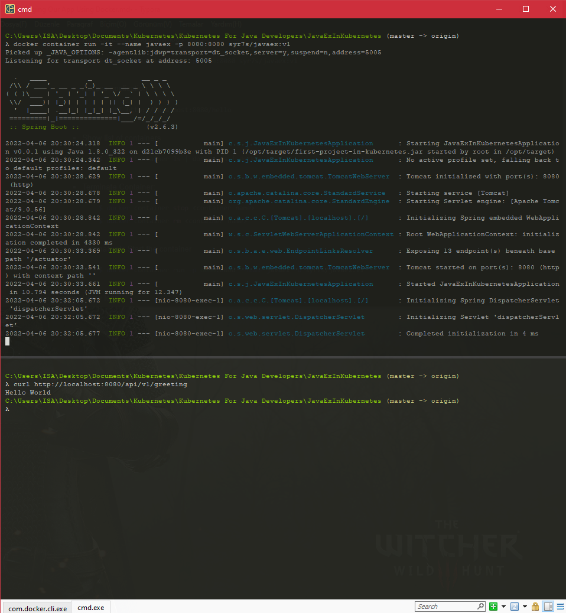
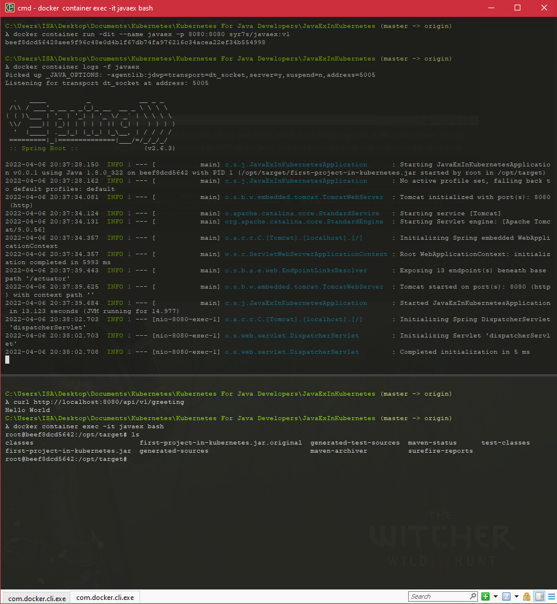
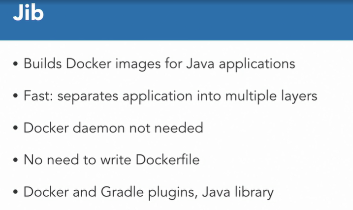
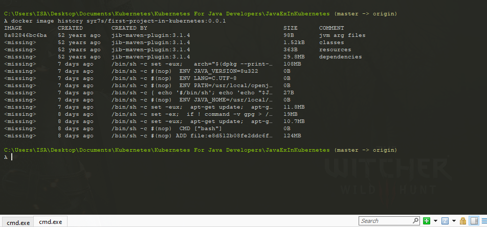
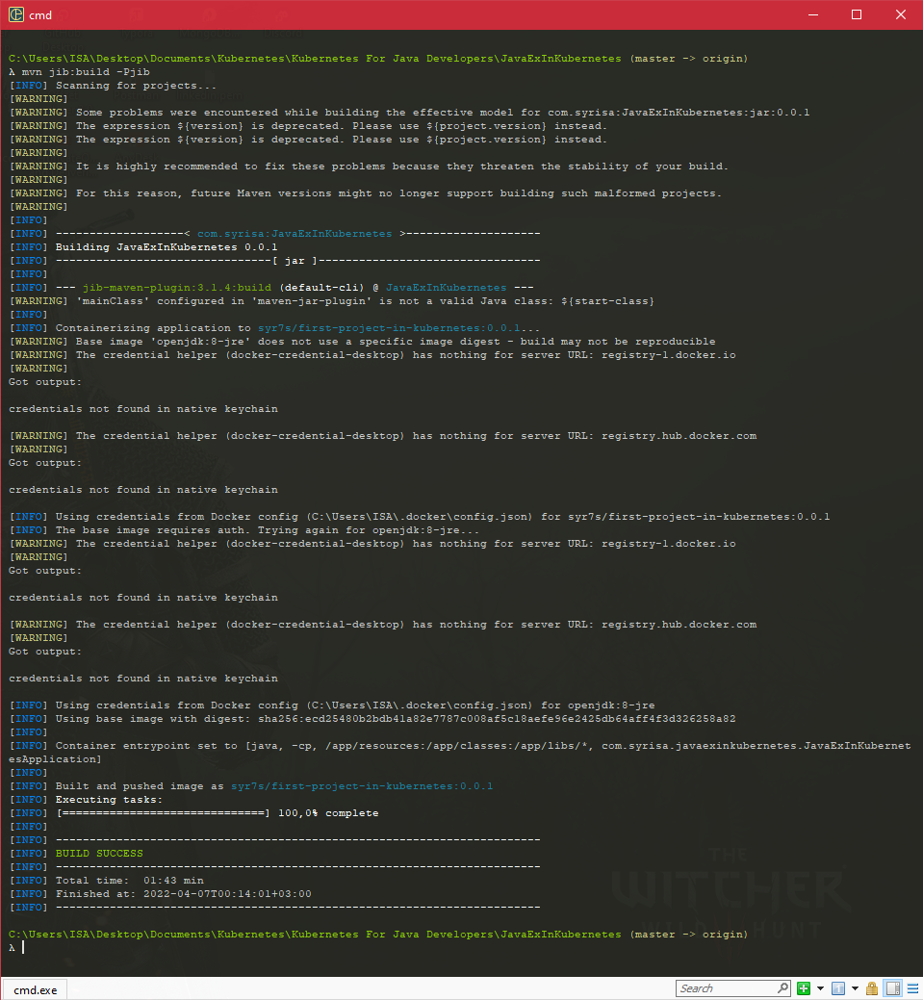

### Packaging Our App Using Docker

#### Docker workflow

* A client host, a server host, and a registry. 

* Registry is a stateless highly scalable server side application that stores and lets you distribute Docker images. This is typically hosted on the internet, such as Docker Hub or Amazon Elastic Container Registry. It could be hosted inside the firewall as well. Such as using JFrog's Artifactory or other similar products. This is where all your Docker images, including application images are published. 

* Docker client host is from where the commands to download an image or run a container are issued. This could be your Dell machine during development or CI/CD pipeline that is giving the commands to run the containers. The command is typically issued using Docker CLI which is also installed on the client host.

* There is server host where the images are downloaded for your use and containers are run. There are multiple server hosts to make the application highly available. Each server host has Docker Engine installed that is listening for commands. 

* App Developer creates a Docker image and publishes it on the registry, my app in our case. The developers gives the command from the client host like, Docker container run, using Docker CLI. CLI than translates this command to arrest request and sends it to the Docker Engine on the server host. Docker Engine checks if the image is already available on the server host.

* If the image already exists, then it runs the container. If the image does not exist, then it downloads the image from the pre-configured registry and runs the container. 

* The image is stored on the server for later reuse. If multiple instances of the container for the same image needs to run, then the image is only downloaded once, unless a newer version is specified. I also have a course on Docker for Java Developers that provides much more details about how you can get started with Docker. 

  

#### Docker Image and Container

* #### Create a Docker Image

* Docker image can be built from a text-based file, usually called a Dockerfile. Dockerfile is a text document that contains all the commands a user could call on the command line to assemble the image. Docker runs instructions in a Docker file in the specified order. A Dockerfile must start with a FROM instruction. The FROM instruction specifies a base image from which you are building. The base imagine could be an operating system or another general purpose image built by somebody and already has some of the tools that you need for the application.

  * Text-based file
  * Default name is Dockerfile
  * Instructions : FROM, ADD, CMD

* Dockerfile syntax allows multiple instructions. ADD is one such instruction that copies new files, directories, or remote file URLs from a source, and adds them to file system of the image at the destination path. Another important instruction is CMD, that provides defaults for executing container. If there are multiple CMD instructions then only the last CMD will take effect. This is where typically you start or deploy your application.

* Sample Dockerfile : 

  ```shell
  FROM debian
  CMD echo "hello world!"
  ```

  ```shell
  FROM openjdk
  CMD java -version
  ```

* As a developer, you can start with an operating system base image, and add your specific version of the JDK. But if an image with the JDK version that you need already exists, then you're more likely to use that. 

* #### Multi-Stage Dockerfile

* Docker enables multi-stage builds using Dockerfile. 

* This is enabled by having multiple FROM statements. Each FROM statement can use a different base and each of them begins a new stage of the build. 

  

* You can selectively copy artifacts from one stage to another, leaving behind everything you don't want in the final image. This allows build and run of the application from the same Dockerfile, and yet have a lean Docker image for production.

  

* If you're looking for a no-cost, long term support downstream distribution of OpenJDK then Amazon Corretto is one of your choice. An official Docker image for Amazon Corretto is also available at hub.docker.com So you can easily replace OpenJDK with Amazon Corretto as shown in this slide. 

* Amazon Corretto is meant to be a drop-in replacement for OpenJDK compatible JDKs. You can of course use Amazon Corretto on desktop, on Prime and on the Cloud, as a standalone download. 

* #### Build Context

* It is important to understand what is build context when building a Docker image. Docker image is built using Docker image build command. 

  ```shell
  # Set of files in the PATH or URL of docker image build command
  $ docker image build -t ex:v1 -f Dockerfile .
  ```

* This command takes a path or a URL. By default Dockerfile exists at the root of this path or URL. An instruction in the Dockerfile such as ADD will resolve files in the local file system using this build context. 

* The build context is sent to the Docker engine so it is recommended to create a new directory, copy the Dockerfile and other necessary artifacts in that directory, and then issue the build command.

* Empty directory with relevant artifacts

* Alternatively you can also use .dockerignore, very much like .gitignore to exclude files and directories from the build context.

* #### Name an Image

* Each image is uniquely identified with a name and a tag. When building an image you need to assign a name to the image and optionally tag it. If no tag is provided then the latest tag is used. 

  ```shell
  $ docker image build -t name:tag
  ```

* #### Run a Container

* Running an image launches a container. Docker container run command is used to run the container, you just need to specify the image name. As explained in the Docker workflow, the CLI will give this command to the Docker engine, which will check if the image is already available on server host. Download it if needed and then run the container. 

  ```shell
  $ docker container run <image name>
  ```

* By default the container runs in foreground. - d option allows to run the container in detach or background mode. 

* Background : -d

* Multiple options to the command can be combined such as -it

* Interactive : -it 

* Here -i keep STDIN open and -t allocates a pseudo-tty.

* #### Port Forward in Container

* By default no ports of the containers are published to the outside world, however a port can be explicitly made available using port forwarding.

* Allows application in container accessible on the host.

  ```shell
  docker container run -p <host port>:<container port>
  ```

* Multiple ports using additional -p

#### Build a Docker image using a Dockerfile

* We're going to use Dockerfile to build our application. Here, this is a Dockerfile, part of our maven repo. This is the second file that we are explaining here now. As you can see, this is a multi stage Dockerfile. Here is my first from statement, and here is my second from statement. The first from statement is using maven as a base image. And I'm specifying a tag that means I want maven version three point five and jdk eight. You can look at Docker Hub and see where these images are available and what other tags are available if you need a different version of maven. I'm giving this stage a name, call it Build. The first step here is taking a repository.tar.gz which will generate in a second and copying it to a specific directory in the maven image itself.

* This directory is existing in the maven base image. Then we take our application code and copy it to the base image as well in the user source app directory. We set that as a work directory and then give the command call as maven, where we are referring to the settings for maven and package the application. Now this really leverages the maven repository that we will generate locally and repurpose that for creating your application package. At this point, yes, we are using Dockerfile, but it's using basic maven commands to package your Java application. 

  ```Dockerfile
  FROM maven:3.5-jdk-8 as BUILD
  
  ADD repository.tar.gz /usr/share/maven/ref/
  
  COPY . /usr/src/app
  WORKDIR /usr/src/app
  RUN mvn -s /usr/share/maven/ref/settings-docker.xml package
  
  FROM openjdk:8-jre
  EXPOSE 8080 5005
  COPY --from=BUILD /usr/src/app/target /opt/target
  WORKDIR /opt/target
  ENV _JAVA_OPTIONS '-agentlib:jdwp=transport=dt_socket,server=y,suspend=n,address=5005'
  
  CMD ["java", "-jar", "greeting.war"]
  ```

* In this case, we are using openjdk as the base image and we're using 8-jre as the tag. We don't need the entire JDK or maven or class files, none of that for our production image. So we take open openjdk-8-jre as a base image, we expose a port from the application. 8080 is where our application is running. 5005 is our debug port. And we'll look at that a little bit later. Then the first command is, from the build stage, I'm just copying the cargo directory into a specific directory here, and that OPT target directory is now set up as a work directory. Now remember everything that is generated in my first stage is left behind and only the relevant artifacts are copied from first stage, my development stage, to my production stage. I set up certain Java options here, this will be used when we are debugging our application later. And finally I fire up my application using Java -jar and greeting.war because this greeting.war exists in OPT target directory.

  ```bash
  # Build Docker Image using Dockerfile
  #Code 
  # Change to app directory
  # Show and explain multi stage Dockerfile
  #Create local repo:  . This command is going to download the maven repository, all the dependencies, and package them locally into one file.
  mvn -Dmaven.repo.local=./repository clean package
  tar cf repository.tar.gz ./repository
  # Create Docker Image
  docker image build -t syr7s7greeting
  # Show docker image
  docker image ls
  ```

* In my JavaExInKubernetes directory, I have a repository folder. This is my entire maven repository that needs to be packaged into the base image itself.

  

* all the build and the production images are done using a single Dockerfile, using a multi stage Dockerfile

  ```shell
  $ docker image build -t syr7s/javaex:v1 -f Dockerfile .
  ```

  ```dockerfile
  FROM maven:3.8-jdk-8 as BUILD
  
  ADD repository.tar.gz /usr/share/maven/ref/
  
  COPY . /usr/src/app
  WORKDIR /usr/src/app
  RUN mvn -s /usr/share/maven/ref/settings-docker.xml package
  
  FROM openjdk:8-jre
  EXPOSE 8080 5005
  COPY --from=BUILD /usr/src/app/target /opt/target
  WORKDIR /opt/target
  ENV _JAVA_OPTIONS '-agentlib:jdwp=transport=dt_socket,server=y,suspend=n,address=5005'
  
  CMD ["java", "-jar", "first-project-in-kubernetes.jar"]
  ```

#### Working With a Docker Container

* We're going to launch a container using that image.

* Run container and show logs

  ```shell
  $ docker container run -p 8080:8080 syr7s/javaex:v1
  ```

* Access application

  ```shell
  $ curl http://localhost:8080/hello
  ```

* Show list of containers

  ```shell
  $ docker container ls | docker ps | docker ps -a
  ```

* Terminate Container:

  ```shell
  $ docker container stop <container name>
  $ docker container rm <container name>
  ```

* Alternatively Start the container

  ```shell
  $ docker container run -p 8080:8080 --name javaex -d syr7s/javaex:v1
  ```

* Show logs

  ```shell
  $ docker container logs javaex
  ```

* Docker container run is the command that tells Docker engine to run the container. Dash p is an option that maps a container port to a specific port on the host.

  

* You can also see in terms of the ports, I have port 5005, which is not being exposed at this point of time. I'm only exposing port 8080 on the container to 8080 on the host, and that's how we were able to access the application.

  

* Connect container

  ```shell
   $ docker container exec -it javaex bash
  ```

  

* One command two process

  ```shell
  $ docker container rm -f javaex
  ```

#### Build a Docker Image Using Jib

* Dockerfile is a common way to package your Java applications as a Docker image. 

* How does this building of Docker Image fits into your workflow? Jib is a tool that supports that. 

* ### Jib

* Jib builds optimized Docker and OCI images for your Java applications. It is commonly therefore too, as a compiler for containers. Jib allows you to deploy changes fast. It separates your applications into multiple layers, spreading dependencies from classes.

* Now you don't have to wait for Docker to rebuild your entire Java application. Just deploy the layers that changed. A Docker daemon is not needed to build the image. An image is built directly to the registry. 

* Optionally, it can also be built to a Docker daemon. Writing a Dockerfile to create Docker image for your Java application means you need to learn two different sets of tools, one for Java, one for Docker. You also need to learn best practices around Dockerfile and need to insure they're consistently followed across the team. 

* With Jib, there is no need to write a Dockerfile. It uses an open-ended base image that can also be run in debug mode.

* The most important part is it's available as plugins for Maven and Gradle and as the Java library. You can also push to any registry of your choice. This allows you to seamlessly integrate this as part of your build process. No need to write Dockerfile or Docker Build and Push. Jib is an open-source tool and you can get all the details about the tool at GitHub repo.

  

* And we are looking at the Maven profile. This profile is called just jib. Here is the groupID, artifactID, and the jib plugin version. Make sure you use the latest plugin version because it always has more features into it. Now, in terms of our image, we're using openjdk:8-j re as a base image. As we said, the base image can be overwritten. Here is the image that we are going to create. Here are my container options. Here are my runtime options, the ports that I am exposing. Here is an additional option that I'm specifying, which make sure that the timestamp on my docker image is always colored. Now, I'm binding the docker build code to the package phase of the jib profile. What that means is, when I give a Maven package command, it will also involve the docker build goal of the jib plugin.

  ```xml
   <properties>
          <java.version>1.8</java.version>
          <docker.repo>syr7s</docker.repo>
          <docker.tag>latest</docker.tag>
          <docker.registry>registry.hub.docker.com</docker.registry>
          <docker.name>${docker.registry}/${docker.repo}/${project.build.finalName}:${docker.tag}</docker.name>
          <greeting.host>localhost</greeting.host>
          <greeting.port>8080</greeting.port>
      </properties>
      ***
      <profiles>
          <profile>
              <id>jib</id>
              <build>
                  <plugins>
                      <plugin>
                          <groupId>com.google.cloud.tools</groupId>
                          <artifactId>jib-maven-plugin</artifactId>
                          <version>3.1.4</version>
                          <configuration>
                              <from>
                                  <image>openjdk:8-jre</image>
                              </from>
                              <to>
                                  <image>${docker.name}</image>
                              </to>
                              <container>
                                  <environment>
                                      <_JAVA_OPTIONS>'-agentlib:jdwp=transport=dt_socket,server=y,suspend=n,address=5005'</_JAVA_OPTIONS>
                                      <swarm.http.port>8080</swarm.http.port>
                                  </environment>
                                  <ports>
                                      <port>8080</port>
                                      <port>5005</port>
                                  </ports>
                                  <useCurrentTimestamp>true</useCurrentTimestamp>
                              </container>
                          </configuration>
                          <executions>
                              <execution>
                                  <phase>package</phase>
                                  <goals>
                                      <goal>dockerBuild</goal>
                                  </goals>
                              </execution>
                          </executions>
                      </plugin>
                  </plugins>
              </build>
          </profile>
      </profiles>
  
  ```

* I can give the command Maven package and just the jib profile. And once I give this command, Now, if you're giving this command for the very first time, it will of course download all of the dependencies and everything for you, but we have already run the command on this machine, so the dependencies are predownloaded. So, the cool thing here is, you can see it's actually building to the Docker daemon. But in between, it also tries to retrieve the registry credentials. For something important is how do you configure the registry for your Jib profile? 

  ```shell
  $ mvn package Pjib
  ```

  ```shell
  <useCurrentTimestamp>true</useCurrentTimestamp> was removed. 
  ```

* So any of Maven settings, you can set up these values. The registry name, in this case is registry.hub.docker.com then of course you give your user name and your registry password. And that's how it authenticates with the registry.

  ```xml
  <settings>
   ...
   <servers>
    ... 
    <server>
    	<id>MY_REGISTRY</id>
    	<username>MY_USERNAME</username>
    	<password>{MY_SECRET}</password>
    </server>
   </servers>
  </settings>
  ```

* Once you have done that, then you can just give the command, and in this case, it does build the Docker image to our local Docker daemon.

  

* The cool thing about Jib is, as we discussed earlier, it actually splits your classes, resources, and dependencies into each individual Docker layer. This truly leveraging the Docker layering mechanism in an image and allowing you to integrate more rapidly. This way Docker does not have to build an entire application. If your resources and dependencies have not changed, which is typically the case, then only your classes layer is rebuilt and can be easily pushed to the registry. This is particularly relevant in a microservices world because you want that agility for your application and to be able to deploy your application more rapidly as well.

* you can of course build without the Docker daemon and directly to a registry. So, what we can do is, we can just say Maven jib:build and we can still use the same profile and now in this case, it's going to build the exact same image but it's going to push it directly to the Docker registry. We just retrieved the registry credentials and built and pushed the image as syr7s/first-project-in-kubernetes:0.0.1

  ```shell
  $ mvn jib:build -Pjib
  ```

  

​	
