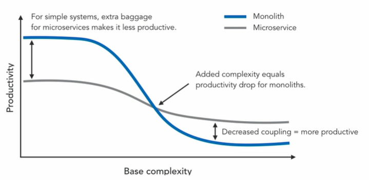

### Introduction to Microservices

#### Microservices 101

- Microservices are a variant of service-oriented architecture that structures the entire application as a collection of loosely coupled services.

- #### Benefits of Microservices

- By breaking up a monolithic service into many smaller, independent services that work together, developers have more freedom to create, manage, and deploy the individual components without compromising the integrity of the entire application.

- Because the surface area of each individual service is smaller, it's easier to plug in this approach into a continuous integration pipeline.

- Which enables continuous delivery. Microservices allow for a more resilient application over all. If one service fails, the whole application shouldn't fail hard and other components should still continue to work. This allows you to isolate faults in a better manner and make your overall application more fault tolerant.

  

- Typically, microservices are broken up with the intent to solve a specific business need or enable a business capability.

- The structure makes it easier to build services that can be clearly communicated to the business side of the organization.

- It's easier to justify technical work when it's related directly to specific business need.

- For greenfield opportunities, there's an initial learning curve and many additional facets to set up with microservices that you won't encounter with monoliths. As you continue development you start to build a more complex system. You'll need more organizational knowledge of the inner workings of the monolith. This is different in microservices architecture, where you'll need to know less upfront. Later, when you have a rather large codebase or larger teams, Chances are, you'll end up being more productive using the microservice architecture, rather than trying to add features or debug a large monolith.

  

- if you started with a microservice architecture up front, you'll end up seeing rewards later on in the lifecycle of the application.

- Building microservice forces you think to about applications in a more modular way.

- Build a microservice - based application using Kubernetes as the microservice platform

#### Benefits of a Microservices Architecture

* Language Independence

* Breaking up the application into multiple subcomponents that interoperate with each other but run independently buys you technical independence. You're allowed to use different languages or even different databases behind the scenes for different microservices in the application.

  

* #### Avoid Bottlenecks with Scaling

* When it comes to scaling, there's always some part of an application that is invoked by a lot of different modules or is the bottleneck for the rest of the application. 

* Authentication and token management is often called a lot from the rest of the code.

* Using microservices won't help me optimize the out modules, but it'll certainly help me scale them. I can build a login an token management API separately as a single service, and then scale these out independently as an app. Kubernetes also helps with scaling.

  

* #### Deployment Benefits

* Deploying your individual microservice also becomes easier in this new pattern

* Changes to an out API can be made and deployed whenever they are ready without having to update the rest of the application.

* **There are several advantages to this**

  * You can get your updates to production mode quickly.
  * The risk of rolling out a smaller changeset is much less than having to deploy the entire application. You get to also play with some new ideas like blue-green or A/B deployments.
  * You are able to replace components in a more efficient way. Building services in this manner also open you up to a lot of new technologies

  

* ### New Opportunities

* Apply microservices approach to containers and serverless paradigms

* Serverless paradigms and containers introduce new tooling and technologies that benefit from a microservices approach.

* 

