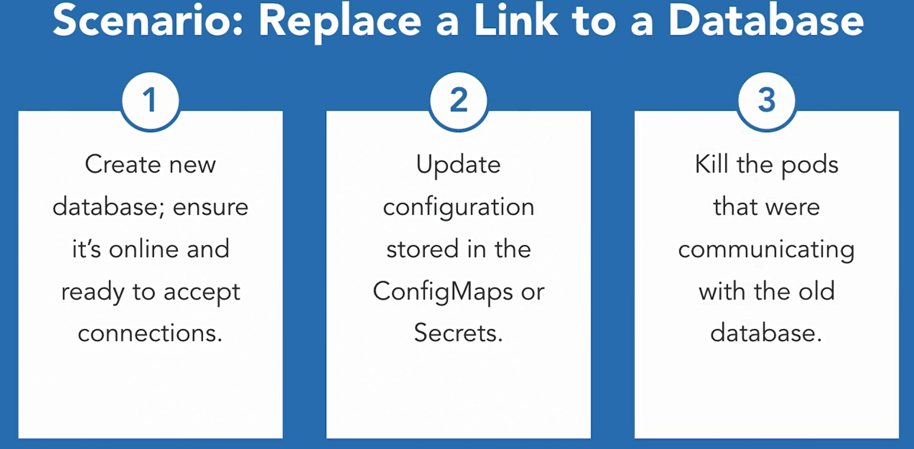

### Microservices Using in Kubernetes 

#### Microservices patterns in Kubernetes

- How does this relate to Kubernetes and how can we leverage the power of the Kubernetes platform as the hosting platform for microservices.

- The 12-factor principles and create a reference implementation for each of these using Kubernetes as a microservice platform

- #### Goal

- Build reference architecture for microservices for Kubernetes

- #### Architecture Groupings

- Basic building block architectures

- Deployment patterns

- Runtime patterns

- #### Building Blocks

  

- #### Deployment Patterns

  

- #### Runtime Patterns

  

#### Microservice Building Blocks

* Codebase : 

* When we talk about codebases, we typically think of source control like GitHub or Perforce. In the container world, these are still important, but we mostly end up relying on container images that might be packaged by a continuous integration system.

  

* Codebase Workflow

* So if we're going to put this into a workflow, the first step would be to push your code into your source control repo.

* We'd have an automated build kickoff and build your code and run your appropriate tests.

* We'll package the code into a container image and push it to a container repository. Docker Hub might be the de facto place to push your images if you're a startup, but larger enterprises might use private repositories, or an internal artifactory.

  

* Application Dependencies

* When we talk about application dependencies, we typically think of dependency management solutions like Maven, pip, gem or Glide, depending on the language you're working on. In Kubernetes, typically applications are implemented as deployments, and break into pods. Pods are comprised, so one or more containers.  One strategy for managing dependencies is to build a pod comprised of many containers that might contain your dependencies. This is actually common practice called sidecar pattern in Kubernetes, and it's often used for running logging in your application. 

  

* #### Dev versus Prod in Kubernetes

* There are many ways to handle dev versus prod deployments in Kubernetes. From an app perspective, the deployment to Kubernetes will always be the same for an application, provided the configuration of the application is stored in ConfigMaps and Secrets.

* To deploy applications while keeping the environments consistent,

* For organizations with a small Kubernetes footprint, or few applications, they might use Kubernetes namespaces to ensure consistency. Different namespaces with different user and config files for access allow you to set security policies and access control. 

* Organizations with large Kubernetes footprints end up creating additional Kubernetes installations and use completely different machines as worker nodes. This allows for a separation of concerns between applications running in development versus production, and scaling issues with an app and dev doesn't cause a production outage. So in the end, you have good options for how you can approach consistency in deployments based on the size of your organization, and its Kubernetes footprint.

  

* **Admin**

* The pattern states that admin tasks are run as one-off processes. 

* The containers running admin tasks are tagged similarly to those running applications so that the admin tasks are operable only with the right version of the software. From a task perspective, admin tasks are run as a Kubernetes job or a chron job. Finally, you can have a separate admin application altogether. However, it might need a new set of APIs, and an authentication scheme than the rest of the app, so that only internal users can access the data.

  

#### Deployment Patterns

* Application Configuration

* It treated application configuration. Every application I know has config files to store application specific information.

* Applications always have associated configuration to make the application work as expected

* Application Configuration in Kubernetes

* Kubernetes provides two ways for applications to store the configuration data outside of the actual application. 

*  it frees the application from its data, which makes the application updates a lot easier. The two ways provided are configMaps and secrets. You would typically use a configMap when you're trying to store application metadata in configuration. Anything that isn't sensitive data. 

* Real world examples for these might include translations, system properties, and start up parameters.

* For the sensitive data, Kubernetes provides us with secrets, which are base64 encoded when they're at rest in the system. Storing sensitive data in secrets is more secure than plain text config maps, or in pod specification, and is the recommendation way to store this kind of information

* Examples for this might be database passwords, SSH keys, OR tokens, etc

  

* Loaded into the pod via

  * Environment variables
  * Files

  

* Build, Release, Run

* We have already covered how our containers are built and stored in a container repository. It's also a best practice to tag your container image with a specific version

* By tagging each image with the build number created by a build agent, or by using a version number that tags to a specific version

  

  

* You can use these to group your containers together in a specific way and deploy them together. 

* There is also additional tooling in the ecosystem, like Helm, which allows you to package your application and apply a revision control to it.

* Processes and Port Bindings

* For processes, it's recommended that the application is executed as one or more stateless process. For most developers who've started their careers as cloud developers, this is not something out of the ordinary. But for the rest of us, who work in enterprises or before the advent of the cloud paradigm, we have seen how servers and applications used to take advantage of sticky sessions.

* The goal is not to rely on the idea that the request will always go to the same server every time, and that any state data must be persisted in the database or cache that can be read by any of the servers. (Goal :: Allow request to go to any container or server by default)

* Statelessness in Kubernetes

* In the Kubernetes worlds, statelessness translates directly to deployments and pods. Deployments are backed by ReplicaSets, that can contain one or more pods, and traffic is routed to any of these pods in the replica for each request. This process makes your application stateless by default.

  

* Word on StatefulSets

* There is a concept in Kubernetes called statefulsets that sometimes gets confused with sticky session. You typically use statefulsets to create a persistent storage. For example, if you're creating a MySQL cluster or a MasterMaster Cassandro cluster, you'd use the statefulset. Don't get this concept confused when building out web applications in Kubernetes.

* Port Bindings

  

* Kubernetes pods are built from containers and communicate with each other or the external world using ports. Pods listen for incoming requests on predeclared ports, and route these requests to the container running in them.

  

#### Runtime Patterns

* Associating Resources in Kubernetes

* Everything is treated as a service and the configurations would be stored in the ConfigMap or Secret.

* Scenario: Replace a Link to a Database

  

  

* From concurrency perspective, having a platform like Kubernetes to run your applications is awesome. 

  

  

* Scaling out Kubernetes to handle more traffic is one of the strengths of the platform

* Another strength of the platform is disposability which is the ability to maximize robustness with fast startup and graceful shutdown

  

* Containers to Pods tor Replicas

  

* Advantages to Users :  From a user perspective, the application will still function and the user won't see any downtime

* Logging

  

  