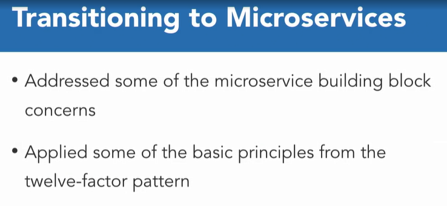

### Example K8s Microservices Application

#### From Monolith to Microservice

* Enterprise Experience

  

* The purpose of the application was to build the e-commerce catalog which allowed customers to view the companies products and understand their specification

  

*  I'll use this e-commerce example for a monolith because it's near and dear to me and it's also a fairly common used case. At it's core, the monolith had three main modules. 

  

* Which is the API that the customers will use to view and create their wish list. In this case, the monolith is a single WAR file and has one or more JAR files that provide all the core functionality. We would also have a common web tier to handle web requests and responses.

  

* How can we break this up? There are many ways to do this. And we'll use the simplest approach.

* This gives us three sub-applications or microservices which are authentication, wish list and the catalog operations.

  

* In the real world, each of these will have a REST API that can be used by other services if necessary. This allows you at the initial benefit of being able to reorganize your code in a more logical way. The development team can rally around new architecture and split themselves into smaller feature teams to work on the individual applications or microservices. 

  

* Similarly, you might be able to convince your business team to rally around the new architecture as well. Because it makes the code and API more visible to the business users. Now that we have our microservices, we'll deploy them as containers. There are a couple advantages to this. First, the individual teams can develop, build, and test their applications locally. This allows the team to be more productive up front. The art team can work on the art features. And the wishes team can develop their wishes components individually. Second, you can setup a continuous integration pipeline for every time you make code commits to your repository, you can also run a CI job to test a code and then finally push your containers.

  

* **Containers allow you to use Kubernetes**

  

* We'll populate our applications with representative code rather than actual code allowing us to focus on the architecture and infrastructure. I'll warn you in advance. Don't use this code in a production setting.

#### Microservice deployment to Kubernetes

* docker pull karthequian/wishlist:1.0

* docker pull karthequian/wishlist-auth:1.0

* docker pull karthequian/wishlist-catalog:1.0

  ```markdown
  # Deploying our application to Kubernetes
  
  We're ready to deploy our application to Kubernetes, but let's take a look at our assets.
  
  ## Goals:
  1. View our sample application and containers
  2. Take a look at our deployment file 
  3. Take a look at our alternate deployment file
  4. Deploy our application into kubernetes and verify we can see our API's working.
  
  ## Goal 1
  View the sample application here: 
  
  ## Goal 2
  To view the deployment file, take a look at wishlist-deployment.yaml
  
  ## Goal 3
  To see another way to run the microservices, take a look at wishlist-deployment-alernate.yaml
  
  ## Goal 4
  To run the microservice described in goal #1, from the current directory, run:
  
  `kubectl create -f wishlist-deployment.yaml`
  
  To verify that the deployment is online:
  `kubectl get deployments`
  
  To verify that the replica sets are running:
  `kubectl get rs`
  
  To verify that the pods are running:
  `kubectl get pods`
  
  To see the services:
  `kubectl get services`
  
  To interact with your API's in the minikube environment:
  `minikube service wishlist-service`
  ```

* Deployment yaml

  

  ```yaml
  # Wishlist deployment yaml
  kind: Deployment
  apiVersion: apps/v1
  metadata:
    name: wishlist-deployment
    labels:
      app: wishlist
  spec:
    replicas: 3 #We always want more than 1 replica for HA
    selector:
      matchLabels:
        app: wishlist
    template:
      metadata:
        labels:
          app: wishlist
      spec:
        containers:
        - name: wishlist #1st container
          image: karthequian/wishlist:1.0 #Dockerhub image
          ports:
          - containerPort: 8080 #Exposes the port 8080 of the container
          env:
          - name: PORT #Env variable key passed to container that is read by app
            value: "8080" # Value of the env port.
        - name: catalog #2nd container
          image: karthequian/wishlist-catalog:1.0
          ports:
          - containerPort: 8081
          env:
          - name: PORT
            value: "8081"
        - name: auth #3rd container
          image: karthequian/wishlist-auth:1.0
          ports:
          - containerPort: 8082
          env:
          - name: PORT
            value: "8082"
  ---
  kind: Service
  apiVersion: v1
  metadata:
    name: wishlist-service
    namespace: default
  spec:
    type: NodePort
    selector:
      app: wishlist
    ports:
    - name: wishlist-port
      protocol: TCP
      port: 8080
    - name: wishlist-auth-port
      protocol: TCP
      port: 8081
    - name: wishlist-catalog-port
      protocol: TCP
      port: 8082
  ```

* If you have a replica of just one this would be in a single pod. And if for some reason the pod goes offline or it crashes then you'll have a brief amount of downtime associated with the deployment. Moving on we have selectors and the template portion of this which has metadata. And finally the spec portion. This is where the majority of our code would go. There are containers associated with this. And there's three of them. A wishlist container, a catalog container, and finally an auth container. As you can see we have the image of karthequian wishlist 1.0. Also wishlist catalog 1.0 and auth 1.0. We notice that we had ports associated with it, so we're declaring a container port of 8080. This exposes the port 8080 of the container to the outside world. And we're passing in an environment variable called port with the same value of 8080. 

* This is because for this application, when it starts up, it will read the value of the environment variable called port, and whatever value is passed to it, that will be the value that the server thought the application starts up on. Similarly for catalog we have port 8081 and port 8082 for wishlist auth. The last part of this is the service

* In Kubernetes you can actually define separate modules in one single file. So you can have one single yaml file that has all of your information for a specific deployment, service, replica set

* We're going to choose a type node port, and we do this because the node port is the simplest kind of service, and Kubernetes by default will allocate a port between 30,000 and 32,767 for the service. 

  ```shell
  kubectl apply -f wishlist-deployment.yaml
  ```

  ```shell
  docker container inspect minikube --format={{.State.Status}}
  ```


#### Alternate Deployment yaml

* Single deployment had a template with multiple containers running in them, one for wishlist, one for the catalog, and finally one for auth. 
* Kubernetes is really flexible, and we can do this in multiple
* In this scenario I'm actually breaking up the deployment into three individual deployments, and I'm still using the same service. However, if you look at the deployment, you'll notice that in the spec there's only a single container. This is the wishlist app deployment container backed by the same image as before and the same port. Similarly we have the same container for the catalog, and also another deployment for the auth. The question here is, why would we want to use three deployments versus a single deployment, and which one do you choose in what scenario?
* Larger organizations that have individual teams or large teams work on individual deployments. So, it makes it easier for one team to take ownership of a single deployment. 
* They could actually own this entire deployment for wishlist, and deploy it as one unit. On smaller teams or smaller organizations, when you want to encompass everything as a single application, you'd probably end up using one deployment for your app, and treat wishlist as an application that you want to deploy as one unit of work. 

#### Adding context with configmaps

* **Configuration Information should live outside of the application.** 

* How can we do this in Kubernetes and how is it implemented? Kubernetes gives us a construct called ConfigMaps that helps us implement this feature

* You can pass in data via environment variables for small sets of data or for larger pieces of data you can use it as a volume mount.

  

*  this is the definition of the configmap now when we want to execute this in the container we first need to volume mount that, so we put volume of config-volume and configmap with name of log-config

  ```markdown
  # Configmaps
  
  Configuration information should live outside of the application. How can we do this in Kubernetes?
  
  ## Goals
  1. Create a configmap that can be referenced by the application via env variables
  2. Create a configmap that can be referenced by the application via a volume mounted file
  
  ```

  

  ```yaml
  kind: ConfigMap
  apiVersion: v1
  metadata:
    name: log-config
  data:
    log-level: debug
  ```

  ```yaml
      spec:
        volumes:
          - name: config-volume # Configmap (Step 2: Declare as a volume)
            configMap:
              # Provide the name of the ConfigMap containing the files you want
              # to add to the container
              name: log-config
  ```

  ```yaml
    - name: LOG_LEVEL
            valueFrom:
              configMapKeyRef:
                # The ConfigMap containing the value you want to assign to SPECIAL_LEVEL_KEY
                name: log-config
                # Specify the key associated with the value
                key: log-level
  ```

* So there we have it log level of debug running in my container that came from the actual configmap that we had configured.

  

* What do we do in larger scenarios where we want (mumbles). Java for example has a log (mumbles) properties where you use log for J for properties, we have a lot more content that needs to come in via a file. How would we do this with a config map?

  ```yaml
  # Configmap (Step 1: Create it)
  apiVersion: v1
  kind: ConfigMap
  metadata:
    name: log-config
  data:
    log.properties: |
      # Root logger option
      log4j.rootLogger=DEBUG, stdout, file
      # Redirect log messages to console
      log4j.appender.stdout=org.apache.log4j.ConsoleAppender
      log4j.appender.stdout.Target=System.out
      log4j.appender.stdout.layout=org.apache.log4j.PatternLayout
      log4j.appender.stdout.layout.ConversionPattern=%d{yyyy-MM-dd HH:mm:ss} %-5p %c{1}:%L - %m%n
      # Redirect log messages to a log file, support file rolling.
      log4j.appender.file=org.apache.log4j.RollingFileAppender
      log4j.appender.file.File=log4j-application.log
      log4j.appender.file.MaxFileSize=5MB
      log4j.appender.file.MaxBackupIndex=10
      log4j.appender.file.layout=org.apache.log4j.PatternLayout
      log4j.appender.file.layout.ConversionPattern=%d{yyyy-MM-dd HH:mm:ss} %-5p %c{1}:%L - %m%n
  ```

  ```yaml
      spec:
        volumes:
          - name: config-volume # Configmap (Step 2: Declare as a volume)
            configMap:
              # Provide the name of the ConfigMap containing the files you want
              # to add to the container
              name: log-config
  ```

  ```yaml
      volumeMounts:
          - name: config-volume
            readOnly: true
            mountPath: "/var/lib/wishlist/"
  ```

  

* When we declare configmap in our data section we declare the file colon space and then we have a pipe and then after the pipe we put the actual contents of what we want to see. And then in our template definition in our spec we have the volume like before. A log config, which maps the betadata to configmap. And in our container we have a volume mount with name of config volume that's similar to the actual volume that we had before, we're going to set this as read only of true because we don't want to overwrite the file and then we're going to mount this in a path of var lib wishlist. 

  

* I'm running inside of the container and I have this mounted in var lib wishlist so that's cd var lib wishlist. And here you'll notice you have a log.properties so you count this out. We noticed that the value is the actual value of the file. So in this case we're in the container again and we have a file that we put in a specific directory called lib wishlist that's the contents that is coming from your log.properties that's loaded in as configmap.

#### Working with Sensitive Configuration

* You'll have to base64 it, decode that, to actually get it.

* Secrets are very similar to config maps, but they're base64 encoded, so you can't actually see them when you try to get them via kubectl get secrets. We can pass these the same way as we did for config maps, either by in environ variables or volume mapping a file, in the case where you might have to upload a cert in to a container

  ```markdown
  ## Goals
  1. Create a secret that can be referenced by the application via env variables
  2. Create a secret that can be referenced by the application via a volume mounted file
  ```

  ```yaml
  # Wishlist deployment yaml
  kind: Secret
  apiVersion: v1
  metadata:
    name: mysql-connection-secret
  data:
    connection-string: c2VydmVyPTEyNy4wLjAuMTt1aWQ9cm9vdDtwd2Q9MTIzNDU7ZGF0YWJhc2U9dGVzdA==
  ```

* There's a kind of secret similar to a kind of config map, with a data section and then a connection string with some garbled data. So if we take this and we run echo, the value, and base64, decode. We actually get back the true value of what that was supposed to be to begin with. 

*  So this looks a lot more like a mySQL connection string.

  

* So how does this make it into the container? So we have a mySQL connection secret, and this gets mounted in by a volume, much like config maps. So we have the secret volume, and then the secret name.

  ```yaml
      spec:
        volumes:
        - name: secret-volume
          secret:
            secretName: mysql-connection-secret
  ```

  ```yaml
         volumeMounts:
          - name: secret-volume
            readOnly: true
            mountPath: "/etc/mysql-volume"
  ```

  ```yaml
          volumeMounts:
          - name: secret-volume
            readOnly: true
            mountPath: "/etc/mysql-volume"
          env:
          - name: PORT
            value: "8082"
          - name: MYSQL_CONNECTION_STRING
            valueFrom:
              secretKeyRef:
                name: mysql-connection-secret
                key: connection-string
  ```

* In the auth container we have volume mount with name of secret volume, which corresponds to the volume we had above. And in this case we're setting read only to true, meaning we only want to read that, and we're mounting that into a specific path. Etc/mysql-volume. 

  

  

#### Adding Liveness Probes

* One of the issues we run into when we have multiple pods inside of a deployment is pod start up times. Occasionally, one container in a pod might depend on another container at start up time. So if the container number two takes a long time to start up, container number one is not going to be able to perform any actions

* In the Kubernetes world, one of the ways to kind of get around this is to use a liveness probe, and liveness probes are often used in deployments when there are many containers running for a single deployment. They help with start up and container running states

* The liveness probe indicates when the container's actually running. So if for some reason your liveness probe fails, then kubenet will try and restart the container. For the readiness probe it essentially tells when the container is ready to receive request

* You're trying to bring up a big oracle database, or something large that has a long start up time, you might want to use a readiness probe to know when this is up and running

  ```yaml
       livenessProbe:
            httpGet:
              path: /status
              port: 8080 #Name or port number
            initialDelaySeconds: 5
            timeoutSeconds: 1
  ```

* We're going to configure a liveness probe for the wishlist container, and in this case we're going to use httpGet as the probe where we'll look at paths of status and port 8080. This can either be a number or you can use the port name, if you can find a port name for you at ENB. I want to configure the initial delay seconds to five, so I'm going to wait five seconds before I start probing. And then the timeout, I'm going to set to one. I'm going to do this for all of the containers, but the configuration for all of these is pretty much the same. 

  

* If you have multiple restarts for one or more of the pods, it helps you debug what's actually going on behind the scenes, and it helps you start up in a cleaner manner.