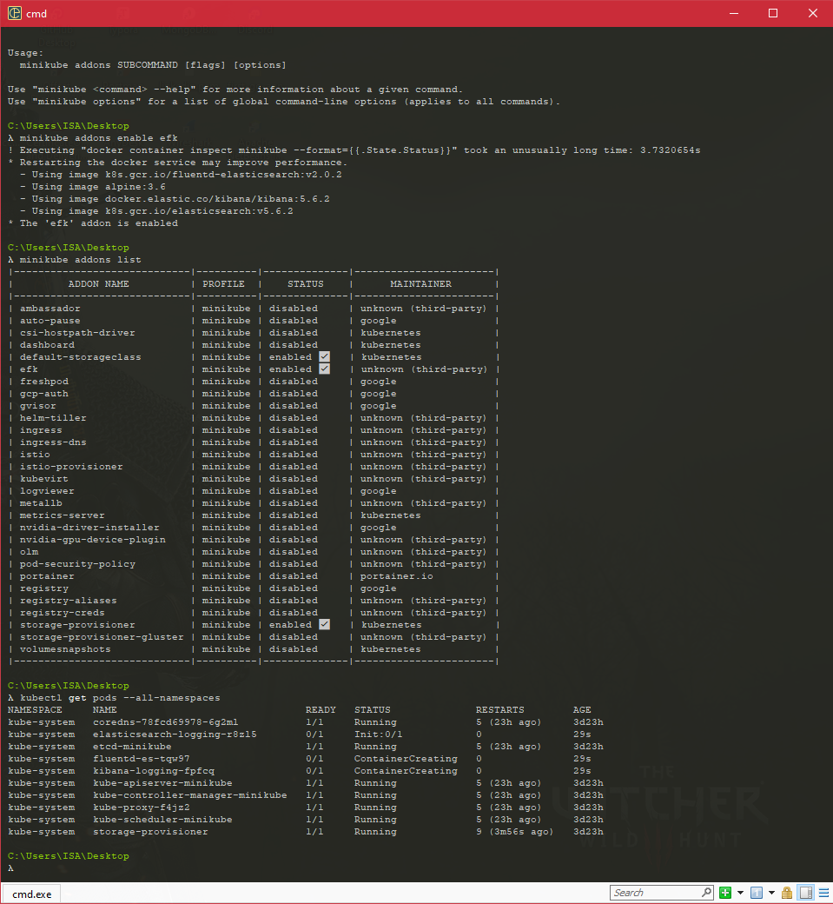
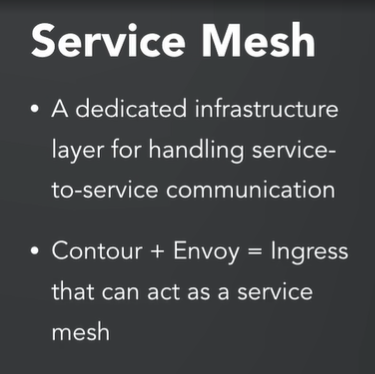
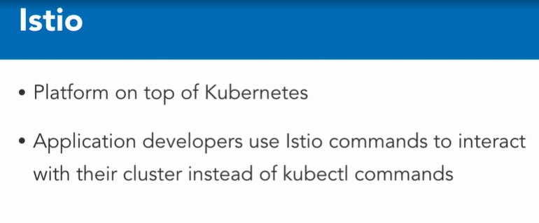

### Advance Topics

#### Deployment with Helm

* Helm is a package manager for Kubernetes. Kubernetes is all about YAML files, and after a while, when your YAML files grow large, it becomes incredibly painful to debug issues. This is why people use Helm to manage the complexity of their YAMLs. It also provides a way to easily update and rollback their Kubernetes artifacts

* Helm (https://helm.sh) is a package manager for Kubernetes. Kubernetes is all about yaml files, and after a while, when your yaml files grow large, it becomes incredibly painful to debug issues.

* This is why people use Helm- to manage complexity in their yaml's. It also provides a way to easily update and rollback their kubernetes artifacts. And finally, it's also the most popular place to find user generated charts. Think of it like the maven or npm for Kubernetes

* Take a look at the wishlist folder for our deployment and service converted to a helm chart.

* I already have helm installed via the instructions at: https://docs.helm.sh/using_helm/#installing-helm

* This template out into a deployment and a service section, just to make it a little bit more cleaner and easier to understand. If you look at the deployment YAML, this deployment YAML looks similar to the YAML that we had before. However, there's a lot of curly braces with things like template in it. 

* Chart.yaml

  ```yaml
  apiVersion: v1
  appVersion: "1.0"
  description: A Helm chart for Kubernetes Wishlist app
  name: wishlist
  version: 0.1.0
  ```

* values.yaml

  ```yaml
  # Default values for wishlist.
  # This is a YAML_formatted file.
  # Declare variables to be passed into your templates.
  
  replicaCount: 3
  
  wishlistImage:
    repository: karthequian/wishlist
    tag: "1.0"
    pullPolicy: IfNotPresent
  authImage:
    repository: karthequian/wishlist-auth
    tag: "1.0"
    pullPolicy: IfNotPresent
  catalogImage:
    repository: karthequian/wishlist-catalog
    tag: "1.0"
    pullPolicy: IfNotPresent
  
  service:
    type: NodePort
    wishlistPortName: wishlist-port
    wishlistPortValue: 8080
    catalogPortName: catalog-port
    catalogPortValue: 8082
    authPortName: auth-port
    authPortValue: 8081
    port: 80
  ```

* service.yaml

  ```yaml
  apiVersion: v1
  kind: Service
  metadata:
    name: {{ template "wishlist.fullname" . }}
    labels:
      app: {{ template "wishlist.name" . }}
      chart: {{ template "wishlist.chart" . }}
      release: {{ .Release.Name }}
      heritage: {{ .Release.Service }}
  spec:
    type: {{ .Values.service.type }}
    ports:
      - port: {{ .Values.service.wishlistPortValue }}
        protocol: TCP
        name: {{ .Values.service.wishlistPortName }}
      - port: {{ .Values.service.catalogPortValue }}
        protocol: TCP
        name: {{ .Values.service.catalogPortName }}
      - port: {{ .Values.service.authPortValue }}
        protocol: TCP
        name: {{ .Values.service.authPortName }}
    selector:
      app: {{ template "wishlist.name" . }}
      release: {{ .Release.Name }}
  ```

* deployment.yaml

  ```yaml
  apiVersion: v1
  kind: Service
  metadata:
    name: {{ template "wishlist.fullname" . }}
    labels:
      app: {{ template "wishlist.name" . }}
      chart: {{ template "wishlist.chart" . }}
      release: {{ .Release.Name }}
      heritage: {{ .Release.Service }}
  spec:
    type: {{ .Values.service.type }}
    ports:
      - port: {{ .Values.service.wishlistPortValue }}
        protocol: TCP
        name: {{ .Values.service.wishlistPortName }}
      - port: {{ .Values.service.catalogPortValue }}
        protocol: TCP
        name: {{ .Values.service.catalogPortName }}
      - port: {{ .Values.service.authPortValue }}
        protocol: TCP
        name: {{ .Values.service.authPortName }}
    selector:
      app: {{ template "wishlist.name" . }}
      release: {{ .Release.Name }}
  
  ```

* Also, there's a thing called Release.Name and something else called a .Values.something else. The templates are actually pieces of code that we can inject into Helm.

  ```yaml
  {{/* vim: set filetype=mustache: */}}
  {{/*
  Expand the name of the chart.
  */}}
  {{- define "wishlist.name" -}}
  {{- default .Chart.Name .Values.nameOverride | trunc 63 | trimSuffix "-" -}}
  {{- end -}}
  
  {{/*
  Create a default fully qualified app name.
  We truncate at 63 chars because some Kubernetes name fields are limited to this (by the DNS naming spec).
  If release name contains chart name it will be used as a full name.
  */}}
  {{- define "wishlist.fullname" -}}
  {{- if .Values.fullnameOverride -}}
  {{- .Values.fullnameOverride | trunc 63 | trimSuffix "-" -}}
  {{- else -}}
  {{- $name := default .Chart.Name .Values.nameOverride -}}
  {{- if contains $name .Release.Name -}}
  {{- .Release.Name | trunc 63 | trimSuffix "-" -}}
  {{- else -}}
  {{- printf "%s-%s" .Release.Name $name | trunc 63 | trimSuffix "-" -}}
  {{- end -}}
  {{- end -}}
  {{- end -}}
  
  {{/*
  Create chart name and version as used by the chart label.
  */}}
  {{- define "wishlist.chart" -}}
  {{- printf "%s-%s" .Chart.Name .Chart.Version | replace "+" "_" | trunc 63 | trimSuffix "-" -}}
  {{- end -}}
  
  ```

* I have a helpers.tpl file that defines a wishlist.name. And this is an actual definition for a piece of code that I want injected into my deployment YAML.

* The values, these come from the values.yaml file. If we take a look at that, in here, we notice that these are live values for all of the information that we want. 

* Helm is actually two pieces. There's the client piece, which is your Helm command that you're running, and then there's a server, which is the Tiller server that runs as a deployment in your Kubernetes environment. 

  ```markdown
  helm ls 
  # This command will list out all of the charts that we currently have running. When we run this, we don't expect to see anything because we haven't done anything yet. 
  ```


#### Service Proxying with Envoy

* Ingress controllers, where Envoy fits in, and how we can implement Ingress controllers for our wishlist application. Services are typically of three types. ClusterIP, NodePort, and LoadBalancers. ClusterIP and NodePort services are for applications internal to infrastructure.

* https://kubernetes.io/docs/concepts/services-networking/ingress/

* . For apps that you want to expose externally, you end up using a LoadBalancer service. That's great, but for every end point, you end up having to use another LoadBalancer resource from your cloud provider, and that can end up costing a little bit more.

* Ingress allows you to route requests to services based on the request hoster path, centralizing a number of services into one single entry point. 

* So think of it as the central point for one entry point for multiple requests, whereas a LoadBalancer is one entry point for a specific host or a path.

* Envoy is a simple service proxy that proxies traffic from one source to another. The goal of Envoy is to make networking and observability for your application a lot more visible. 

* When all service traffic flows through the Envoy mesh, you can visualize problem areas, tune overall performance, and add features like rate limiting in one single spot. It's also common to see Envoy used as an Ingress controller either by itself or using something like Heptio Contour

* Contour : 

* Contour is an Ingress controller for Kubernetes that works by deploying the [Envoy proxy](https://www.envoyproxy.io/) as a reverse proxy and load balancer. Contour supports dynamic configuration updates out of the box while maintaining a lightweight profile.

* Contour also introduces a new ingress API ([HTTPProxy](https://projectcontour.io/docs/main/config/fundamentals/)) which is implemented via a Custom Resource Definition (CRD). Its goal is to expand upon the functionality of the Ingress API to allow for a richer user experience as well as solve shortcomings in the original design.

* https://www.github.com/heptio/contour

  ```yaml
  # Wishlist deployment yaml
  kind: Deployment
  apiVersion: apps/v1
  metadata:
    name: wishlist-deployment
    labels:
      app: wishlist
  spec:
    replicas: 3 #We always want more than 1 replica for HA
    selector:
      matchLabels:
        app: wishlist
    template:
      metadata:
        labels:
          app: wishlist
      spec:
        containers:
        - name: wishlist #1st container
          image: karthequian/wishlist:1.0 #Dockerhub image
          ports:
          - containerPort: 8080 #Exposes the port 8080 of the container
          env:
          - name: PORT #Env variable key passed to container that is read by app
            value: "8080" # Value of the env port.
        - name: catalog #2nd container
          image: karthequian/wishlist-catalog:1.0
          ports:
          - containerPort: 8081
          env:
          - name: PORT
            value: "8081"
        - name: auth #3rd container
          image: karthequian/wishlist-auth:1.0
          ports:
          - containerPort: 8082
          env:
          - name: PORT
            value: "8082"
  ---
  kind: Service
  apiVersion: v1
  metadata:
    name: wishlist-service
    labels:
      app: wishlist-service
    namespace: default
  spec:
    type: ClusterIP
    selector:
      app: wishlist
    ports:
    - name: wishlist-port
      protocol: TCP
      port: 8080
    - name: wishlist-auth-port
      protocol: TCP
      port: 8082
    - name: wishlist-catalog-port
      protocol: TCP
      port: 8081
  ---
  apiVersion: extensions/v1beta1
  kind: Ingress
  metadata:
    name: wishlist-service
    labels:
      app: wishlist-service
  spec:
    rules:
    - host:
      http:
        paths:
        - path: /wishlist
          backend:
            serviceName: wishlist-service
            servicePort: 8080
        - path: /products
          backend:
            serviceName: wishlist-service
            servicePort: 8081
        - path: /login
          backend:
            serviceName: wishlist-service
            servicePort: 8082
  
  ```

* contour commands

  ```shell
  $ kubectl apply -f https://j.hept.io/contour-deployment-rbac
  $ kubectl delete -f https://j.hept.io/contour-deployment-rbac
  ```

* What's happening is we had one single URL in our application even though it's running as different services, still gets mapped to a single end point, login or products. 

#### Metrics with Prometheus

* Prometheus. It's an open source monitoring tool used often with Kubernetes.

  ```shell
   helm install stable/prometheus --name prom-demo -f values.yaml
  ```

  ```yaml
  rbac:
    create: false
  server:
    ## Prometheus server container name
    name: server
  
    service:
      nodePort: 30001
      type: NodePort
  ```

* This brings up the Prometheus interface, and you notice that it has a little expression area where you can execute a graph and a console area as well. So Prometheus is typically used for three reasons. You can monitor your Kubernetes cluster, you can look at node information, and you can also have app metrics that you can monitor. So if you want to look at Kubernetes statistics, we've already instrumented Prometheus to do this.,

* Prometheus giving us Kubernetes statistics, node information, and also monitoring your application to try and pull out your application metrics.

#### Logging with Fluentd

* Minikube gives this to us as an add on. As we can see in the minikube's add-on list we have EFK that starts off as disabled

  ```shell
  minikube addons list
  ```

* Minikube add ons list. So I've enabled this by default. I'm going to start up minikube by doing a minikube start. However, I want to pass some additional parameters here. The ELK stack, or the EFK stack, ends up taking a lot of resources, so we want to pump up minikube with additional CPU and memory. It's recommended that you use at least four gigs, but I'm going to crank this up real high. And I'm going to use 16 gigs instead. And I'll use 4 CPUs. And I will wait for minikube to start up the cluster. 

  ```shell
  minikube start --memory 16000 --cpus 4
  ```

  

  ```shell
  minikube addons open efk
  ```

* Essentially, this is just doing a minikube service and then pulling out the Kibana service name and opening the Kibana service in our UI. 

  

*  By default Kibana shows you all the information that it has

#### Tracing issues with Jaeger

* Jaeger's actually a German word that means hunter, and it's a distributor tracing analyzer that was released by Uber. It's compatible with the open tracing standard and both open tracing and Jaeger are CNCF projects. If you're new to the space, think of Jaeger as an open source new relic.

  ```shell
  https://lnkd.in/gVFVwsg
  ```

* #### **Development Setup**

* This template uses an in-memory storage with a limited functionality for local testing and development. The image used defaults to the latest version [released](https://github.com/jaegertracing/jaeger/releases). Do not use this template in production environments. Note that functionality may differ from the pinned docker versions for production.

* Install everything in the current namespace:

  ```
  kubectl create -f https://raw.githubusercontent.com/jaegertracing/jaeger-kubernetes/master/all-in-one/jaeger-all-in-one-template.yml
  ```

* Once everything is ready, `kubectl get service jaeger-query` tells you where to find Jaeger URL. If you are using `minikube` to setup your Kubernetes cluster, the command `minikube service jaeger-query --url` can be used instead.

*  the Jaeger artifacts create a deployment and a few services.

* So we need to deploy something in order to see it in Jaeger. For this I'm going to use the canonical example of the HotROD application, because it has a lot more areas and pads that it walks through, so it'll show for a better demo.

  ```shell
  https://lnkd.in/gy32KU2
  ```

* The Jaeger agent takes information from the HotROD container and passes it back to the Jaeger collector. 

#### Persona : Cluster Administrator

* Responsible for setting up Kubernetes
* Making sure that the worker nodes are in good health
* Responding to any issues with the system in general

Persona: Cluster Developer

* Keep track, implements new K8s features and makes sure the existing cluster adheres to current specifications

Persona: Application Admin

* Verifies that deployments and services for applications are working as expected.
* Architects the microservices to the Kubernetes environment
* It's probably you - the person watching the video right now

Persona: Application Developer

* Creating the application and doing all the things to make sure the microservices work from a code perspective
* Adhering to the integration standards set out by the app admin

#### Service Mesh

* The Kubernetes core code to reduce and the roles of the cluster admin to be a little bit more defined. However, this only means that there will be a lot of churn in the rest of the segments and roles. Specifically from a microservice perspective, everyone is talking about the service mesh right now. The service mesh is basically a dedicated infrastructure layer for handling service to service communication

  

* Istio, which is an opensource platform to connect, manage, and secure microservices. Istio is deployed on top of Kubernetes and has a mesh layer in front of all applications and can control traffic handling, policy definition, metrics logs, and security.

  

* Even though we had a simple microservice, we still had a lot of yammle to look at, so get really comfortable with that. Also, pay really close attention to labels and selectors, and use these judiciously with your Kubernetes applications. It'll save the day for you when you have many many running pods and you're trying to debug problems with your distributor microservice application.