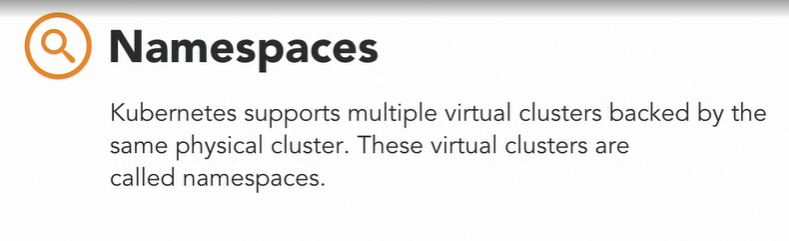
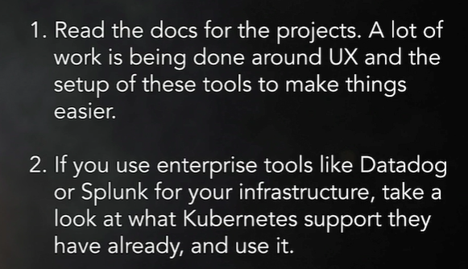
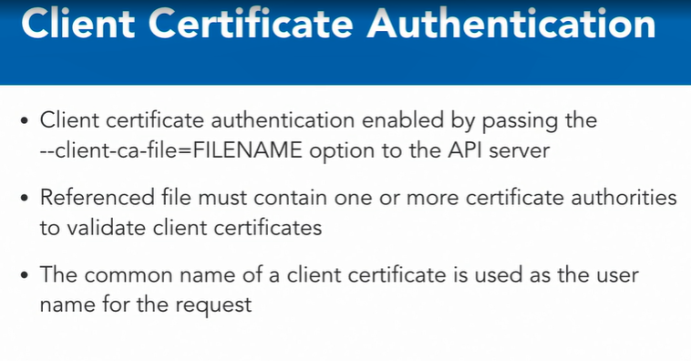
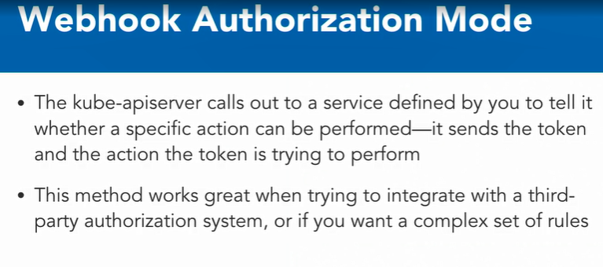

### Advance Topics

#### Production Kubernetes Deployments

* How do I deploy Kubernetes to production ?

* Previously it was difficult to deploy Kubernetes to a production environment. In the container community, it was well-known that Kubernetes is a great tool, but at the time was almost impossible to deploy and manage. Fortunately with the growth of Kubernetes and its community, a lot of work has been performed in this space, and it's much easier to deploy Kubernetes today. 

* https://github.com/kelseyhightower/kubernetese-the-hard-way

* Kubernetes the Hard Way

* The most common way to install Kubernetes today is using the Kube admin tool, also known as kubeadm. This is probably the easiest way to install it on any public cloud, private cloud, or on premise infrastructure. 

* #### Install Steps

* Initially provision the master host with Docker and the Kubernetes distribution

* Run kubeadm init, which starts kubeadm, provisions the kubernetes control plane and provides join token

* Run kubeadm join with join token on each worker node The workers will join the cluster

* Essentially, you're required to initially provision the master host with Docker and the Kubernetes distribution you're looking for. Once this is done, you can run kubeadm init, which starts up Kube admin and provisions the control plane. Once completed, Kube admin will provide you with a token called a join token. On each of your worker nodes, you can simply run the Kube admin join command with your join token, and the workers will join your cluster. Once the nodes have joined, you'll need to install a pod network for your pods to be able to communicate with each other. 

* There are many different networking solutions that you can implement which have different pros and cons depending on your infrastructure needs

* #### Install a Pod Network

* Evaluate your networking strategies

* Consider Flannel and Weave Net as starting possibilities

* #### kops

* Kops, if you're working in an AWS infrastructure and you're wanting to install a cluster, then kops is the tool for you. Kops has a number of useful features. It automates the Kubernetes cluster provisioning in AWS. It deploys highly-available masters, also known as HA. It permits upgrading with kube-up, uses a state-sync model for dry runs and automatic idempotency. 

  

* It generates configuration files for AWS CloudFormation and Terraform configuration, supports custom add-ons, and finally uses a manifest-based API configuration. Kops is a very popular way to deploy Kubernetes on AWS and looks very similar to the way kubectl operates.

* 

  

* If you're going to run Kubernetes on a cloud provider like AWS, Azure, Google or Oracle Cloud, you might want to consider one of their native container services like Amazon Elastic Kubernetes Service on AWS, Azure Container Service for Azure, Google Container Engine for Google Cloud or Oracle Container Engine for Kubernetes in Oracle Cloud.

* #### Managed Kubernetes vs. Self-install

* Why am I wasting time using kube admin or kops when I can just use a managed service?

* You spend a lot less time managing the Kubernetes control plane and spend more time on the applications deployed in your data plane. However, providers don't let you configure all the different elements of Kubernetes that you may need and might trail the latest Kubernetes version as well.

  

* #### Recommendation

  

* A Kubernetes install isn't as hard as it used to be with the advent of new tools like kube admin, kops and managed services on cloud providers doing all the heavy lifting for you. Getting a cluster up and running today is quick, and building a production-worthy platform isn't as hard as it used to be.

#### Detailed look at namespaces

*  Namespaces are a fundamental concept to add multi-tenancy to your Kubernetes instance.

  

* #### Namespaces Use Cases

* Roles and responsibilties in an enterprise

* Partitioning landscapes, for example, dev vs test vs production. 

* Customer partitioning for non-multi-tenant scenarios.. For example, if you're a consulting company and you have multiple customers, you can use this feature. 

* Application partitioning

* Enterprises have many teams that typically operate independently of each other and might have some shared interfaces and APIs to communicate with each other. The use of namespaces is perfect in this scenario, because teams are able to operate independently without stepping on each other. 

* Namespaces also prevent them from confusing services and deployments that might not belong to them. Here are a couple of things you'll need to watch out for. Plan in advance how you want to manage your enterprise in a Kubernetes environment. 

  

* Setting standards up front will help you in the long-term with infrastructure management.

  

  

* Another common pattern is using namespaces for Dev, Test, and Production environments. With most teams building a continuous integration, or CI pipelines, you can easily define CI pipelines to deploy an entire environment in a quick and easy fashion. Some anti-patterns to watch out here for are, sometimes you will end up with a really large namespace because you have many applications that are running

  

* In these scenarios, it might be good to create additional namespaces for groups of application. For example, E-Commerce Dev namespace for all E-commerce related applications. Another scenario is, you might end up with too many environments. Just because you can, does not mean that you should. Don't abuse the feature because it will result in too many unnecessary environments. If you don't use a staging deployment, or you don't use a staging namespace, then don't create one. 

  

* Consulting companies and small software vendors might use this method a lot. You could create a namespace for each customer or project to keep them distinct, while not needing to worry about reusing the same names or resources across different projects. 

* A new side effect of using the Helm package manager introduced by Kubernetes, is that k8s applications, which are typically comprised of deployment, services, et cetera, have gotten very complex. 

* And when installing these applications, they're delivered in their own namespace, which makes it easier to encapsulate the application in one single spot in your Kubernetes cluster, all in just a single namespace. When you're done using the application, you can just delete the namespace. Interacting with namespaces is very straightforward.

* #### Basic Namespace Commands

*  To just get all your existing namespaces, you can just do a kubectl get namespaces

  ```shell
  kuebctl get namespaces # Returns all existing namespaces
  ```

* Create a namespace using this command followed by the name you'd like to use

  ```shell
  kubectl create namespace
  ```

* Delete namespace using this command followed by the name you'd like to delete

  ```shell
  kubectl delete namepsace
  ```

* When deploying a resource like a deployment to a specific namespace adding this flag will make the resource exist in the namespace.

  ```shell
  -n namespace-name
  ```

#### Monitoring and Logging

* Once your infrastructure and your application have been deployed successfully, you run into your next challenge: Are they operating correctly, have there been any errors, are they even online? The DevOps practices of monitoring and logging help you answer these questions. 

* #### Commands to Get Started

* stdout

* kubectl logs

* From a kubernetes prospective, starting out, it's better for your applications, running in a pod, to write your standard out. This is because kubernetes will automatically pick up the logs and show you anything in the log info when you use the command kubectl logs to fetch the logs. This is really useful when you're doing development. 

  

*  The architecture of this paradigm is shown here.

  

* You would typically run a deployment for your Elasticsearch in Kibana instance outside of your application. The Elasticsearch endpoint needs to be accessible to pods in the cluster, and the Kibana instance should be exposed as a service so that you can see log information in the Kibana user interface. Then, in your application deployment, you'll want the log shipper, Fluentd, Logstash or Filebeat, to gather log data and periodically send it to the Elasticsearch instance

* #### Monitoring Priorities

* Node health

* Health of Kubernetes

* Application health (and metrics)

* #### cAdvisor

* For node and kubernetes health, the combination of two open source projects, cAadvisor and Prometheus, give an elegant way to monitor your cluster and applications. 

* cAdvisor is an open-source resource usage collector that was built for containers. 

* It auto discovers all containers in a given node and collects CPU, memory, file system and network usage statistics.

* cAdvisor also provides the overall machine usage by analyzing the root container on the machine.

* #### Prometheus

* Prometheus is an open source systems monitoring and alerting toolkit.

* Kubernetes via projects like kube-prometheus

* Prometheus is an open-source system monitoring and alerting toolkit with a query language that works really well for application-specific metrics and can also be used from an alerting standpoint. Prometheus was initially used to collect application metrics, y'know, like number of successful logins per hour, but can also be used natively to monitor kubernetes itself, with projects like kube-prometheus. 

* You can instrument your application to save application monitoring data at a /metrics endpoint, that Prometheus queries in a timely manner. 

* 

* Prometheus and cAdvisor are typically linked to Grafana, which is an open-source tool to visualize monitoring data.

  

* #### Recommandation

  

#### Authentication and Authorization

* Authentication and authorization are two of the most common topics that arise when folks are trying to integrate Kubernetes into their infrastructure

* From an architecture perspective, users who are trying to access the Kubernetes API, via the kubectl command, first have to be authenticated to access the API. And then authorized to run specific actions.

  

*  Occasionally, users will also need to have admission control to approve or reject a request.

*  We need to understand what a user means from a Kubernetes context

  

* We typically think of normal users as users who are in an LDAP or an SSO system in our enterprises. From a Kubernetes perspective, these users are managed outside of Kubernetes. Service accounts are managed by the Kube API server, bound to a specific namespace, and tied to credentials managed in secrets. 

  

* Authentication in Kubernetes defines whether a user has access to communicate with the Kube API server. And authorization defines whether a user has actual permissions to perform specific actions.

  

* #### Popular Authentication Modules

  * Client certs

  * This is a straight forward way to manage Kubernetes if you're comfortable with handling certificate managements in your org

    

  * Static token files (static password file)

  * The API server reads the bare tokens from a file when given the dash dash token auth file option on the command line

    

  * OpenID Connect

  * The caveat to this method is that these tokens last indefinitely and you're required to restart the API server for any changes in tokens to take place.

    

  * The static password file is similar to this method but the values are passed as basic auth parameters. The benefit of this method, is that it's very simple and easy to manage a small batch of users this way. 

  * Webhook mode

    

  * The details of this are complex and I'd recommend reading the docs for this method. And finally, there's authentication using webhook tokens. This is one of the most common methods that's used by a number of organizations who want to have the users interacting with Kubernetes but also manage tokens in an easier way

  *  Using this method, the Kube API server makes a request to an API that's defined by you to authenticate. The remote API decides whether a token passed to it is a valid token or not, and then responds back to the server. 

* On the authorization front, there are three common ways to perform authorizations. ABAC, RBAC, or Webhook

  

* #### ABAC : Attribute-based access control : 

* ABAC, or attribute based access control, defines an access control paradigm whereby access rights are granted to users through the use of policies that combine attributes together. The ABAC file defines what access a specific user might have to all resources.

  

* In the example config shown, Karthik has master access to all attributes, whereas the user Carisa only has read access to all the repos and name spaces

* #### RBAC : Role -Based Access Control (RBAC)

* RBAC is role based access control. This is the most common authorization mechanism used in Kubernetes and a lot of applications end up using RBAC to authorize their service accounts.

  

* You turn on this functionality on your KubeAPI server even if you're using another authorization mechanism, because you'll end up using something that will require RBAC being installed. RBAC depends on roles and cluster roles. 

* These are rules that represent a set of permissions. A role can be defined within the namespace with a role or a clusterwide with a cluster role. In this example, we see that a role is in the default namespace that allows read access to all pods.

  

* Role bindings grant permissions defined in a role to users. They hold the users or group as a reference to the role being granted. Permissions can then be granted within a namespace with a role binding or cluster wide with a cluster role binding.

  

* Example: devisacan read pods in the namepsace

  ```yaml
  kind: RoleBinding
  apiVersion: brace.authorization.k8s.io/v1
  Metadata:
  	name: read-pods
  	namespace: default
  subjects:
  	kind: user
  	name: devisa
  	apiGroup: rbac.authorization.k8s.io
  roleRef:
  	kind: Role
  	name: pod-reader
  	apiGroup: rbac.authorization.k8s.io
  ```

* The webhook mode for authorization, like the authentication webhook mode, allows you to define what permissions are allowed for a specified user. 

  

* The Kube API server will send a request with the user and resource attribute data to a remote server that you define, that interprets the request and defines whether a request is allowed or not. This method works really well if you're trying to integrate with a third party authorization system, or if you want a complex set of rules.

#### Question

* Who would benefit from using customer partitioning that is not multi-tenant?
* ans : consulting companies and small software vendors
* What command allows you to retrieve all the deployments in the "ecommerce" namespace
* ans : kubectl get deployments -n ecommerce -- This will retrieve all the deployments in the ecommerce namespace.
* Starting out, why is it better for your application to be running in a pod to write logs to Stdout?
* ans : to automatically pick up the logs, and show you anything in the log info when you do a `kubectl logs` command to fetch the logs
* Which authorization mode grants users access to Kubernetes resources through the use of policies that combine roles?
* ans : RBAC  -  RBAC is role-based access control, which sets permissions through rules associated with namespaces or clusters.
* Kubernetes : Native
* Kubernetes the Hard way
* https://kubernetes.io/docs/home/
* Slack: kubernetes.slack.com
* https://www.cncf.io
* Meetups :: https://www.meetup.com/pro/cncf
* KubeCon, dockerCon17
* theagileadmin.com