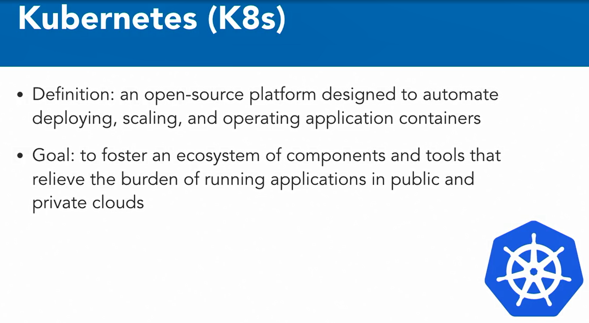
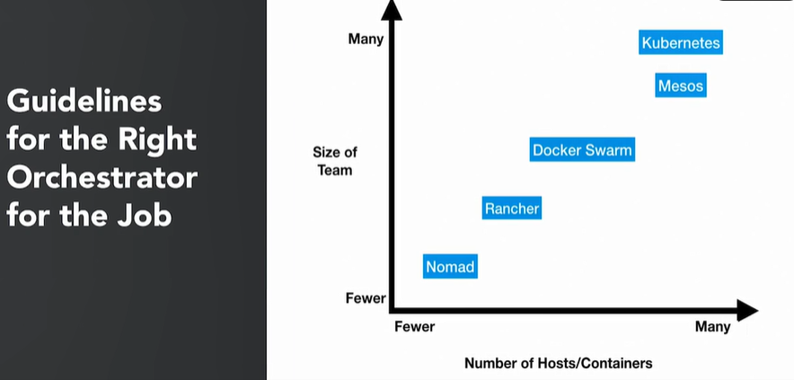

### Containerization with Kubernetes

#### What is Containerization ? 

* In general a container is defined as a collection of software processes unified by one namespace with access to an operating system kernel that it shares with other containers and little or no access between them.

* #### Docker Instance

  * A runtime instance of Docker image contains three things
    * A Docker image
    * An execution environment
    * A standard set of instructions
  * For those coming from an object oriented world, you can use the analogy of classes and objects, where a container is an object and the class is a Docker image. While Docker has many products and solutions, the core pieces of the ecosystem are the Docker Engine and the Docker Store, sometimes referred to as the Docker Hub. 

  

* What is the difference between a container and a virtual machine? 

* Containers might look like a VM, but these are two distinct technologies. In a VM, each virtual machine includes many applications, all the necessary binaries and libraries that would exist on the OS, and the entire guest operating system to interact with them. 

  

* On the other hand, a container will include the application and all of its dependencies, but will share the kernel with the other containers. It is not tied to any specific infrastructure other than having the Docker Engine installed on its host. It'll run an isolated process in the user space on the host operating system

  

  

* This allows containers to run on almost any computer, infrastructure, or cloud. From a high level, containers provide benefits to both developers and DevOps folk alike. 

  

   They also make the process of deployment very easy and repeatable. 

  

* Containers help alleviate platform compatibility issues. From a DevOps standpoint, using containers simplifies release management. 

  

* They can be configured once and run multiple times, making the process more repeatable and efficient. Environments can be made more consistent. 

  

* No more process differences between the dev, staging, and production environments.

* Scaling applications also becomes a lot simpler. Containers take a few seconds to deploy to a host, which makes the process of adding extra workers easier and the workload can grow and shrink more quickly for on-demand use cases.

* The DevOps team can isolate and debug issues at the container level.(The dev team can isolate and debug specific issues to a container level, eliminating problems relating to differences in hosts or runtime issues with applications.)

  

* Organizations use containers to build applications to incorporate a microservices-based architecture. Newer applications are built with a microservices mindset using containers underneath to realize this, and legacy applications are shipped as containers to fit the microservices mold as well. 

  

* Finally, containers assist with code agility and help you build a continuous integration or continuous deployment pipeline. This use case really pushes an IT team to develop, test, and deploy applications faster in a more automated fashion. Hopefully by now it's clear why enterprises have started to adopt containers in such a big way. 

#### What is Kubernetes ? 

*  The most popular open-source container orchestrator available today

  

  

* **How do you manage all these running containers on a single host, and more importantly, across your whole infrastructure?** 

* This is where the idea of container orchestrators come in.

* **Container orchestration solves the problem of deploying multiple containers either by themselves or as a part of an application across many hosts. From a high level some of the features required are the ability to provision hosts, start containers in a host, be able to restart failing containers, have the ability to link containers together so that they can communicate with their peers, expose required containers as services to the world outside the cluster, and scaling the cluster up or down.** 

  

* #### Kubernetes (K8s)

  

* Kubernetes, often called K8S or Hubernetes, is an open-source platform that started at Google. Internally, all of the Google infrastructure relies on containers and generates more than two billion container deployments a week, all powered by an internal platform called Borg. Borg was the predecessor to Kubernetes and the lessons learned from developing Borg over the years has become the primary building blocks in the development of Kubernetes.

  

* This means no more golden handcuffs and opens up opportunities to have hybrid cloud scenarios for your folks migrating towards the cloud. 

  

* It's important to note that you don't have to use Docker containers. You can use rkt by CoreOS or other container platforms. However, most users in the container ecosystem use Docker containers.

* Box has been moving towards a MIC services architecture for their infrastructure and became an early adopter. Kubernetes has provided Box's developers a common development platform to build MIC services. Also, since Kubernetes can run on bare metal, just as well as the cloud, Box could create a migration strategy to Google Cloud. It could also use the same tools and concepts to run across their existing data center and the new Google Cloud. Pokemon GO. 

* Example explain

* When a game has the motto "Got to catch them all," it retrospectively comes as no shock that as soon as it launched, within half an hour, traffic surged and crashed all Pokemon GO servers. To keep up with traffic, Niantic got help from teams at Google to move Pokemon GO to the Google container engine. To date, Pokemon GO is the largest Kubernetes deployment on the Google container engine. Due to the scale of the cluster and accompanying TrueBit, a multitude of bugs were identified, fixed, and merged back to the Kubernetes code base. eBay was an early adopter of OpenStack, and used OpenStack as the platform to run their virtual machines

#### Kubernetes Features

* #### Multi-Host Container Scheduling

* This feature is handled by the kube-scheduler which assigns containers, also known as pods in Kubernetes to nodes at runtime.

  

* #### Scability and Availability

* Kubernetes master can be deployed in a highly available configuraiton

* Multi-region deployments available

* #### Scalability (v1.17)

* The architecture supports up to a 5000-node cluster and can run up to a maximum of a hundred and fifty thousand pods. The pods can also be horizontally scaled via an API.

* **Flexibility and Modularization.** 

* Kubernetes has a plug-and-play architecture that allows you to extend it when you need to. 

* Add-ons: network drivers, service discovery, container runtime, visualization and command.  If there are tasks that you need to perform for your environment specifically, you can create an add-on to suit your needs. 

* Two features that allow Kubernetes clusters to scale are registration and discovery. New worker nodes can seamlessly register themselves with the Kubernetes master node. 

  

* Kubernetes also includes service discovery out of the box. Service discovery allows for automatic detection of new services and endpoints via DNS or environment variables.

  

* #### Persistent Storage

* Much requested and important feature when working with containers

* Pods can use persistent volumes to store data.

* Data retained across pod restarts and crashes

* #### Application Upgrades and Downgrades

* Application upgrades is one area where the Kubernetes project has done a lot of pioneering work.

* Upgrades: rolling updated supported. 

* Downgrades : rollbaclks are supported . (Application upgrades are supported out of the box as well as rollbacks.)

* #### Maintenance

* When it comes to Kubernetes maintenance and upgrades, Kubernetes features are always backward compatible for a few versions.

  

* #### Logging and Monitoring

* In terms of logging and monitoring, application monitoring or health checks are also built-in, TCP, HTTP or container exec health checks are available out of the box. There are also health checks to give you the status of the nodes and failure monitored by the node controller. Kubernetes status can also be monitored via add-ons like Metrics Server, cAdvisor and Prometheus. You can use the built-in logging frameworks or if you choose, you can bring your own

  

* #### Secrets Management

* Sensitive data is a first-class citizen in Kubernetes. 

* Secrets amounted as data volumes or environment variables. 

* They are also specific to a single namespace so aren't shared across all applications.

  

#### Other implementations

* Container orchestration is a very complicated topic. When containers first became a hot topic, a lot of folks, enterprises included, were building their own orchestration tools in house, because the landscape was very nascent at that time. 

  

* #### Major Players in Container Orchestration

* The cloud data landscape of today is typically based around Kubernetes, but there are also other technologies and architectures that are popular. Mesos and Rancher are popular from a container perspective, and serverless technologies are also gaining popularity for application modernization. 

* #### Cloud Specific Technologies

* There are also Cloud-Specific Technologies, like **Amazon EC2 Container Service or Google Anthos** that are technologies built specifically for those ecosystems.

* Kubernetes, Docker Swarm, Rancher, Mesos

* #### Mesos

  

* Typical Mesos Users

  * Large enterprises
  * Projects that require lots of compute (big data jobs) or task-oriented workloads.
  * Mesos is often used by companies that have to perform big data jobs.
  * it's driven by developers, rather than operations
  * But requires an ops team to manage the tool.

* #### Rancher

  

* Rancher is a full stack container management platform, it allows you to install and manage Kubernetes clusters easily, whether on premise or in the cloud. It was an early player in the container ecosystem, and had orchestration concepts, even before they became a hot topic. It has a great user interface and API to interact with clusters, and provides enterprise support for its tooling. I've seen a lot of folks use Rancher, from small teams to large enterprises.

* Typical Rancher Users

  * Small teams to enterprises
  * Support organizations and teams out of box
  * Nice user interface and APIs
  * Easy to manage infrastructure effectively

  

* This chart plots the number of hosts and containers versus the size of the development team. If you're running a lean shop, you should consider some of the solutions on the left. If you're a larger enterprise, you probably lean towards one of the more feature-rich solutions on the right. Another perspective on the container space is to look at yearly surveys. There are a few of these, from the CNCF Survey, to Datadog, to devops.com

* #### When to Go Serverless

  

  

#### Questions

* Which feature in Kubernetes assigns pods to a node at runtime?
* ans : container scheduling, This feature accounts for resources, quality of service, policies, and user specifications.
* Why do organizations use containers?
* ans : to build applications to incorporate a microservices-based architecture.
* Which statement is true regarding the difference between a virtual machine and a container?
* ans : A container shares the kernel with other containers.  A virtual machine has its own OS, but a container just needs the Docker Engine installed on the host.
* How would you best describe Kubernetes?
* ans : an open-source platform designed to automate deploying, scaling, and operating application containers.
* Two features that allow Kubernetes Clusters to scale are `_____` and `_____`.
* ans : registration; discovery

