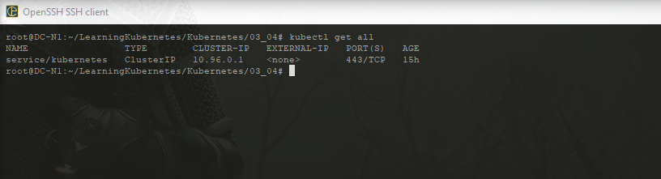
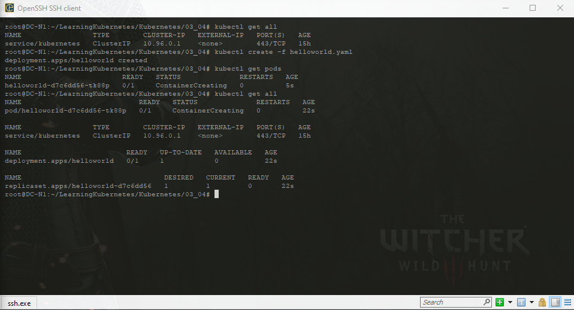
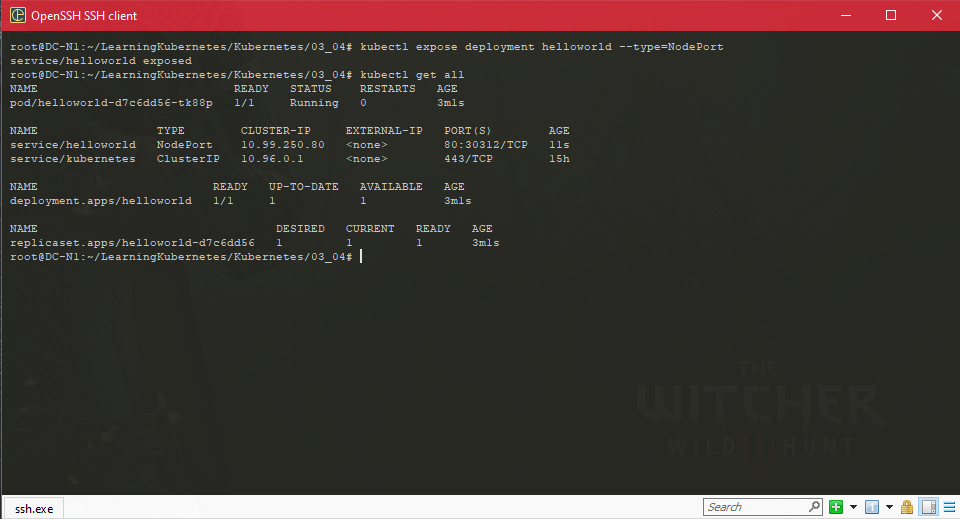
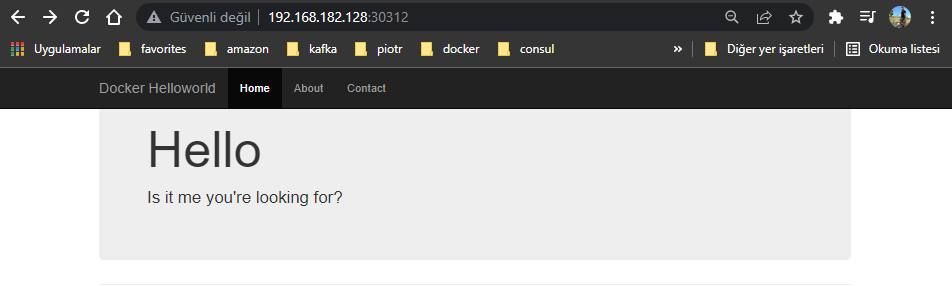
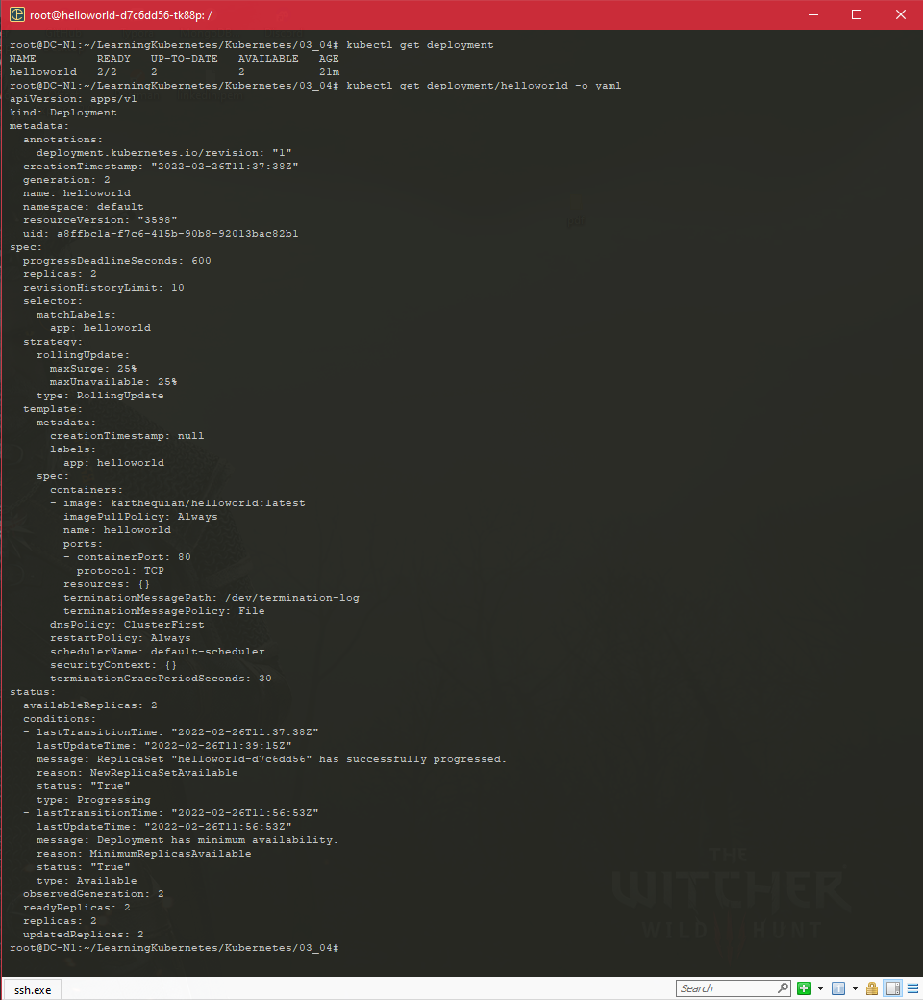
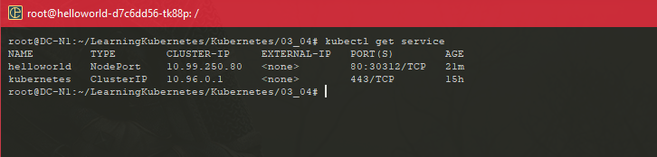
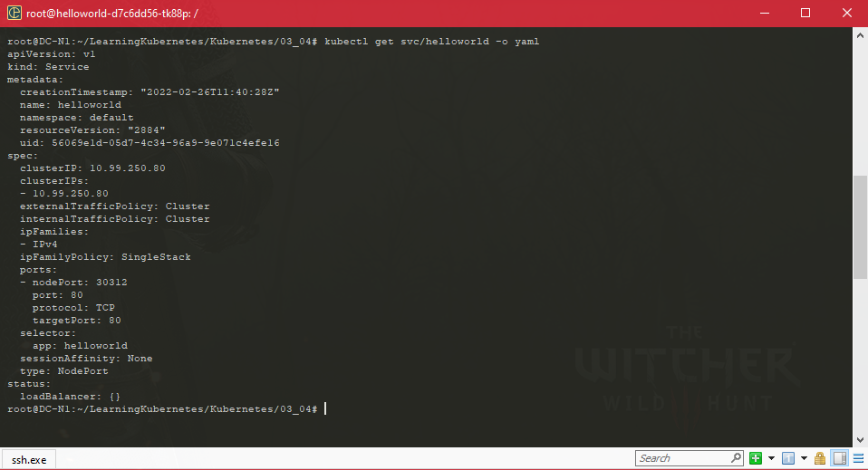
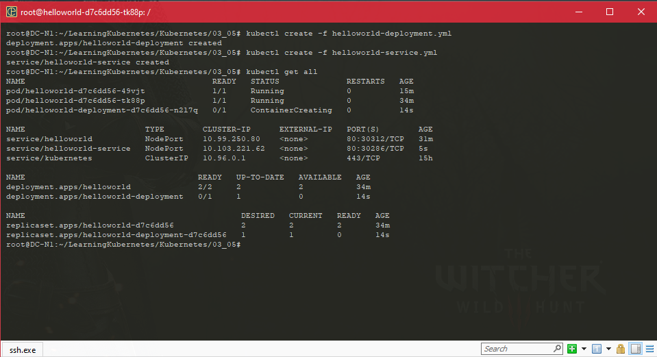
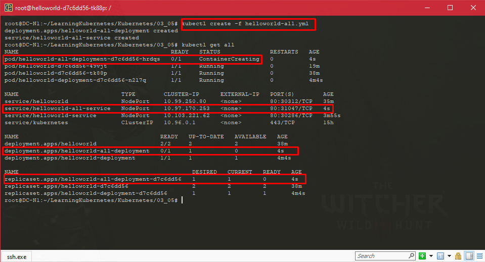
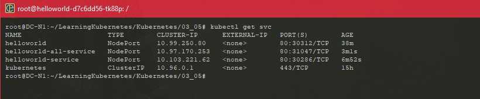

#### Kubernetes 101: Hello World

#### Getting up and running: Other options

- #### Ways to Run Kubernetes

- Minikube

- Docker Desktop

- Kubernetes in Docker (kind)

- Managed Kubernetes service in a cloud - for example, Amazon Elastic Kubernetes Service (EKS)

- #### Minikube

  - Course is based on Minikube
  - Original tooling to run Kubernetes locally
  - One of the largest subcommunities in cloud native ecosystem
  - Support the latest version of Kubernetes quickly
  - User experience targeted to brand-new users of Kubernetes
  - Abstract complexities while getting started
  - Powerful addons feature - some tooling bundled in

- #### Docker Desktop

  - Easily create a Kubernetes cluster with the Docker Desktop interface
  - Pleasant new user experience
  - Recommended if you are having trouble with Minikube or are already familiar with Docker Desktop
  - Disadvantages : 
    - Lags Kubernetes versions
    - Can take longer to see the latest version compare to Minikube

- #### Kind

  - Kind, also known as Kubernetes in Docker. Kind is a popular tool in the Kubernetes ecosystem to run local Kubernetes clusters using Docker containers as nodes. Initially, kind was created to test Kubernetes, Kubernetes features, and used to test Kubernetes in the continuous integration environment. Chances are if you're going to be doing a lot of testing or integration work with Kubernetes, you'll want to consider kind for your primary development environment. It works great, but probably not suited for new beginners who are trying to learn Kubernetes

- Managed Kubernetes Services

  - Run Kubernetes clusters without worrying about running the control plane
  - Available on all major cloud providers
  - If you don't already have an account with a provider stay with Minikube
  - Can spend more time getting set up than running a Kubernetes Hello World application

- https://github.com/karthequian/LearningKubernetes

#### Running a first Hello World application

- Start minikube 

  ```sh
  minikube start
  kubectl config get-contexts
  ```

- helloworld.yaml

  ```yaml
  apiVersion: apps/v1
  kind: Deployment
  metadata:
    name: helloworld
  spec:
    selector:
      matchLabels:
        app: helloworld
    replicas: 1 # tells deployment to run 1 pods matching the template
    template: # create pods using pod definition in this template
      metadata:
        labels:
          app: helloworld
      spec:
        containers:
        - name: helloworld
          image: karthequian/helloworld:latest
          ports:
          - containerPort: 80
  ```

- So there shouldn't anything in there. To figure out what's in your cluster, you can run the command kubectl get all, returns all resources.

  ```shell
  kubectl get all
  ```

  

- I'm going to run the command kubectl create because I'm going to create a resource minus f, meaning file and then helloworld. And we get a deployment helloWorld was created. Once again, if I run kubectl get all, I should hopefully see more resources here. And I do, I see the service that was there before, but now we have a pod of helloworld with a grid passed after that . A deployment of helloworld and also a replica set associated with that. The other things to kind of look forward to over here are their ready states.

  

- Cause this has a little web page that we want to access. How do we go about that? So in order to do that, we need to create the service construct for Kubernetes. And I can expose this deployment as a service. So in order to do that, let's clear my screen. I can run the command kubectl expose. And then I'm going to expose the deployment. I need to pass the name, so we call this helloworld earlier and I'm going to expose this as a type of node port. And we'll notice here that it says, service/helloworld was exposed. So if I take a look at the cluster again, get all, we notice that we now have two services, the Kubernetes one like we had before, but now helloworld. It's of type NodePort, which is what we declared it as, been online for nine seconds and should be accessible on this specific port. 

  

- One of the nice things about minikube is I can run the minicube service helloWorld command. And by service helloworld, it should reference the helloworld service we just created. Once I run this, it actually takes me to the web browser on this specific IP and port.

  

  ```shell
  minikube service --url helloworld
  http://192.168.182.128:30312
  ```

  

- Connect to the container within pod.

  ```shell
  kubectl exec -it helloworld-d7c6dd56-tk88p -- bash
  ```

#### Breaking down the Hello World Application

- Let's go ahead and understand what the basics of the application are and how this interacts with the deployments and services.

  ```shell
  kubectl get all
  ```

- All the resources that Kubernetes has up and running, you can run the Kubernetes command kubectl get all. So this essentially returns all of the resources that we have in the cluster.

  ```shell
  kubectl get deployment
  ```

- I can run the kubectl get deployment command. Instead of getting all resources, I'm just limiting this to just the deployment.

-  If I want to introspect into the hello world deployment, I can do that by running kubectl get deployment/helloworld and I'm going to output this as YAML

  ```shell
  kubectl get deployment/helloworld -o yaml
  ```

  

* get service

  ```shell
  kubectl get svc
  ```

  

 * get service detail

   ```shell
   kubectl get svc/helloworld -o yaml
   ```

   

- helloworld.yaml

  ```yaml
  apiVersion: apps/v1
  kind: Deployment
  metadata:
    name: helloworld
  spec:
    selector:
      matchLabels:
        app: helloworld
    replicas: 1 # tells deployment to run 1 pods matching the template
    template: # create pods using pod definition in this template
      metadata:
        labels:
          app: helloworld
      spec:
        containers:
        - name: helloworld
          image: karthequian/helloworld:latest
          ports:
          - containerPort: 80
  ```

- helloworld-deployment.yaml

  ```yaml
  # Helloworld application- just the deployment
  apiVersion: apps/v1
  kind: Deployment
  metadata:
    name: helloworld-deployment
  spec:
    selector:
      matchLabels:
        app: helloworld
    replicas: 1 # tells deployment to run 1 pods matching the template
    template: # create pods using pod definition in this template
      metadata:
        labels:
          app: helloworld
      spec:
        containers:
        - name: helloworld
          image: karthequian/helloworld:latest
          ports:
          - containerPort: 80
  ```

- helloworld-service.yml

  ```yaml
  apiVersion: v1
  kind: Service
  metadata:
    name: helloworld-service
  spec:
    type: NodePort
    ports:
    - port: 80
      protocol: TCP
      targetPort: 80
    selector:
      app: helloworld
  ```

- We can run a kubectl create minus F hello world deployment.yml, this will create the deployment.

  ```shell
  kubectl create -f helloworld-deployment.yaml
  ```

- We can run a kubectl create minus F hello world service.yml, this will create the service.

  ```shell
  kubectl create -f helloworld-service.yaml
  ```

  

- Essentially the three dash notation allows you to add multiple files into a single file, so we can actually go ahead and execute just one file to deploy all of your artifacts. It makes life a little bit simpler than having to run a lot of deploys for many files. 

- helloworld-all.yml

  ```yaml
  apiVersion: apps/v1
  kind: Deployment
  metadata:
    name: helloworld-all-deployment
  spec:
    selector:
      matchLabels:
        app: helloworld
    replicas: 1 # tells deployment to run 1 pods matching the template
    template: # create pods using pod definition in this template
      metadata:
        labels:
          app: helloworld
      spec:
        containers:
        - name: helloworld
          image: karthequian/helloworld:latest
          ports:
          - containerPort: 80
  ---
  apiVersion: v1
  kind: Service
  metadata:
    name: helloworld-all-service
  spec:
    type: NodePort
    ports:
    - port: 80
      protocol: TCP
      targetPort: 80
    selector:
      app: helloworld
  ```

  ```shell
  kubectl create -f helloworld-all.yaml
  ```

  

*  All of these have different ports that you can access these on, because they're individual apps that are up and running, because they're individual deployments. But you get the gist that you can have one single file to deploy many things versus having multiple files to do one single thing.

* the nodes

  Nodes can be added or removed from the cluster, but are independent from the application resources.

* 

  

#### Question 

- How can you verify that Minikube and VirtualBox are talking to each other?
- ans : Run the command `kubectl get nodes`.
- Which resource or resources are created in Kubernetes after creating an application resource?
- ans  : the pod, deployment, and ReplicaSet.A pod is created, along with the deployment and an associated ReplicaSet with statuses for each.
- How can you combine the deployment and the service yaml into a single yaml file?
- ans : Run the command `vi helloworld-all.yml`.
- If you are in Windows and using Powershell, the command `docker version` will check that `_____`.
- ans : Docker is up and running
- How can you create multiple resources through a single deployment in Kubernetes?
- ans : Use the three-dash notation to combine multiple files into a single YAML file.Using the three-dash notation lets you combine multiple deployment configurations into a single file for ease of use.
- What happens with the command code `chmod +x ./kubectl`?
- ans : It makes the kubectl executable.