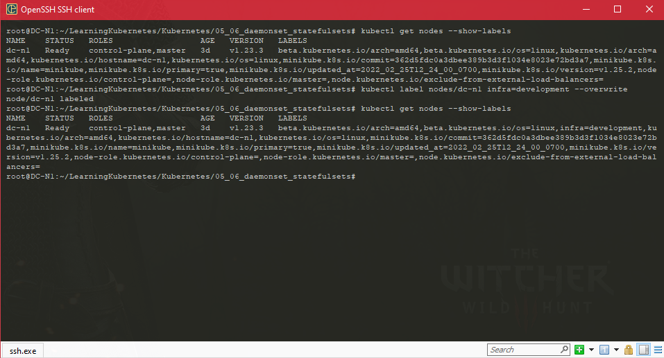

### Kubernetes 201

#### Running a more complicated example

- We're going to deploy the PHB Guestbook application with a MongoDB database into our cluster

- https://lnkd.in/gk2DR9M

- Three dashes and this three dash notation actually allows us to append multiple Kubernetes resources, like deployments and services, into one single file.

- So it looks like we have two deployments and two services that we want to deploy.

  

  ```shell
  minikube service --url frontend
  ```

  

  

  ```shell
  kubectl exec -it frontend-f7967ff8-lj9f -- /bin/bash
  ```

  ```shell
  apt install vim
  ```

  

  

#### The Kubernetes Dashboard

* The Kubernetes Dashboard is a simple, web-user interface for Kubernetes clusters. It allows users to manage and troubleshoot applications running into cluster, as well as manage the cluster itself.

* https://lnkd.in/gQU3X_v

* One of the most common asks in the container world is for the need for a UI to visualize what's going on with the cluster. It was one of the most requested features of Docker when it first started and is a common requirement for DevOps engineers to manage clusters

*  Kubernetes Dashboard allows you to monitor and view clusters from an operational perspective.

* One thing I like about Minikube are the add-ons, and the Kubernetes Dashboard actually comes bundled as an add-on inside of Minikube.

  ```shell
  minikube addons list
  ```

  

  * Enable dashboard

    ```shell
    minikube addons enable dasgboard 
    ```

  * Enable metric-server

    ```shell
    minikube addons enable metrics-server
    ```

  * To enable all the features, please run Minikube addons enable metrics-server. So this is just telling us that we want to enable the metrics-server add-on in order to get CPU and member information that's also shown under dashboard.

  #### Dealing with configuration data

  * *  Applications require a way for us to pass data to them that can be changed at deploy time.

    * Examples of this might be log levels or URLs of external systems that the application might need at start-up time. Instead of hard-coding these values, we use configmaps in Kubernetes to pass these values as environment variables to the container. 

      ```yaml
      apiVersion: apps/v1
      kind: Deployment
      metadata:
        name: logreader
        labels:
          app: logreader
      spec:
        replicas: 1
        selector:
          matchLabels:
            app: logreader
        template:
          metadata:
            labels:
              app: logreader
          spec:
            containers:
            - name: logreader
              image: karthequian/reader:latest
              env:
              - name: log_level
                value: "error"
      ```

    * For example, in this scenario, I have a deployment where I have a container called karthequian reader and, as an environment variable, I want to pass log level of error.

      ```shell
      kubectl get events | grep -i logreader-7b746fc87-66swx
      ```

    * We'll notice that this says that the log level passed via environment variable was error as per the application. What we'd like to do is we'd like to change this at deployment time. For this, we can use something called configmaps. In order to create a configmap, we can use the kubectl command, kubectl, create configmap. We're going to call the configmap logger and we're going to take this from literal and we're going to call the actual value log_level=debug. This means that we are going to pass something called log_level=debug to the actual container as an environment variable. We get configmap created and let's take a lot at the yaml for the deployment and how that's going to change when we use configmap.

      

      ```shell
      kubectl create configmap logger --from-literal=log_level=debug
      ```

      ```yaml
      apiVersion: apps/v1                                             
      kind: Deployment                                                
      metadata:                                                       
        name: logreader-dynamic                                       
        labels:                                                       
          app: logreader-dynamic                                      
      spec:                                                           
        replicas: 1                                                   
        selector:                                                     
          matchLabels:                                                
            app: logreader-dynamic                                    
        template:                                                     
          metadata:                                                   
            labels:                                                   
              app: logreader-dynamic                                  
          spec:                                                       
            containers:                                               
            - name: logreader                                         
              image: karthequian/reader:latest                        
              env:                                                    
              - name: log_level                                       
                valueFrom:                                            
                  configMapKeyRef:                                    
                    name: logger #Read from a configmap called logger 
                    key: log_level  #Read the key called log_level    
      ```

    * You'll notice that we have an environment variable named log level, but the values are values from configmapRef, and the name of the configmap, and the key for this is the log_level. So this structure basically takes configmap, which is called logger, and reads the key, called log level, out of the configmap.

    * . We can do this by doing a kubectl get configmaps. As we notice, we have the logger that we've created from before and we can actually introspect into this guy by doing a kubectl, get configmap/logger -o yaml, similar to the way we look at deployments. And this returns the entire configmap to us. And you'll notice that in the data section, as a log_level=debug, which is what we had initially set it to. 

      

  #### Dealing with application secrets

  * Just like configuration data, applications might also require other data that is more sensitive in nature. For example, like in this scenario, database passwords or api tokens. Passing these straight and yml for deployment or pod would make them visible to everyone.

  * Create a secret ky

    ```shell
    kubectl create secret generic apikey --from-literal=api_key=123456
    ```

    

  * We see a secret of name api key, type opaque, some data in it. If you want to take a look at the actual secret, you can do a kubectl get secret and we called this api_key. 

    ```shell
    kubectl get secret apikey -o yaml
    ```

    

  * We have a different value from what we initially typed. That is because this value is encoded in the base 64 format. 

    ```yaml
    apiVersion: apps/v1
    kind: Deployment
    metadata:
      name: secretreader
      labels:
        name: secretreader
    spec:
      replicas: 1
      selector:
        matchLabels:
          name: secretreader
      template:
        metadata:
          labels:
            name: secretreader
        spec:
          containers:
          - name: secretreader
            image: karthequian/secretreader:latest
            env:
            - name: api_key
              valueFrom:
                secretKeyRef:
                  name: apikey
                  key: api_key
    ```

  * This is very similar to using a config map, but instead of configmapref, we use secretref, we called our secret apikey, so we pass that as the name and the actual key in that was called api_key

    ```shell
    kubectl logs secretreader-69d566f7f4-knrw2
    ```

  * The pod in this instance is just printing out the value passed to it via an environment variable, but the value is hidden behind the secret and is protected from the casual observer.

    

  * Delete all pods,deployment,service etc.

    ```shell
    kubectl delete deployment --all
    ```

  #### Running Jobs in Kubernetes

  * Jobs are a construct that run a pod once and then stop. However, unlike pods and deployments, the output of the job is kept around until you decide to remove it.

    ```yaml
    apiVersion: batch/v1
    kind: Job
    metadata:
      name: finalcountdown
    spec:
      template:
        metadata:
          name: finalcountdown
        spec:
          containers:
          - name: counter
            image: busybox
            command:
             - bin/sh
             - -c
             - "for i in 9 8 7 6 5 4 3 2 1 ; do echo $i ; done"
          restartPolicy: Never #could also be Always or OnFailure
    ```

    ```shell
    kubectl get jobs
    ```

  * We'll notice that we have the finalcountdown pod with some metadata over there. It's not in a ready state, but the Status of that was completed. We can actually even take a look at the logs for this.

    

  * So crons are like jobs, however, they can run periodically. 

    ```yaml
    apiVersion: batch/v1beta1
    kind: CronJob
    metadata:
      name: hellocron
    spec:
      schedule: "*/1 * * * *" #Runs every minute (cron syntax) or @hourly.
      jobTemplate:
        spec:
          template:
            spec:
              containers:
              - name: hellocron
                image: busybox
                args:
                - /bin/sh
                - -c
                - date; echo Hello from your Kubernetes cluster
              restartPolicy: OnFailure #could also be Always or Never
      suspend: false #Set to true if you want to suspend in the future
    ```

  * And the same Suspend status, false. One thing that comes up a lot with cronjobs specifically is how do you pause it or stop this. 

    

  * Kubectl edit cronjobs/hellocron. This is the actual cronjob, and later down here, you'll notice that the Suspend status is false, so I'm going to actually change this to true, exit out, and if I look at the cronjob again, we'll notice that the Suspend status is true. And then I'm going to give this a little bit of time and then I'm going to check again to see when the last scheduled was. Typically we have to send a one-minute schedule, so if we wait a little bit over a minute we'll start to notice that the last scheduled would've happened one minute and 23 seconds ago, et cetera, so something over 60 is what we're looking for. 

    

  #### Running stateful set applications

  * A daemon set ensures that all nodes run a copy of a specific pod. As nodes are added to the cluster, pods are added to them as well. Example of a daemon set would be running your logging or monitoring agent on all of your nodes.

  * In this example, I'm going to use a simple busy box container and deploy it as a daemon set. This is my yaml for the daemon set

    ```yaml
    apiVersion: apps/v1
    kind: DaemonSet
    metadata:
      name: example-daemonset
      namespace: default
      labels:
        k8s-app: example-daemonset
    spec:
      selector:
        matchLabels:
          name: example-daemonset
      template:
        metadata:
          labels:
            name: example-daemonset
        spec:
          #nodeSelector: minikube # Specify if you want to run on specific nodes
          containers:
          - name: example-daemonset
            image: busybox
            args:
            - /bin/sh
            - -c
            - date; sleep 1000
            resources:
              limits:
                memory: 200Mi
              requests:
                cpu: 100m
                memory: 200Mi
          terminationGracePeriodSeconds: 30
    ```

    

  * The daemon set is working as expected. This is not something new that we haven't seen before. how we can get daemon sets to work on specific pods

    ```yaml
    apiVersion: apps/v1
    kind: DaemonSet
    metadata:
      name: example-daemonset2
      namespace: default
      labels:
        k8s-app: example-daemonset2
    spec:
      selector:
        matchLabels:
          name: example-daemonset2
      template:
        metadata:
          labels:
            name: example-daemonset2
        spec:
          containers:
          - name: example-daemonset2
            image: busybox
            args:
            - /bin/sh
            - -c
            - date; sleep 1000
            resources:
              limits:
                memory: 200Mi
              requests:
                cpu: 100m
                memory: 200Mi
          terminationGracePeriodSeconds: 30
          nodeSelector:
            infra: "development"
    ```

  * You can do this by running : kubectl label nodes/minikube infra=development --overwrite

    ```shell
    kubectl label nodes/<node-name> infra=development --overwrite
    ```

    

  * We have a node selector with label name infra and value development. We also had a ndoe for minikube with the label name infra and value of development.

    ```yaml
    apiVersion: apps/v1
    kind: DaemonSet
    metadata:
      name: prod-daemonset
      namespace: default
      labels:
        k8s-app: prod-daemonset
    spec:
      selector:
        matchLabels:
          name: prod-daemonset
      template:
        metadata:
          labels:
            name: prod-daemonset
        spec:
          containers:
          - name: prod-daemonset
            image: busybox
            args:
            - /bin/sh
            - -c
            - date; sleep 1000
            resources:
              limits:
                memory: 200Mi
              requests:
                cpu: 100m
                memory: 200Mi
          terminationGracePeriodSeconds: 30
          nodeSelector:
            infra: "production"
    ```

    ```shell
    kubectl get daemonsets
    ```

  * We have the prod daemon set where we have desired, current, ready, up to date and available with all zeros. Because we do not have any infrastructure nodes of type production. All the nodes that we have right now are all development

    ```yaml
    apiVersion: v1
    kind: Service
    metadata:
      name: zk-hs
      labels:
        app: zk
    spec:
      ports:
      - port: 2888
        name: server
      - port: 3888
        name: leader-election
      clusterIP: None
      selector:
        app: zk
    ---
    apiVersion: v1
    kind: Service
    metadata:
      name: zk-cs
      labels:
        app: zk
    spec:
      ports:
      - port: 2181
        name: client
      selector:
        app: zk
    ---
    apiVersion: policy/v1beta1
    kind: PodDisruptionBudget
    metadata:
      name: zk-pdb
    spec:
      selector:
        matchLabels:
          app: zk
      maxUnavailable: 1
    ---
    apiVersion: apps/v1
    kind: StatefulSet
    metadata:
      name: zk
    spec:
      selector:
        matchLabels:
          app: zk
      serviceName: zk-hs
      replicas: 3
      updateStrategy:
        type: RollingUpdate
      podManagementPolicy: OrderedReady
      template:
        metadata:
          labels:
            app: zk
        spec:
          affinity:
            podAntiAffinity:
              requiredDuringSchedulingIgnoredDuringExecution:
                - labelSelector:
                    matchExpressions:
                      - key: "app"
                        operator: In
                        values:
                        - zk
                  topologyKey: "kubernetes.io/hostname"
          containers:
          - name: kubernetes-zookeeper
            imagePullPolicy: Always
            image: "k8s.gcr.io/kubernetes-zookeeper:1.0-3.4.10"
            resources:
              requests:
                memory: "1Gi"
                cpu: "0.5"
            ports:
            - containerPort: 2181
              name: client
            - containerPort: 2888
              name: server
            - containerPort: 3888
              name: leader-election
            command:
            - sh
            - -c
            - "start-zookeeper \
              --servers=3 \
              --data_dir=/var/lib/zookeeper/data \
              --data_log_dir=/var/lib/zookeeper/data/log \
              --conf_dir=/opt/zookeeper/conf \
              --client_port=2181 \
              --election_port=3888 \
              --server_port=2888 \
              --tick_time=2000 \
              --init_limit=10 \
              --sync_limit=5 \
              --heap=512M \
              --max_client_cnxns=60 \
              --snap_retain_count=3 \
              --purge_interval=12 \
              --max_session_timeout=40000 \
              --min_session_timeout=4000 \
              --log_level=INFO"
            readinessProbe:
              exec:
                command:
                - sh
                - -c
                - "zookeeper-ready 2181"
              initialDelaySeconds: 10
              timeoutSeconds: 5
            livenessProbe:
              exec:
                command:
                - sh
                - -c
                - "zookeeper-ready 2181"
              initialDelaySeconds: 10
              timeoutSeconds: 5
            volumeMounts:
            - name: datadir
              mountPath: /var/lib/zookeeper
          securityContext:
            runAsUser: 1000
            fsGroup: 1000
      volumeClaimTemplates:
      - metadata:
          name: datadir
        spec:
          accessModes: [ "ReadWriteOnce" ]
          resources:
            requests:
              storage: 10Gi
    ```

  * **Stateful sets** manage the deployment and scaling for a set of pods, and provide guarantees about the ordering and the uniqueness of these pods. But unlike a deployment, a stateful set manages the sticky identity for each of these pods. 

  * If you're not already familiar, zookeeper is just a simple key value store that's commonly used. It's Apache zookeper if you want to take a look. 

    ```shell
    kubectl get statefulsets
    ```

  * Typically you would end up having multiples of these running on different nodes. But we're just showing a simple example of single stateful set running on mini kube.