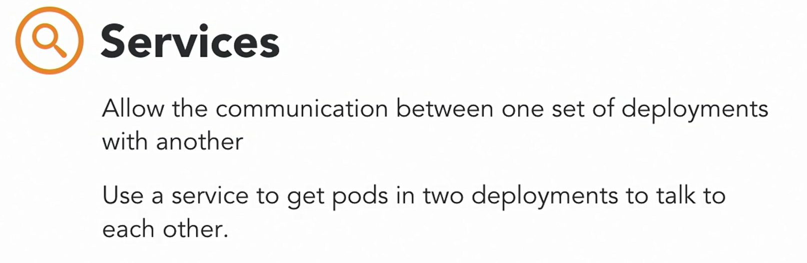

### Kubernetes: The Terminology

#### Architecture of a Kubernetes Cluster

* #### The Kubernetes Architecture

* Master Node is responsible for the overall management of the Kubernetes Cluster. Its got three components that take care of communication, scheduling, and controllers.

* These are the API Server, Scheduler, and Cluster Manager. 

* The Kube API Server, as the name states, allows you to interact with the Kubernetes API. It's the front end of the Kubernetes control plane. , 

* We have the Scheduler. The Scheduler watches created Pods, who do not have a Node design yet, and designs the Pod to run on a specific Node. 

* The Controller Manager runs controllers. These are background threads that run tasks in a cluster. 

* The controller actually has a bunch of different roles, but that's all compiled into a single binary. 

* The roles include, the Node Controller, who's responsible for the worker states.

* The Replication Controller, which is responsible for maintaining the correct number of Pods for the replicated controllers

* The End-Point Controller, which joins services and Pods together.

* Service account and token controllers that handle access management

  

* **Etcd** is a simple distributed key value stored. Kubernetes uses etcd as its database and stores all cluster data here. Some of the information that might be stored, is job scheduling info, Pod details, stage information, etc.

* The Master Node. You interact with the Master Node using the Kubectl application, which is the command line interface for Kubernetes. Kubectl is also also called Kubectl, in some instances.

* **Kubectl** has a config file called a Kubeconfig. This file has server information, as well as authentication information to access the API Server. 

* **Worker Nodes** are the Nodes where your applications operate. 

* The Worker Nodes communicate back with the Master Node. Communication to a Worker Node is handled by the Kubelet Process. It's an agent that communicates with the API Server to see if Pods have been designed to the Nodes. It executes Pod containers via the container engine. It mounts and runs Pod volume and secrets. 

* And finally, is aware of Pod of Node states and responds back to the Master. It's safe to say that if the Kubelet isn't working correctly on the Worker Node, you're going to have issues.

* Kubernetes is an container orchestrator, so the expectation is that you have a container native platform running on your Worker Nodes. This is where Docker comes in and works together with Kubelet to run containers on the Node. You could use alternate container platforms, as well, like (mumbles), but not a lot of folks do this anymore. 

* Kube-proxy  is the network proxy and load balancer for the service, on a single Worker Node. It handles the network routing for TCP and UDP Packets, and performs connection forwarding.

* Having the Docker Demon allows you to run containers. 

* Containers of an application are tightly coupled together in a Pod. 

* By definition, a Pod is the smallest unit that can be scheduled as a deployment in Kubernetes. This group of containers share storage, Linux name space, IP addresses, amongst other things. They're also call located and share resources that are always scheduled together.

* Once Pods have been deployed, and are running, the Kubelet process communicates with the Pods to check on state and health, and the Kube-proxy routes any packets to the Pods from other resources that might be wanting to communicate with them. 

* Worker Nodes can be exposed to the internet via load balancer. And, traffic coming into the Nodes is also handled by the Kube-proxy, which is how an End-user ends up talking to a Kubernetes application.

#### Basic Building Blocks : Nodes and Pods

* Another way to look at the same architecture, but from a cluster perspective. From this perspective, the Master is responsible for managing the cluster. It coordinates all the activities in the cluster and communicates with the Nodes to keep Kubernetes and your applications running.

  

* The Node

  

* The Node has the following requirements.

  

* **One thing to note is that if you're using Kubernetes in a production like setting, it's recommended that you have at least a three Node cluster**

* #### Minikube

  

* Your applications run on Nodes

* #### Pods

* The most basic construct needed to build a Kubernetes app. This is called a Pod. In the Kubernetes model, a Pod is the simplest unit that you can interact with. You can create, deploy, and delete Pods, and it represents one running process in your cluster.

  

  

  

* In some scenarios, you can have multiple docker containers running in a Pod, but a Pod represents one single unit of deployment, a single instance of an application in Kubernetes that's tightly coupled and shares resources.

* Pods are designed to be ephemeral, disposable entities. I never create Pods just by themselves in a production application. I only do that when I need to test whether the underlying containers actually work. Pods also don't self-heal. If a Pod dies, for some reason, it will not be rescheduled. Also, if a Pod is exited from a Node because of lack of resources, it will not be restarted on different healthier Nodes. There are higher level constructs to manage and add stability to Pods, called controllers.

  

* So pro-tip, don't use a Pod directly. Use a controller instead, like a deployment.

  

* A Pod has the following states. 
* **Pending**, which means that the Pod has been accepted by the Kubernete system, but a container has not been created yet. 
* **Running**, where a Pod has been scheduled on a Node, and all of its containers are created, and at least one container is in a running state. 
* **Succeeded**, which means that all the containers in the Pod have exited with an exit stat of zero, which indicates successful execution, and will not be restarted. 
* **A failed** state, which means all the containers in the Pod have exited and at least one container has failed and returned a non-zero exit status. 
* **CrashLoopBackOff** this is where a container fails to start, for some reason, and then Kubernetes tries over and over and over again to restart the Pod.

#### Deployments, Jobs and Services

* #### Benefits of Controllers

* These are application reliability, where multiple instances of an application running prevent problems if one or more instance fails. Scaling. When your pods experience a high volume of requests, Kubernetes allows you to scale up your pods, allowing for a better user experience. And finally, load balancing, where having multiple versions of a pod running allow traffic to flow to different pods and doesn't overload one single pod or a node. I'll cover the following kinds of controllers.

  

* #### Kind of Controllers

  * **ReplicaSets** : Ensures that a specified number of replicas for a pod are running at all times.. If the number of pods is less than what the ReplicaSet expects, for example, when a pod might have crashed, the ReplicaSet controller will start up a new pod, however, you can't actually declare a ReplicaSet by itself. You'll need to use it within a deployment

  * **Deployments** : A Deployment controller provides declarative updates for pods and ReplicaSets.you can describe the desired state of a deployment in a YAML file and the Deployment Controller will align the actual state to match. Deployments can be defined to create new ReplicaSets or replace existing ones with new ones. Most applications are packages deployments, so chances are, you'll end up creating Deployments more than anything else. 

    

  * Essentially, a deployment manages a ReplicaSet which, in turn, manages a pod. The benefit of this architecture is that deployments can automatically support a role-back mechanism. A new ReplicaSet is created each time a new Deployment config is deployed, but it also keeps the old ReplicaSet. This allows you to easily roll back to the old state if something isn't quite working correctly.

  * #### Deployment Controller Use Cases

  * Deployment Controllers and objects are higher-level constructs that were introduced to solve specific issues

  * Pod Management :  Running a ReplicaSet allows us to deploy a number of pods and check their status as a single unit.

  * Scaling a ReplicaSet scales out the pods and allows for the deployment to handle more traffic.

  * Pod updates and role-backs, where the Deployment Controller allows updates to the PodTemplateSpec. This creates a new ReplicaSet and deploys a newer version of the pod. Also, if you don't like what you see in the newer version of the pod, just roll-back to the old ReplicaSet. 

  * **Pause and resume.** Sometimes we have larger changesets or multiple updates that need to happen to a deployment. Used with larger changesets. Pause deployment, make changes, resume deployment. the new ReplicaSet will be started up and the deployment will update as expected.

  * A deployment is paused, it means that only updates are paused, but traffic will still get passed to the existing ReplicaSet as expected. 

  * #### Deployment Use Case

  * Status

  * Easy way to check the health of pods and identify issues. Getting the deployment status is an easy way to check for the health of your pods and identify issues during a roll-out.

    

  * **DaemonSets**

    

  * Deleting a DaemonSet will also clean up all the pods that it created. The typical use case for a DaemonSet is to run a single log aggregator or monitoring agent on a node.

  * **Jobs**

    

  * As the pod completes successfully, the job tracks information about the completion state of the pod. 

  * Typically, jobs are run as a cron job to run a specific process at a specific time and repeat at another time. You might use a cron job to run a nightly report or database backups, for example.

  * **Services**

    

  * A service provides network connectivity to one or more pods in your cluster. When you create a service, it's designed a unique IP address that never changes through the lifetime of the service. Pods are then configured to talk to the service and can rely on the service IP on any requests that might be sent to the pod.

  * #### Using Services

    

  * Services are a really important concept because they allow one set of pods to communicate with another set of pods in an easy way.

  * It's a best practice to use a service when you're trying to get two deployments to talk to each other. That way, the pod in the first deployment always has an IP that they can communicate with regardless of whether the pod IPs in the second deployment changes. For example, when your front-end deployment needs to call a back-end deployment, you want to address the back-end with a service IP. Using the Backend Pod IP is a bad choice here because it can change over time and would wreak havoc for your application. A service provides an unchanging address so that the Frontend Pods can effectively talk to them at all times.

    

  * Internal services, where an IP is only reachable from within the cluster, this is the cluster IP in Kubernetes speak.

  * There are external services where services running web servers, or publicly accessible pods, are exposed through an external endpoint. These endpoints are available on each node through a specific port. This is called a NodePort in Kubernetes speak.

  * The load balancer. this is for use cases when you want to expose your application to the public internet. It's only used when you are using Kubernetes in a cloud environment backed by a cloud provider such as AWS

#### Labels, Selectors and namespaces

* These constructs allow us to agitate and organize our applications so that when we have a lot of them, Kubernetes operators still understand what's going on holistically.

  

* Labels are for us, the users of Kubernetes, to identify attributes for objects. Typically, labels are used to organize clusters in some meaningful way. They can be added at deployment time, or later on and changed at any time. Label keys are unique per object.

  

* Labels are very specific to your use case, and they are built for users, so think about what your environment looks like, and how you want to organize your applications, and then get your label maker out.

  

* #### Selectors

  * Equality-based : include the equals and not equals, where the equals represents equality, where two labels or values of labels should be equal. Not equal represents inequality. This means that the values of the labels should not be equal.

    

  * Set-based :  include IN, NOTIN, and EXISTS operators.

    * The IN operator specifies that the value should be in a set of defined values. 
    * The NOTIN operators specified that the value should not be in a set of defined values. 
    * The EXISTS operator is used to determine whether a label exists or not.

  * Labels and label selectors are typically used with a kubectl command to list and filter objects

* #### Namespaces

* Unlike labels and selectors, the namespace concept is a feature of Kubernetes that allows you to have multiple virtual clusters backed by the same physical cluster. 

* Namespaces are a great concept to use for large enterprises where there are many users and teams and you want to give access to different teams but at the same time have a rough idea of who owns what in the Kubernetes environment.

  

* For example, if you have a big e commerce company, you might have a namespace for your catalog team, card team and order status team to run their different applications. 

* It's also a great way to divide cluster resources between multiple users and this can be done using resource quotas. Namespaces provide scope for names. 

* Names of resources, like deployments and pods, must be unique within the namespace, but not necessarily across separate namespaces. So in our example, the catalog team and the card team can have an application name authentication in their own namespaces. 

* When you launch Kubernetes, there is a default namespace where all our objects get placed, but you are allowed to create new namespaces as and when you wish.

* When you install newer application Kubernetes, they'll typically install in a brand new namespace, so that they don't interfere with your existing cluster and cause confusion.

#### Kubelet and kube proxy

* **The kubelet** is the Kubernetes node agent that runs on each node. It has many roles.

  

* The kubelet only manages containers that were created by the API server, and not any other containers that might be running on the node. We can also manage the kubelet without an API server by using HTP endpoint or a file.

  

* The network proxy is called the kube-proxy. This is another process that runs on all the worker nodes. 

  

* #### Three Modes of kube-proxy

  * User space mode : The user space is the most common mode
  * Iptables mode
  * Ipvs mode (alpha feature)

* These modes are important when it comes to using services.

* #### Why These Modes Are Important

* Services are defined against the API server. The kube-proxy watches the API server for addition and removal of services. 

* For each new service, kube-proxy opens a randomly chosen port on the local node.

* Any connections made to that port are proxied to one of the corresponding back-end pods

#### Questions 

* In a Kubernetes model, what is the simplest unit that you can interact with that represents one running process in your cluster?

* ans : a pod - In Kubernetes, a pod is a single instance of an application with tightly coupled, shared resources.

* Where do applications operate within Kubernetes?

* ans : worker nodes

* Which process handles load balancing, network routing, and connection forwarding for applications? 

* ans : the kube-proxy process - Kube-proxy is the network proxy and load balancer for worker nodes.

* When a pod has been scheduled on a node, and all of its containers are created, which pod life cycle is represented?

* ans : running

* Why will you create deployments more than anything else?

* ans : Most applications are package deployments.

* In which scenario would using namespaces be a great concept?

* ans : in a large enterprise where there are many users and teams

* What is the purpose of the Podspec YAML file?

* ans : The kubelet ensures that the containers described in the Podspecs are running and healthy. The YAML file describes a pod, and kubelet uses the Podspecs to validate container health.

  ​        

