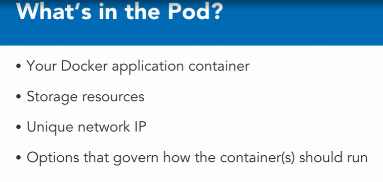

### Kubernetes: The Terminology

#### Architecture of a Kubernetes Cluster

* #### The Kubernetes Architecture

* Master Node is responsible for the overall management of the Kubernetes Cluster. Its got three components that take care of communication, scheduling, and controllers.

* These are the API Server, Scheduler, and Cluster Manager. 

* The Kube API Server, as the name states, allows you to interact with the Kubernetes API. It's the front end of the Kubernetes control plane. , 

* We have the Scheduler. The Scheduler watches created Pods, who do not have a Node design yet, and designs the Pod to run on a specific Node. 

* The Controller Manager runs controllers. These are background threads that run tasks in a cluster. 

* The controller actually has a bunch of different roles, but that's all compiled into a single binary. 

* The roles include, the Node Controller, who's responsible for the worker states.

* The Replication Controller, which is responsible for maintaining the correct number of Pods for the replicated controllers

* The End-Point Controller, which joins services and Pods together.

* Service account and token controllers that handle access management

  

* **Etcd** is a simple distributed key value stored. Kubernetes uses etcd as its database and stores all cluster data here. Some of the information that might be stored, is job scheduling info, Pod details, stage information, etc.

* The Master Node. You interact with the Master Node using the Kubectl application, which is the command line interface for Kubernetes. Kubectl is also also called Kubectl, in some instances.

* Kubectl has a config file called a Kubeconfig. This file has server information, as well as authentication information to access the API Server. 

* Worker Nodes are the Nodes where your applications operate. 

* The Worker Nodes communicate back with the Master Node. Communication to a Worker Node is handled by the Kubelet Process. It's an agent that communicates with the API Server to see if Pods have been designed to the Nodes. It executes Pod containers via the container engine. It mounts and runs Pod volume and secrets. 

* And finally, is aware of Pod of Node states and responds back to the Master. It's safe to say that if the Kubelet isn't working correctly on the Worker Node, you're going to have issues.

* Kubernetes is an container orchestrator, so the expectation is that you have a container native platform running on your Worker Nodes. This is where Docker comes in and works together with Kubelet to run containers on the Node. You could use alternate container platforms, as well, like (mumbles), but not a lot of folks do this anymore. 

* Kube-proxy  is the network proxy and load balancer for the service, on a single Worker Node. It handles the network routing for TCP and UDP Packets, and performs connection forwarding.

* Having the Docker Demon allows you to run containers. 

* Containers of an application are tightly coupled together in a Pod. 

* By definition, a Pod is the smallest unit that can be scheduled as a deployment in Kubernetes. This group of containers share storage, Linux name space, IP addresses, amongst other things. They're also call located and share resources that are always scheduled together.

* Once Pods have been deployed, and are running, the Kubelet process communicates with the Pods to check on state and health, and the Kube-proxy routes any packets to the Pods from other resources that might be wanting to communicate with them. 

* Worker Nodes can be exposed to the internet via load balancer. And, traffic coming into the Nodes is also handled by the Kube-proxy, which is how an End-user ends up talking to a Kubernetes application.

#### Basic Building Blocks : Nodes and Pods

* Another way to look at the same architecture, but from a cluster perspective. From this perspective, the Master is responsible for managing the cluster. It coordinates all the activities in the cluster and communicates with the Nodes to keep Kubernetes and your applications running.

  

* The Node

  

* The Node has the following requirements.

  

* **One thing to note is that if you're using Kubernetes in a production like setting, it's recommended that you have at least a three Node cluster**

* #### Minikube

  

* Your applications run on Nodes

* #### Pods

* The most basic construct needed to build a Kubernetes app. This is called a Pod. In the Kubernetes model, a Pod is the simplest unit that you can interact with. You can create, deploy, and delete Pods, and it represents one running process in your cluster.

  

  

  

* In some scenarios, you can have multiple docker containers running in a Pod, but a Pod represents one single unit of deployment, a single instance of an application in Kubernetes that's tightly coupled and shares resources.

* Pods are designed to be ephemeral, disposable entities. I never create Pods just by themselves in a production application. I only do that when I need to test whether the underlying containers actually work. Pods also don't self-heal. If a Pod dies, for some reason, it will not be rescheduled. Also, if a Pod is exited from a Node because of lack of resources, it will not be restarted on different healthier Nodes. There are higher level constructs to manage and add stability to Pods, called controllers.

  

* So pro-tip, don't use a Pod directly. Use a controller instead, like a deployment.

  

* A Pod has the following states. 

* **Pending**, which means that the Pod has been accepted by the Kubernete system, but a container has not been created yet. 

* **Running**, where a Pod has been scheduled on a Node, and all of its containers are created, and at least one container is in a running state. 

* **Succeeded**, which means that all the containers in the Pod have exited with an exit stat of zero, which indicates successful execution, and will not be restarted. 

* **A failed** state, which means all the containers in the Pod have exited and at least one container has failed and returned a non-zero exit status. 

* **CrashLoopBackOff** this is where a container fails to start, for some reason, and then Kubernetes tries over and over and over again to restart the Pod.

  

  

  

  

  

  

  

  

