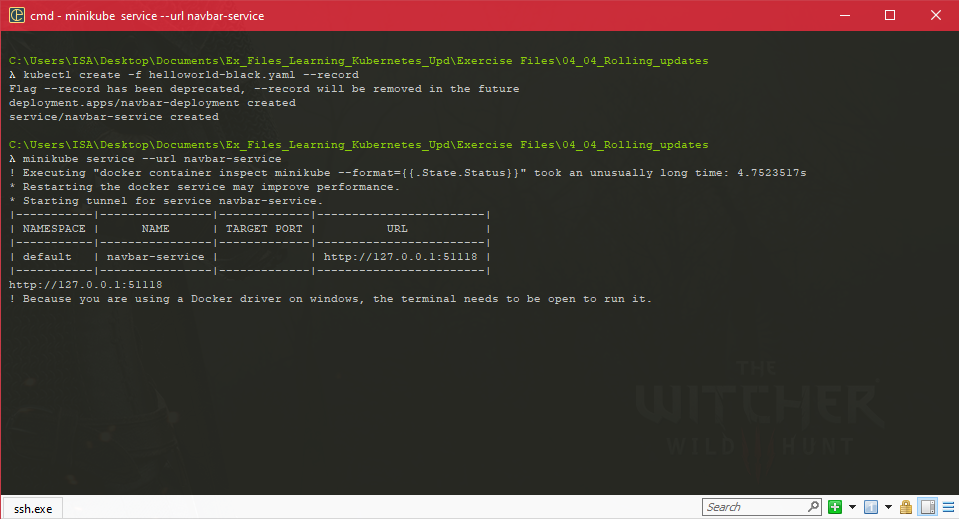

### Making It Production Ready

#### Add,change and delete labels

- sample-infrastructure-with-labels.yaml

  ```yaml
  apiVersion: v1
  kind: Pod
  metadata:
    name: helloworld
    labels:
      env: production
      author: karthequian
      application_type: ui
      release-version: "1.0"
  spec:
    containers:
    - name: helloworld
      image: karthequian/helloworld:latest
  ```

  

  ```shell
  kubectl get pods --show-labels
  ```

  

- This is how we would add labels at deployment time. You can also add labels to the running pod because in some scenarios you might want to tag a pod after it's been deployed.

  ```shell
  kubectl label pod/helloworld app=helloworldapp --overwrite
  ```

  

-  What happens in the scenarios where we want to delete a label?

  ```shell
  kubectl label pod/helloworld app-
  ```

  

#### Working with Labels

-  How we can search by labels.  how we can search for them.

-  In order to do label searches, we want to use selectors with labels to do this.

-  in the production environment. In order to do this 

  ```shell
  kubectl get pods --selector env=production
  kubectl get pods -l env=production
  ```

  

- And our list of pods has drastically reduced and all of the pods returned are pods that we have running in production

  ```shell
   kubectl get pods --selector env=production --show-labels
  ```

- We have a cart-prod, and we have an env in production. And if I search for this, you'll notice that all of my labels are associated with an application that's been tagged to run in a production-like setting

- Let's search for somebody who's a dev-lead, 'cause a lot of times, different developers are associated with applications. So, kubectl get pods minus-minus selector and dev-lead, I'm going to search for Carisa. So, in this scenario, we have four applications where we have a dev-lead and her name is Carisa. 

  

-  we want to add multiple labels and search by multiple labels? 

  ```shell
  kubectl get pods --selector dev-lead=karthik,env=staging
  ```

- **kubectl get pods --selector dev-lead=karthik,env=staging** allows you to add multiple labels and search by multiple labels to filter down the pods that we have running.

- What if we wanted to search for something that was not owned by Karthik? 

  ```shell
  kubectl get pods --selector dev-lead!=karthik,env=staging
  ```

  

-  The result of this is all of the applications that are not owned by Karthik in the staging environment.

-   We want to actually learn how to use the in operator

- rSo, we do a kubectl get pods, and instead of minus-minus selector, you can use the minus-l shortcut. And we're going to look for release-versions in, let's say, 1.0 to 2.0. This command will basically look for anything that has a release-version that's between 1.0 and 2.0. As we run that, we get a list of different applications, or pods, that are running that have a release-version between 1.0 and 2.0. Show-labels. 

  ```shell
  kubectl get pods -l "release-version in (1.0,2.0)"
  ```

  

- We can use the notin operator

  ```shell
  kubectl get pods -l "release-version not in (1.0,2.0)" --show-labels
  ```

- Sometimes we want to also be able to delete by labels. How do we go about doing that? 

- Let's pick our favorite dev-lead, Karthik, and delete all the pods associated with him.

  ```shell
  kubectl delete pods -l dev-lead=karthik
  ```

- In this scenario, we've deleted all of our pods where the dev-lead was Karthik.

- **You can also use labels with deployments, services, replica sets, et cetera. So everything I've just shown you can also be transposed to those constructs for services and deployments.**

  ```shell
  kubectl delete -f sample-infrastructure-with-labels.yml
  ```

#### Application Health Checks

* How we can add application health checks to our existing hello world application. 

* helloworld-with-probes.yaml

  ```yaml
  apiVersion: apps/v1
  kind: Deployment
  metadata:
    name: helloworld-deployment-with-probe
  spec:
    selector:
      matchLabels:
        app: helloworld
    replicas: 1 # tells deployment to run 1 pods matching the template
    template: # create pods using pod definition in this template
      metadata:
        labels:
          app: helloworld
      spec:
        containers:
        - name: helloworld
          image: karthequian/helloworld:latest
          ports:
          - containerPort: 80
          readinessProbe:
            # length of time to wait for a pod to initialize
            # after pod startup, before applying health checking
            initialDelaySeconds: 5
            # Amount of time to wait before timing out
            timeoutSeconds: 1
            # Probe for http
            httpGet:
              # Path to probe
              path: /
              # Port to probe
              port: 80
          livenessProbe:
            # length of time to wait for a pod to initialize
            # after pod startup, before applying health checking
            initialDelaySeconds: 5
            # Amount of time to wait before timing out
            timeoutSeconds: 1
            # Probe for http
            httpGet:
              # Path to probe
              path: /
              # Port to probe
              port: 80
  ```

* The **readinessProbe** is used to know when a container is ready to start accepting traffic. So we'll give it some amount of **initialDelaySeconds**. In this case, we'll do five. And then we have **timeoutSeconds**, which is the amount of time to wait before timing out. We'll use it as one.

* The **livenessProbe** here will use the **initialDelaySeconds** of five and then timeout of one, and then do something similar with **httpGet**.

  

* helloworld-with-bad-readiness-probe.yaml

  ```yaml
  apiVersion: apps/v1                                                  
  kind: Deployment                                                     
  metadata:                                                            
    name: helloworld-deployment-with-bad-readiness-probe               
  spec:                                                                
    selector:                                                          
      matchLabels:                                                     
        app: helloworld                                                
    replicas: 1 # tells deployment to run 1 pods matching the template 
    template: # create pods using pod definition in this template      
      metadata:                                                        
        labels:                                                        
          app: helloworld                                              
      spec:                                                            
        containers:                                                    
        - name: helloworld                                             
          image: karthequian/helloworld:latest                         
          ports:                                                       
          - containerPort: 80                                          
          readinessProbe:                                              
            # length of time to wait for a pod to initialize           
            # after pod startup, before applying health checking       
            initialDelaySeconds: 5                                     
            # Amount of time to wait before timing out                 
            timeoutSeconds: 1                                          
            # Probe for http                                           
            httpGet:                                                   
              # Path to probe                                          
              path: /                                                  
              # Port to probe                                          
              port: 90                                                 
  ```

  

* So if we end up going to describe this pod, actually clear the screen, it has some pod pre-information, but what we're really looking for is the events. And here underneath Events, we have a warning, and it says the reason unhealthy, and kubelet, minikube, and it says readiness probe failed, the Get of http on port 90, and then the error here is, you know, connection refused.

* The readinessProbe fails. So as a result, the pod is not actually ready to accept traffic. So that was readinessProbes.

* helloworld-with-bad-liveness-probe.yaml

  ```yaml
  apiVersion: apps/v1
  kind: Deployment
  metadata:
    name: helloworld-deployment-with-bad-liveness-probe
  spec:
    selector:
      matchLabels:
        app: helloworld
    replicas: 1 # tells deployment to run 1 pods matching the template
    template: # create pods using pod definition in this template
      metadata:
        labels:
          app: helloworld
      spec:
        containers:
        - name: helloworld
          image: karthequian/helloworld:latest
          ports:
          - containerPort: 80
          livenessProbe:
            # length of time to wait for a pod to initialize
            # after pod startup, before applying health checking
            initialDelaySeconds: 5
            # How often (in seconds) to perform the probe.
            periodSeconds: 5
            # Amount of time to wait before timing out
            timeoutSeconds: 1
            # Kubernetes will try failureThreshold times before giving up and restarting the Pod
            failureThreshold: 2
            # Probe for http
            httpGet:
              # Path to probe
              path: /
              # Port to probe
              port: 90
  ```

  

  ```shell
  kubectl get events | grep -i $pod
  kubectl get events | grep -i helloworld-deployment-with-bad-liveness-probe-65bc854c5b-lwhgg
  ```

  

  ​	

#### Handling application upgrades

* We're going to upgrade our deployment from one version to another, and later on we're also going to do a rollback.

*  helloworld-black.yaml

  ```yaml
  apiVersion: apps/v1
  kind: Deployment
  metadata:
    name: navbar-deployment
  spec:
    selector:
      matchLabels:
        app: helloworld
    replicas: 3 # tells deployment to run 3 pods matching the template
    template: # create pods using pod definition in this template
      metadata:
        labels:
          app: helloworld
      spec:
        containers:
        - name: helloworld
          image: karthequian/helloworld:black
          ports:
          - containerPort: 80
  ---
  apiVersion: v1
  kind: Service
  metadata:
    name: navbar-service
  spec:
    # if your cluster supports it, uncomment the following to automatically create
    # an external load-balanced IP for the frontend service.
    type: NodePort
    ports:
    - port: 80
      protocol: TCP
      targetPort: 80
    selector:
      app: helloworld
  ```

* So we're going to do a kubectl create -f helloworld-black, and I'm going to add this --record, which basically means that we're going to try and record our rollout history, and that's something

  ```shell
  kubectl create -f helloworld-black.yaml --record
  ```

  

*  We're going to take the navbar and change the color a bit in a different deployment. We've already deployed this application, and we have a black colored navbar behind the scenes. We want to update this to a blue navbar, and in order to do that I already have an image called helloworld blue, and I'm going to update that image by doing a kubectl set image deployment. We've called this the navbar-deployment. And I'm going to change this to helloworld. 

  ```shell
  kubectl set image deployment/navbar-deployment helloworld=karthequian/helloworld:blue
  ```

  
  
*  We notice that we have multiple replica sets here both associated with the navbar-deployment, however, they have two different GUIDs associated with them. We notice that this replica set has a desired, current, and ready status, or ready values of three. and if you look at our pods we'll also have three different pods running for this

  
  
* Basically, behind the scenes, what's happened in this scenario is our deployment, when we do a deployed with a new image, we got a new replica set that matches the second set of images that we had, and we had pods rerolled for that. If we take a look at our rollout history, kubectl rollout history, for the actual deployment, which was navbar, we'll notice that we have two revisions here. First, when we actually created it, and this is our kubectl command that we created with a record of true. The second revision, which is what we set the image to, we had navbar deployment, and then we set the image to helloworld blue. The reason we initially added the record equals true is to see the actual cause changes that we see in this list. And that's how we do an in place upgrade.

  ```shell
  kubectl rollout history deployment/navbar-deployment
  ```

  

* What if we wanted to rollback to the first version? That we can do with this specific command. Just like we did a rollout, we can do a rollout undo. Kubectl rollout undo, the deployment name, navbar-deployment, and this will revert our changes back from two to one

  ```shell
  kubectl rollout undo deployment/navbar-deployment
  ```

  

* A lot of times in this scenario you might want to actually go back to a specific version, and to that you can rollout undo and then you can add a --to-revision and add whatever version number you want over here that you saw on the list.

  ```shell
  kubectl rollout undo deployment/navbar-deployment --to-revision=
  ```

#### Basic troubleshooting techniques

* Sometimes things don't work as you expect, and you have to take a closer look to debug issues or understand what's going on.

  

* This example scenario where we have a bad helloworld deployment which has zero available pods, and running a kubectl get pods command returns the bad pod with zero pods in ready status where the status of error pull image. What do you do in this scenario or how do you debug the situation?

* Deployment perspective

  ```shell
  kubectl describe deployment bad-helloworld-deployment
  ```

* Pod perspective

  ```shell
  kubectl descibe pods <pod_name>
  ```

  

* This returns all the information for this specific pod. There's name information and whatnot. The stuff we're really interested in from a debugging perspective is the events. So as you can see, it was scheduled five minutes ago, but it looks like we started to see a warning, but if you look at the type, the very first event that looks a little bit suspicious is this warning and the reason is failure for kubelet, minikube, failed to pull image karthequian/unknown-pod:latest, and we get a specific error associated with that. This gives us some indication that there's actually something going on with the pod with respect to the image, so it forces you to check whether this image is correct or whether you don't have access to the repository that it's sitting in. That's one debugging technique.

  ```shell
  kubectl logs -f <pod_name>
  ```

* The other technique that I use a lot is I end up looking at log files for specific pods. So if I do a kubectl get deployments, I have two deployments running. Specifically, I'm going to introspect the helloworld deployment and look at the pods associated with that. So let me do a get pods for all. So helloworld-deployment. This is the pod associated with the helloworld-deployment

* The third thing I typically do is sometimes you have to actually exec into the pod to see what's going on. To exec into a pod, we use the kubectl exec command minus it. Once again we need the pod name.

  

* We can see all the processes in the pod, so we know this is an nginx master process, nginx worker process, et cetera, and a lot of times you end up having to exec into the pod to make sure that your configuration files are correct, or all the information that you're expecting, environment variables, et cetera, are actually in the pod that you're looking for.

  ```shell
  kubectl exec -it -c <pod_name> /bin/bash
  ```

*  Typically, you don't use the minus c if you just have a single pod with a single container running in it, but it's useful when you have multiple containers that comprise of the pod.

#### Question

* Why does Kubernetes use a liveness probe?
* ans : so you can run a periodic check on a container to make sure the container is still healthy
* Which two specs can be defined for establishing application health checks?
* ans : readinessProbe and livenessProbe The readinessProbe detects when a container can accept traffic, and the livenessProbe checks whether the container is alive and running.
* How are labels added to a running pod?
* ans : by overwriting
* What does running the command `kubectl get pods --selector dev-lead=karthik,env=staging` allow you to do?
* ans : add and search by multiple labels
* You have many pods with various labels for each. Which command should be used to find the pods associated with your production environment?
* ans : get pods --selector env=production   --  Selectors with labels allow you to find specific pods.