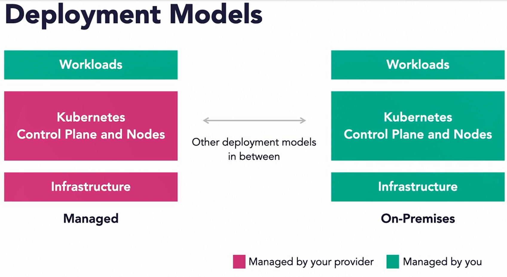
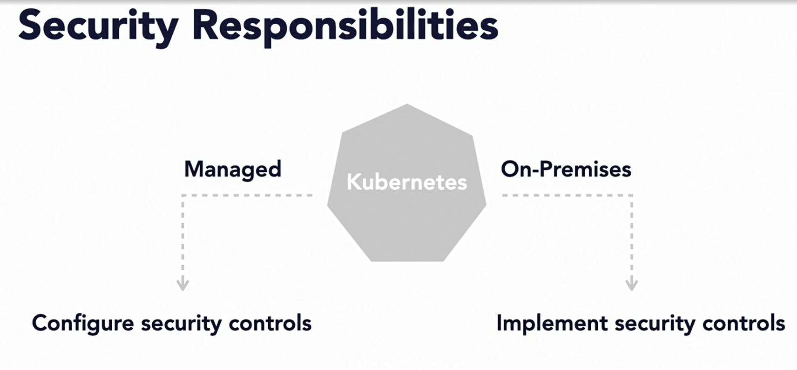
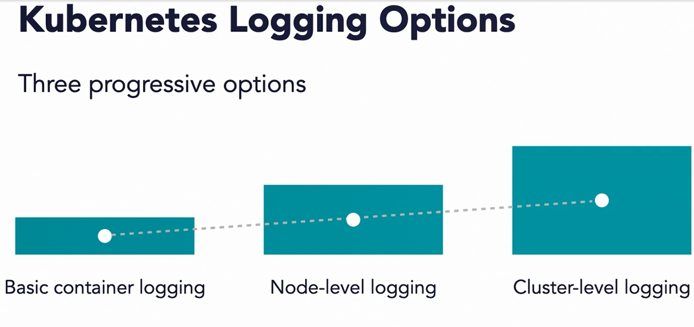
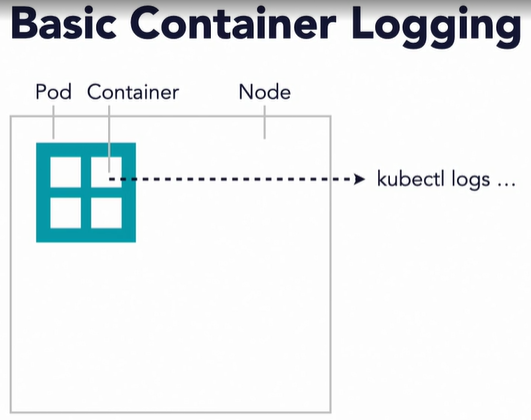
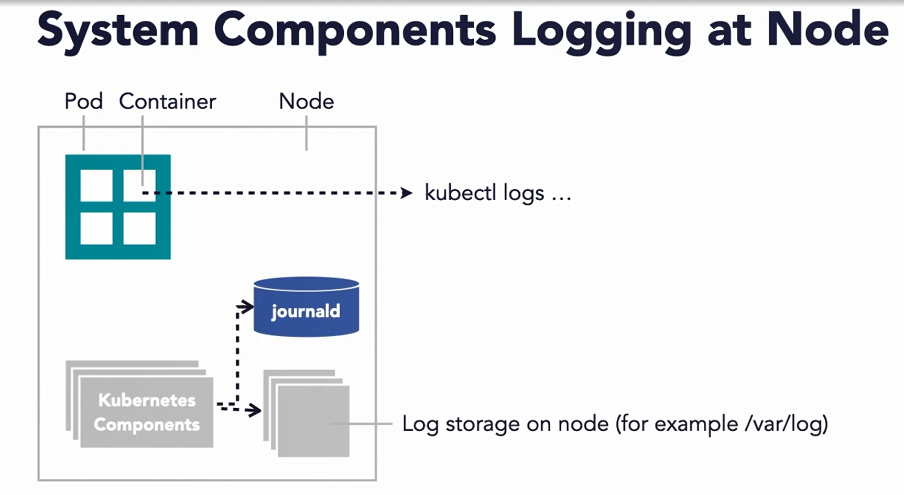
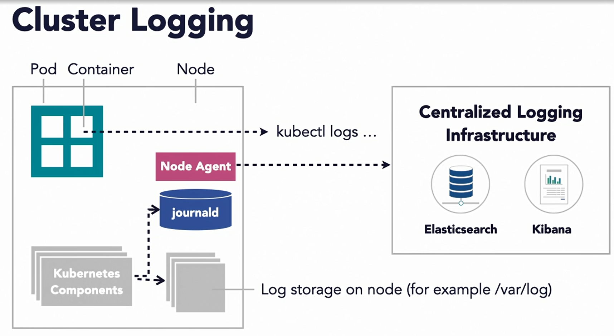
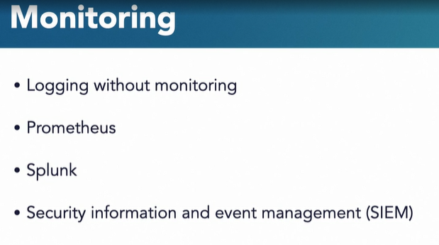

### Additional Security Consideration

#### Infrastructure Security

* The underlying infrastructure, whether it is your on premise data center or the public cloud is the backbone of your Kubernetes cluster. 

* Underlying infrasturcture = Backbone of Kubernetes

* Provides compute,memory,storage and networking.( The infrastructure provides the foundational compute, memory, storage and networking capabilities to run Kubernetes. The security of this infrastructure is critical)

* Implied trust between control plane and infrastructure.

* Even if you secure your applications and the cluster, the underlying infrastructure may still be vulnerable.. The vulnerabilities in the infrastructure can be a reason your application or cluster might be compromised. 

* But who is responsible for the security of the infrastructure?

* Deployment Model

* #### Deployment Models

* There are two ends of the spectrum. On one hand you have the fully managed Kubernetes solutions. These solutions make it easy to deploy and manage Kubernetes clusters. Some examples are, Azure Kubernetes Service, Amazon's Elastic Container Service and Google Kubernetes Engine. On the other hand, you have a deployment of Kubernetes in your own data center. In this model, you are responsible for managing and operating the Kubernetes clusters. You're also responsible for running the infrastructure as well. 

  

* In an on premise model, you are responsible for implementing the security controls such as network protection, firewalls, access management, all by yourself. In the managed service model, you still need to implement these security controls. But the difference is that you leverage the capabilities offered by the cloud provider. Some examples of these capabilities are access and resource management and cloud security policies and so on.

  

* Moreover, the cloud provider is already responsible for protecting the underlying hardware as per the shared security responsibility model. Regardless of the deployment model, there are some security considerations you must keep in sight. And then work with your infrastructure provider or team to ensure that security implementation addresses these. 

* #### Infrastructure Security Considerations

* Infrastructure isolation

* Minimal public access to control plane

* Make sure there is network isolation among multiple clusters. Access to the Kubernetes control plane should not be permitted directly via the public facing IP addresses. Any access must be limited.

* Minimal public access to nodes.

*  Direct public access to nodes should be prohibited. Access must be managed via the control plane using the appropriate services offered by Kubernetes.

* Minimal access to cloud or infrastructure API

* Monitor your infrastructure

* New technologies and approaches to modern cloud native security are emerging.

* Artificial Intelligence for Cybersecurity

  

#### Logging and monitoring

* When your applications are running and the cluster is humming, you need a way to know what's going on with your Kubernetes' components and applications. 

* Logs are your "eyes" into the cluster and applications

* These logs help debug problems with your cluster. They're also important in detecting security anomalies and any ongoing attacks.

* Decouple logging life cycle from containers, pods and nodes.

* No native log management in Kubernetes.

* #### Kubernetes Logging Options

* Three progressive options

* Basic container level logging for logs generated by applications. Logging at node level that also includes capturing logs generated by Kubernetes' core components. And logging at cluster level that is enabled with an external backend solution. 

  

* Applications write their logs to standard output instead of to any specific log file. 

* By using kubectl logs command, you can see the logs from a current or a previously running container. 

  

* In addition to container logs, Kubernetes' native components generate logs as well. These logs can be sent to either journal D or directly to a log file.

  

* Cluster level logging relies on implementing a logging backend. In a typical implementation, you will see a node agent running on every node.

* Node aggregator then pushes to a centralized logging backend.

  

* #### Monitoring

* Though logging is essential, it is of no use if you don't monitor and look for abnormalities and patterns in data. You can connect your logging infrastructure to Prometheus, which is an open source monitoring system. Your enterprise may already be using it. Another monitoring choice is via Splunk, which is also a popular enterprise grade event collection and monitoring solution. And lastly, you can push your logs and events to your centralized SIEM, that is the security information and event management system. 

  

  

  #### Questions

  * In a managed Kubernetes deployment model, You can leave the implementation of security control to the provider and just focus on applications.
  * ans : FALSE - While underlying cloud or infrastructure providers may provide security controls and tools, it is still your responsibility to implement those controls.

  * Which one is true about logging and monitoring?

  * ans : Logs from Kubernetes should be aggregated and analyzed for threats and anomalies.

    Logs from Kubernetes contain precious information about users, applications, and traffic behavior. They must be monitored and analyzed just like logs of the rest of the infrastructure.

    **Containers and Kubernetes**

  

  

  

  

  

  

  

  

  

  

  

  

  

  