### Demystifyinhg Containers and Kubernetes

#### What are Containers

* A container is a software that packages not only your application code, but also its dependencies such as libraries, configuration settings, and the file system. Containers are portable, meaning they can run on different kinds of operating systems and infrastructure, seamlessly.They isolate a running application from the environment outside the application, as well as from the other containers.

  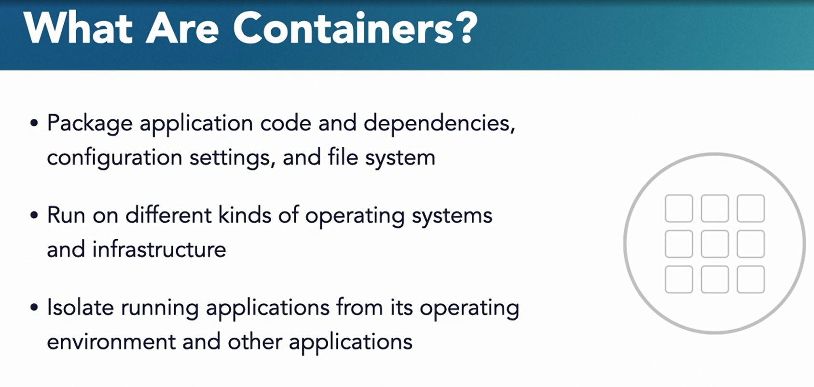

* It's important to realize the difference between a container and a container image. A container image is a special file, that becomes a container when it is run as a process of an operating system

* #### Benefits of Containers and OS Virtualization

* The economics, containers are more bang for your buck. Look, if you're running only one operating system, all running containers utilize the same OS and that makes containers lightweight compared to a virtual machine.

* So when a given hardware setup, you can squeeze a larger number of business applications, since all the dependencies required for an application are packaged along with your code

* You don't run into the issue of it works in my laptop, but not in production. Containers are portable across platforms. It is easier to build and share container images in comparison to virtual machine images, given that images are built in layers, they offer observability all the way from the OS to the application layer. 

* When implemented with the right set of security controls, containers limit the spillover should a containerized application be breached, but the security of containers depend upon correctly using the features and isolation capabilities of an operating system. 

  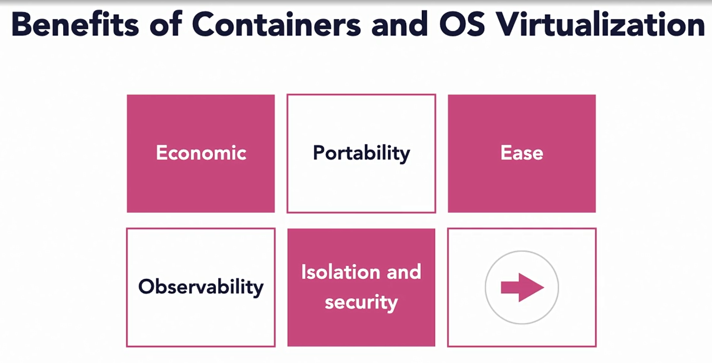

* Containers take advantage of an operating system paradigm, known as OS Virtualization. OS Virtualization is made possible, by the capabilities of the kernel of the OS. These capabilities make a running application pink as if it has got a full copy of the OS only to itself. But in reality, multiple applications are sharing the same operating system. This kind of virtualization plays a significant role in the security of containers and the applications running inside them. 

#### Virtualization

* There are three ways applications and their operating environment can be configured on a given hardware.

  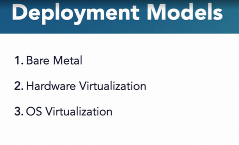

* #### Bare Metal

* Before virtualization technologies were in mainstream, an application was deployed on a dedicated, bare metal hardware. There were no restrictions on the resources an application could use.

  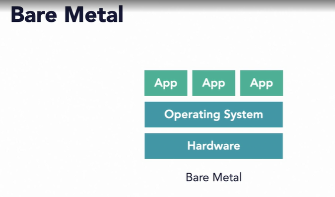

* Should an application hog the entire hardware resource, the only option left for the admin was to throw more hardware at it. Of course, the applications running on separate hardware were isolated from each other, which was great from a security perspective, but the applications running on the same hardware had limited security boundaries around them. 

* #### Hardware Virtualization

* Then came hardware virtualization, which enabled organizations to run multiple virtual machines on the same hardware instance. This form of virtualization not only allowed flexible scale up or scale down of the VMs, but also provided stronger isolation among applications running on the same hardware. Think of each VM as a standalone computer with its own instance of an operating system. 

  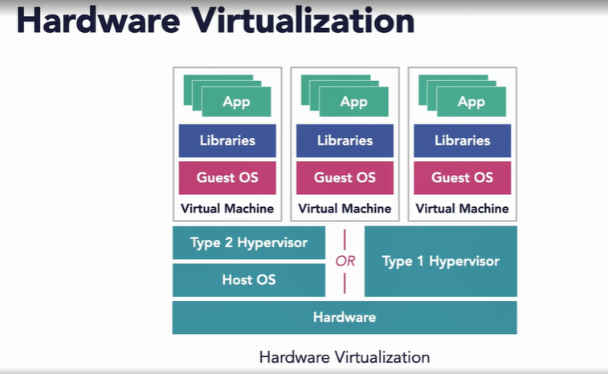

* The operating system running in the VM thinks it has the full compute and memory resources at its disposal. The OS doesn't know that the hardware is actually being shared with other VMs. And this magic is made possible by the hypervisor layer.

* VM based deployments do provide isolation and scalability. In fact, they work really well for a variety of use cases. But, modern loosely coupled microservices that are built, deployed and restarted many times during the day have different requirements

* #### OS Virtualization

* Enter OS virtualization that made containers possible. Containers are lightweight, easy to create and destroy and don't come with the overhead associated with the virtual machines.

* This makes them more suitable for the modern applications and use cases. On the surface containers appear similar to VMs, but remember behind the scenes, it is the operating system and not the hardware that is being virtualized.

* **Meaning in hardware virtualization, where each VM runs its own copy of an operating system, in OS virtualization only one instance of the operating system is running. Each container thinks it has the entire operating system at its disposal. The container does not know that the operating system is being shared with other containers.**

* **What is analogous to the hypervisor from the hardware virtualization in the OS virtualization world?** 

* It is the container runtime and the capabilities of the operating system that makes the OS virtualization possible.

#### Isolation and Security Capabilities of OS

* Namespaces. Control groups or in short, cgroups. Ability to add or drop OS system calls. Loadable security modules to bring additional security controls not offered by the OS by default. And lastly, the seccomp.

  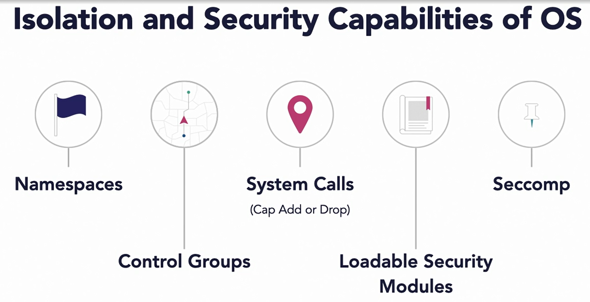

* These capabilities have existed way before modern containers came into existence. Container platforms, such as Docker utilize these features of the Linux operating system to make containers easy to use, run, and secure

* By default, each Linux process runs in a default namespace meaning, system resources such as process IDs, user IDs, network interfaces, and file systems are shared with other processes. As you can imagine, that will not work for containerized applications.

  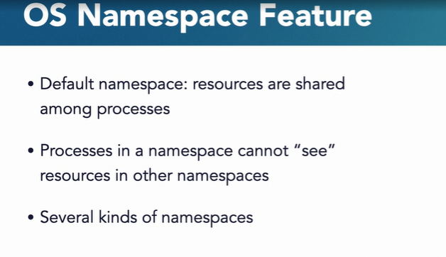

* Linux offers the ability to create namespaces. **When a process is run inside a namespace, it is not able to see the resources in other namespaces.** For example, it can't see the PID or process IDs from other namespaces. Likewise, a process running in a namespace will see its own version of the host name, which will be different from the host name seen by the processes in another namespace.Obviously, all of these processes are running on the same host machine. Different types of namespaces focus on different types of resources.

  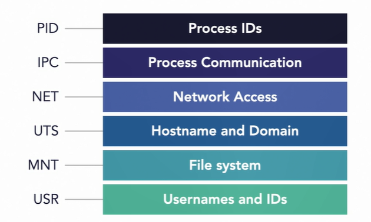

* For example, PID for process IDs, IPC for interprocess communication, NET for networking access and so on. Understand that the process needs to be assigned to more one namespace from this list to ensure the isolation for that resource type. So who will do this on your behalf? 

* When you issue a command to create a Docker container, the container platform takes care of creating namespaces behind the scene for you. 

  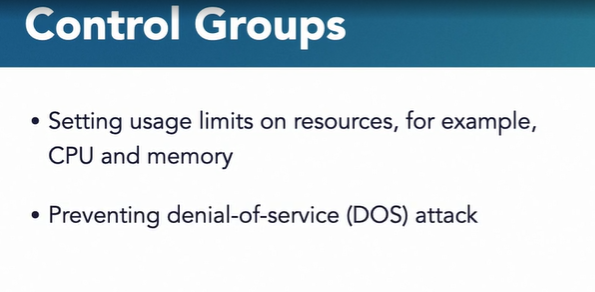

* While namespaces offer isolation of OS resources, another feature known as control groups or in short cgroups allows you to set and enforce resource limits. When you have multiple container processes running, you don't want one process hogging up all the available CPU or memory and leaving nothing behind for other processes. Container platforms leverage cgroups to set limits on the resource usage. 

* You have heard of the security principle of least privilege, meaning, limiting access rights for users and processes to bare minimum permissions they need to perform their jobs. The same principle applies to containers as well. If a container doesn't have a genuine need, you don't want that container to be granted blanket access to all system calls offered by the kernel. And that's where the capabilities feature of Linux comes useful. Capability feature breaks up the set of root privileges into smaller slices, and then, allows you to choose and apply only those privileges that a container needs.

  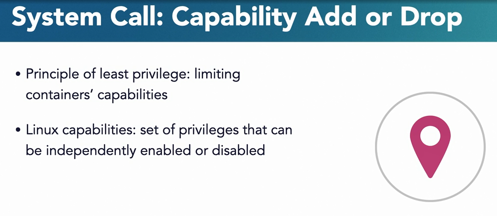

* **Namespaces, control groups, and capabilities** are enough for process isolation and resource management. But container platforms such as Docker need a kernel supported mechanism to enforce access control. 

  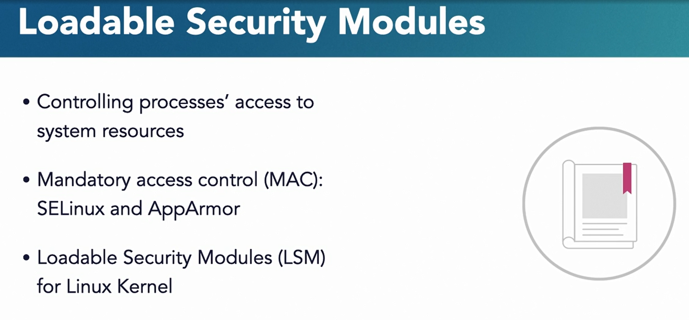

* The access control here refers to controlling which processes get access to which of the system resources. There are several mandatory access control implementations, but the two most common ones are SELinux and AppArmor, and they take a different approach to provide access control. Keep in mind, that both SELinux and AppArmor are not part of the kernel code. Instead, they are plugged into the kernel wire hooks. These hooks are offered by the Linux security module or LSM framework of the Linux operating system. Instead of implementing the access control feature itself, the Linux kernel invokes the functionality of these modules.

* In addition to LSMs, the container platform can also use seccomp. **Seccomp** is a capability in Linux that allows the processes running in user space to transition into a secure state and, restrict the use of system calls to extremely limited set, thereby, limiting the Linux Kernel attack surface. 

* namespace, not to be confused with Kubernetes namespace is a Linux kernel feature that provides isolation of processes. Cgroups provide resource limits. Capabilities features allow dropping privileged system calls. Keep in mind, that this feature allows dropping system calls only to a predefined list. SELinux and AppArmor are access control modules that are plugged into the kernel via hooks. They provide fine grain access control to resources. And finally, secccomp limits which system calls a process in user space can execute.

* 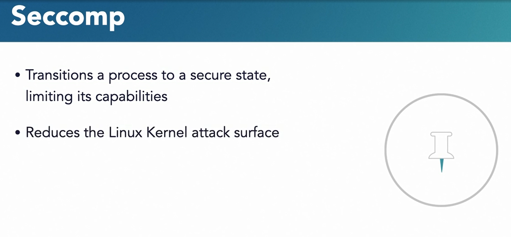

* Namespace, not to be confused with Kubernetes namespace is a Linux kernel feature that provides isolation of processes.

* Cgroups provide resource limits. 

* Capabilities features allow dropping privileged system calls.

* Keep in mind, that this feature allows dropping system calls only to a predefined list. 

* SELinux and AppArmor are access control modules that are plugged into the kernel via hooks. 

* They provide fine grain access control to resources. And finally, secccomp limits which system calls a process in user space can execute.

#### Container Runtime

* Container Platform : Beyond operating system's native features

* The component that actually leverages these OS features is known as container runtime

* Container platform consists of a Daemon that listens to API requests from the clients. This demon, in turn relies on a component known as container runtime.

  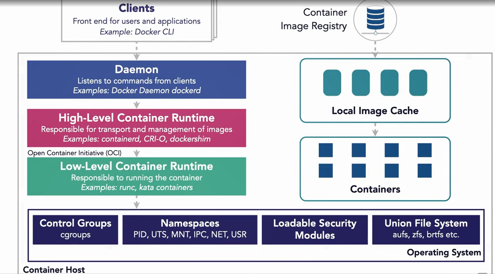

* The definition and the scope of container runtimes have changed over the years. But in general, container runtimes perform two distinct tasks. The high level tasks of image transport, packing or unpacking images is done by so-called high-level Container runtime.

* In the Docker ecosystem, this task is performed by container D. There are other implementations as well, such as CRI-O. 

* High level container runtime relies on a low-level container runtime to actually run the containers.

* Low-level container runtime uses operating system features such as namespaces and cgroups to create and isolate containers. RunC is the most popular implementation of a low level container runtime. 

* **Keep in mind that there are some implementations of container runtimes that perform both the high level and the low level functionalities.** 

* RKT also known as rocket. While we are talking about containers, it is important to know about the Open Container Initiative or in short the OCI. 

* OCI is a project under Linux foundation that standardizes to specifications related to containers and container images. (https://opencontainers.org)

* OCI image specification defines a standard way of creating a container image. While OCI runtime specification defines a standard way of running an ACI image. 

* RunC is an OCI runtime spec compliant implementation while container D leverages the OCI image specification.

#### What is Kubernetes

* Containers enable us to easily deploy small application components. In other words, loosely coupled microservices, but it is not uncommon for an enterprise to have an extremely large number of containers running.

* Once you have such a large number of containers running simultaneously, how do you manage them? 

  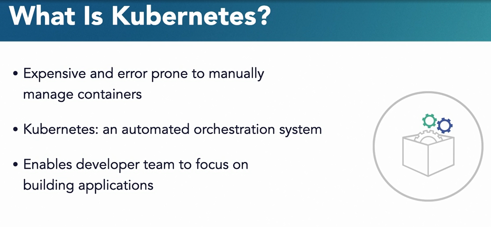

* The reality is it is expensive, error-prone, and cumbersome for an operations team to do so manually. You need an automated system that can schedule, configure, restart, and monitor such containers. Kubernetes is such an open source-container orchestration system that relieves the operations team. And with the help of an orchestrator, operations team only need to focus on managing kubernetes itself, while the Kubernetes manages thousands of containers on their behalf. In fact, the combination of container technology, powered with the orchestration of Kubernetes, enables your DevOps team to focus on what they are best at. Developing teams can focus on writing code and building applications. 

* They no longer have to worry about the infrastructure setup, service discovery, or how to expose their services. Likewise, operations team can focus on the underlying infrastructure such as on-premise data center or cloud infrastructure, they no longer have to be distracted by the software application issues such as release management, tracking and interdependencies and deployment.

* Loosely speaking, Kubernetes acts as an operating system for your data center. It presents your infrastructure as a unified computation resource to your developers.

* #### Pod

* Kubernetes as the orchestration engine for containers, but Kubernetes does not manage the containers individually. Instead, it manages them as a collection of containers in a single atomic unit. This collection of containers in kubernetes jargon is known as a pod.

  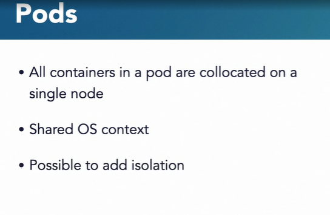

* All containers in a pod are co-located on a single hardware node, meaning you will not find containers that belong to the pod deployed on different nodes. By default, containers in a pod share the same OS context, such as Linux namespaces, network and volumes and so on, but it's possible to add additional isolation among containers even within a pod.

* #### Kubernetes Cluster

* Kubernetes cluster consists of two primary building blocks, a master node and multiple worker nodes. Master node manages and orchestrates the entire Kubernetes system. Worker node on the other hand, is where your containerized applications are run.

  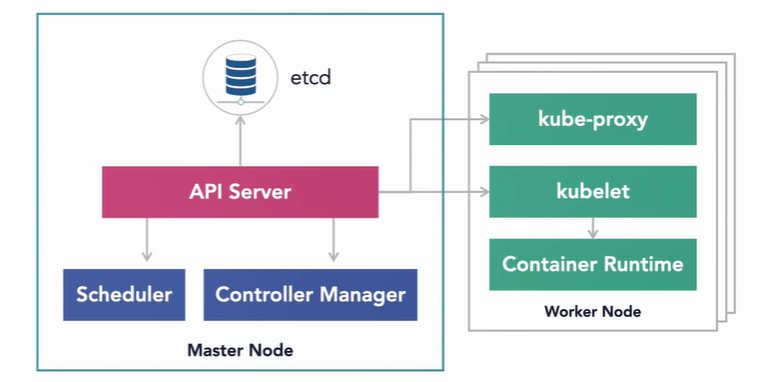

* Master node and worker node run special components that work together in harmony and make up the control plane.

* Kubectl is a command line interface that lets you control the Kubernetes cluster.

  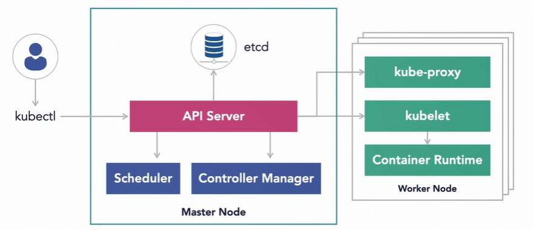

* Objects are the abstractions that Kubernetes uses to capture the state of a cluster. For example, a pod, the smallest possible unit of deployment in the Kubernetes object model, or the policies that apply to pods, are also represented as objects. 

  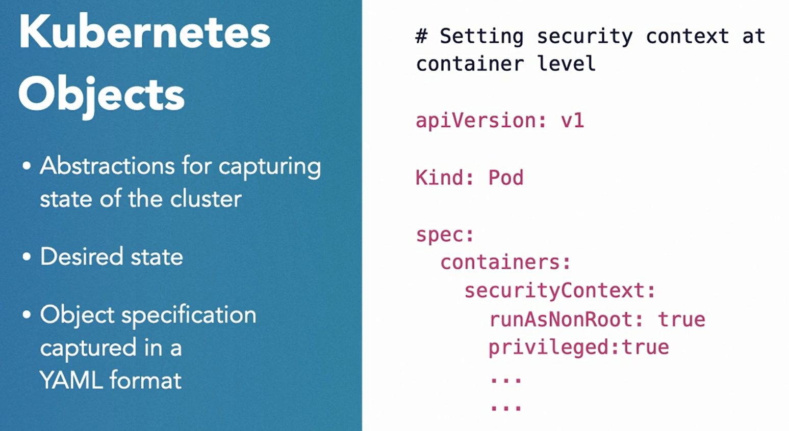

#### Kubernetes Mater Node

* **Etcd** is a distributed key value data store that stores the configuration and state of the cluster.

  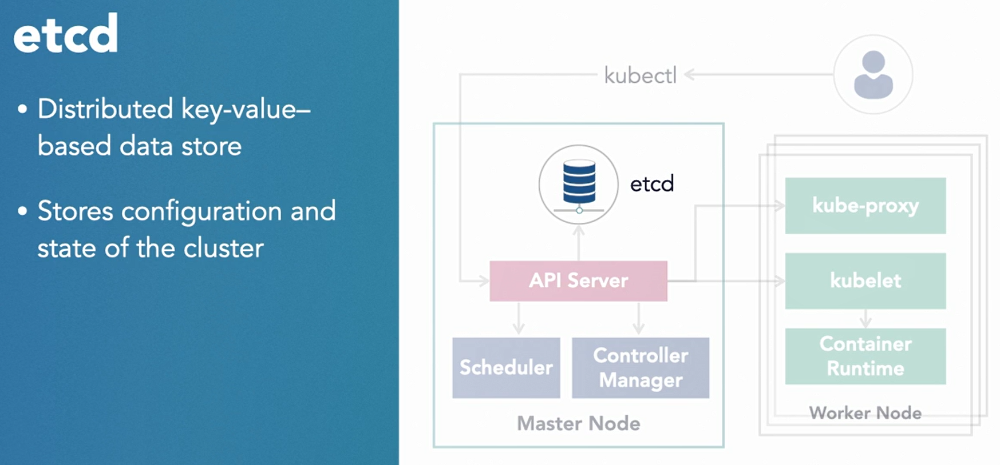

* **Master node runs the API server.** The API server is responsible for accepting and processing commands from clients such as kubctl. The components of the master and the worker node do not talk to each other directly. They do so via the API server. 

  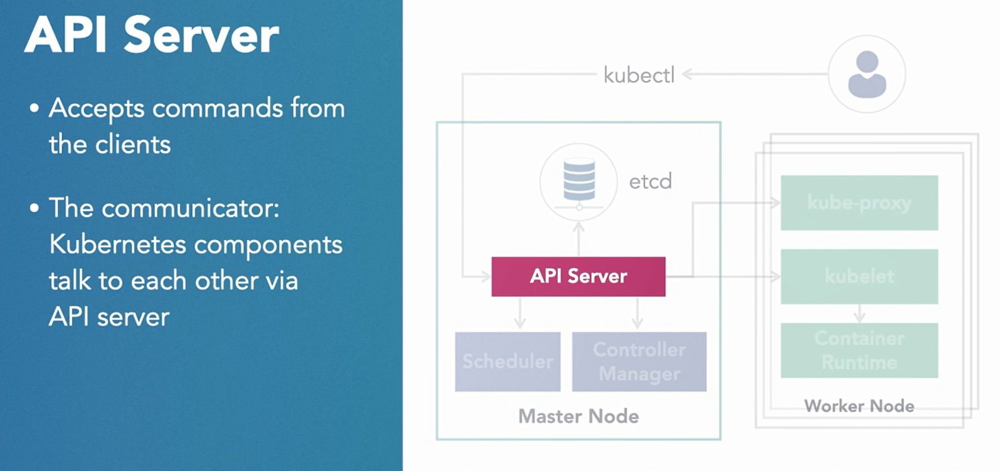

* The controller manager is the manager of the controllers. So what is a controller? A controller is a Kubernetes component that watches the state of the cluster and attempts to modify the actual state of the cluster so it matches the desired state.

* Some examples of the controllers are replica set, daemon set, stateful set, service controller, and so on. Controllers watch the API server for changes to the cluster state and keep performing operations until the actual state matches the desired state.

  

* The scheduler determines which node a pod will be assigned to. It uses a variety of algorithms to determine the best fit node to run a pod. The algorithm takes into account many factors, such as the available hardware resources on the nodes, the special needs of the pod, affinity of a pod to a certain node type, and so on. Scheduler posts the updated pod definition to the API server, which is being watched by kubelets on the worker nodes.

  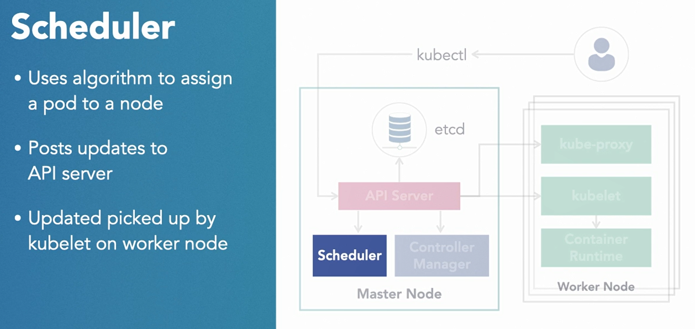

* It may appear as if the master node is doing all the heavy lifting. While master node stores and controls the state of the cluster, it is the worker node that runs your containerized workloads.

#### Kubernetes Worker Node

* **Kubelet** is constantly watching out for any commands that are posted to the API server. More specifically, commands pertaining to the pods on its node. Once it knows that the node it is running on is expected to run a pod, it gets into action.Kubelet doesn't do so by itself. It takes the help of container runtime. Kubelet also monitors the containers running inside a pod. It restarts or terminates as needed and then notifies the API server. 

  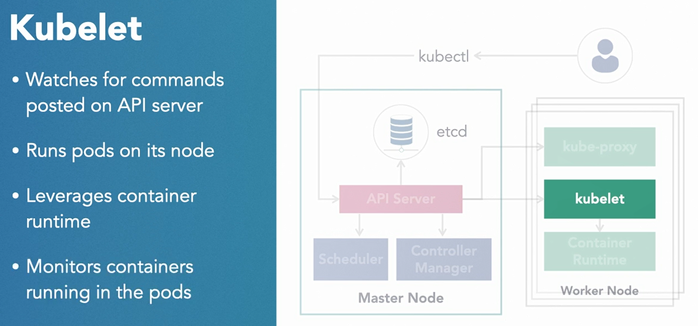

* The containers need a way to communicate with the other containers inside the cluster, as well as with the clients outside the cluster.

* **Kube-Proxy**, also known as the service proxy, ensures this connectivity. It uses the operating systems packet filtering system, if available, or it just forwards the traffic itself. In addition to the components we just discussed, there are a few add on components required for Kubernetes and your applications to run smoothly. For example, DNS server, dashboards, logging mechanisms, and so on. 

  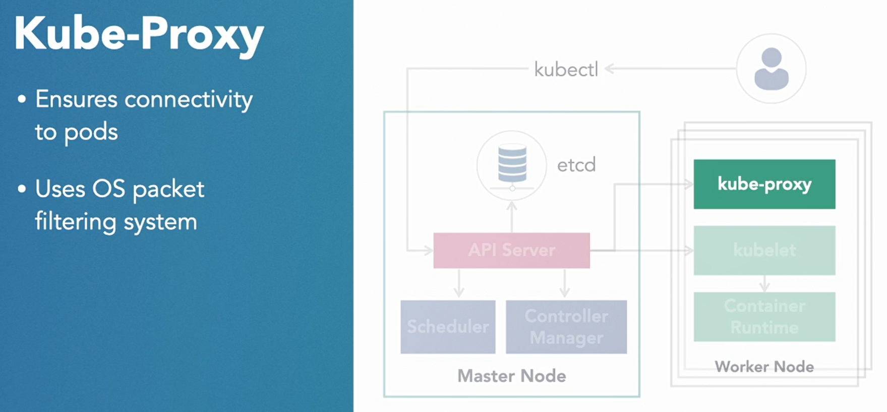

* The Kubelet relies on container runtime to run containers, but Kubernetes supports different kinds of container runtimes as long as they support the container runtime interface, or in short, CRI. 

* There are a few CRI compliant runtimes available today such as CRI-O, more commonly known as CRIO and CRI containerd. CRIO, which implements the CRI, provides the integration path between the OCI confirmed runtime, such as RunC, and the Kubelet. Similarly, containerd from Docker now has a CRI plugin that allows you to run even containerd as container runtime with the Kubelet.

  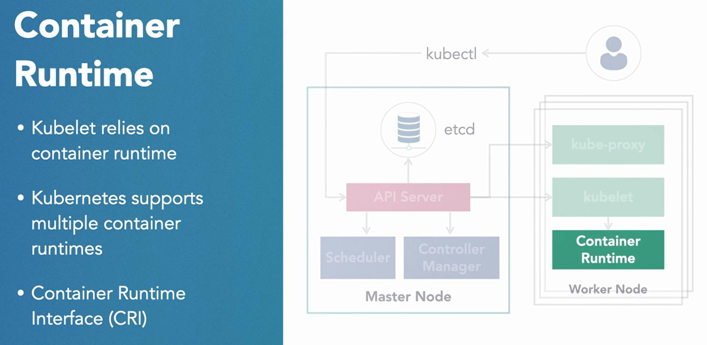

#### Question

* What is true about Linux namespaces and cgroups?

* ans : Namespaces represent partitioning of OS resources, while cgroups enable resource usage control.Cgroups help control resource usage.

* What is a container image?

* ans : a standalone file with software, dependencies, and configuration included to run an application.A container image is a standalone file with software, dependencies and configuration included to run an application.

* What is Kubernetes?

* ans : a container orchestrator system.Kubernetes is a container orchestration system.

* What not the responsibility of a container runtime?

* ans : communicating with users and external clients.Container daemon is used to communicate with users and clients.

* Etcd is the distributed data store for storing and managing /etc/passwd contents.

* ans: FALSE. Etcd may store secrets but does not store Linux user passwords that are typically found in /etc/passwd.

* Select which is true about master and worker node of Kubernetes.

* ans : Master node runs API Server. Worker node runs kubelets. Containerized applications run on a Worker node under the supervision of Kubelet.

* Which one of the following is true about a container?

* ans : A container is an OS process. A container is a running process under the operating system.

* Containers in a pod are collocated on the same node.

* ans : TRUE . By definition, a pod is an atomic deployable unit in the eyes of Kubernetes.

  

