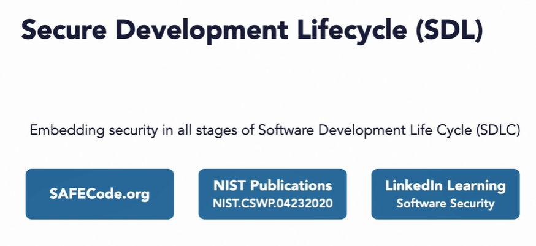
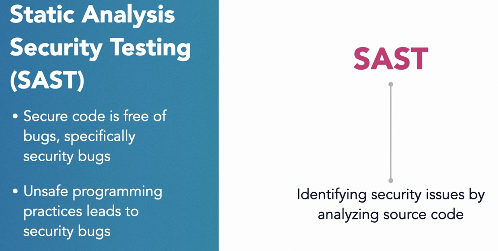
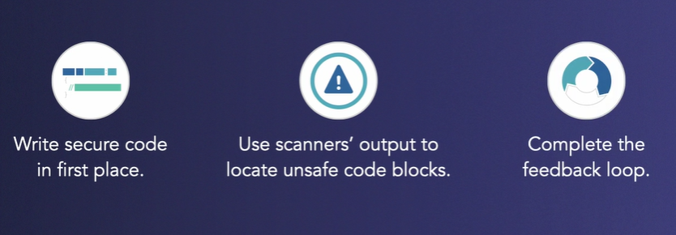
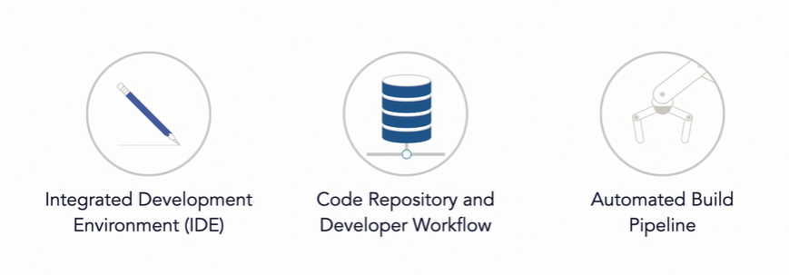
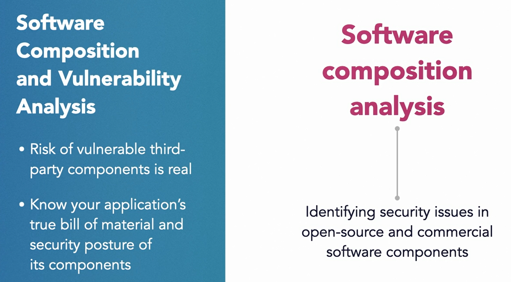
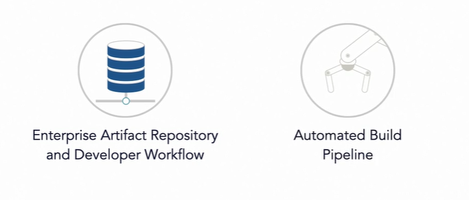
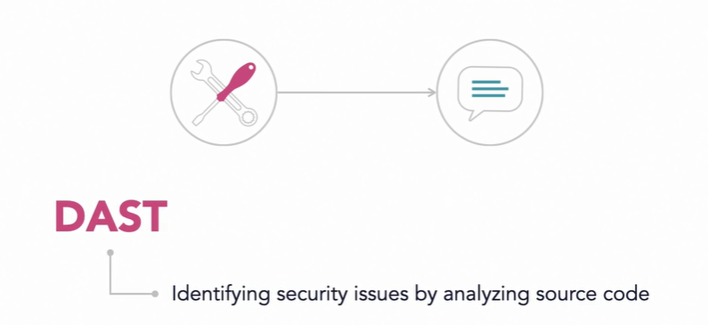

### Factor #1: Securing Containerized Application Code

#### Securing Design Before Code

* Rationate for Early Security Testing

* Goal :  containers free of security vulnerabilities

* Scanning container images and running containers is necessary but not sufficient.(. So it is natural to believe that scanning and monitoring your containers and kubernetes environment for security and policy violations is going to be imperative. But is that enough? Don't get me wrong. Such security controls are extremely important and necessary)

* Scanning only containers is a missed opportunity and inefficient.( Because by the time you end up scanning thousands of running containers, not only you have missed an opportunity to catch a security bug early on, but you're also being inefficient as well. If these containers are instantiated from the same image, you could have found many configuration defects and vulnerabilities from that one single image. You could have also blocked it from running as a container in the first place. By the same argument, if you have multiple container images being generated out of the same codebase, it is more effective to secure that source code itself.)

* In other words, there is a case for finding security vulnerabilities as early as possible in the software development life cycle. We saw in the previous chapters that developers build images from homegrown code, third party components, libraries, and OS components. The security of such images and containers is only as good as the security of the objects being placed inside them.

* #### Security Development Lifecycle (SDL)

* Embedding security in all stages of Software Development Life Cycle (SDLC)

  

* #### Security Requirements

* Security requirements at par with feature requirements

* Work with product owners and managers

* #### Secure Architecture

* Secure application is contingent on secure architecture

* Least privilege

* Defense in depth

* Separation of duties

* Minimizing attack surface

* #### Threat Modeling

* Enumerate external threats and discover weaknesses in your design.

* You should apply threat modeling techniques to find and then mitigate such weaknesses so that you can prevent a poor design from being implemented in the first place.

#### Secure Code

* #### Static Analysis Security Testing (SAST)

* Secure architecture and threat modeling will get your engineering team to a solid foundation. But there is no guarantee that the code developers will write will be free of bugs. More specifically, the security bugs. Securing code requires a multi-pronged approach. The approach includes peer code reviews, automated scanning of the code and the software components at various stages in your software development life cycle.

  

* Unsafe programming practices leads to security bugs

* Poor and unsafe programming habits leads to security bugs in the code. These innocent-looking security bugs, if not fixed early, will morph into security vulnerabilities in your containers running in the production. 

* This process of identifying security issues in the source code by scanning and analyzing is popularly known as static analysis security testing, or SAST in short.

  

* You'll have multiple opportunities to run a static analysis of your code, first in the integrated development environment or the IDE of the developer. 

* This allows the developers to get immediate feedback on the security issues in their code.

* Next, you can run a static analysis directly on the source code repository and integrate it with the developer's workflow. 

* This will give you the option to scan the code with every pull or merge request.

* If you're running a continuous integration pipeline, there is another opportunity to run the scan in the pipeline immediately after the code commit.

  

* #### Software Composition and Vulnerability Analysis

* Risk of vulnerable third-party components is real.

* Know your application's true bill og material and security posture of its components

  

* What about the code that has been acquired from third parties? You want to identify all components that may contain security vulnerabilities. Perform software composition analysis of your code so you know the true bill of material of your code. Many open source and commercial tools can assist you with this type of analysis. 

* So when should you run these tools? 

* Just as in the case of SAST, you have multiple opportunities. Integrate component scan in your enterprise artifact repository so anytime a developer pulls or pushes a software component, it is scanned at the artifact repository level. Many commercial tools integrate directly with the repositories. These tools continuously apply your security policy to block vulnerable components from being used.

  

* You can and should run a component scan in your CI/CD pipeline where possible in your workflow.

* #### Dynamic Application Security Testing (DAST)

* Static code and software composition analysis can give you the confidence that the code is secure, but you still want to be sure that when the code turns into running application, it can withstand the attacks of an adversary. 

  

* Before you deploy your application into your production environment, utilize specialized tools that test the application for commonly found security weaknesses. This type of application testing is known as dynamic application security testing, or DAST in short.

### Question

* Which of the following is true about SAST and DAST ?

* ans : SAST helps analyze code for security bugs. DAST helps build test an application at runtime. **SAST is static application security testing for analyzing code for security bugs. DAST is dynamic application security testing for testing an application at runtime.**

* Which of the following is not a secure design principle?

* ans : maximizing the attack surface

  **Minimizing the attack surface means reducing the unnecessary software components thereby reducing the probability that a vulnerable component can be the reason for a security breach. Maximizing the attack surface is not the best practice.**

* Shift security left means `_____`.

* ans : moving security activities to the early part of the software development lifecycle

  **Shifting security left means conducting security activities as early as possible in the software design and development process.**