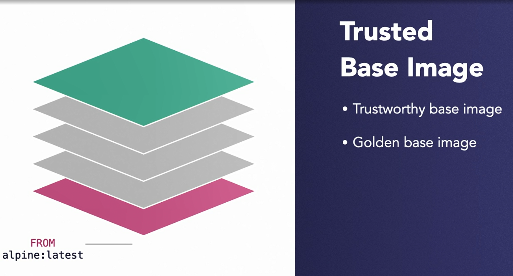
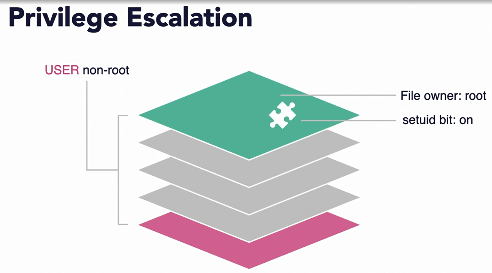
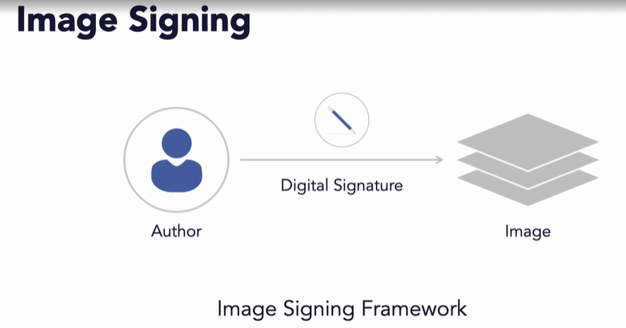

### Factor #2: Securing Image

#### Secure container images, part 1

* You should be able to recognize the importance of secure design and code in setting a solid foundation for a secure container ecosystem. But at some point in the software development lifecycle, you or the developers in your organization are going to build a container image. 

  

* A container image comes with its own set of security issues related to its integrity and configuration. Such security issues must be addressed independently. Moreover, a container image is not just built, it is also are stored, transported, and then retrieved by many players of this ecosystem.

* Protecting images and the image registry (So we need to make sure that both the image and the image registry are protected at every stage.)

* Configuration defects in images.(And second, no defects should be introduced in the image that will later appear as vulnerabilities while running the containers.)

* The security controls you should implement to protect these images while in rest or in motion. 

* We will start with the security controls required at the time of image creation.

* A container image is a collection of multiple layers built using the Union File System, where each change to the file system is stored as a separate layer. 

  

* Each incremental layer represents the delta of changes from the previous layer. The layer also contains the metadata including a layer or a commit ID.

* Although you can create a container image in many ways, the most common and practical way is to use a Dockerfile. 

* A Dockerfile is a plain text file with step by step instructions on how to build an image. Not only a Dockerfile makes it easy to see how an image was built, but it also allows you to check in the file in the source code repository and track it just like the rest of your source code. 

  

* Note that the Dockerfile defines not only the code that goes into your image, but also the configuration and the environment under which the image will run. And that puts an enormous amount of power in the hands of the author, or anyone who can get their hands onto the file.

  

* A Dockerfile and look at the security best practices you can put in place. The FROM directive in a Dockerfile tells the container platform such as Docker, which base image to use. This base image will be the bottom most layer of your final container image. Start with an image whose content and the source is known. Your organization might already maintain a set of golden base images that are trusted and made available via an enterprise image repository. These golden images are safe to use because they have been scanned for security vulnerabilities, vetted and meet the organization's security policies. 

  

* The attack surface of your container is directly proportional to the number of software components present in its image.

  

* Larger the number of components, the greater the probability that one of them has a security flaw that is exploitable by an attacker.

* There are a few ways you can reduce the attack surface. 

* #### Minimal Base Image

* Start with minimal base image

* You already know that you should start from a trusted base image. But you should also start with a minimal base image in the FROM directive. There is no need to begin with say a traditional Ubuntu Linux image with all kinds of utilities and modules still in it. 

* Instead, use a minimal image such as Alpine, BusyBox, or something similar. Or if you prefer, you can create your own base image by literally starting from scratch.

* Even if you start with a minimal base image, you still have the option to add additional software components.

* For example, add and copy commands in Dockerfile allows you to add additional content into the image file system. You should ask, do you really need to add that extra component just because you can? For example, do you need to add SSH web server or even the Bash shell? 

* Look, if you keep your image bloated with unnecessary components, you will have few consequences. If the extra component you added happens to be vulnerable, your entire image is at risk which can lead to the breach of the container. When a container is breached, these components can make attackers' job easier, helping them move around and even escalate privileges. 

  

* For example, if an attacker gets access to your container, the attacker will need utilities such as a shell, cat, ls command, etc. If your container does not have these tools to begin with, you're making it harder for the attackers to carry out their job. Keep in mind though, this approach is a dual-edged sword. By stripping your image off these basic utilities, you're also making it difficult for yourself to debug any bugs.

#### Secure Container images part 2

* #### Grant Minimum Priveleges

* The principle of least privilege implies that a subject which can be either a person or a service account should be granted only as much as access privileges as are needed to perform their job.

* Under no circumstances should they be given a blanket privilege beyond their role. The user instruction in Dockerfile specifies, the user, the container will be running as. If you don't specify a user in the Dockerfile, the container runs as a root by default. 

  

* And for most containers, which are running business applications that is beyond the level of privileges they actually need. Keep in mind that unless you are building a system container that really needs to interact with the OS Kernel, no container needs route access. 

* Setting a setuid bit on a file in a Unix-like operating system has some interesting consequences. Typically, when a Linux process is started from a file, the process runs with the permissions of the executer.

  

* But when the process is started from a file with the setuid bit on, the process runs with the permissions of the owner of the file. This behavior has some repercussions for security and can lead to privilege escalation.

* You were careful enough to specify a username the image should run as, but you happen to include a binary with setuid bit in your image. When someone runs that binary, the process starts with a different set of privileges. For example, if the owner of the binary happened to be root, the process will be running with the root privileges. And this is a form of privilege escalation, you didn't want that process to run as root.

  

* Therefore, don't include binaries with setuid bit bit turned on. Now, even if you intentionally minimize the attack surface, chances are that unsolicited objects will creep into your image. 

* These unwanted objects can take many forms, but all of them make your containers vulnerable. For example, a malware that is a malicious executable that gets added into your image intentionally or accidentally. 

* Malware can create a backdoor to your container and make it accessible to attackers. Ironically, you can accidentally introduce malware by getting a malicious image from a public repository. 

* Another kind of object that you don't want in your image is a Secret. A Secret is anything that is confidential and can unlock access to private data. 

* For example, passwords, private keys or connection strings and so on. We only know about the problem of Secrets in source-code repositories. If you have not solved that problem, chances are that the same habits and practice will manifest in the image file system as well. 

  

* How do you take care of these unwanted issues with the images and what security controls should you put in place? 

* Scan your images, identify the security issues, whether these are embedded malware, embedded secrets or security vulnerabilities and address them before your image is run as a container. 

  

* Ideally, if you follow the secure design, code and scanning practices, we discussed in prior chapters, there should be minimal vulnerabilities in your image

*  But things change, new vulnerabilities are discovered. New vulnerabilities emerge frequently.

* A clean image yesterday may not be clean today.

  

* You didn't find any security bugs in the code and the image was clean when the developers built it. 

* That may not be true today or in the future when you're about to run your containers. So when and how often should you scan your container images?

* **First, scan an image in your Continuous Integration or CI pipeline immediately after building the image. Second, integrate scanning directly with the image registry, so that the images are being scanned continuously in the background and are flagged based on their vulnerability status.** 

* This will prevent vulnerable images from being downloaded in the first place. 

* There are several open source and commercial tools available in the market. For example, **Claire**, Kube-bench, **aquasec**, and **Twistlock**. **These tools will help you scan for security vulnerabilities, configuration defects, policy violations, and even compliance with security Benchmarks from CIS.**

#### Image Registries

* What makes an image trustworthy ? 

* Layers adds to the complexity

* Trust in the chain of custody

* Switch focus from images to image registries and building trust in them. You know, that you should only use a trusted base image to create your container images. But how do you know if the image you just acquired has not been tampered with, and is from a source you know and trust? Risks associated with using images built by someone else are similar to risks with using third party software components. But the problem is a bit more nuanced for container images. Since the final image is actually a collection of multiple layers, each layer may be created by a separate user. So we need a mechanism to establish trust in the complete chain of custody

* **This trust in the image is established through a process known as image signing. Image signing enables its author to add its identity to the image. This identity is in the form of a digital signature. The user of the image then verifies the integrity of the image before starting to use it.**

  

* Your organization, you can implement an image signing framework from the scratch. But many commercial container image registries, you already use, include some implementation of an image signing framework. Few open source projects provide frameworks for image signing. 

  

* This framework includes a set of libraries and utilities that can be used to secure the software upgrade process. Keep in mind that this framework is not specific to container images only. Another CNCF open source project called notary, is an implementation of the update framework that is suitable for distributing container images. With notary, the creator of the image, signs the image, using a secure private key. The creator pushes the content to the notary server. Users of the images, verify the image using the public key that they received from the creator via an out-of-band channel.

* We will continue to see the enhancements in the next version of notary. Your container images include your businesses intellectual property. If you transport these images to or from an image registry over an insecure network, you run the risk of a variety of security attacks. 

  

* An attacker could intercept the clear text connection and sniff the confidential data. There is also a risk of a man in the middle attack whereby an attacker can intercept and serve malicious images to the requester. So what should you do? Always encrypt the connection to the registry, use the latest version of the TLS protocol, but will that be enough.

#### Image registry access Control

* #### Authenticate Subjects

* Encryption of network does not prevent from malicious users.

* Permit only authenticated users.

* Not all authenticated users are equal.

* #### Principle of Least Privilege

* Provide minimum needed permissions.( the publisher process executed as part of your CI/CD pipeline, that uploads the image to your image registry. Does it really need both read and update permissions? So long as it has the right permissions that should be sufficient.)

* Apply of principle of least privilege

* So apply the principle of least privilege and give only permissions needed to do the job. Similarly, when the Kubernetes orchestrator needs to pull images from an image registry, it doesn't need the right access, read-only access will just be sufficient. 

* There is a subject that has the privileges, not only to create a container image, but also to deploy the container as well. In other words, there is no separation of duties when executing this task. This is a very contentious topic in DevSecOps. On one hand, this arrangement appears frictionless and is treated as a recipe for continuous deployment.

  

* There is that risk of pushing some insecure code without "another pair of eyes looking at the code." So how do you balance between the need for hands-free continuous delivery, and need for protection from fraud or error in this case. Retain the separation of duties, but minimize the handoffs among multiple persons. 

  

* When you do implement handoff, automate as much as possible, and do it only at the most critical point in the pipeline. Now, depending upon the risk profile of your application and the compliance requirements, you may be even mandated to implement separation of duties. Therefore you may be required to ensure that the person creating the image is not permitted to publish and run it.

* Each image and its layers are identified by a digest that takes a special form, which is hashing algorithm colon, a hash value. If the contents of the layers are altered, the hash value will also change. This approach acts as a security aid in determining if the layer was altered, the digest that looks something like this is a machine friendly way to uniquely identify an image.

  

* But for all practical purposes, developers use another construct known as a tag. A tag is a human-friendly way to identify an image. You may have seen the latest tag used to identify the most recent version of an image.

* You don't have an automated way of doing that and container A crashes. Orchestrator post the image with latest tag. Now B is running with a stale image and A with the latest image. There is a mismatch. 

* This is one example where tags can be notoriously difficult to get right. You want to make sure that you're pulling the right image from the image registry. There are a couple of ways to address this. 

* First, you can use immutable tags. Once immutable tags are attached to the image layer, they stay attached. For example, if you tag an image would say label one, when the version of the image changes, you don't move label one. Instead you apply a new tag called label two to the latest version. That way your label one and label two are always pointing to a known and never changing version of the image. 

* In this approach, you set up the orchestrator to always pull via an immutable tag. So you're sure that all running containers will be running an image that is known and fixed. 

  

* The second option is to keep using the latest tag, which is of course a mutable tag. But then you should carefully implement a mechanism to ensure that each container is running the desired image. And the last option is to not use tags at all. Instead, pull the image by its own digest value. 

* And image can have many and ever changing tags, but will always have only one unique digest that will not change. 

#### Question

* Secure image must contain all of tools and utilities that an OS offers.

* ans : FALSE Unnecessary components make an image more vulnerable to security attacks.

* Which one is recommended practice?

* ans : Encrypt connection to the registry. Authenticate users . Give only as much permission to users and services as needed to do their job.

  Encrypt the connection to the registry and use TLS. Identify and authenticate users. Furthermore, give permissions to those authenticated users who have been authorized and need to perform an action.

* A minimal image reduces the attack surface of your container `_____`.

* ans : all of these answers

  The fewer the components, the smaller the image. Few components mean a smaller chance that one of them has a security vulnerability. Also, few components and utilities mean an attacker will not have access to common tools to continue the attack.

* Which one is recommended practice?

* ans : As the creator of your image, you should sign an image because users can be sure of the author of the image.

  Downstream users of your container image need to know the source of your image and be able to trust the image. Signing the image gives them the confidence and information that the image is not from a malicious user. Encrypting helps with confidentiality but not with identity.

* If you do not specify a user in Dockerfile, container runs `_____`.

* ans : as root By default, a container runs as root when not specified.

* 

  