### Factor #3: Securing Hosts and Container Working Environment

#### Container working environment

* Assume that you implemented all of the security controls, such as secure design code, images, and registries, but your application has not come alive yet. It only comes to life and starts running when its image is instantiated as a container. That container, which is nothing but a Linux process, needs an environment and resources to run.

  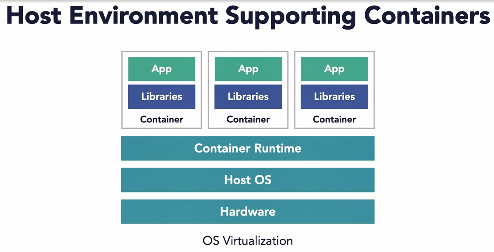

* It needs a container runtime, it needs a host OS, and the capabilities offered by the OS. This environment needs to be secured. 

  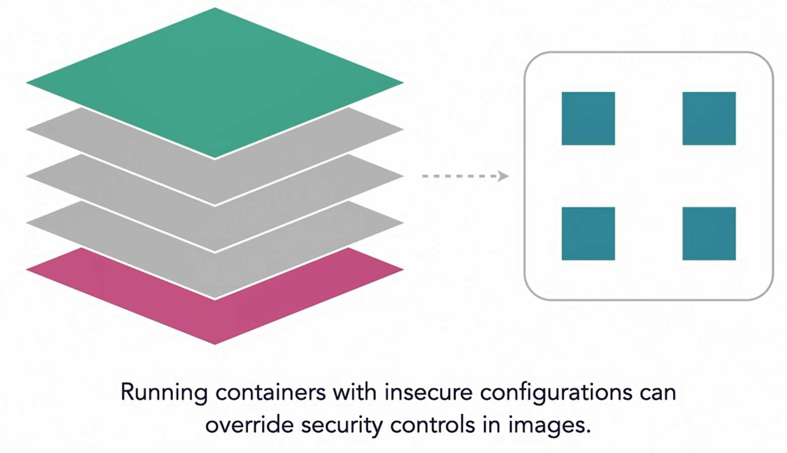

* You can instantiate a container using a Docker command or in Kubernetes by submitting a part definition to an API server. While doing so, you may override and effectively undo the security configurations you may have put in place at the time of creating images. 

* #### Running a Container as Root

* Docker file, you should specify a user to not let the container run as root, but what about when running a container? 

* When starting a container from an image, you have a choice to specify a user ID corresponding to the root, and therefore we're running the container as root.

  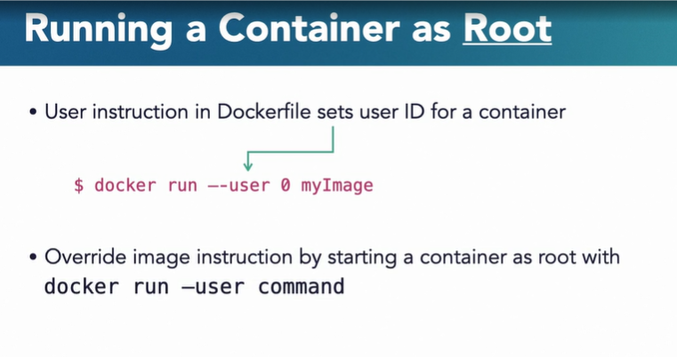

* #### Privileged Containers

* Containers running as root != Privileged Container.(Another level of privileges that a container can be granted. It's a common misconception that a container running as a root has the highest level of privileges, but that's not true. )

* Open Container Initiative (OCI) specification defines default capabilities

* https://lnkd.in/gJ5BbFF

  ```shell
  $ docker run --privileged myImage
  ```

* If you look carefully in the spec, not all capabilities are turned on as shown by zero. When you start a container with the privileged parameter, you're essentially making all of the system capabilities available to the container process. 

* This is extremely dangerous. Set a container has full access to everything on the host operating system. 

* Privileged containers pierce the wall of security between OS and containers. In other words, by creating a privileged container, you have pierced all boundaries between the container process and the OS kernel, leaving no room for isolation. Granted, there are use cases such as Docker in Docker or system containers that necessitates the use of privileged containers.

* Most application containers do not need to run in privileged mode.( But most application containers don't need to run in privileged mode.)

#### Container Network Security

- Container communication is enabled by networking.

- Docker and Kubernetes take different approaches. In Kubernetes, each pod is assigned an IP address and is expected to communicate with other pods seamlessly regardless of where the pod is running, on the same node or on separate nodes.

- Kubernetes, however, does not provide the network functionality on its own.

- It depends on the container network interface or CNI plugin, which must be set up by an admin separately.

- Rather, it depends on the container network interface or CNI plugin, which must be set up by an admin separately. So to secure inter-container communication, or to be precise, inter-pod communication in Kubernetes, you need to apply network policies. 

  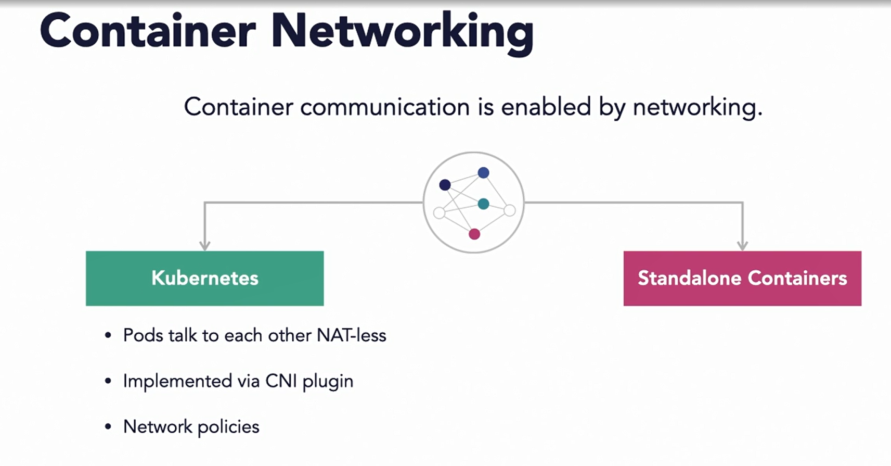

- Through these network policies, you can control what traffic can flow between pods. We will address the network security controls for Kubernetes. But that still leaves us to deal with the security of networks specific to standalone Docker containers

  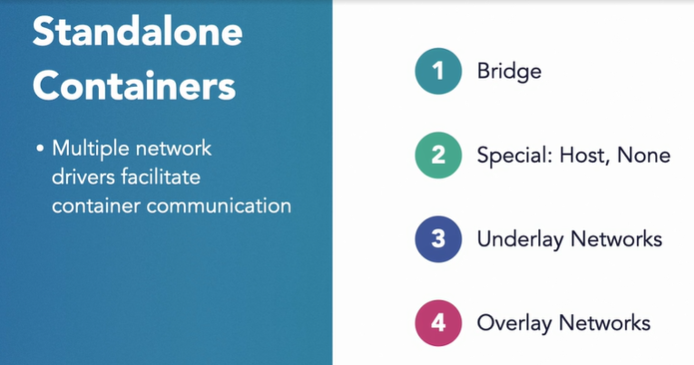

- #### Bridge Network

- The bridge network driver, which is the default option, allows containers to communicate with each other on the same host. In this diagram, you will be able to spot a Docker bridge virtual interface.

  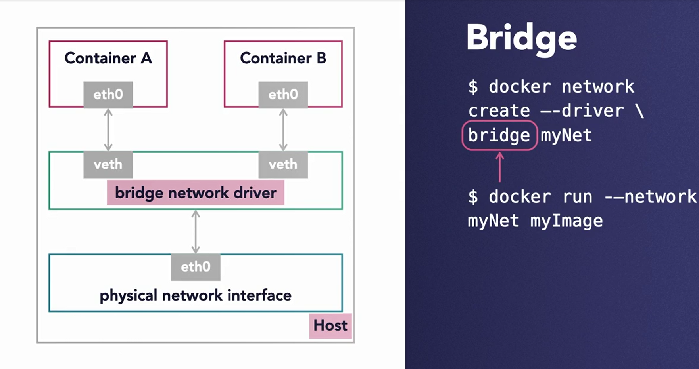

- #### Closed Container with None 

- A special case of container networking is a closed container. A closed container uses the none network driver. It has only a loopback interface. No incoming or outgoing connections can be made from a closed container.

  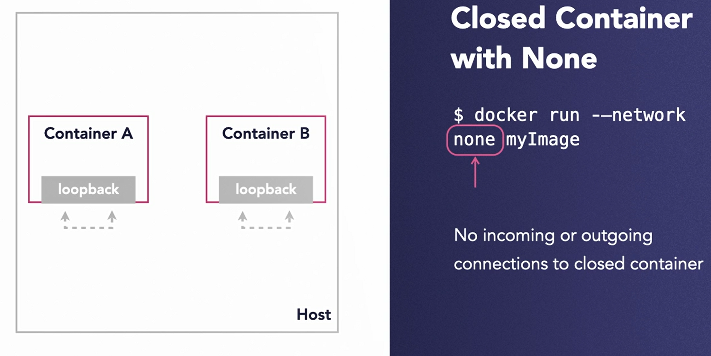

- #### Container Sharing Host Network

- Recall from the previous chapters that an isolated container runs in a separate namespace from that of its host. But there is a special case where you may want the container to run in the same network space as the host. Such a container uses the host network driver.

  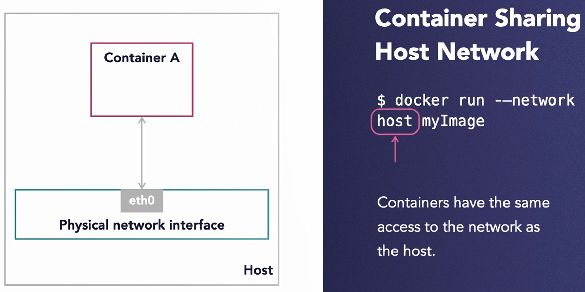

-  In this option, a container's access to network is identical to that of its host.

- #### Underlay Networks

- Underlay network drivers help containers that are on different hosts communicate with each other using the underlying physical interface. (Container communication by leveraging underlyinh physical interface)

- Media access control virtual local area network (macvlan)

- Internet protocol VLAN (ipvlan)

- Two examples of such drivers are: media access control virtual local area network, or in short macvlan, internet protocol VLAN, or in short ipvlan. These drivers let you treat a container just like a physical host with its own MAC address. 

- This capability comes handy when you're migrating from existing VM-based deployments or have special security or compliance requirements. 

- #### Overlay Networks

- Overlay network drivers also help containers on different hosts communicate with each other, but by taking a different approach. 

- The overlay network is a virtual network that sits on top of the host specific networks. Overlay networks can be implemented using various virtualization technologies such as virtual extensible LAN or in short vxlan.

- Container communication by leveraging a virtual network

- Virtual network sits above host networks

- #### Recap

- **The bridge option allows containers on the same host to talk to each other.** 

- **Host and none options are used for special container networking.** 

- **Underlay and overlay networks allow containers across hosts to talk to each other.**

- **But by the way, on a side note, Kubernetes can utilize either underlay or overlay network plugins to make the networking possible.**

  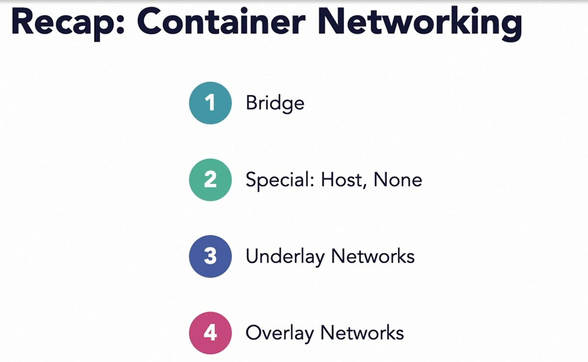

#### Container Ports and Interface Security

* #### Container Ports

* Containers are not directly routable from outside their cluster.

* **So how do containers communicate with the outside world?** You will need to map a TCP or a UDP port on the host network interface to a target container port.(Map host port to target container port)

  ```shell
  docker run -p 8088:8080/tcp
  ```

* When executing Docker run command, you specify this mapping with -p or -- publish option. For example, this command will forward traffic on port 8088 of the host to port 8080 of the container.

* **In contrast to Kubernetes, Docker does not come with network security policies. So you will need to put best practices and security controls in place to ensure that the communication among containers takes place only between the authorized parties.** 

* #### Incoming Traffic

* Containers port bound to host IP address 0.0.0.0

  ```shell
  $ docker run -p 8088:8080/tcp
  ```

* The port mapping command that you just saw has a security issue. With this command the container ports are exposed to any IP address which is represented by a wildcard IP address 0.0.0.0 on the host. This is not secure. You should accept connections only on a specific interface.

  ```shell
  docker run -p 10.2.5.6:49153:8080 webserver
  ```

* For example, if you run the same command as following, you'll be mapping container port 8080 to a specific interface represented by IP address, 10.2.5.6 and by port 49153. 

* #### Privileged Ports

* So what happens if you don't specify the port mapping?

* Docker automatically maps container ports to available host port range (49153-65535)

* But what if the user does not specify a port between one and 1024? 

* Docker does not restrict that. The problem is that the ports between one and 1024 are deemed privileged and may carry sensitive data.(No restrictions on assigning privileged host ports 1-1024)

* Review of Dockerfile and audit of running containers.

* #### Docker Socket

* Switch from IP addresses and ports to the processes. Docker Daemon process accepts commands from the clients. The clients use a Docker socket to communicate with the Docker Daemon. Clients can talk to the Daemon over file descriptors, TCP or unique sockets. By default, this unique socket is located at a specific location in the host file system.

  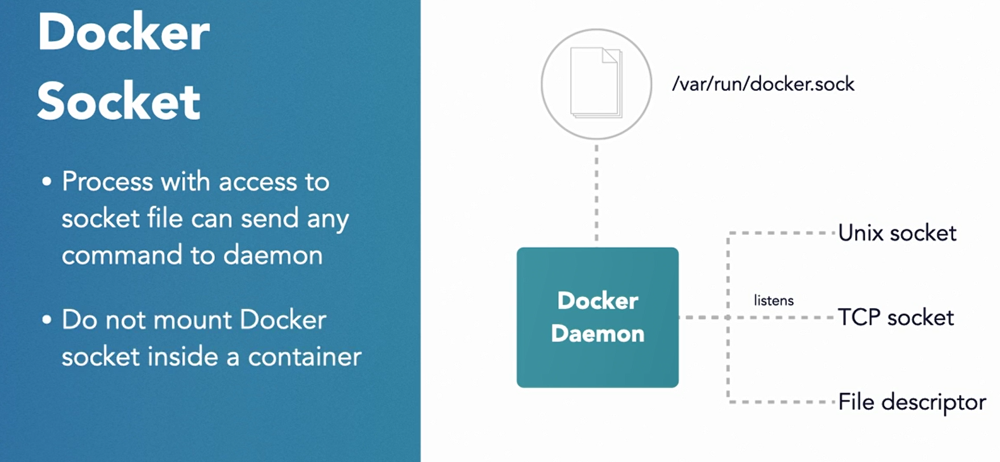

* Access to the socket is protected from other processes on the host. But what do you think will happen if you mount the socket as a volume inside a container? 

* Any process within that container will have full access to send any command to the Daemon. This will result in the container gaining full control of the host, and this is not what you want. So ensure that this socket is not mounted inside the containers.

* #### Default Network Bridge Security

  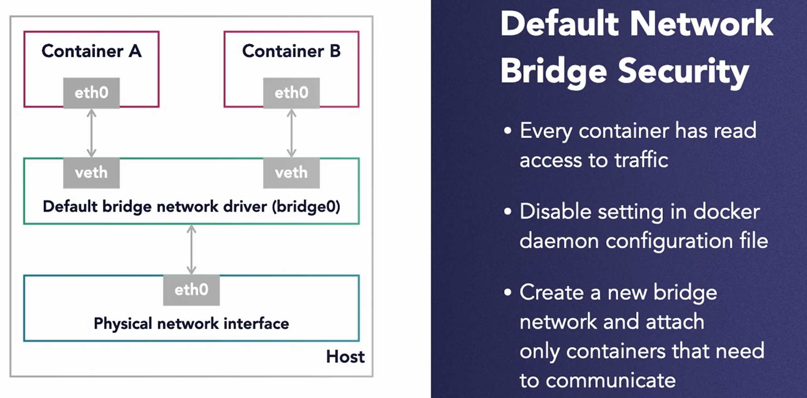

#### Host OS Protection

* Unlike hardware virtualization, in OS virtualization, multiple containers share the same OS.

* That leads to an expectation of mutual trust between the container and the host OS running that container. So far we have been discussing container and application security. But the host is equally accountable in the security of this ecosystem. In fact, the impact of a host being breached is way more amplified than that of a container breach.

  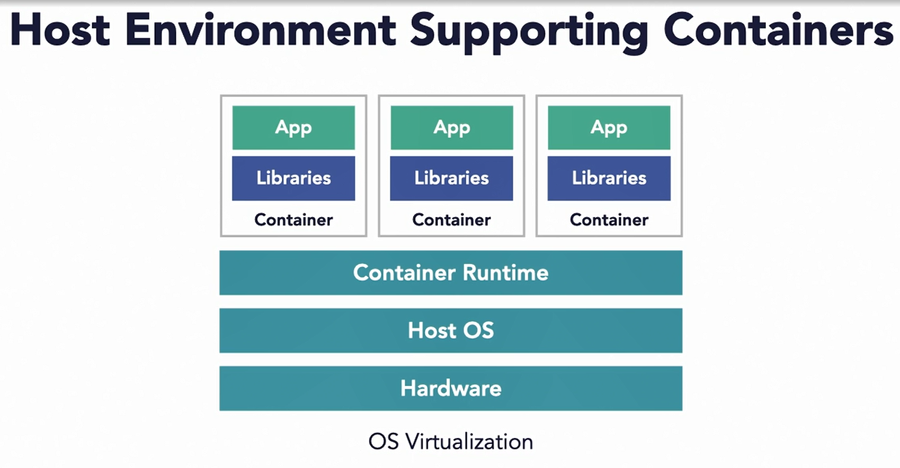

* #### Minimal Host OS

* A typical Linux operating system has way more services running than you need to support container applications. 

* Here you have two options to choose from. First, run a minimal OS that has been custom built for running containers, for example, VMware Photon or Red Hat CoreOS. These so called thin OSs have been stripped off of many components and services not typically required to run containers. Your second option is to keep using traditional operating system as mandated by your organization, but apply special hardening techniques to reduce the attack surface. You have fewer resources to rely on, the CIS Benchmarks and the NIST guide to server security.

  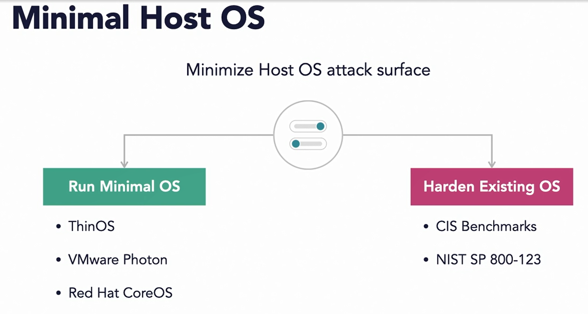

* Look at the workloads you're planning to run on your hosts, are you mixing both containerized and non-containerized workloads on the same VM? Move non-containerized workloads such as general services and applications to separate hosts. 

  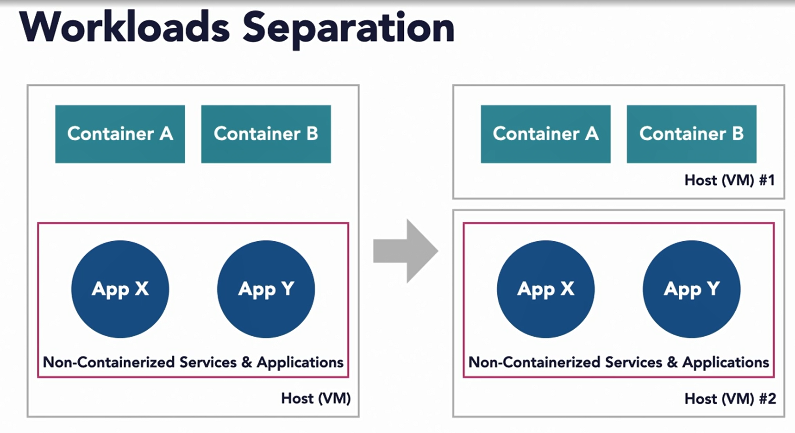

* if you don't do that, it's likely your general workloads are not going to be managed by an automated orchestrator such as Kubernetes. That means your admin and operations team will need to manually access the host to start, stop and manage your services. And that will have two consequences.

  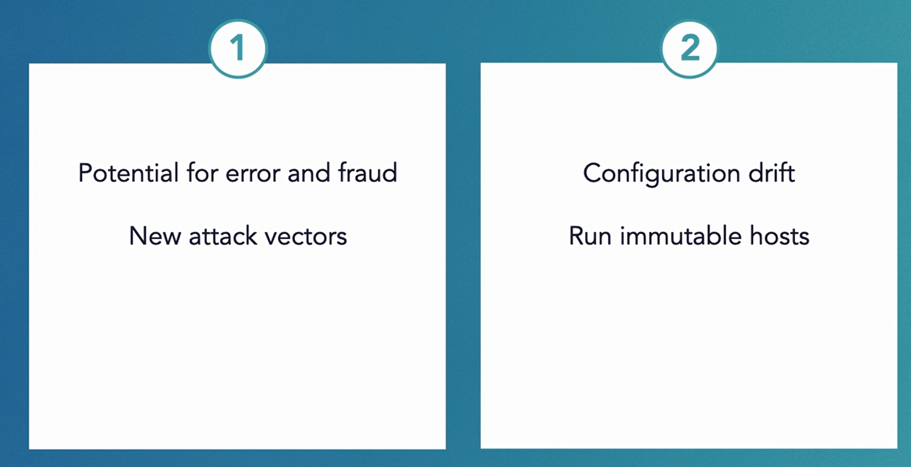

* First, there is a potential for error and fraud. Obviously, you will need to grant permissions to users and operations to log in to host maintain the applications. This opens up your host to new attack vectors, either internal or external. And second, admins making changes to a live host will lead to a drift in the host configuration from its baseline. And that will result in a disparity in the configuration of hosts running in your cluster. Just like containers, you should make your hosts immutable as well. 

* if your container does get breached, you will limit the spillover to only applications running on that host.

* #### Minimize Direct Access to Host

* Let Kubernetes run and manage your containers.

* Treat your hosts as cattle, not pets

* #### Host OS Vulnerabilities

* Use standardized and approved VM images for the hosts.

* Continously scan for security vulnerabilities

* #### Host File System

* Protect host file system from malicious containers.(The host file system is precious and must be protected from malicious applications and rogue containers.)

* Mount host file system as read only to container.

* Reduce attack spillover

* Containers not tied to a host

* There are many reasons why you should mount the host file system as read only to your containers.

* First, should a container be compromised, it will not be able to make changes to the read only host file system. This will limit the attack spillover to only within the container.

* And secondly, by mounting the host file system as read only, you're also enforcing the container to not persist data on the host. 

* Containers will be forced to utilize an external data source for data persistence. 

* This approach is a step in the right direction. 

* You will ensure that your containers are decoupled from the hosts. Decoupled containers can be easily stopped and restarted on another host.

#### Question

* Privileged container always has the same set of permission as a container running as root user.

* ans : FALSE - Privileged containers have access to all system capabilities beyond what the root user has.

* What is true about Docker daemon socket?

* ans : none of these answers

  Docker daemon socket does not need to be mounted in a container, nor it is required for a container to communicate with the host. Socket file is a private file and should be never accessed by any container under normal circumstances.

* If required, host file system should be mounted on container as `_____`.

* ans : read-only file system. If a container is breached, having access to only a read-only host file system will limit its ability to modify the host.

* What is a recommended practice regarding containerized and non-container workloads?

* ans : Both containerized and non-containerized workloads should run on different hosts.

  Non-containerized workloads should be run on hosts, separate from hosts running containers. Non-containerized workloads usually need admin (human) access. Mixing them with containers means interfering with Kubernetes` automated orchestration.

* Which one is recommended practice about Host OS and Container OS?

* ans : Host OS must be minimal and Container OS should be minimal.

  Both host and container OS should be the smallest possible as to minimize the attack surface.


