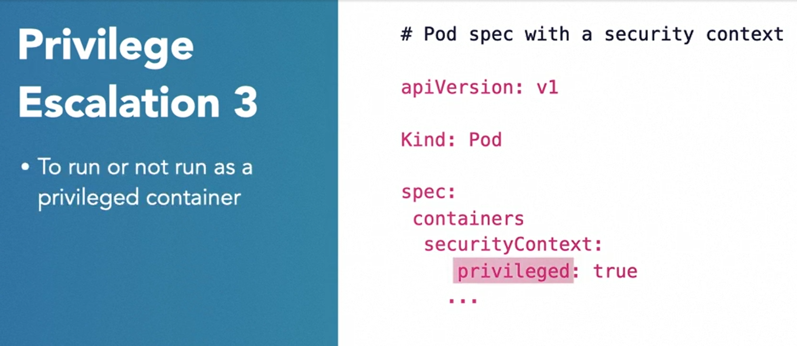

#### Factor #4: Securing Applications in Kubernetes

#### Securing applications in Kubernetes

* The security of images, containers and hosts is a critical part of your strategy to protect your containers ecosystem. 

* When you introduce an orchestrator such as Kubernetes, you increase the attack surface exponentially. 

* #### Kubernetes Security

* When it comes to the security of Kubernetes, we can see it from two different dimensions. First, the security of your pods and applications running in a cluster. And secondly, the security of the cluster and its native components

  

* Securing applications requires proper isolation among parts. 

* It also requires implementing access control, including authentication, authorization and mission control. 

* It includes protecting the networking among the pods. 

* The secrets management.

* To protect the Kubernetes orchestrator itself requires discovering and fixing misconfigurations.

* It also requires securing the communication between the Kubernetes core components themselves.

* Besides you also need to ensure that these components themselves are not granted extraordinary privileges and are communicating over secure channels. 

* The security controls we are going to discuss will vary in terms of their reach and scope. 

* #### Security Controls Scope

* Kubernetes offers a mix of components, collections and abstractions.

* You're already familiar with some of them . For example, nodes and pods. Kubernetes also offers clusters and namespaces. A cluster is a collection of nodes or host machines that run your pods. Basically every running Kubernetes instance has a cluster. 

* Kubernetes also allows creating multiple virtual clusters from a single physical cluster. These virtual clusters are known as namespaces. Organizations use namespaces to allot cluster resources among multiple teams.

  

* Security features and controls offered by Kubernetes to secure applications in a cluster. The scope of these controls can vary from pod, namespace to cluster level.

#### Access Management

* Before a client such as kubectl or another Kubernetes component can perform any operation in Kubernetes.
* 
* The client must prove it is who it claims to be, the client must be permitted to perform the action it is requesting, and third, the requested operation, especially if it modifies a Kubernetes object, must be compliant with the security policy. The API server takes the help of three access control plugins to verify these criteria. Authentication plugins, authorization plugins, and admission control plugins.

#### Authenticating Users

* #### Authentication

* Kubernetes supports two types of subjects, regular human users and machine accounts, also known as service accounts. Service accounts are managed within Kubernetes while the user accounts are expected to be managed outside of Kubernetes. In fact, Kubernetes doesn't even have a native representation of a human user. In other words, you can create accounts for people in Kubernetes. 

  

* So how does Kubernetes authenticate then?

* #### Authentication Methods

* Multiple authentication options

  * Static password or token file.
  * X.509 client certificate
  * OpenID Connect tokens
  * Service account tokens
  * Others

* **Static Password and Token File**

* Information is stored in a file.

* Password, username and user ID

* A client using HTTP passes the authorization header with a 64 base encoded value of the user column, password. 

* The API server then verifies it against the stored value. If a match is found, the user is authenticated, but passwords don't expire and can be changed without restarting the API server. 

*  This authentication method should not be used in any enterprise environment

* **X.509 Client Certificates**

* If the client certificate option is enabled in the API server, a client can present an X.509 certificate to assert its identity. API server using a pre-configured list of certification authorities then verifies the identity of the client.

* Kubernetes does not support revoking the certificates. So if you want to change your certificate, your only options are to wait for the certificate to expire or just re-key.

* Secondly, the certificate-based authentication and the groups within role-based access control don't work together very well, why? Because every time the privileges of the subject change, you will need to reissue a certificate. 

  

* **OpenID Connect**

* OpenID Connect protocol is based on the OAuth 2.0 specification. 

* OpenID Connect does not really authenticate, rather it provides a mechanism for generating and refreshing the client's assertion tokens. 

* OAuth, which is the underlying protocol, on the other hand, provides a mechanism for transferring these tokens.

* How this works in Kubernetes.

* A user logs in with an identity provider. An identity provider could be Azure Active Directory on your cloud, you can also run your own using Keyclaok or CoreOS Dex. Identity provider returns the user and identity token. 

* Using your kubectl command, you supply that token along with an API call to the API server. API server, then validates the token, which is nothing but a JWT token. 

* And by the way, did you notice that there is no arrow going from the API server back to the identity provider? No, and that's because all of the information needed to validate you as a user is in the ID token itself. This approach makes this authentication method, both stateless and scalable.

  

* Other Authentication Methods

#### Authentication Service Accounts

* What about authenticating applications or more specifically pods?

* Authentication applications using Service Account

* Kubernetes offers a construct known as ServiceAccont. Unlike user accounts kubernetes does indeed store ServiceAccount details as a ServiceAccount resource.

* Each pod is assigned a ServiceAccount by default. 

* Service Account allows controlling which resources a pod can access. But you can and should change the default account.

* By associating a ServiceAccount to a pod gives you the developer or the admin, the flexibility to control the resources a pod will have access to.

* A pod sends a request to the API Server with an authentication token. That token uniquely identifies that pod. Upon receiving the request the API Server in turn does two things. With the help of authentication plugin it authenticates ServiceAccount and next, using the authorization plugin checks whether the requested operation is permitted for that ServiceAccount.

* How does the pod actually receive that token? Now, if you recall in case of a user account, the ID token was granted by the identity provider.

* In case of a ServiceAccount, a default secret token is mounted on every pods file system at a predetermined location. But as you will see there're other ways to inject secret tokens into the parts.

  

* A custom ServiceAccount inside a pod. A service account is being created using kubectl command. And then inserted into a pods yaml specification. Okay so we covered the authentication let's switch to authorization.

  

#### Authorization

* Once a user or a service account has been authenticated, API server then validates if the requested operation is allowed. 

* By default, all permissions are denied. Keep in mind that the authorization plugin checks for permissions only at the verb level.

*  In more granular validation beyond the verbs is done by the admission controller.

  

* Kubernetes authorization supports multiple strategies, but the role-based access control or RBAC is the most common and recommended strategy.

* #### Role-Based Access Control

* Recommendation strategy: RBAC

* Grant or deny access to operations based on subject's role.

* The role-based access control or RBAC is the most common and recommended strategy. Generally speaking, role-based access control strategy grants or denies access to specific operations to subjects based on their assigned roles. For example, using kubectl command, a subject has the option of submitting any action to the API server, such as get, update and delete, but the API server by leveraging RBAC will finally determine whether the requested action is permitted or not.

* How does the RBAC plugin do it? 

* it does through the interplay of several parts, which are, a Kubernetes object or resource, such as a Pod or a service upon which an action needs to be performed. The action represents an operation verb, for example, get, create, delete, and so on. Roles include a subset of actions that are permitted on a resource. The subject represents a user, a group of users or a service account who wants to take an action. And finally, the bindings. Bindings are the links between a subject and a role. 

  

* A role can be of two types from the perspective of its scope. A role applies to namespace resources, while the cluster role applies to cluster resources. To bind a subject to a namespace resource, you use RoleBinding, while to bind a cluster-level resource, you use ClusterBinding. With that said there is a special use case, where you can also define cluster-level role once and then apply them to specific namespaces., you will bind a subject to cluster role using RoleBinding.

  

* #### Other Authorization Strategies

* Kubernetes also defines two other authorizations strategies. 

* **Node authorization** is a special purpose authorization mode used to authorize API requests made by the kubelets. 

* **Attribute-based access control,** or ABAC, is an authorization approach where instead of using roles of the subjects, attributes of the subjects and the resources are used to determine who's authorized or not. 

#### Admission Controller

- Intercepts request and validates ( The admission controller plugin intercepts the request and validates it against policies before the changes to a resource are persisted)

- Over 30 different admission controller plugin

  ```shell
  $ kube-apiserver --enable-admission-plugins=<...>
  ```

-  Plugins are enabled while starting kube API server. The following 17 plugins are enabled by default. 

- The following 17 plugins are enabled by default. 

  

- #### Plugin Examples

- By enabling AlwaysAdmit plugin, you're setting all requests to be allowed. This is equal to having no admission controller at all

- Always Deny : At the other end of the spectrum is AlwaysDeny plugin. With this plugin, you set all requests to be denied by default.

- NamespaceLifecycle :  a namespace is in the process of being terminated. During that timeframe, if you submit a request to create a pod in it, the namespace lifecycle admission controller will kick in and will stop that pod from being created in the terminating namespace.

- ResourceQuota :  If the incoming request violates the resource constraints specified in the resource quota object, the request will be denied.

- PodSecurityPolicy : PodSecurityPolicy is a special admission controller plugin.

- #### Dynamic Admission Controller

- Build-your-own-controllers :  In addition to built in admission controllers Kubernetes also offers dynamic admission controllers. 

- You can build your own admission controller extensions and run them via webhooks. Kubernetes offers two types of webhooks, mutating and validating. 

- Mutating webhooks are invoked first. They allow you to modify the object included in the request that is being sent to the API server. Validating webhooks are invoked next. They validate the request against custom policies. 

  

- The question is why would you want to mutate or in other words, change the incoming object. Well, in some cases you want to enforce default and more secure values. You can set those secure defaults by using mutating webhooks. For example, by using your custom built, mutating admission controller, you can set that pod's user ID to a non root user in the incoming pod spec to the API server.

#### Security Context

* #### Why Security Context and Policies

* Access control is required but... Correctly implemented access control strategy can issue you that only the desired subjects will be able to perform the permitted actions.

* Containers share a thin wall with the OS. But your applications and pods work in conjunction with the OS and kernel, and you still need another layer of controls to ensure that these pods don't do anything dumb.

* not to run a container as root. With Kubernetes need a mechanism.

* Kubernetes offers these mechanisms via security context and security policies. 

* Security Context vs. Security Policy

* Think of security context as the mechanism provided to developers. Developers when writing pod specifications can attach the security context for a pod in the spec itself. On the other hand, think of security policy as a cluster level mechanism for admins to ensure that regardless of what specifications developer write, any non-security compliant requests will be denied.

  

* A security policy is implemented by a none other than the admission controller.

  

* The security controls you can add using security context. Some of these should look familiar to you from our prior videos on container security.

  

* To prevent a container from running a root.

* To run the container as a specific user, set RunAsUser value to the appropriate user ID.

  

* You can control whether a container runs as a privileged container or not by changing the privileged attribute in the Security Context.

  

* You can add or drop a specific capability from a system capability with add and drop attributes. 

  

* Using security context, you can assign SELinix labels to a container. And besides, you can also enable Satcom and AppArmor, but both of these are not in general availability stage yet.

  

#### Security Policy

* While security context gives the power and privileges in the hands of developers, security policies enable admins to prevent the container from running that violate a policy or best practice.

  

* For example, a container running in privileged mode. But first, here is an example of a pod security policy specification. After you define the policy, you post it to the API server. 

* From that point onwards, any request to create a pod received by the API server must be compliant with the pod security policy.

* By setting the privileged attribute to false, you as admin are not permitting containers to run in privileged mode. Similarly, by setting this rule, you are requiring the container must not run as a root user. 

  

* You can also enforce that containers run only with a read-only file system by setting read-only file system flag to true.

  

* You can also enforce that the containers must add or drop certain system capabilities. For example, by defining a list of allowed capabilities, and by defining a separate list of capabilities that the containers must drop.

#### Kubernetes Network Security

* From access control, security context and policies. Switch gears to Kubernetes network security. Kubernetes doesn't follow the Docker container networking model. When it comes to port allocation, service discovery and load balancing, the Kubernetes network model is designed to be backward compatible with VMs or physical hosts. Every pod gets assigned an IP address just as a VM does and just like a VM can talk to another VM, so can a pod. There is no need for network address translation or NAT.  There's no need to map ports on a host to the ports on a pod.. In fact, the Kubernetes networking model requires this simplicity and this network model is made possible by the virtue of external network plugins. This simplicity of interpod communication actually creates some security challenges. 

  

* #### Network Policies

* Not all pods need to talk to each other. By default, pods can send and receive traffic to and from any source without any restriction. 

* You don't see a business or a technical need for say a database pod to be talking directly to a web server pod. In that situation you want to ensure that the communication link between the two pods doesn't exist. 

* A good security policy is to segment your network and isolate traffic based on traffic sensitivity.

* Kubernetes offers network policies that allow you to control which pods can communicate with each other.

  

* Just defining and posting a network policy to API server will not control the traffic. The network plugin that has been set up for Kubernetes by the admin must support network policies.

* You want to start by stating which pods this policy is applicable to. And the mechanism for selecting such pods is through labels. If you don't specify a label, the policy will apply to all pods. Policy type attribute allows you to select whether the policy will apply to ingress, egress or both types of traffic. Ingress refers to incoming traffic to a pod while egress refers to the outgoing traffic from a pod.

  

* So in this example, you're applying the network policy to pods that match the label inventory. And next you're stating that the incoming traffic should be permitted only from pods with label order.

  

* Switching to egress example, here you're limiting outbound traffic from pods labeled inventory to only pods that are labeled warehouse. We only scratch the surface when it pertains to pod security, as well as network policies

  

#### Secrets Management

* #### Secrets

* Allow pods to get access to secrets. There are several use cases for Secrets in the Kubernetes environment. The most obvious one is when you want your Pods to use Secrets such as access tokens, passwords, or API keys. 

* Kubernetes components need access to secrets. The other use cases are really two components of your Kubernetes cluster. These components also need Secrets so that they can communicate with the API server or other component.

* Kubernetes offers a first class object known as Secret, which holds the key-value pair information. The Secret is stored in etcd store as base64 encoded value.

* **base64 is an encoding mechanism and not an encryption technique. This encoding is used to convert binary data into plain text format.** 

* Secrets stored in etcd are also encrypted .

  

* The Secrets can be passed onto your application via a mounted volume or via an environment variable. 

  

* One common example of using Secrets is that every Pod gets a Secret volume automatically mounted. The Secret volume stores all the information the Pod needs to securely communicate with the API server, but for your application and use case, you're going to be creating and using custom Secrets.

  

* how your Pod can consume your custom made Secret. You modify the Pod specification to mount the Secret volume, which in this case is mySecrets. 

  

* You specify your Secret, which in this case is myKeys, but how does the Secret volume look from the point of view of a Pod? If you will call a Kubernetes Secret object is actually a key-value pair. The key portion of the key-value pair appears as the file name. The value portion of the pair appears as the content of the file. We will get to the subject of creating Secrets in a second, but for the time being, in this example, let's say when you created the Secret, your key was myVaultKey. This will show up as myVaultKey under your mounted volume. On a side note, all those Secrets are stored in etcd store in encrypted form. When consuming the Secret via volume or an environment variable, the Secret is stored in its original form and not in the base64 encoded form.

  

* The other method of making Secrets accessible within the container is via environment variables. 

* So you update your Pod definition to include two things. First, the name of the environment variable that you're going to use in your application. And second, specify where is the value of that variable going to come from. In this example, you're stating that the environment variable name is myVaultKey, which will take its value from the Secret names, myKeys.

  

* **Kubernetes supports both volume mount and environmental variable for injecting Secrets into a Pod, but you should prefer using the volume mount. There are several risks associated with keeping the Secrets in environment variables.**

* #### Risks of Using Environment Variables

* Preferred approach: use secret volume

* Values may be stored in log files.

* Developers may save the environment variable values in a log file exposing the Secret information to people who shouldn't have access to your data

* Child process interits environment of parent process. You will not have control over what a child process does with that information. 

* Secrets can be created using the command line or definition files. For example, with kubectl create secret command, or you can write the Secret in a Yaml based Secret specification file, and then apply it using kubectl apply. You can also inject Secrets from a third party secrets management solution. Kubernetes uses etcd to store Secrets in an encrypted manner, but many organizations use a third party secret management solution, such as Conjur or HashiCorp Vault. These third party solutions handle storage, encryption and rotation. They also offer visibility and control beyond Kubernetes. Moreover, they are useful when you want to access Secrets outside of the Kubernetes and you need a central place to store them.

  

#### Question : 

* Which is true about security policy and security context?

* ans : security context is primarily a mechanism for developers

  Security policy is a tool for admins to ensure that pods that are run in a cluster meet a prespecified policy. Security context specification allows developers to specify the security controls around pods and containers.

* Admission controller `_____`.

* ans : intercepts the request and validates against security policies

  The admission controller is not used for authentication or authorization of subjects. This plugin is executed afterward to ensure the actions requested in an incoming request meet a prespecified policy

* What is true about Secrets?

* ans : none of these answers

  Secrets can be supplied to a pod via an environment variable or shared volumes.

* An incoming request to read/write a Kubernetes resource typically goes through a validation in this order:

* ans : Authentication, Authorization, Admission Control

  Kubernetes access control follows the sequence of authentication, authorization, and admission control.

* Which is true about Role based access control (RBAC) in Kubernetes?

* ans :authorization of users or service account

  RBAC strategy is for authorization (not authentication) of users or service accounts.

* Kubernetes has `_____`.

* ans : no native representation of human users and first class representation of machine (service) account

  Kubernetes has first-class representation of service account. Human (user) accounts are managed outside of Kubernetes.

