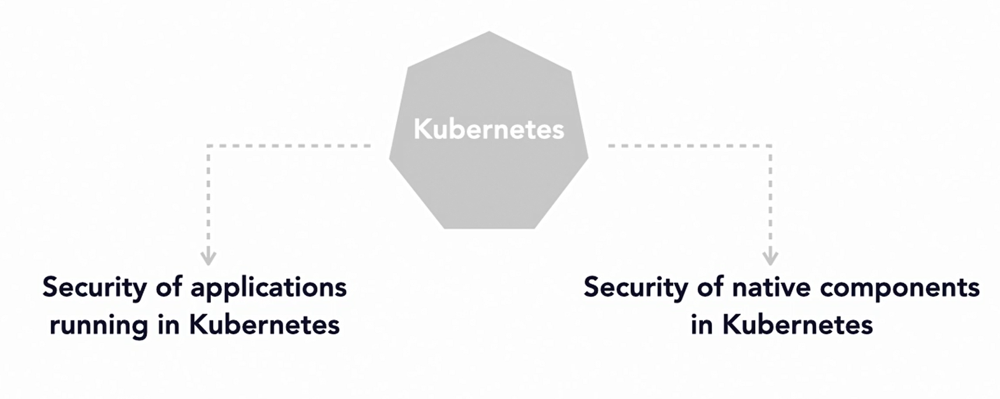
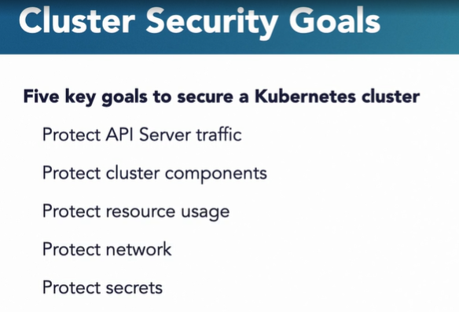
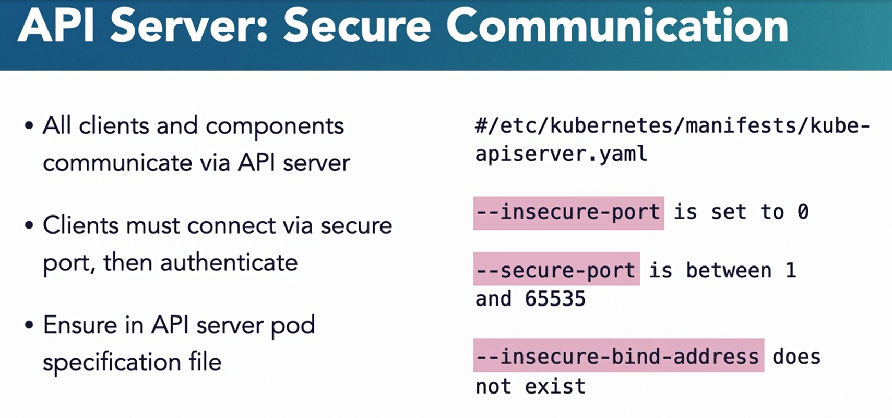
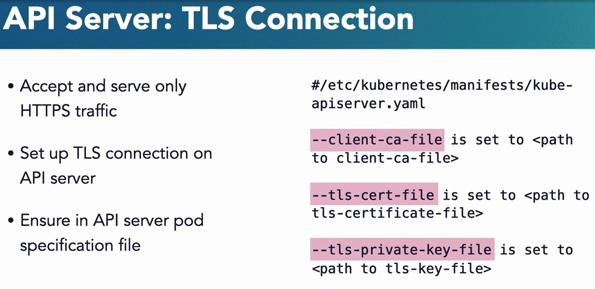
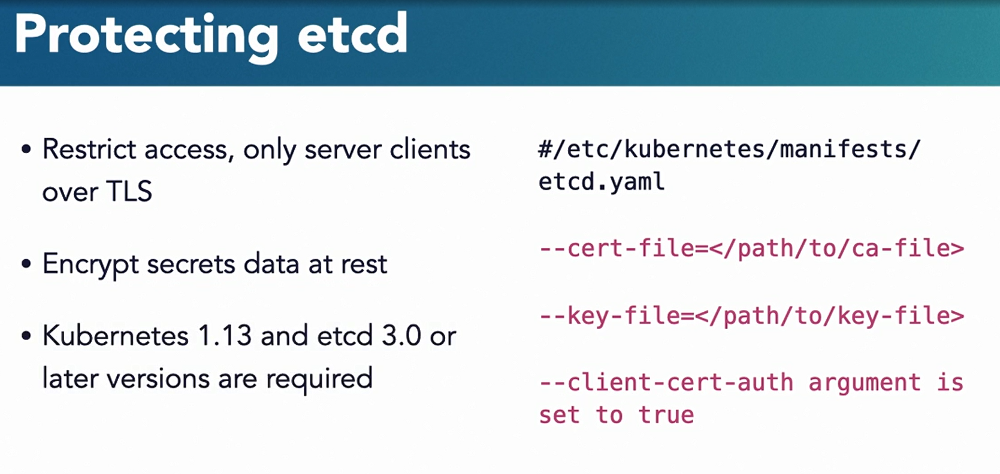
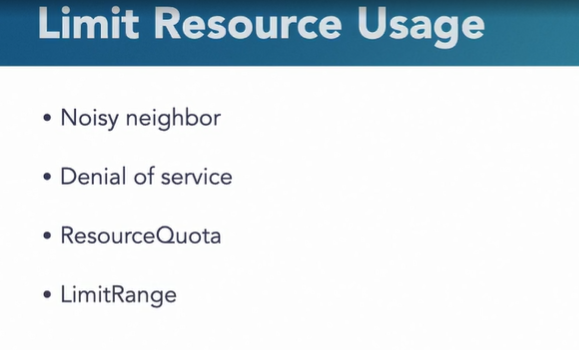

### Factor #5: Securing Kubernetes Cluster

#### Cluster Security Goals

* The security features and capabilities offered by Kubernetes. 

* These feature allow developers and admins to establish security controls that protect your running pods. These features also play a significant role in protecting the rest of the Kubernetes infrastructure. These core components are not typically accessed by your application.

  

* They work behind the scenes to keep the cluster running. 

* But how do you protect them? 

  

#### Securing API Service Traffic

* Authentication and role-based access control enable users and service accounts to communicate with the API Server. 

* #### Apı Server : Secure Communication

* Kubernetes native components also frequently communicate with the API Server. (All clients and components communicate via API Server)

* Kubelets, kube-scheduler, kube-proxy, and kube-controller-manager must connect to API Server via a secure port.(Clients must connect via secure port, then authenticate)

* Ensure in API server pod specification file

* Make sure that in the API Server specification file, the insecure-port parameter is set to zero. If you set up an API Server on the default insecure-port 8080, you are allowing attackers unencrypted access to the API Server

* The secure-port parameter is used to serve HTTPS traffic.

  

* Ensure that its value, if defined, is between one and 65535

#### API Server :  TLS Connection

* API Server should be configured to serve and accept only HTTPS traffic.(Accept and serve only HTTPS traffic)

* Set up TLS connection on API server

* That will require you to set up TLS, so check out the Kubernetes documentation on how to do that. Also, make sure in the API Server specification file, the client-ca-file parameter exists, and it points to the correct path of the file containing certificate authorities. 

* Similarly, ensure that the parameters related to TLS certificate file and private keys are set appropriately.

  

#### Protecting etcd

* Restrict access, only server clients over TLS.( You need to protect at etcd store)

* Secrets are stored in the etcd store, so you must ensure that the secret data at rest is encrypted. Starting with Kubernetes version 1.13 and etcd version 3.0 onwards, Kubernetes supports encryption of secrets.

  

* By default, Kubelet allows anonymous requests. Ensure that you only allow authenticated and authorized requests.

* #### Kubelet

* Disable anonymous requests

* Only serve requests over HTTPS

* #### Limit Resource Usage

* Kubernetes offers various mechanisms to manage the users of resources at the cluster and namespace level. 

* You want to put these restrictions in place to protect from a noisy neighbor that wants to hog all compute and memory resources. This can help you protect from a denial of service attack due to malicious containers.

* You can use ResourceQuota to prevent pods from running that don't meet the pre-specified CPU and memory limits

* Likewise, setting up limit range allows you to prevent users from requesting high values of your resources. 

  

* #### Restrict Network Access

* Implement namespaces

* To protect your network, implement namespaces in a large enterprise multi-application environment. We already saw how network policies can help control traffic in a cluster. Use a network plugin provider that supports network policies. 

* Control access to load balancers

* Utilize quota and limit ranges to control access to your load balancers. Load balancers expose your application to the outside world, and you want to carefully control users who can have access.

* #### Encrypt and Rotate Secrets

* Encrypt secrets at rest

* Encrypt secrets at rest and in transit. 

* Use the latest version of Kubernetes supporting encryption of secrets in etcd. 

* Use TLS to ensure that the confidential data in transit is not accessible to others. 

* Rotate your secrets frequently. Remove the service account token after it is no longer needed.

* Reduce the lifespan of a secret. The shorter the lifespan, the less likely it is going to be usable by an attacker.

#### Question

- API server traffic should be protected via TLS.

- ans : True

  API server traffic contains commands/response and other confidential information about cluster. It must be protected via TLS.

- Unlike pods and applications created by developers, Kubernetes core components are part of Kubernetes so no special security controls need to be applied to them.

- ans : FALSE

  Kubernetes are core components must be protected with security controls.

- Encrypting the secrets in etcd `_____`.

- ans : is recommended and is supported by Kubernetes

  Secrets store in etcd database must be protected and encrypted. Kubernetes now supports this capability.

