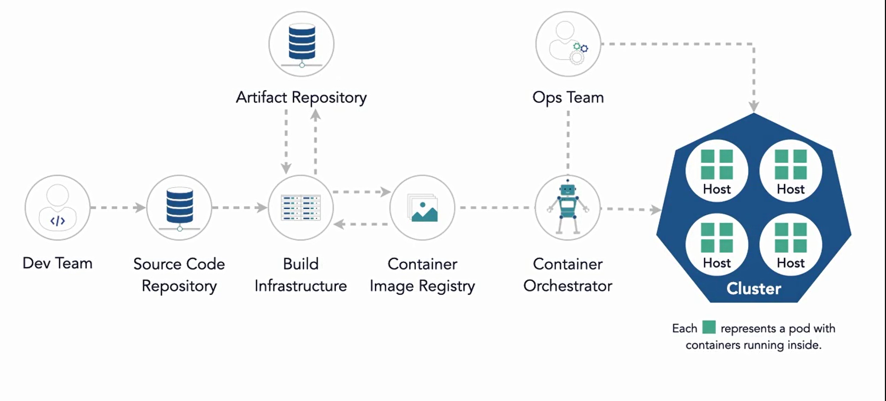
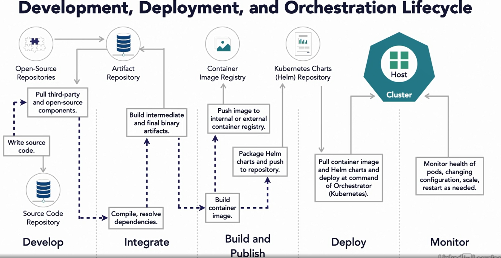
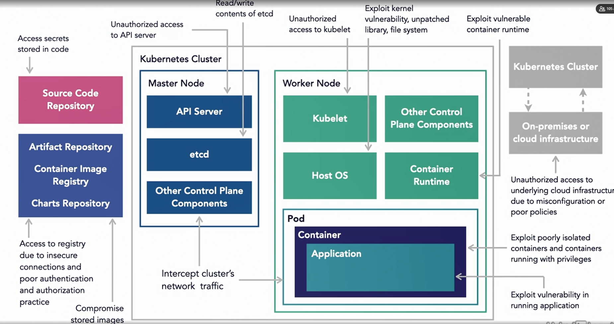
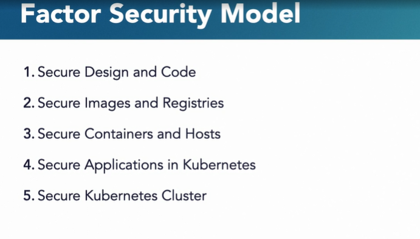

### Securing Containers and Kubernetes Ecosystem

#### Overall technology architecture

* Implementing security controls requires identifying the attack surface.( To implement security controls, for protecting your container, and Kubernetes' ecosystem. You first need to identify, the attack surface. And that requires, an understanding of the end to end architecture. That also requires knowledge of the role, each building block plays, from the first line of code, all the way to the running containers in production)

  

* Here is a simplified view, of a few key building blocks in this ecosystem. Of course, the real picture is a bit more complex than this. Taking the code, from developers hands, to a deployed application in Kubernetes, is made possible, by careful coordination of these building blocks. These building blocks, must work harmoniously with each other.

* Source Code Repositories, such as git hub and git lab, whether deployed in the cloud, or in your own premise environment, store the Source Code written by your developers.

* s.An Artifact Repository, serves as the source for third party software components, libraries, and the build artifacts for your developers. It also makes those third party, software components available to your developers, with built in governance, and a security policy around it. 

* The Build Infrastructure, along with its continuous integration pipeline, provides both the engine and the workflow, to compile the Source Code and build container images

* The images that have been scanned, for security and can be trusted. 

* These container images, are stored in an Image Repository, and access to via central registry. 

* A Container Orchestrator such as Kubernetes, is set up and configured, in advance by the admin, the Orchestrator locates, an optimal compute node to run the Container Image.

* The Orchestrator, then continues to monitor, run, and restart your application containers.

#### Container deployment and orchestration lifecycle

* Modern practice for development, deployment and operations of software has come a long way.

  

* how building blocks of this ecosystem come together to move the code from the developers IDE to deployment with the minimal human touch.

  

* Developers write code and check in into a source code repository. In addition to writing homegrown proprietary code, they also use open source components and third party packages to build their business applications. Instead of going directly to third party repositories on the internet, developers retrieve these components why a trusted enterprise repository manager. 

* This ensures that the vulnerable software components are not accidentally or intentionally downloaded and made part of their application. 

* An automated continuous integration system, compiles the code and resolves dependencies, and stores any intermediate or final binary artifacts to a central repository. 

* Developers or an automated CI system, generates a container image and stores the image in a container image repository. Many organizations choose to use Kubernetes package managers to define and install applications in Kubernetes. 

* These packages are known as Helm charts and are managed by a tool conveniently known as Helm. The same build pipeline also creates and stores these charts in a special repository. 

* The stages of the software development lifecycle we looked at so far are performed as part of continuous integration or ensured a CI pipeline. The output of the CI pipeline is a container image and a Helm chart that is ready to be deployed to staging or production environment. From this point on a continuous deployment, or ensured a CD pipeline takes over.

* The continuous deployment pipeline deploys the containerized application to a staging environment. The same pipeline may also perform automated security and functional tests before deployment.

* The pipeline deploys to your production environment by upgrading the Helm chart in the production cluster. From this point onwards Kubernetes monitors the health of pods and nodes. It watches for any configuration changes and scales up or down, or restarts as needed.

#### Attack surface and vectors

* Keeping this well synchronized ecosystem secure is going to be challenging, but before we can secure it, we need to understand what can actually go wrong. 

* To do so, we will look at the attack surface of the containers and Kubernetes. 

* The attack surface simply means the areas of a system that are one wonderful and can be exploited. A source code repository that contains the proprietary code may contain secrets. 

* The secrets might be accidentally exposed. An attacker who gets access to your repository will automatically get access to your secrets, such as passwords, API keys, and database credentials, and access to those secrets opens the door to other parts of your system.

* The artifact repositories and container image registries, serve trusted objects and images to your developers and orchestrators. Unsecure connections, poor authentication and authorization practices can result in malicious actors getting access to these sources of trust

* The attacker in turn can then compromise stored objects and images. Kubernetes cluster that comprises a master node and worker nodes has quite a large attack surface. 

* Master node, also known as the control plane, consists of API server, etcd, and several other components

* Most components of Kubernetes don't talk to each other directly. They all communicate why our API server. Unauthorized access to API server considerably jeopardize the security of the entire cluster

* Etcd stores the configuration and state of the clusters components and objects. Should an attacker get read-write access to the etcd, the attacker then literally has full access to your entire cluster. 

* Worker nodes run your workloads, or in other words, your containerized applications. Traffic between master and worker nodes carries commands and responses. 

* Unsecured network can be intercepted by an attacker. As a result, the attacker can view or modify the state of your cluster and applications.

* Kubelet process is in charge of running containers on its worker node as per the pod specification received from the API server. 

* Unauthorized access to Kubelet can compromise that node.

* The host operating system, running on a worker node can itself be vulnerable. Running an operating system with unnecessary components, wide open file permissions, and the unpatched kernel, can make the entire node vulnerable to attacks. 

* Misconfigurations or vulnerabilities in container platform and container runtime can compromise your containers. 

* Containers rely on successful OS virtualization and isolation. 

* Poorly isolated containers can access not only the host resources, but also the resources of their neighboring containers. 

* A poorly designed application with security weaknesses can be explored by the attacker. 

* Your Kubernetes cluster runs on an on-premise or cloud infrastructure Misconfiguration or poor security policies can result in unauthorized access to the underlying infrastructure. With access to infrastructure, an adversary can compromise your entire cluster.

  

#### Factory Security Model

* After seeing the attack surface, we can appreciate the complexity of efforts that might be required to keep it all protected. Therefore, we need a structured approach to security. We're going to apply a five factor security model.  Each factor comprises of a set of security controls that work to protect this ecosystem.

* The first factor is all about secure design principles and coding practices that your developers and architects should adopt.

* The next factor focuses on the security of container images and image registries. This factor includes security controls required to protect images during creation, storage, transport, and retrieval. A container is a process instantiated from an image. 

* Naturally, after securing images, the next factor focuses on security controls to protect running containers. This factor also includes controls to secure hosts that provide the operating environment for containers. 

* Your applications in Kubernetes depend on Kubernetes' provided features for access management, networking, secrets management, and so on. This factor covers how to apply these security capabilities of Kubernetes to protect your applications in the cluster.

* Kubernetes cluster comes with its own core component, which must be protected as well. This factor is all about security of Kubernetes cluster and its components.

  

#### Question

* The best place to store secrets (e.g. passwords, API keys) is source code repository so they can be version controlled.
* ans : FALSE - Storing secrets along with source make them accessible to everyone who has access to code.
* A CI/CD pipeline `_____`.
* ans : usually includes automated security scanning as part of pipeline activities.CI/CD pipeline includes continuous integration and delivery / deployment capabilities for applications.stands for Continuous Integration and Continuous delivery/deployment pipeline.automates building, testing and delivery / deployment of application
* Unauthorized access to API server can jeopardize the security of `_____`.
* ans : 
* none of these answers. API server is a crucial component of the Kubernetes cluster. If an attacker gets access to API server, they get access to the entire cluster, including Master, Worker Nodes and potentially underlying infrastructure.

